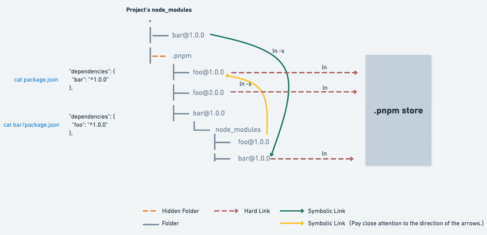

## yarn
yarn 是一个由Facebook、Google、Exponent和Tilde构建的新的JavaScript包管理器。它的出现是为了解决历史上npm的某些不足(比如npm对于依赖的完整性和一致性的保证,以及npm安装过程中速度很慢的问题)

当npm还处于v3时期的时候,一个叫yarn的包管理工具横空出世.在2016年, npm还没有package-lock.json文件,安装的时候速度很慢,稳定性很差,yarn的出现很好的解决了一下的一些问题:

- 确定性: 通过yarn.lock等机制,即使是不同的安装顺序,相同的依赖关系在任何的环境和容器中,都可以以相同的方式安装。(那么,此时的npm v5之前,并没有package-lock.json机制,只有默认并不会使用 npm-shrinkwrap.json)
- 采用模块扁平化的安装模式: 将不同版本的依赖包,按照一定的策略，归结为单个版本;以避免创建多个版本造成工程的冗余(目前版本的npm也有相同的优化)
- 网络性能更好: yarn采用了请求排队的理念,类似于并发池连接,能够更好的利用网络资源;同时也引入了一种安装失败的重试机制
- 采用缓存机制,实现了离线模式 (目前的npm也有类似的实现)

## yarn 和 npm 都存在的问题

- 依赖结构的不确定性
- 扁平化算法本身的复杂性很高，耗时较长。
- 项目中仍然可以非法访问没有声明过依赖的包

## 三者对比


工具 | 依赖管理	 | 问题
---------|----------|-----------
 npm       | node_modules 树形结构	 | 隐藏依赖重复安装
 npm > v3	 | node_modules 扁平结构	 | 重复引用、幽灵依赖
 yarn      | node_modules 扁平结构	 | 重复引用、幽灵依赖
 pnpm      | node_modules 网状 + 平铺,操作系统级别 hard link 避免重复安装   | 新技术，不够稳定

- 幽灵依赖: 扁平化结构导致package.json中没有的包，用户能require到，造成了非法访问依赖（依赖的依赖被提了上来导致的
- 重复引用: 扁平化包包hoist(提升)造成，A和B依赖1.0版本，提升最上面，如果此时C、D、E、F依赖相同包但版本是1.1，他们提升不了，就会重复安装1.1
- 操作系统级别 hard link 避免重复安装： 相同磁盘分区的不同项目，依赖相同直接走硬链接，分区不同直接copy

## pnpm 优势
> perfomance npm，即pnpm（高性能npm）

- 包安装速度极快；
- 磁盘空间利用非常高效
- 支持 monorepo

### pnpm 快的原因

pnpm 使用的技术名词解释：
- CAS 内容寻址存储:是一种存储信息的方式，根据内容而不是位置进行检索信息的存储方式。
- Virtual store 虚拟存储:指向存储的链接的目录，所有直接和间接依赖项都链接到此目录中，项目当中的.pnpm目录

pnpm 高效利用磁盘的过程：
- pnpm 内部使用基于内容寻址的文件系统来存储磁盘上所有的文件，不会重复安装同一个包，磁盘中**只有一个地方写入**，后面再次使用都会直接使用 hardlink
- hard link 使得用户可以通过不同的路径引用方式去找到某个文件。pnpm 会在全局的 store 目录里存储项目 node_modules 文件的 hard links
- .pnpm目录,.pnpm 以平铺的形式储存着所有的包，正常的包都可以在这种命名模式的文件夹中被找到,.pnmp为虚拟存储目录，该目录通过`<package-name>@<version>`来实现相同模块不同版本之间隔离和复用，由于它只会根据项目中的依赖生成.
- Store + Links让文件资源进行关联，结合.pnpm目录就能在项目里使用了


## 基于符号链接的 node_modules 结构
- https://pnpm.io/zh/symlinked-node-modules-structure
- https://juejin.cn/post/7053340250210795557#heading-6

.pnpm 以平铺的形式储存着所有的包


```xml
.pnpm/<organization-name>+<package-name>@<version>/node_modules/<name>

// 组织名(若无会省略)+包名@版本号/node_modules/名称(项目名称)
```

```xml
.pnpm/<organization-name>+<package-name>@<version>_<organization-name>+<package-name>@<version>/node_modules/<name>

// 组织名(若无会省略)+包名@版本号_peerDep组织名(若无会省略)+包名@版本号/node_modules/名称(项目名称)
```
如果有多个peer会用+号连接，如 foo@1.0.0 有两个peers依赖（bar@^1 和 baz@^1），`foo@1.0.0_bar@1.0.0+baz@1.0.0`


### pnpm node_models 结构
> https://pnpm.io/zh/symlinked-node-modules-structure

例如在项目中使用 pnpm 安装了一个叫做 express 的依赖，那么最后会在 node_modules 中形成这样两个目录结构:

```js
node_modules/express/... // 这是个软连接symlink 实际指向下面 .pnpm
node_modules/.pnpm/express@4.17.1/node_modules/xxx 
```
其中第一个路径是 nodejs 正常寻找路径会去找的一个目录，如果去查看这个目录下的内容，会发现里面连个 node_modules 文件都没有：
```js
▾ express
    ▸ lib
      History.md
      index.js
      LICENSE
      package.json
      Readme.md
```
实际上这个文件只是个软连接，它会形成一个到第二个目录的一个软连接(类似于软件的快捷方式)，这样 node 在找路径的时候，最终会找到 .pnpm 这个目录下的内容.

这个 .pnpm 是个虚拟磁盘目录，然后 express 这个依赖的一些依赖会被平铺到 .pnpm/express@4.17.1/node_modules/ 这个目录下面，这样保证了依赖能够 require 到，同时也不会形成很深的依赖层级。

在保证了 nodejs 能找到依赖路径的基础上，同时也很大程度上保证了依赖能很好的被放在一起。
```js
node_modules
├── foo -> ./.pnpm/foo@1.0.0/node_modules/foo // 软连接到 .pnpm
└── .pnpm
    ├── bar@1.0.0
    │   └── node_modules
    │       ├── bar -> <store>/bar  // 硬链接到该磁盘分区的store目录
    │       └── qar -> ../../qar@2.0.0/node_modules/qar // qar作为bar和foo共同依赖统一放到上一层，通过相对地址去上一层找
    ├── foo@1.0.0
    │   └── node_modules
    │       ├── foo -> <store>/foo
    │       ├── bar -> ../../bar@1.0.0/node_modules/bar
    │       └── qar -> ../../qar@2.0.0/node_modules/qar
    └── qar@2.0.0
        └── node_modules
            └── qar -> <store>/qar
```

### symlink 和 hard link 机制
本质上 pnpm 的 node_modules 结构是个网状 + 平铺的目录结构。这种依赖结构主要基于软连接(即 symlink)的方式来完成。

真实依赖则是通过 hard link 存储到全局的 store 目录中。在使用 pnpm 对项目安装依赖的时候，如果某个依赖在 sotre 目录中存在了话，那么就会直接从 store 目录里面去 hard-link，避免了二次安装带来的时间消耗，如果依赖在 store 目录里面不存在的话，就会去下载一次。

### 处理peer 和 多个版本号

peer 依赖项（peer dependencies）会从依赖图中更高的已安装的依赖项中解析（resolve），因为它们与父级共享相同的版本。 这意味着，如果 foo@1.0.0 有两个peers（bar@^1 和 baz@^1），那么它可能在一个项目中有多个不同的依赖项集合。 若要支持这些用例，pnpm 必须有几组不同的依赖项，就去硬链接几次 foo@1.0.0

```js
// 有两个依赖都依赖foo 但他们peer要求的baz版本不同
- foo-parent-1
  - bar@1.0.0
  - baz@1.0.0
  - foo@1.0.0
- foo-parent-2
  - bar@1.0.0
  - baz@1.1.0
  - foo@1.0.0

// 此时会有两种foo的组合方式 以确保parent能引用正确
node_modules
└── .pnpm
    ├── foo@1.0.0_bar@1.0.0+baz@1.0.0
    │   └── node_modules
    │       ├── foo
    │       ├── bar   -> ../../bar@1.0.0/node_modules/bar
    │       ├── baz   -> ../../baz@1.0.0/node_modules/baz
    │       ├── qux   -> ../../qux@1.0.0/node_modules/qux
    │       └── plugh -> ../../plugh@1.0.0/node_modules/plugh
    ├── foo@1.0.0_bar@1.0.0+baz@1.1.0
    │   └── node_modules
    │       ├── foo
    │       ├── bar   -> ../../bar@1.0.0/node_modules/bar
    │       ├── baz   -> ../../baz@1.1.0/node_modules/baz
    │       ├── qux   -> ../../qux@1.0.0/node_modules/qux
    │       └── plugh -> ../../plugh@1.0.0/node_modules/plugh
    ├── bar@1.0.0
    ├── baz@1.0.0
    ├── baz@1.1.0
    ├── qux@1.0.0
    ├── plugh@1.0.0
```

## pnpm 光速建立 monorepo

### 初始化
1. 项目根目录建立一个 pnpm 的 workspcae 配置文件 pnpm-workspace.yaml （官方说明），意味着这是一个 monorepo
   
2. 清理依赖：在 yarn + lerna 中的方案是配置自动抬升，这种方案会存在依赖滥用的问题，因为抬升到顶层后是没有任何限制的，一个依赖可能加载到任何存在于顶层 node_modules 存在的依赖，而不受他是否真正依赖了这个包，这个包的版本是多少的影响。但在 pnpm 中，无论是否被抬升，存在默认隔离的策略，这一切都是安全的。

所以建议去除每个子项目的共同依赖，比如 react ，lodash 等，然后统一放入顶层的 package.json


### Workspace 协议

默认情况下，如果可用的 packages 与已声明的可用范围相匹配，pnpm 将从工作区链接这些 packages
- .pnpm目录,.pnpm 以平铺的形式储存着所有的包，正常的包都可以在这种命名模式的文件夹中被找到,.pnmp为虚拟存储目录，**该目录通过`<package-name>@<version>`来实现相同模块不同版本之间隔离和复用**，由于它只会根据项目中的依赖生成，并不存在提升，所以它不会存在之前提到的幽灵依赖问题
- Store + Links让文件资源进行关联，结合.pnpm目录就能在项目里使用了
