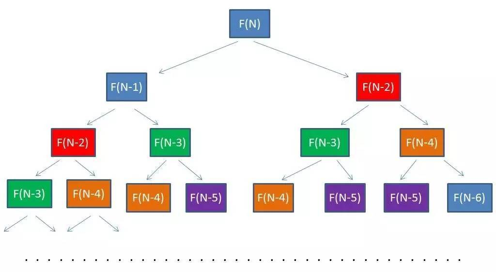
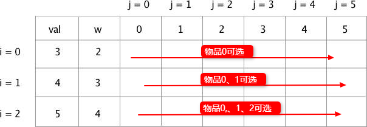
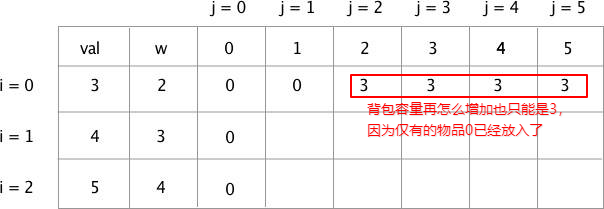
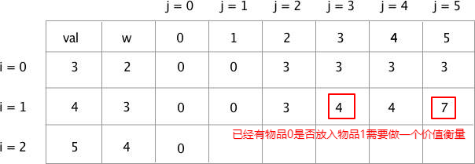
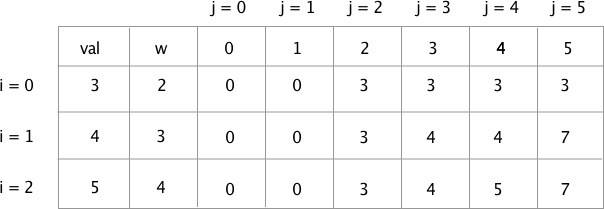
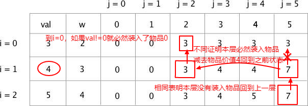

## 动态规划与分治

动态规划其实和分治策略是类似的，也是将一个原问题分解为若干个规模较小的子问题，递归的求解这些子问题，然后合并子问题的解得到原问题的解。

区别在于这些子问题会有重叠，一个子问题在求解后，可能会再次求解，于是我们想到将这些子问题的解存储起来，当下次再次求解这个子问题时，直接拿过来就是。

其实就是说，动态规划所解决的问题是分治策略所解决问题的一个子集，只是这个子集更适合用动态规划来解决从而得到更小的运行时间。

即用动态规划能解决的问题分治策略肯定能解决，只是运行时间长了。因此，分治策略一般用来解决子问题相互对立的问题，称为标准分治，而动态规划用来解决子问题重叠的问题。

动态规划则具有记忆性，通过填写表把所有已经解决的子问题答案纪录下来，在新问题里需要用到的子问题可以直接提取，避免了重复计算，从而节约了时间，所以在问题满足最优性原理之后，用动态规划解决问题的核心就在于填表，表填写完毕，最优解也就找到。

## 动态规划(DP 算法)


动态规划中包含三个重要的概念：最优子结构、边界、状态转移公式

最优性原理是动态规划的基础，最优性原理是指“多阶段决策过程的最优决策序列具有这样的性质：不论初始状态和初始决策如何，对于前面决策所造成的某一状态而言，其后各阶段的决策序列必须构成最优策略”。

## 爬楼梯问题

假设你正在爬楼梯。需要 n  阶你才能到达楼顶。
每次你可以爬 1 或 2 个台阶。你有多少种不同的方法可以爬到楼顶呢？

### 思路 1 递归倒推

首先我们假设 n=10 阶
我们可以反推，楼梯你怎么爬总有最后一步，要不跨一阶，要么跨两节，这时对应两种情况：
你要么从第 9 阶过来，要是第 8 阶过来，接下来我们需要找到一个递推公式。

假设：从 0 到第 9 阶设有 x 种，从 0 到第 8 阶设有 y 种，从 0 到 10 阶有 z 种。
关系：z = x + y,因为 0 到 10 必然只有 0->9->10,0->8->10 两种情况，加起来就可以了

再假设: f 是求出到达某一级有几种方法的方程
转化：f(10) = f(9) + f(8) 这就是我们找到的 **最优子结构**
推导：f(n) = f(n-1) + f(n-2) 每一层都满足这个公式，即状态与状态之间的 **状态转移方程**
边界：f(3) = f(2) + f(1) 右边可直接算出，无需向下，这就是问题的**边界**

这时我们已经可以写成一版代码：

```tsx
function climbStairs(n){
    if(n===1){
        return 1
    }
    if(n===2){
        return 2
    }
    return climbStairs(n-1)+climbStairs(n-2)
}
console.log(climbStairs(10))
```

有个巨大的问题就是算法复杂度，第一次提交 leetcode 出现的尴尬的超时
分析如下图：




如果我们有 n 层，那么会向下递推 n-2 次，节点就有 2^n-1 多个，时间复杂度达到了 O(2^n)

从图中可以发现有部分重复的计算，我们可以缓存下来

```tsx
function memo(func){
    const cache = new Map();
    return function(...arg){
        if(cache.has(arg)){
            return cache.get(arg)
        }else{
            const res = func.call(this,...arg)
            cache.set(arg,res)
            return res
        }

    }
}
const memoClimbStairs = memo(climbStairs)
console.log(memoClimbStairs(10))
```

最后发现还是提交不上去，显示的内存不足

### 思路二 正向的动态规划

有了前面的公式：f(n) = f(n-1) + f(n-2)，我们很明显知道 f(3) = f(2) + f(1),那么，我们可以向求菲波那切数列那些，无需递归。
f(1) + f(2) = f(3)
f(2) + f(3) = f(4)
f(3) + f(4) = f(5)
.......
.......

```tsx
function fastClimbStairs(n){
   if(n=== 1){
       return 1
   }
   if(n===2){
       return 2
   }
   let a = 1;
   let b = 2;
   let res = 0;
   // 输入3 只用计算一次
   for(let i = 3;i<=n;i++){
       res = a + b;
       a = b;
       b = res;

   }
   return res
}
```

## 背包问题

给定一个固定大小的背包，背包的容量为 capacity，有一组物品，存在对应的价值和重量，要求找出一个最佳的解决方案，使得装入背包的物品总重量不超过背包容量 capacity，而且总价值最大。本题中给出了 3 个物品，其价值和重量分别是 (3,2),(4,3),(5,4)。括号左边为价值，右边为重量，背包容量 capacity 为 5。那么求出其搭配组合，使得背包内总价最大，且最大价值为多少？

### 思路：动态规划建立二维数组

背包问题也是一个动态规划的问题，之前爬楼梯我们递推每一层和前面的关系，背包问题也可以递推，但是要注意优先级的关系。

还有就是需要控制变量，我们需要先确定物品不变然后依次增加背包的容量来递推。
可以建立一个二维数组，横向是背包容量的变化，纵向是物品的增多.
每次增加一个物品，增加一层数组，并且该层可以选择本层和本层之上的物品。

### 第一步建表

下图中：i 代表物品，val 代表价值，w 代表重量，j 代表背包容量



### 第二步填充第一行

现在开始填第一行，只有物品 0 的情况
随着背包容量增加，在某一个时候可以把物品 0 放入，但之后由于没有了物品，那么就只能全是物品 0 产生的价值


#### 第三步最优价值衡量算法

填充第二行就需要判断情况，如下图框起来的 4 和 7 都是特殊的点。



如果背包此时能够放入第 i 个商品，得判断放入和不放入哪个才是最优解

放入物品 i：剩余的容量表达式应为 j-w[i] ，剩余的容量还能产生多少价值我们已经缓存在了表里，这里我们可以直接用，就在前面的 j-w[i]列，价值= T[i][j-w[i]]
放入物品参生的总价值公式 T[i][j] = val[i] + T[i][j-w[i]]

不放入物品 i：既然不放入了，与 i-1 时参生的价值就没有区别的，那么价值与同一列的上一行相等
不放入物品产生的总价值公式 T[i][j] = T[i-1][j]

比较放入和不放入产生的价值就可以确定是否放入，然后又会得到最优解(注意：这里就已经形成了动态规划的状态转移公式，而且确保了每一步规划都是最优的，直到规划到最后)

#### 红框 4 和 7 点计算过程

**注意：没有计算背包剩余的意思，每次背包容量增大，新的物品能装下，都相当于清空背包直接放入新物品然后比较放入是否是最优解**

i=1 j=3 : 选择了物品 1 之后，物品 1 的重量为 3，背包容量为 4， 减去物品 1 的重量后， 剩余容量为 1，无法装下物品 0。总价值为 4>放入之前的 3，于是放入，就不在装入物品 0 了

i=1 j=5 ：选择了物品 1 之后，物品 1 的重量为 3，背包容量为 4， 减去物品 1 的重量后， 剩余容量为 j-w[i] = 2，发现 T[i][2]是等于 3 的，容量 2 的时候还能创造 3 个价值，与 3+4 = 7（这里就是调用之前计算好的容量 2 最优解情况，是动态规划的思想），7>4,放入

最后照葫芦画瓢填充到最后就行了,7 就是最大价值


### 将上述过程写出代码

```tsx
function knapSack(w,val,capacity,n){
    // 我们建立的递推表
    let T = []
    // i 代表第几个物品，从第0个开始
    for(let i= 0; i<n;i++){
        T[i] = [];
        // j代表每次背包容量增加1，求出不同容量的最佳组合
        for(let j = 0; j <= capacity; j++){
            if(j===0){
                // 背包容量为零 那么价值肯定为零
                T[i][j] = 0;
                continue;
            }
            // 如果物品重量都大于背包容量了肯定装不下
            if(w[i]>j){
                // 只有一个物品0，背包容量又不够
                if(i===0){
                    // 肯定价值就只能是0
                    T[0][j] = 0
                }else{
                    // i!=0时，代表的是可以使用0到i的物品组合
                    // 第i个物品无法放入 背包的价值只能是0到i-1的物品组合的最优解
                    T[i][j] = T[i-1][j]
                }
                continue;
            }
            if(i===0){
                // 只有一个物品时就只能放这个物品
                T[i][j] = val[i]
            }else{
                // 如果背包此时能够放入第i个商品，得判断放入和不放入哪个才是最优解

                // 放入物品i：剩余的容量表达式应为 j-w[i] ，剩余的容量还能产生多少价值我们已经缓存在了表里，这里我们可以直接用，就在前面的j-w[i]列，价值= T[i][j-w[i]
                // 放入物品参生的总价值公式  T[i][j] = val[i] + T[i][j-w[i]]

                // 不放入物品i：既然不放入了，与i-1时参生的价值就没有区别的，那么价值与同一列的上一行相等
                // 不放入物品产生的总价值公式 T[i][j] = T[i-1][j]

                // 比较放入和不放入产生的价值就可以确定是否放入，然后又会得到最优解(注意：这里就已经形成了动态规划的状态转移公式，而且确保了每一步规划都是最优的，直到规划到最后)
                T[i][j] = Math.max(val[i] + T[i-1][j-w[i]],T[i-1][j]);
            }
        }
    }
    return T
}
```

### 如何找到装入了那些物品



写成代码：

```tsx
// knapSack无法判断我们选择了那些物品，得回溯去寻找
// findValue 主要就是通过最终坐标对比上一层是否有变化，有变化就是加入了
function findValue(w,val,capacity,n,T){
	var i = n-1, j = capacity;
	while ( i > 0 && j > 0 ){
        // 定位到最后一个数据，比较和包空间同大小的上一层有没有变化
		if(T[i][j] != T[i-1][j]){
            // 如果有变化，那么肯定是在当前层添加物品
            console.log('选择物品'+i+',重量：'+ w[i] +',价值：' + values[i]);
            // 然后找加入这个物品之前容量对应的坐标
			j = j- w[i];
			i--;
		}else{
			i--;  //如果两个值相等，这表明没有放入i物品时，往上回溯到i-1，开始下次循环
		}
    }
    //  如果能回溯到第一行，且回溯点不是0，那肯定第一个物品是加入了
	if(i == 0 ){
		if(T[i][j] != 0){ //那么第一行的物品也可以取
			console.log('选择物品'+i+',重量：'+ w[i] +',价值：' + values[i]);
		}
	}
}
```

## 最少硬币找零

给定不同面额的硬币 coins 和一个总金额 amount。编写一个函数来计算可以凑成总金额所需的最少的硬币个数。如果没有任何一种硬币组合能组成总金额，返回  -1。你可以认为每种硬币的数量是无限的。

示例 1:

输入: coins = [1, 2, 5], amount = 11
输出: 3
解释: 11 = 5 + 5 + 1

### 类比爬楼梯算法

相同点：爬楼梯的时候跨越 1 或者 2 阶，最后刚好到达 n 阶，这里我们使用一定数量的硬币，1 块 2 块或 5 块，最后刚好凑成总金额，相当于每次跨 1、2、5。

不同点：爬楼梯是把各种次数相加，求总共有多少种爬法，最少硬币找零就是找出各种找零方法中那种使用货币最少，也就爬楼梯的出脚次数最少

### 解题思路 1 自顶向下递归求解

爬楼的时候先反推，到达最后一层有两种可能也就是 f(n) = f(n-1)+f(n-2),然后递推相加

但这里我们需要考虑求一个最优解，也就是最少硬币，那么我们再决定从哪步过来的时候，需要做一个的比较，从上一步次数最少的：f(n) = 1 + min{f(n-value)|value∈coins}

只有是递归那么复杂度一定是偏高的，我们可以做一步缓存递归结果，优化一下

```tsx
function minCoin(coins, amount) {
  // 如果amount为0表示刚刚把钱兑换完 返回0
  if (amount === 0) {
    return 0;
  }
  // 设置一个最大值，保存下面循环的三个节点的最小值
  let minValue = Number.MAX_SAFE_INTEGER;
  // amount不为0，那么需要递归往下计算
  for (var coin of coins) {
    // 如果换的量比所有面值都小就进下次循环
    // 比面值大才进入下面的递归才分
    if (amount - coin >= 0) {
      const count = memoMinCoin(coins, amount - coin);
      // 子问题有解，需要判断和同一层的节点谁的解最小
      if (count != -1) {
        minValue = Math.min(count+1, minValue);
      }
    }
  }
  // amount-coin<0 ,要拆分的面值比任何硬币都小 无解
  // 上面的逻辑如果无解的话minValue会是最大整数，这里需要处理
  return minValue==Number.MAX_SAFE_INTEGER?-1:minValue;
}

// 记录重复计算的值
function memo(func){
  const cache = new Map();
  return function(...arg){
      if(cache.has(arg)){
          return cache.get(arg)
      }else{
          const res = func.call(this,...arg)
          cache.set(arg,res)
          return res
      }
  }
}

const memoMinCoin = memo(minCoin)


let coins = [1, 2, 5], amount = 11
const count = memoMinCoin(coins, amount);
```

### 思路二 自底向上 动态规划

我们从分解 0 元开始，一直到分解 amount 元，且每一步都按最优解来算
到 amount 的时候就是最少的组合

```tsx
// 动态规划
function minCoinDP(coins,amount){
  // 因为要循环求min 这里把规划表填充一个最大值
  let dpArray = Array(amount+1).fill(amount+1);
  dpArray[0] = 0
  for(let i =1;i<=amount;i++){
    // 有几种面值就有几条路径可以到达
    for(let coin of coins){
      // 比当前容量小才比较
      if(coin<=i){
        dpArray[i] = Math.min(dpArray[i],dpArray[i-coin]+1)
      }
    }
  }
  // 如果第amount个不是初始值，则能分解，且为最优解
  return dpArray[amount] == amount+1?-1:dpArray[amount]
}

console.log(minCoinDP(coins, amount))
```
