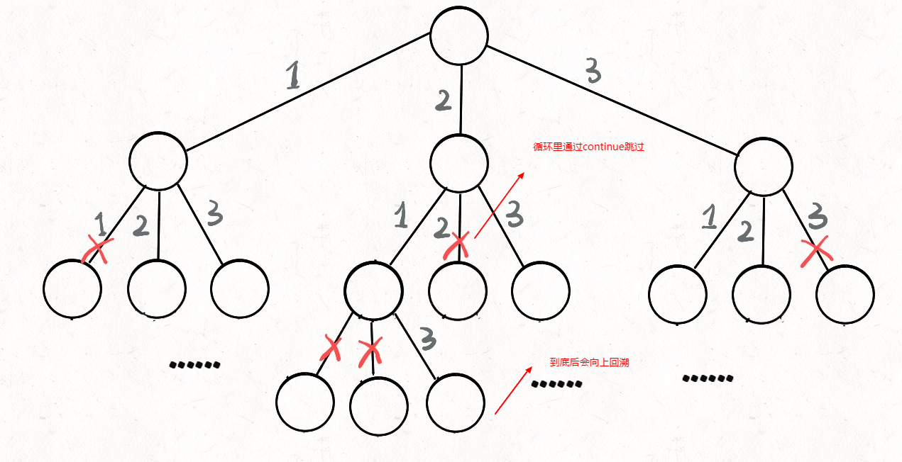

## 回溯算法

回溯算法实际上一个类似枚举的搜索尝试过程，主要是在搜索尝试过程中寻找问题的解，当发现已不满足求解条件时，就“回溯”返回，尝试别的路径。回溯法是一种选优搜索法，按选优条件向前搜索，以达到目标。但当探索到某一步时，发现原先选择并不优或达不到目标，就退回一步重新选择，这种走不通就退回再走的技术为回溯法，而满足回溯条件的某个状态的点称为“回溯点”。


## 实例 1-全排列

### 题目

给定一个没有重复数字的序列，返回其所有可能的全排列。

示例:

```
输入: [1,2,3]
输出:
[
  [1,2,3],
  [1,3,2],
  [2,1,3],
  [2,3,1],
  [3,1,2],
  [3,2,1]
]
```

### 思路

解决一个回溯问题，实际上就是一个决策树的遍历过程。你只需要思考 4 个问题：

1、路径：也就是已经做出的选择。

2、选择列表：也就是你当前可以做的选择。

3、结束条件：也就是到达决策树底层，无法再做选择的条件。

4、恢复状态：撤销刚才的选择，向上回溯

```
result = []
function backtrack(路径, 选择列表,result):
    if 满足结束条件:
        result.push(路径)
        return

    for 选择 in 选择列表:
        # 做选择
        将该选择从选择列表移除
        路径.push(选择)
        backtrack(路径, 选择列表)
        # 撤销选择
        路径.pop(选择)
        将该选择再加入选择列表


```
只要在递归之前做出选择，在递归之后撤销刚才的选择，就能正确得到每个节点的选择列表和路径



### Js代码

```
function all(numArray) {
  let memoArray = [];
  let  all =[]
  backtrack(numArray, memoArray,all);
  return all;
}


function backtrack(numArray, memoArray,all){
    if(memoArray.length===numArray.length){
        // 注意这里需要用一层浅拷贝，不然最后memoArray.pop的时候all也会改变
        all.push([...memoArray])
        return
    }
    for(let i =0;i<numArray.length;i++){
        // 每个元素只能选择一次，重复就不进入递归
        if(memoArray.includes(numArray[i]))continue
        memoArray.push(numArray[i])
        backtrack(numArray,memoArray,all)
        // 本条路径走完需要回复状态,即取消选择，下次就可以进入不同的分支
        // 如2-1-3，第三层的backtrack结束需要回退到2-1
        // 然后本层for循环结束也就是第二层backtrack结束再退，然后到2，for的时候才能到2-3
        memoArray.pop()
    }
}

const x = all([1,2,3,4,5])
```

## 实例2-N皇后

 n皇后问题是将n个皇后放置在n*n的棋盘上，皇后彼此之间不能相互攻击(任意两个皇后不能位于同一行，同一列，同一斜线)。

每一种解法包含一个明确的 n 皇后问题的棋子放置方案，该方案中 'Q' 和 '.' 分别代表了皇后和空位。

示例:
```
输入: 4
输出: [
 [".Q..",  // 解法 1
  "...Q",
  "Q...",
  "..Q."],

 ["..Q.",  // 解法 2
  "Q...",
  "...Q",
  ".Q.."]
]
```
解释: 4 皇后问题存在两个不同的解法。


### 思路

问题本质上跟全排列问题差不多，决策树的每一层表示棋盘上的每一行；每个节点可以做出的选择是，在该行的任意一列放置一个皇后。

上面全排列是之前使用过的数不在使用，这里就是一个皇后的横竖和斜线上的不能出现其它皇后


### Js代码
> 没做太多优化，内存占用较高。。。
注意：因为JS数组是引用类型，因为你要恢复到上一状态，很可能把你要输出的数组也改了，这里我用Array.from写了个深拷贝来解决
```
function solveNQueens(n) {
// 填充数组，用map是切断引用关联
  let board = Array(n)
    .fill(null)
    .map(() => Array(n).fill("."));
  let res = [];
  backtrack(board, 0, res);
  let newRes = res.map(item => {
    return item.map(row => {
      return row.join("");
    });
  });
  return newRes;
}


function backtrack(board, row, res) {
  if (row === board.length) {
    res.push(deepCloneArray(board));
    return;
  }

  let rowL = board[row].length;
  for (let col = 0; col < rowL; col++) {
    if (!isValid(board, row, col)) continue;
    board[row][col] = "Q";
    backtrack(board, row + 1, res);
    board[row][col] = ".";
  }
}

//是否可以在 board[row][col] 放置皇后
function isValid(board, row, col) {
  let colL = board.length;
  // 检查列是否有皇后互相冲突
  for (let i = 0; i < colL; i++) {
    if (board[i][col] == "Q") return false;
  }
  // 检查右上方是否有皇后互相冲突
  for (let i = row - 1, j = col + 1; i >= 0 && j < colL; i--, j++) {
    if (board[i][j] == "Q") return false;
  }
  // 检查左上方是否有皇后互相冲突
  for (let i = row - 1, j = col - 1; i >= 0 && j >= 0; i--, j--) {
    if (board[i][j] == "Q") return false;
  }
  return true;
}

function deepCloneArray(arr) {
  if (Array.isArray(arr)) {
    return Array.from(arr, deepCloneArray); //递归入口
  } else {
    return arr;
  }
}

console.log(solveNQueens(4));
```


## 实例3-单词搜索

### 题目

给定一个二维网格和一个单词，找出该单词是否存在于网格中。

单词必须按照字母顺序，通过相邻的单元格内的字母构成，其中“相邻”单元格是那些水平相邻或垂直相邻的单元格。同一个单元格内的字母不允许被重复使用。

示例:

board =
[
['A','B','C','E'],
['S','F','C','S'],
['A','D','E','E']
]

给定 word = "ABCCED", 返回 true.
给定 word = "SEE", 返回 true.
给定 word = "ABCB", 返回 false.

### 解题思路

- 首先这是典型的回溯问题，往一个方向找，找不到在退回
- 每个点最多四个方向，可以用递归，相当于是图的深度优先搜索
- 已经匹配的元素需要做一个标记，避免重复寻找
- 标记之前需要缓存一个状态，此路不通时回溯需要恢复状态

### JS 代码

```
function exist(arr,word){
    for(let i = 0; i<arr.length;i++){
        for(let j = 0;j<arr[i].length;j++){
            if(findWord(i,j,word,arr)){
                return true
            }
        }
    }
    return false
}

function findWord(i,j,word,arr){
    if(arr[i][j]!==word[0])return false
    if(word.length === 1)return true
    // 缓存一个值，没找到时用于回溯时返回上一个状态
    let temp = arr[i][j]
    // 找到了一个匹配的,就标记为-1，避免重复
    arr[i][j] = -1
    // 深度优先搜索，先一个方向走到死，不对再退回
    if(i>0&&findWord(i-1,j,word.slice(1),arr))return true
    if(j>0&&findWord(i,j-1,word.slice(1),arr))return true
    if(i<arr.length-1&&findWord(i+1,j,word.slice(1),arr))return true
    if(j<arr[i].length-1&&findWord(i,j+1,word.slice(1),arr))return true
    // 如果前后左右都没有通路，退回之前的状态
    arr[i][j] = temp
    return false
}
```

