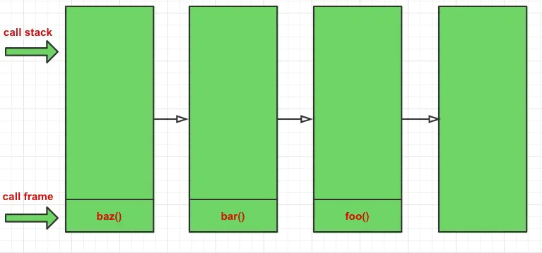

## 尾调用

尾调用是函数式编程中一个很重要的概念，当一个函数执行时的最后一个步骤是返回另一个函数的调用，这就叫做尾调用。 可通过优化，使得计算仅占用常量栈空间 (Stack Space)。


## 尾调用优化

函数在调用的时候会在调用栈（call stack）中存有记录，每一条记录叫做一个调用帧（call frame），每调用一个函数，就向栈中push一条记录，函数执行结束后依次向外弹出，直到清空调用栈，参考下图：

```tsx
function foo () { console.log(111); }
function bar () { foo(); }
function baz () { bar(); }

baz();

```


造成这种结果是因为每个函数在调用另一个函数的时候，并没有 return 该调用，所以JS引擎会认为你还没有执行完，会保留你的调用帧。

如果对上面的例子做如下修改：

```tsx
function foo () { console.log(111); }
function bar () { return foo(); }
function baz () { return bar(); }

baz();

```




## 尾调用优化只在严格模式下有效。


在非严格模式下，大多数引擎会包含下面两个属性，以便开发者检查调用栈：

- func.arguments: 表示对 func最近一次调用所包含的参数
- func.caller: 引用对 func最近一次调用的那个函数

在尾调用优化中，这些属性不再有用，因为相关的信息可能以及被移除了。因此，严格模式(strict mode)禁止这些属性，并且尾调用优化只在严格模式下有效。


## 尾递归

当一个函数尾调用自身，就叫做尾递归。

```tsx
function foo () {
    return foo();
}

```


## 尾递归的作用

操作系统为JS引擎调用栈分配的内存是有大小限制的，如果计算的数字足够大，超出了内存最大范围，就会出现栈溢出错误。


### 求阶乘普通版


```tsx
function factorial (num) {
    if (num === 1) return 1;
    return num * factorial(num - 1);
}

factorial(5);            // 120
factorial(10);           // 3628800
factorial(500000);       // Uncaught RangeError: Maximum call stack size exceeded

```

### 尾递归来计算阶乘

通过尾递归，我们把复杂度从O(n)降低到了O(1)，如果数据足够大的话，会节省很多的计算时间。
```tsx
'use strict';

function factorial (num, total) {
    if (num === 1) return total;
    return factorial(num - 1, num * total);
}

factorial(5, 1);                // 120
factorial(10, 1);               // 3628800
factorial(500000, 1);           // 分情况

// 注意，虽然说这里启用了严格模式，但是经测试，在Chrome和Firefox下，还是会报栈溢出错误，并没有进行尾调用优化
// Safari浏览器进行了尾调用优化，factorial(500000, 1)结果为Infinity，因为结果超出了JS可表示的数字范围
// 如果在node v6版本下执行，需要加--harmony_tailcalls参数，node --harmony_tailcalls test.js
// node最新版本已经移除了--harmony_tailcalls功能

```


### 避免改写递归函数

可以看到上文中的尾递归版本的函数多了一个total参数，这个参数的意义就是用来保存一次的计算并传给下次调用。

这是对原函数的一种改写，可不可以就保持原来的只传入一个参数呢？

1. ES6参数默认值

```tsx
'use strict';

function factorial (num, total = 1) {
    if (num === 1) return total;
    return factorial(num - 1, num * total);
}

factorial(5);                // 120
factorial(10);               // 3628800

```

1.用一个符合语义的函数去调用改写后的尾递归函数

```tsx
function tailFactorial (num, total) {
    if (num === 1) return total;
    return tailFactorial(num - 1, num * total);
}

function factorial (num) {
    return tailFactorial(num, 1);
}

factorial(5);                // 120
factorial(10);               // 3628800

```

## 手动优化尾递归

- 将参数提取出来，成为迭代变量。原来的参数则用来初始化迭代变量。
- 创建一个迭代函数，迭代函数只用来只用来更新迭代变量。
- 将原来函数的里面所代码（不包括我们上面的迭代函数和迭代变量初始化）包在一个 while (true) 迭代循环里面。Tip：加一个 label 用于标识循环。
- 递归终止的 return 不变，尾递归的 return 替换成迭代函数，并且 continue 掉上面的迭代循环。

```tsx
尾递归代码：

function fact(n, r) { // <= 这里把 n, r 作为迭代变量提出来
    if (n <= 0) {
        return 1 * r; // <= 递归终止
    } else {
        return fact(n - 1, r * n); // <= 用迭代函数替代 fact。
    }
}
转换后得到的代码：

function fact(_n, _r) { // <= _n, _r 用作初始化变量
    var n = _n;
    var r = _r; // <= 将原来的 n, r 变量提出来编程迭代变量
    function _fact(_n, _r) { // <= 迭代函数非常简单,就是更新迭代变量而已
        n = _n;
        r = _r;
    }
    _fact_loop: while (true) { // <= 生成一个迭代循环
        if (n <= 0) {
            return r;
        } else {
            _fact(n - 1, r * n); continue _fact_loop; // <= 执行迭代函数，并且进入下一次迭代
        }
    }
}
```


## ES6的尾调用优化

ECMAScript 6 提供了尾调用优化(tail call optimization)功能，以使得对某些函数的调用不会造成调用栈(call stack)的增长。本文解释了这项功能，以及其带来的好处。

实际上由于前面所说的这些问题（当然还有一些其他原因），除了Apple以外的浏览器厂商都认为ES6的尾调用优化这个feature存在问题，于是拒绝实现。所以除非你只在Safari上开发，『深入理解ES6 尾调用』在目前没有实践意义。