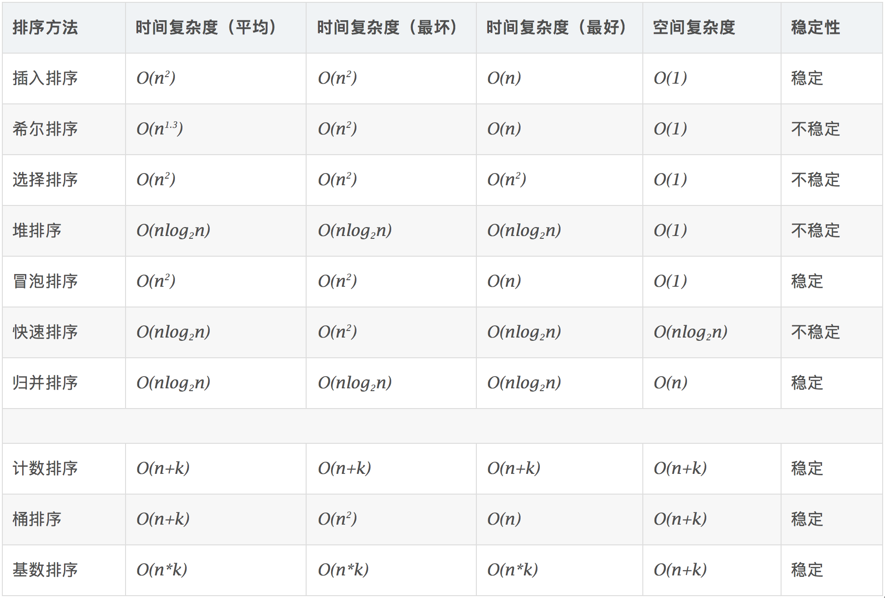
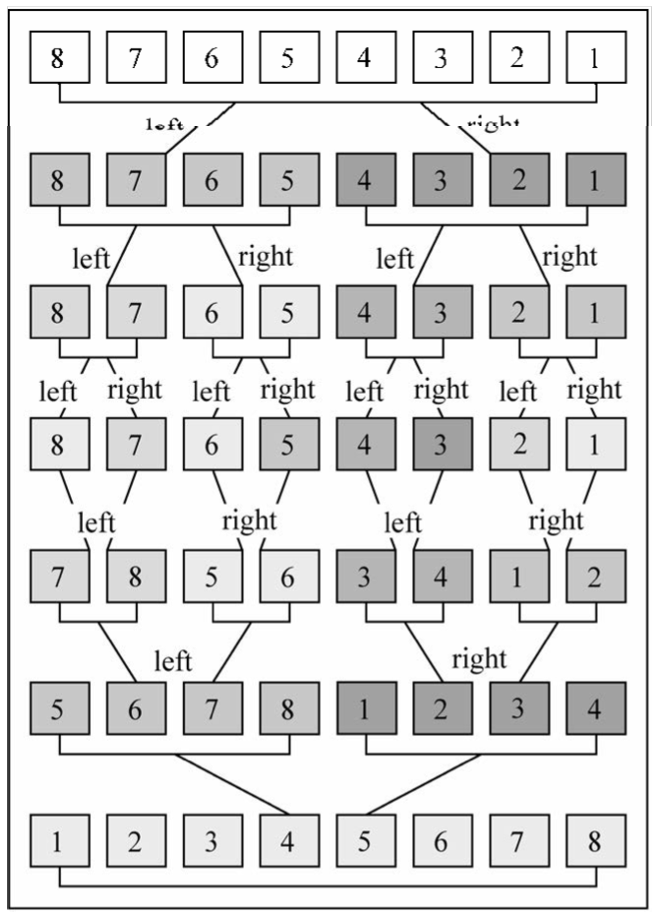
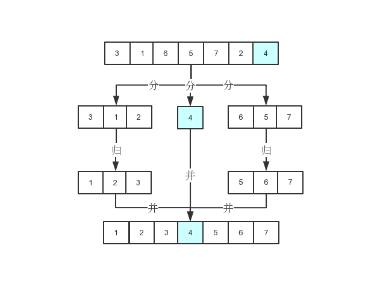
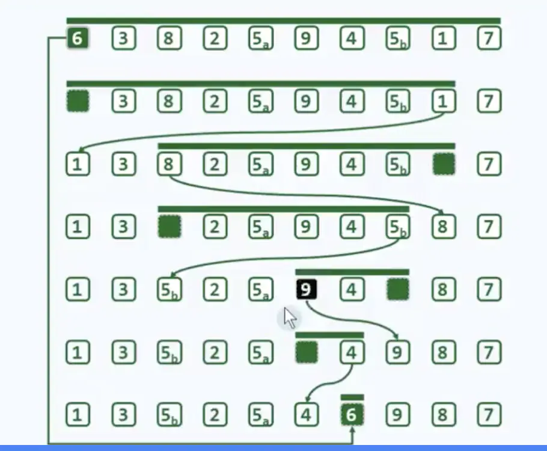

>图片来自网络侵删

## 算法复杂度



## 冒泡排序

- 比较相邻的元素。如果第一个比第二个大，就交换它们两个；
- 对每一对相邻元素作同样的工作，从开始第一对到结尾的最后一对，这样在最后的元素应该会是最大的数；
- 针对所有的元素重复以上的步骤，除了最后一个；
- 重复步骤1~3，直到排序完成。


```tsx
function bubbleSort(arr){
    for(let i=0;i<arr.length-1;i++){
        for(let j=0;j<arr.length-i-1;j++){
            if(arr[j]>arr[j+1]){
                let temp
                temp = arr[j];
                arr[j] = arr[j+1];
                arr[j+1] = temp
            }
        }
    }
    return arr;
}

var arr=[3,44,38,5,47,15,36,26,27,2,46,4,19,50,48];
console.log(bubbleSort(arr).toString())
```


## 选择排序

- 首先在未排序序列中找到最小（大）元素，存放到排序序列的起始位置
- 然后，再从剩余未排序元素中继续寻找最小（大）元素，然后放到已排序序列的末尾。
- 以此类推，直到所有元素均排序完毕。


```tsx
function selectionSort(arr) {
    let minIndex
    for(let i = 0; i<arr.length; i++){
        minIndex = i;
        for(let j=i+1; j<arr.length; j++){
            if(arr[j]<arr[minIndex]){
                minIndex = j
            }
        }
        [arr[i],arr[minIndex]] = [arr[minIndex],arr[i]]

    }
    return arr
}

var arr=[3,44,38,5,47,15,36,26,27,2,46,4,19,50,48];
console.log(selectionSort(arr).toString())
```

## 插入排序

- 通过构建有序序列，对于未排序数据，在已排序序列中从后向前扫描，找到相应位置并插入。
- 在从后向前扫描过程中，需要反复把已排序元素逐步向后挪位，为最新元素提供插入空间。
- 扑克牌摸牌的时候开始为空，然后抹上了一张按大小插入一张，与这个类似。


```tsx
function insertSort(arr) {
    for(let i = 1;i<arr.length;i++){// 外循环表示有序的长度
        for(let j=i;j>=0;j--){
            if(arr[j]<arr[j-1]){
                // 使用解构赋值交换
                [arr[j],arr[j-1]] = [arr[j-1],arr[j]];
            }else{
                break
            }
        }
    }
    return arr
}

// 改良一下插入，避免多次交换元素，找到最终插入的位置直接插
function insertSort2(arr) {
    for(let i = 1;i<arr.length;i++){
        let index = i 
        for(let j=i-1;j>=0;j--){
            if(arr[j]>arr[i]){
                index = j
            }
        }
        if(index === i)continue// 位置不用变
         // 直接从指定位置插入，不交换
         arr.splice(index,0,arr[i])
         // 插入一个后原来的下标会右移一位，然后把i+1从原来的位置上它删除即可
         arr.splice(i+1,1)
    }
    return arr
}

var arr=[3,44,38,5,47,15,36,26,27,2,46,4,19,50,48];
var arr2=[3,44,38,5,47,15,36,26,27,2,46,4,19,50,48];
console.log(arr)
console.log(insertSort(arr).toString())
console.log(insertSort2(arr2).toString())
```


## 归并排序

>归并排序是建立在归并操作上的一种有效的排序算法。该算法是采用分治法（Divide and Conquer）的一个非常典型的应用。

- 把长度为n的输入序列分成两个长度为n/2的子序列；
- 对这两个子序列分别采用归并排序；
- 将两个排序好的子序列合并成一个最终的排序序列。




```tsx
// 实验一下数组分治  中间递归划分 直到只有一个元素
function mergeSortTest(arr) {
  if (arr.length > 1) {
    let mid = Math.floor(arr.length / 2);
    let left = mergeSortTest(arr.slice(0, mid));
    let right = mergeSortTest(arr.slice(mid));
    return [[...left], [...right]];
  } else {
    return [...arr];
  }
}

// 在上面的基础上 最后添加排序 然后向上合并
function mergeSort(arr) {
  if (arr.length > 1) {
    let mid = Math.floor(arr.length / 2);
    let left = mergeSort(arr.slice(0, mid));
    let right = mergeSort(arr.slice(mid));
    // 最后肯定会拆分为left[3] right[44] 这种
    return merge(left,right);
  } else {
    return arr;
  }
}

function merge(left, right) {
  let newArr = [];
  while (left.length && right.length) {
    if (left[0] > right[0]) {
      newArr.push(right[0]);
      right.shift();
    } else {
      newArr.push(left[0]);
      left.shift();
    }
  }
  if (!left.length) {
      // concat不会修改源数组，需要重新赋值
    newArr = newArr.concat(right);
  } else {
    newArr = newArr.concat(left);
  }
  return newArr;
}

// 先测试一下递归分治划分的数组是否成功
var arrTest = [1,2,3,4,5,6,7,8]
var divideArr =  mergeSortTest(arrTest) 
console.log(JSON.stringify(divideArr))// [[[[1],[2]],[[3],[4]]],[[[5],[6]],[[7],[8]]]] 对的


var arr = [3, 44, 38, 5, 47, 15, 36, 26, 27, 2, 46, 4, 19, 50, 48];
const arred = mergeSort(arr);
console.log(arred.toString());


```

## 快速排序

- 从数列中挑出一个元素，称为 "基准"（pivot）；
- 重新排序数列，所有元素比基准值小的摆放在基准前面，所有元素比基准值大的摆在基准的后面（相同的数可以到任一边）。
- 在这个分区退出之后，该基准就处于数列的中间位置。这个称为分区（partition）操作；
- 递归地（recursive）把小于基准值元素的子数列和大于基准值元素的子数列排序。

### 快排也有分治和归并的思想

对比快排和归并我们可以发现，快排是在往下的过程中就会排好序，而归并是在往上的过程中才排序的


### 快速找出基准元素的真实位置

如果把第一个元素作为基准:
- 先从右往左来，遇见比基准元素小的1，赋值给arr[0]
- 然后记录1的索引，等到下一次从左往右遇到比基准元素大的就往这里插
- 左边指针增大，右边减小，直到执行同一个地方，就是基准元素应该放的地方
- 左边比基准元素小，右边比基准元素大



### 基准元素的定位过程


```tsx
// 第一版非原地排序，空间复杂度较高
// 思想比较是一致的，比较好理解但不推荐使用
function quickSortRecursion (arr) {
    if (!arr || arr.length < 2) return arr;
    const pivot = arr.pop();
    let left = arr.filter(item => item < pivot);
    let right = arr.filter(item => item >= pivot);
    return quickSortRecursion(left).concat([pivot], quickSortRecursion(right));
  }
 

/**
 * @description 快排过渡方法，用于理解快排中基准元素的比较行为
 * 设立一个基准元素target，元素<target就移动到它左边，元素>target移动它的右边 => 可以简化为找出target在排好序数组的位置
 * 然后相同的递归调用左边和右边，直到把所有元素都放到对应的位置，就完成了排序算法
 * 原地快排就是在不占用其他内存的情况下，尽快的找出target该放入的位置
 * 这里假设第一个元素是target
 */

function targetToIndex(arr){
    // 先声明两个指针，方便从开始和最后扫描
    let left = 0
    let right = arr.length-1
    let target = arr[0]
    // 
    while(left<right){
        // 从最后扫描，直到找到比target小的，就赋值给左边(小的放前面)
        while(left<right&&arr[right]>target){ //!:这里必须加上left<right，内部越位就完了
            right--
        }
        // 注意这里没有用交换，是直接赋值，交换需要中间变量temp，就不是原地排序了
        // right 这个位置被拿去赋值了，下次就填充right这里，并且需要填充的在右边，所以下次得从左边开始遍历
        arr[left] = arr[right]

        // 从前面扫描，直到比target大了，就赋值给刚刚记录的right
        while(left<right&&arr[left]<target){
            left++
        }
        arr[right] = arr[left]
    }
    // 最后left和right会相交，这是就target真正的位置。
    // 右边小的安排在了左边，左边大的安排在了右边，最后剩下的位置刚好安排target
    arr[left] = target
    return arr

}

const arr = [6,3,8,2,5,9,4,5,1,7]
const firstIndex = targetToIndex(arr) 
console.log(firstIndex) //[1, 3, 5, 2, 5, 4, 6, 9,8,7] 现在6的位置已经是对的了

/**
 * @description 最终原地快排
 * 快速排序也利用了分治的思想，在上面的targetToIndex加入递归找到每个元素的位置即可
 * 上面的方法找到第一个元素的位置的时候，也确定了其它元素的区域
 * 比target小的只能在左边排，大的在右边排，这样就把排序的难度降低了
 * 然后在利用递归的思想就可以送到每一个元素该去它该去的地方，这是一种大而化小，分而治之的思想
 */
function quickSort(arr,start,end){
    if(end<start)return
    // 先声明两个指针，方便从开始和最后扫描
    let left = start
    let right = end
    let target = arr[left]
    while(left<right){
        while(left<right&&arr[right]>target){ 
            right--
        }
        arr[left] = arr[right]
        while(left<right&&arr[left]<target){
            left++
        }
        arr[right] = arr[left]
    }
    arr[left] = target
    // 继续递归排好基准元素左边
    quickSort(arr,start,left-1)
    // 排好基准元素右边
    quickSort(arr,left+1,end)
    return arr
}

var arr2 = [3, 44, 38, 5, 47, 15, 36, 26, 27, 2, 46, 4, 19, 50, 48];
quickSort(arr2,0,arr2.length-1)
console.log(arr2.toString())
```


## 堆排序

- 先将初始序列K[1..n]建成一个大根堆, 此堆为初始的无序区.
- 再将关键字最大的记录K1 (即堆顶)和无序区的最后一个记录K[n]交换, 由此得到新的无序区K[1..n-1]和有序区K[n], 且满足K[1..n-1].keys≤K[n].key
- 交换K1 和 K[n] 后, 堆顶可能违反堆性质, 因此需将K[1..n-1]调整为堆. 然后重复步骤2, 直到无序区只有一个元素时停止.


```tsx
function swap(arr, a, b) {
  [arr[a], arr[b]] = [arr[b], arr[a]];
}

// 下沉操作,如果它比孩子小就下沉,以保证大的节点往上
function shiftDown(arr, index, size) {
  let maxNode = index;
  const left = 2 * index + 1;
  const right = 2 * index + 2;
  if (left < size && arr[left] > arr[maxNode]) {
    maxNode = left;
  }
  if (right < size && arr[maxNode] < arr[right]) {
    maxNode = right;
  }
  if (maxNode !== index) {
    swap(arr, index, maxNode);
    shiftDown(arr, maxNode, size);
  }
}

/**
 * 可以更根据已有的非最大堆数组创建最大堆
 * 之前数据结构里是有空数组构建的最大堆，采用的是尾部追加然后上浮
 * 这里直接可以拿到最后一个叶子节点，往前遍历下沉，就可以保证堆顶一定是最大的元素
 * 公式:数组的最后一个非叶子节点 = Math.floor(arr.length/2)-1
 */
function creatHeap(arr) {
  for (let i = Math.floor(arr.length / 2) - 1; i >= 0; i--) {
    shiftDown(arr, i, arr.length);
  }
}

/**
 * 完成对排序的调度
 */
function heapSort(arr) {
  // 首先创建最大堆
  creatHeap(arr);

  for (let i = arr.length - 1; i > 0; i--) {
    // 将最大堆的堆顶交换到数组尾部，每次确定一位
    swap(arr, i, 0);
    // 这里出入i是让以排好序的堆尾不在参与下沉
    shiftDown(arr, 0, i);
  }
  return arr;
}

const arr = [8, 23, 42, 22, 4, 8, 5, 6, 7, 26, 34];

console.log(heapSort(arr).toString()); //4,5,6,7,8,8,22,23,26,34,42

```

## 计数排序

>作为一种线性时间复杂度的排序，计数排序要求输入的数据必须是有确定范围的整数。

- 找出待排序的数组中最大和最小的元素；
- 统计数组中每个值为i的元素出现的次数，存入数组的第i项；
- 出现在数组的同一个地址就累加
- 然后再根据我们存储的数组下标来输出元素


```tsx
// 排序的数组必须是整数才行
// 空间复杂度比其他的排序要高，尤其是一个数很大，其他数很小的时候，会浪费很多空间
function countingSort(arr) {
    // max 函数不能穿数组，得用apply
    let maxValue = Math.max.apply(null,arr)
    let minValue = Math.min.apply(null,arr)
    let arrLen = arr.length
    let bucket = new Array(maxValue-minValue+1)
    let sortedIndex = 0
    let bucketLen = maxValue + 1

    for (var i = 0; i < arrLen; i++) {
        if (!bucket[arr[i]]) {
            bucket[arr[i]-minValue] = 0;
        }
        bucket[arr[i]-minValue]++;
    }

    for (var j = 0; j < bucketLen; j++) {
        while(bucket[j] > 0) {
            arr[sortedIndex++] = j+minValue;
            bucket[j]--;
        }
    }

    return arr;
}

var arr = [3, 44, 38, 5, 47, 15, 36, 26, 27, 2, 46, 4, 19, 50, 48];
const arred = countingSort(arr);

console.log(arred)

```
