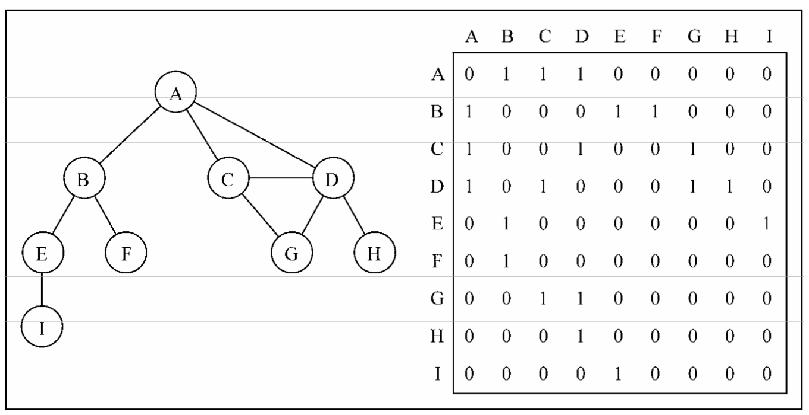
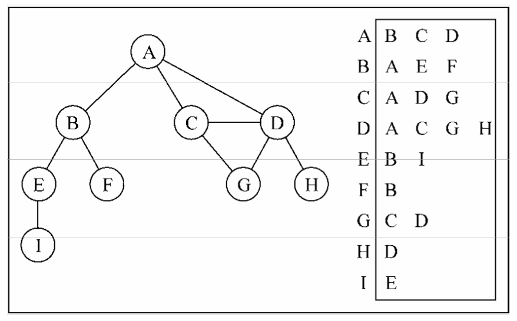
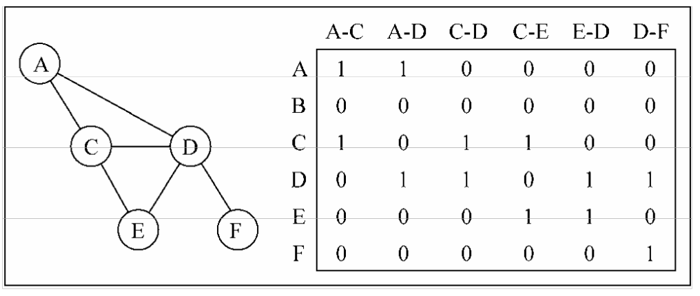

## 图
图是网络结构的抽象模型。图是一组由边连接的节点（或顶点），任何二元关系都可以用图来表示。

一个图G=(V, E)由以下兀素组成：
- V: 一组顶点
- E: 一组边，连接V中的顶点

### 有向图、无向图、加权图

有向图中，边具有方向。它们从一个节点转到另一个节点，并且无法通过该边返回到初始节点。

无向图，边是无向的（它们没有特定的方向）。将无向边视为双向街道。您可以从一个节点转到另一个节点并返回相同的“路径”。

加权图中，每条边都有一个与之相关的值（称为权重）。该值用于表示它们连接的节点之间的某种可量化关系。

### 图的表示方式

#### 邻接矩阵

#### 邻接表

#### 关联矩阵

### 实现无向图与有向图

采用邻接表来实现较为简单，我们可以使用ES6的Map来存储这张表。
被通过Map.has和Map.set来高效处理部分逻辑

### 实现的方法

- addVertex 添加顶点
- addEdge 添加边
- breadthFirstSearch 广度优先搜索
- depthFirstSearch 深度优先搜索
- toString 返回字符串式的结构

### TODO
- 最短路径算法
- 最小生成树
