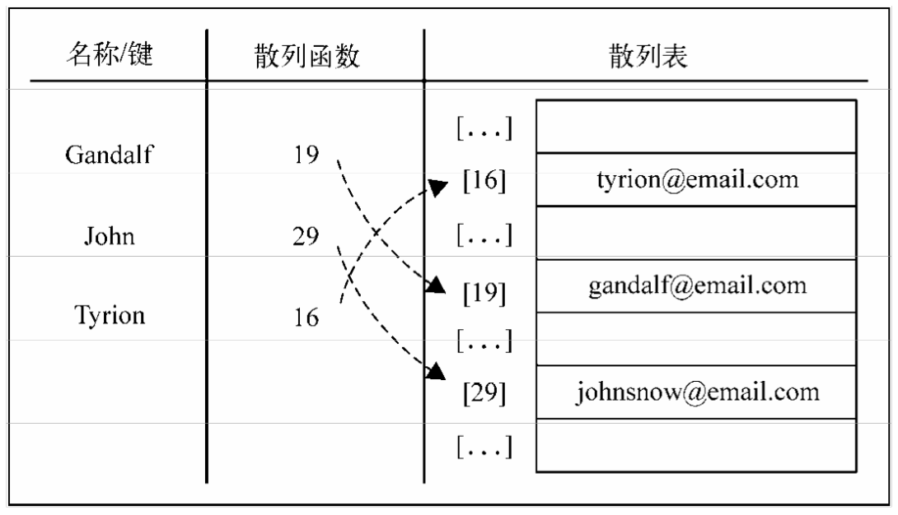

## 散列表（哈希表）：Hash Tables

根据关键码值(Key value)而直接进行访问的数据结构。也就是说，它通过把关键码值映射到表中一个位置来访问记录，以加快查找的速度。这个映射函数叫做散列函数，存放记录的数组叫做散列表。

使用哈希表可以进行非常快速的查找操作。很多语言的内置数据结构像python中的字典，java中的HashMap，都是基于哈希表实现。
参考Java的JDK的话，地址利用最好在0.75左右效率最高
哈希表可以概念化为一个数组，其中包含一系列存储在对象内部子数组（桶）中的元组。一个桶就是可以存多个地址冲突的值

- 在散列中，通过使用散列函数将大键转换为小键。
- 然后将这些值存储在称为哈希表的数据结构中。
- 散列的想法是在数组中统一分配条目（键/值对）。为每个元素分配一个键（转换键）。
- 通过使用该键，您可以在O(1)时间内访问该元素。
- 使用密钥，算法（散列函数）计算一个索引，可以找到或插入条目的位置。

### 实现的内部方法

使用循环取余加单链表解决地址冲突

- hash 根据内容计算一个存储地址
- set 设置键和值
- delete 删除一条数据
- get 获取一条数据
- has 判断数据是否已经存在

### 散列函数计算存储位置的算法

- 直接寻址法
- 数字分析法
- 平方取中法
- 折叠法
- 随机数法
- 除留余数法

### 解决冲突的办法有哪些

- 线性探测方法：产生冲突后按顺序地往后一个一个找
- 二次探测方法：di=1^2,-1^2,2^2,-2^2，⑶^2，…，±（k)^2,(k<=m/2）
- 链表法：每个位置对应一条链表，所有散列值相同的元素都放到相同位置对应的链表中。

## 哈希表的一些技巧

如果要求一个算法复杂度是线性的，并且这个算法涉及查找或者排序什么的，那多半和哈希表有关，空间换时间来降低时间复杂度

比如leetcode128最长连续序列https://leetcode-cn.com/problems/longest-consecutive-sequence/

