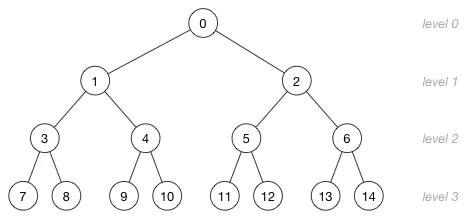
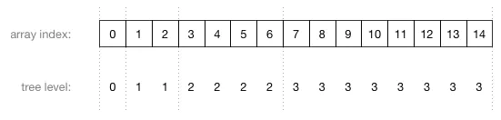

## 堆

堆(Heap)是计算机科学中一类特殊的数据结构的统称。堆通常是一个可以被看做一棵完全二叉树的数组对象。

## 堆的常用方法

- 构建优先队列
- 支持堆排序
- 快速找出一个集合中的最小值（或者最大值）
- 堆排序

## 最大堆和最小堆

最大堆中，父节点的值比每一个子节点的值都要大。在最小堆中，父节点的值比每一个子节点的值都要小。

## 堆的数组表示

## 公式转换
* 公式1：index的左侧节点 = 2 * index + 1
* 公式2：index的右侧节点 = 2 * index + 2
* 公式3：index的父节点 = Math.floor((index - 1) / 2);
* 公式4：第一个非叶子节点 = Math.floor(arr.length/2)-1 （堆排序用于构建大根堆

## 小根堆实现的方法

- getLeftIndex 返回左孩子
- getRightIndex 返回右孩子
- getParentIndex 返回父节点
- size 堆大小
- isEmpty 是否为空
- clear 清除堆
- insert 插入一个节点
- swap 交换数组元素
- siftUp 向上比较 节点上浮(用于数组在尾部最加时，需要往上判断)
- shiftDown 向下比较 节点下沉(用于删除头部节点，然后将尾部替换为头部时下沉比较)