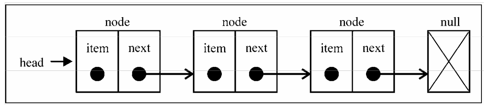
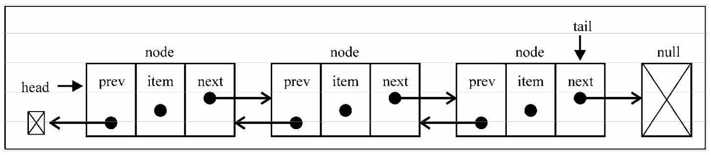
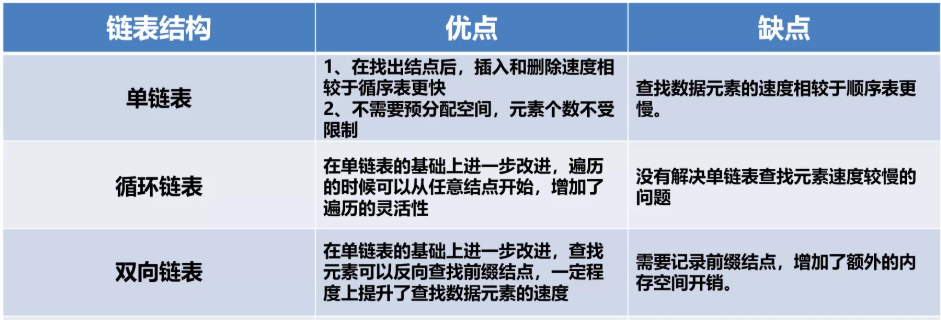

## 数组与链表

大多数语言中，数组的大小是固定的，从数组的起点或中间插入或移除项的成本很高，因为需要移动元素；


链表存储有序的元素集合，但不同于数组，链表中的元素在内存中并不是连续放置的。每个 元素由一个存储元素本身的节点和一个指向下一个元素的引用(也称指针或链接)组成。下图展示了链表的结构:

### 单链表




### 双链表




### 循环链表

循环链表的特点是无须增加存储量,仅对表的链接方式稍作改变,即可使得表处理更加方便灵活.

- ①循环链表中没有NULL指针.涉及遍历操作时,其终止条件就不再是像非循环链表那样判别p或p->next是否为空,而是判别它们是否等于某一指定指针,如头指针或尾指针等. 
- ②在单链表中,从一已知结点出发,只能访问到该结点及其后续结点,无法找到该结点之前的其它结点.而在单循环链表中,从任一结点出发都可访问到表中所有结点,这一优点使某些运算在单循环链表上易于实现.



## Js里的指针

相对于传统的数组，链表的一个好处在于，添加或移除元素的时候不需要移动其他元素。然而，链表需要使用指针，因此实现链表时需要额外注意。
```tsx
let obj = {
    a:1,
    b:2
}
let obj2 = {
    c:1,
    d:2
}

let point1 = obj
let point2 = obj2// obj和obj2只是一个指向堆内存地址的指针变量  

obj.a = 'aaaa'
console.log(point1)

obj2 = "cccc"//point2已经指向了{c:1，d:2} 无能你怎么修改obj2这个变量都不会
console.log(point2)
```

## 主要实现的链表方法

- prepend 头部插入
- append 尾部插入
- insert 按索引插入
- empty 置空链表
- removeAt 按索引删除
- reverse 翻转链表
- indexOf 返回一个节点的索引
- findNode 返回指定节点
- toArray 转化为数组
- print 打印链表
- swap 双链表交换节点