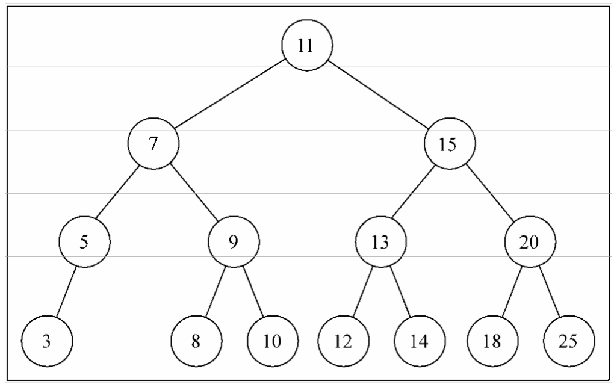

## 二叉树和二叉搜索树

二叉树中的节点最多只能有两个子节点：一个是左侧子节点，另一个是右侧子节点。这些定 义有助于我们写出更高效的向/从树中插人、查找和删除节点的算法。
二叉搜索树（BST）是二叉树的一种，但是它只允许你在左侧节点存储（比父节点）小的值， 在右侧节点存储（比父节点）大（或者等于）的值。

## 相关术语

- 树的结点（node）：包含一个数据元素及若干指向子树的分支；
- 孩子结点（child node）：结点的子树的根称为该结点的孩子；
- 双亲结点：B 结点是A 结点的孩子，则A结点是B 结点的双亲；
- 兄弟结点：同一双亲的孩子结点； 堂兄结点：同一层上结点；
- 祖先结点: 从根到该结点的所经分支上的所有结点
- 子孙结点：以某结点为根的子树中任一结点都称为该结点的子孙
- 结点层：根结点的层定义为1；根的孩子为第二层结点，依此类推；
- 树的深度：树中最大的结点层
- 结点的度：结点子树的个数
- 树的度： 树中最大的结点度。
- 叶子结点：也叫终端结点，是度为 0 的结点；
- 分枝结点：度不为0的结点；
- 有序树：子树有序的树，如：家族树；
- 无序树：不考虑子树的顺序；

## 实现二叉搜索树

### 搜索树的基本方法实现

- insert 与 insertNode 插入节点
- preOrderTraverse 前序遍历 根节点->左子树->右子树
- inOrderTraverse 中序遍历 左子树->根节点->右子树
- postOrderTraverse 后序遍历 左子树->右子树->根节点
- maxNode 取最大值
- minNode 取最小值
- search 查找节点是否存在
- maxDeep 最大深度
- removeNode 删除节点分三种情况：
  * 1删除叶子节点
  * 2删除单边的节点
  * 3删除左右孩子都有的节点

### 建立的搜索树

