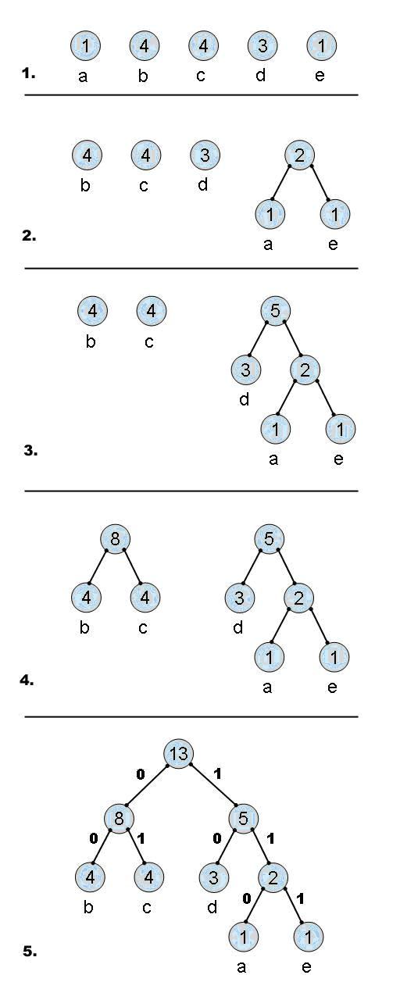

## gzip 开启-三种方法
可以减小文件体积，传输速度更快。gzip是节省带宽和加快站点速度的有效方法。
服务端发送数据时可以配置 Content-Encoding：gzip，用户说明数据的压缩方式
客户端接受到数据后去检查对应字段的信息，就可以根据相应的格式去解码。
客户端请求时，可以用 Accept-Encoding:gzip，用户说明接受哪些压缩方法。

nginx服务端响应请求时候压缩：
```
server {
    # 开启gzip
    gzip on;
    # 启用gzip压缩的最小文件，小于设置值的文件将不会压缩
    gzip_min_length 1k;
    # gzip 压缩级别，1-10，数字越大压缩的越好，也越占用CPU时间，后面会有详细说明
    gzip_comp_level 2;
    # 进行压缩的文件类型。javascript有多种形式。其中的值可以在 mime.types中找到。
    gzip_types text/plain application/javascript application/   x-javascript text/css application/xml text/javascript;
}
```

node服务端响应请求时候压缩：

```
const compress = require('koa-compress');
const app = module.exports = new Koa();
app.use(compress());
```

Webpack的 gzip设置 - 应用构建时候压缩
```
const CompressionWebpackPlugin = require('compression-webpack-plugin');

webpackConfig.plugins.push(
    new CompressionWebpackPlugin({
      asset: '[path].gz[query]',
      algorithm: 'gzip',
      test: new RegExp('\\.(js|css)$'),
      // 只处理大于xx字节 的文件，默认：0
      threshold: 10240,
      // 示例：一个1024b大小的文件，压缩后大小为768b，minRatio : 0.75
      minRatio: 0.8 // 默认: 0.8
      // 是否删除源文件，默认: false
      deleteOriginalAssets: false
    })
)

```

## 双端Gzip区别及其意义

使用 Webpack的好处是， Nginx每次请求服务端都要压缩很久才回返回信息回来，不仅服务器开销会增大很多，请求方也会等的不耐烦。我们在 Webpack打包时就直接生成高压缩等级的文件，作为静态资源放在服务器上，这时将 Nginx作为二重保障就会高效很多。

## 压缩核心之 Deflate

Deflate 是一个同时使用 LZ77 与 Huffman Coding 的算法，这里简单介绍下这两种算法的大致思路。


## LZ77
>https://www.jianshu.com/p/4033028e5570

LZ77 的核心思路是如果一个串中有两个重复的串，那么只需要知道第一个串的内容和后面串相对于第一个串起始位置的距离 + 串的长度。

比如： ABCDEFGABCDEFH → ABCDEFG(7,6)H。7 指的是往前第 7 个数开始，6 指的是重复串的长度，ABCDEFG(7,6)H 完全可以表示前面的串，并且是没有二义性的。

LZ77 用 滑动窗口（sliding-window compression）来实现这个算法。具体思路是扫描头从串的头部开始扫描串，在扫描头的前面有一个长度为 N 的滑动窗口。如果发现扫描头处的串和窗口里的 最长匹配串 是相同的，则用（两个串之间的距离，串的长度）来代替后一个重复的串，同时还需要添加一个表示是真实串还是替换后的“串”的字节在前面以方便解压（此串需要在 真实串和替换“串” 之前都有存在）。

解压：GZIP 的压缩因为要在窗口里寻找重复串相对来说效率是比较低的（LZ77 还是通过 Hash 等系列方法提高了很多），那解压又是怎么个情况呢？观察压缩后的整个串，每个小串前都有一个标识要标记是原始串还是替换“串”，通过这个标识就能以 O（1）的复杂度直接读完并且替换完替换“串”，整体上效率是非常可观的。

## Huffman Coding
>https://www.cnblogs.com/kuang17/p/7193124.html

核心思路是通过构造 Huffman Tree 的方式给字符重新编码（核心是避免一个叶子的路径是另外一个叶子路径的前缀），以保证出现频路越高的字符占用的字节越少。

解压：Huffman Coding 之后需要维护一张 Huffman Map 表，来记录重新编码后的字符串，根据这张表，还原原始串也是非常高效的。


### 读取文件内如计数

要进行Huffman编码，首先要把整个文件读一遍，在读的过程中，统计每个符号（我们把字节的256种值看作是256种符号）的出现次数。然后根据符号的出现次数，建立Huffman树，通过Huffman树得到每个符号的新的编码。对于文件中出现次数较多的符号，它的Huffman编码的位数比较少。对于文件中出现次数较少的符号，它的Huffman编码的位数比较多。然后把文件中的每个字节替换成他们新的编码。


### 建立Huffman树：

把所有符号看成是一个结点，并且该结点的值为它的出现次数。进一步把这些结点看成是只有一个结点的树。

每次从所有树中找出值最小的两个树，为这两个树建立一个父结点，然后这两个树和它们的父结点组成一个新的树，这个新的树的值为它的两个子树的值的和。如此往复，直到最后所有的树变成了一棵树。我们就得到了一棵Huffman树。


### 通过Huffman树得到Huffman编码：

这棵Huffman树，是一棵二叉树，它的所有叶子结点就是所有的符号，它的中间结点是在产生Huffman树的过程中不断建立的。我们在Huffman树的所有父结点到它的左子结点的路径上标上0，右子结点的路径上标上1。

现在我们从根节点开始，到所有叶子结点的路径，就是一个0和1的序列。我们用根结点到一个叶子结点路径上的0和1的序列，作为这个叶子结点的Huffman编码。

我们来看一个例子。

有一个文件的内容如下
abbbbccccddde

我们统计一下各个符号的出现次数，
a b c d e
1 4 4 3 1

建立Huffman树的过程如图：



通过最终的Huffman树，我们可以得到每个符号的Huffman编码。

a 为 110
b 为 00
c 为 01
d 为 10
e 为 111

我们可以看到，Huffman树的建立方法就保证了，出现次数多的符号，得到的Huffman编码位数少，出现次数少的符号，得到的Huffman编码位数多。

### 无公共前缀

各个符号的Huffman编码的长度不一，也就是变长编码。对于变长编码，可能会遇到一个问题，就是重新编码的文件中可能会无法如区分这些编码。

比如，a的编码为000，b的编码为0001，c的编码为1，那么当遇到0001时，就不知道0001代表ac，还是代表b。出现这种问题的原因是a的编码是b的编码的前缀。

由于Huffman编码为根结点到叶子结点路径上的0和1的序列，而一个叶子结点的路径不可能是另一个叶子结点路径的前缀，所以一个Huffman编码不可能为另一个Huffman编码的前缀，这就保证了Huffman编码是可以区分的。