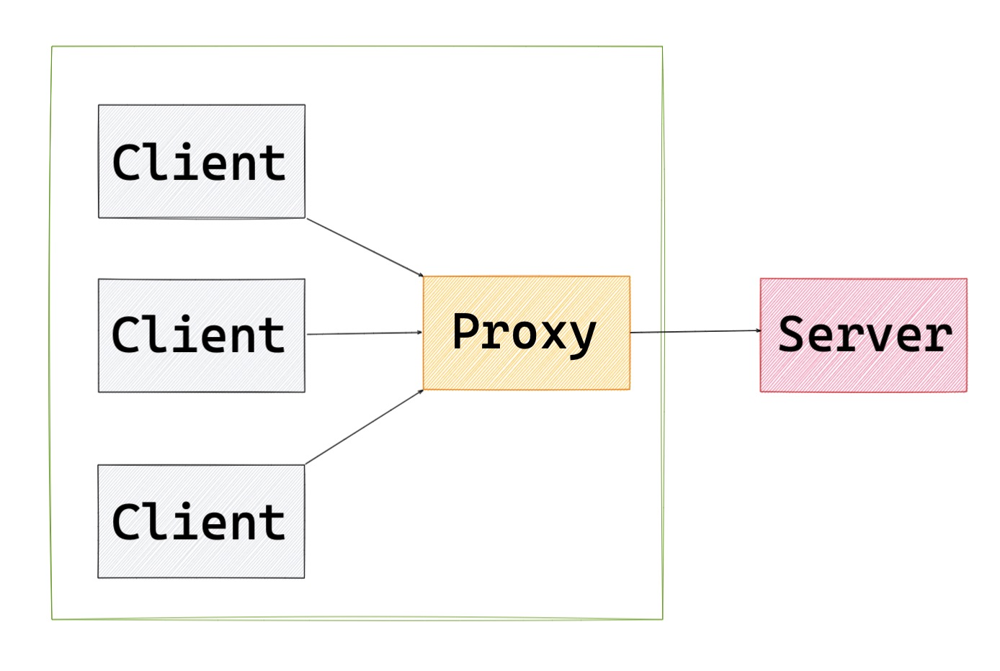
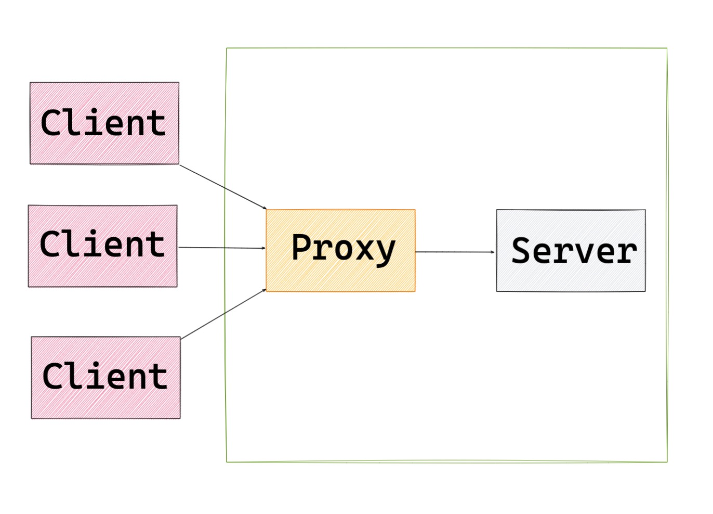

## 正向代理 Forward proxy

一句话解释正向代理，正向代理的对象是客户端，服务器端看不到真正的客户端。



```
resolver 8.8.8.8 # 谷歌的域名解析地址
server { 
    location / {      
        # 当客户端请求我的时候，我会把请求转发给它

        # $http_host 要访问的主机名 $request_uri 请求路径

        proxy_pass http://$http_host$request_uri; 
        }
    }
```

## 反向代理 Reverse proxy

一句话解释反向代理，反向代理的对象是服务端，客户端看不到真正的服务端。



跨域是前端工程师都会面临的场景，跨域的解决方案有很多。不过要知道在生产中，要么使用 CORS 、要么使用 Nginx 反向代理来解决跨域。在 Nginx 的配置文件中进行如下配置即可：

```
server {    
    listen   80;    
    server_name   localhost; # 用户访问 localhost，反向代理到 http://webcanteen.com    
    location / {        
        proxy_pass http://webcanteen.com    
        }
    }
```
