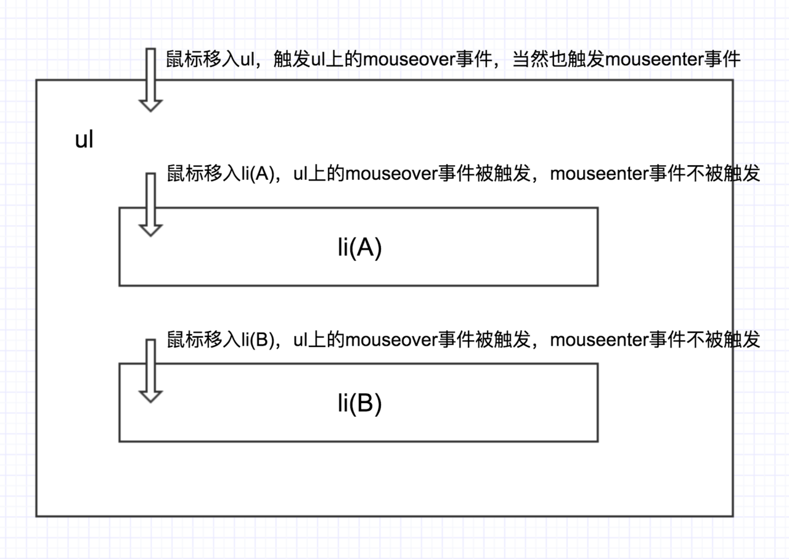

## JS 的特性

- JS 是一种轻量级，解释性脚本语言。
- 为了创建以网络为中心的应用程序而设计。
- 基于对象
- 补充和集成了 HTML
- 开放和跨平台

## 什么是类型化语言

类型化语言中，值与值关联，而不是与变量关联，它有两种类型：

- 动态:在这种情况下，变量可以包含多种类型，如在 JS 中，变量可以取 number, string 类型。
- 静态:在这种情况下，变量只能包含一种类型，就像在 Java 中声明为 string 的变量只能包含一组字符，不能包含其他类型。

## 函数式编程

> 这篇文章总结的可以：https://juejin.im/post/5c92f499f265da612647b754#heading-10

与面向对象编程（Object-oriented programming）和过程式编程（Procedural programming）并列的编程范式。

- 数式编程是声明式 的而不是命令式 的，应用程序的状态是通过纯函数流动的。
- 相对于面向对象编程（Object-oriented programming）关注的是数据而言，函数式编程关注的则是动作，其是一种过程抽象的思维，就是对当前的动作去进行抽象。
- 函数式强调将计算过程分解成可复用的函数，典型例子就是 map 方法和 reduce 方法组合而成 MapReduce 算法。
- 只有纯的、没有副作用的函数，才是合格的函数。
- 最主要的特征是，函数是第一等公民。

函数式编程的目的是使用函数来抽象作用在数据之上的控制流和操作，从而在系统中消除副作用并减少对状态的改变。

## ECMAScript 是什么？

ECMAScript 是编写脚本语言的标准，这意味着 JavaScript 遵循 ECMAScript 标准中的规范变化，因为它是 JavaScript 的蓝图。也就是说 ECMAScript 会约束 JavaScript
javaScript = ECMAScript + DOM + BOM（自认为是一种广义的 JavaScript）

## OOP 面向对象特征

### 封装

封装就是一个对象把自己的私有属性或方法隐藏起来，只对外提供与其它对象交互的必要接口，其他对象通过这些接口来操作这些私有的属性与方法，这就可以在数据正常交互的同时，保证安全性。

### 继承

当我们去定义一个类的时候，可以以一个已有的类为基础，把这个已有的类中定义的内容作为自己的内容，并且可以增加新的内容或者修改原有的内容以满足各种需要，这就是继承。继承是子类共享父类数据的一种机制，提供了很强的重用性与扩展性。

### 多态
实现多态一般方式是重写与重载，可以这么说，多态在我们平时开发中随处可见。
多态字面意思就是多种形态，简单的说，就是指不同的类可以响应同一个请求，实现多态，有三个前提：
- 要有继承关系
- 子类要重写父类的方法
- 父类引用指向子类对象


### 抽象

抽象是将一类对象的共同特征总结出来构造类的过程,包括数据抽象和行为抽象两方面,抽象只关注对象的哪些属性和行为,并不关注这此行为的细节是什么

### 面向对象的好处、特性

- 更方便
- 复用性好
- 高内聚和低耦合
- 代码冗余度低

## AOP 面向切片编程

AOP、OOP在字面上虽然非常类似，但却是面向不同领域的两种设计思想。OOP（面向对象编程）针对业务处理过程的实体及其属性和行为进行抽象封装，以获得更加清晰高效的逻辑单元划分。
而AOP则是针对业务处理过程中的切面进行提取，它所面对的是处理过程中的某个步骤或阶段，以获得逻辑过程中各部分之间低耦合性的隔离效果。这两种设计思想在目标上有着本质的差异。

AOP(Aspect-Oriented Programming)：面向切面的编程，是对面向对象编程（OOP）的补充。面向对象是纵向编程，继承、封装和多态，而面向切面编程补充面向对象的不足。
在OOP中，我们关注的是类（class），而在AOP中，我们关注的是切面。
比如说，一次表单提交，有正常的业务提交过程，但我们想在这个提交过程的横向加一个表单验证。或者一个正常的业务中，我们希望横向添加一些埋点功能，同时再横向添加运行时错误信息收集的功能，同时还能够验证一下是否有操作权限等，这些都是面向切面编程。
一般来说，如果你遇到了需要从外部增加一些行为，进而合并或修改既有行为，或者把业务逻辑代码和处理琐碎事务的代码分离开，以便能够分离复杂度等的业务场景，请一定要用好这种编程设计思想。
AOP比较典型的应用有：日志记录、性能监控、埋点上报、异常处理等等。（感觉可以联系ReactVue中的一些生命周期，以及一些Node的框架如think和egg）


## 控制反转

控制反转（Inversion of Control，缩写为IoC），是面向对象编程中的一种设计原则，可以用来减低计算机代码之间的耦合度。其中最常见的方式叫做依赖注入（Dependency Injection，简称DI），还有一种方式叫“依赖查找”（Dependency Lookup）。通过控制反转，对象在被创建的时候，由一个调控系统内所有对象的外界实体将其所依赖的对象的引用传递给它。也可以说，依赖被注入到对象中。

Class A中用到了Class B的对象b，一般情况下，需要在A的代码中显式的new一个B的对象。
采用依赖注入技术之后，A的代码只需要定义一个私有的B对象，不需要直接new来获得这个对象，而是通过相关的容器控制程序来将B对象在外部new出来并注入到A类里的引用中。而具体获取的方法、对象被获取时的状态由配置文件（如XML）来指定。 

## 内存溢出VS内存泄露

内存溢出 out of memory，是指程序在申请内存时，没有足够的内存空间供其使用，出现out of memory；比如申请了一个integer,但给它存了long才能存下的数，那就是内存溢出。还有就是调用栈溢出（即stackoverflow如递归没有结束条件），代码中存在死循环或循环产生过多重复的对象实体

内存泄露 memory leak，是指程序在申请内存后，无法释放已申请的内存空间，一次内存泄露危害可以忽略，但内存泄露堆积后果很严重，无论多少内存,迟早会被占光。

memory leak会最终会导致out of memory！

内存泄露:用完扔了，没有归还。我问你要1个亿，花完后，也没还给你（没退还）。
内存溢出:霸占不属于你的资源。你有100万时，我问你要1个亿。（给不起）

## JavaScript是面向对象还是基于对象？

- 面向对象：是先设计好图纸，然后按照这个图纸的设计去建造房子
- 基于对象：是先建造一个房子，然后根据房子的样子，再去建造房子


面向对象：是先有一个抽象的对象描述（类）， 然后根据这个描述去构建新的对象（实例化对象）
基于对象： 是先有一个具体的对象，然后根据这个具体的对象，再去创建新的对象（实例化对象）

JavaScript对象的具体设计：具有高度动态性的属性集合，是基于对象的。不能用传统的对象来看待

## Ajax 是什么？

“Ajax 即“Asynchronous Javascript And XML”（异步 JavaScript 和 XML），是指一种创建交互式网页应用的网页开发技术。Ajax = 异步 JavaScript 和 XML（标准通用标记语言的子集）。Ajax 是一种用于创建快速动态网页的技术。Ajax 是一种在无需重新加载整个网页的情况下，能够更新部分网页的技术。通过在后台与服务器进行少量数据交换，Ajax 可以使网页实现异步更新。这意味着可以在不重新加载整个网页的情况下，对网页的某部分进行更新。传统的网页（不使用 Ajax）如果需要更新内容，必须重载整个网页页面。”

## src 与 href 的区别

- href 是指向网络资源所在位置，建立和当前元素（锚点）或当前文档（链接）之间的链接，用于超链接。
- src 是指向外部资源的位置，指向的内容将会嵌入到文档中当前标签所在位置；
- 在请求 src 资源时会将其指向的资源下载并应用到文档内，例如 js 脚本，img 图片和 frame 等元素。 当浏览器解析到该元素时，会暂停其他资源的下载和处理，直到将该资源加载、编译、执行完毕，图片和框架等元素也如此，类似于将所指向资源嵌入当前标签内。这也是为什么将 js 脚本放在底部而不是头部。

## JSON 与 JS 对象的关系

JSON 是 JS 对象的字符串表示法，它使用文本表示一个 JS 对象的信息，本质是一个字符串。

## JSON.parse(JSON.stringify())的缺点

1.如果 obj 里面有时间对象，则 JSON.stringify 后再 JSON.parse 的结果，时间将只是字符串的形式，而不是对象的形式

2.如果 obj 里有 RegExp(正则表达式的缩写)、Error 对象，则序列化的结果将只得到空对象

3、如果 obj 里有函数，undefined，则序列化的结果会把函数或 undefined 丢失

4、如果 obj 里有 NaN、Infinity 和-Infinity，则序列化的结果会变成 null

5、JSON.stringify()只能序列化对象的可枚举的自有属性，例如 如果 obj 中的对象是有构造函数生成的， 则使用 JSON.parse(JSON.stringify(obj))深拷贝后，会丢弃对象的 constructor

6、如果对象中存在循环引用的情况也无法正确实现深拷贝

## 严格模式

- 变量必须声明后再使用
- 函数的参数不能有同名属性，否则报错
- 不能使用 with 语句
- 不能对只读属性赋值，否则报错
- 不能使用前缀 0 表示八进制数，否则报错
- 不能删除不可删除的属性，否则报错
- 不能删除变量 delete prop，会报错，只能删除属性 delete global[prop]
- eval 不会在它的外层作用域引入变量
- eval 和 arguments 不能被重新赋值
- arguments 不会自动反映函数参数的变化
- 不能使用 arguments.callee
- 不能使用 arguments.caller
- 禁止 this 指向全局对象
- 不能使用 fn.caller 和 fn.arguments 获取函数调用的堆栈
- 增加了保留字（比如 protected、static 和 interface）

## 设立”严格模式”的目的，主要有以下几个：

- 消除 Javascript 语法的一些不合理、不严谨之处，减少一些怪异行为;
- 消除代码运行的一些不安全之处，保证代码运行的安全；
- 提高编译器效率，增加运行速度；
- 为未来新版本的 Javascript 做好铺垫。

## es6 的 class 有哪些区别

- 不会提升
- class 声明内部会启用严格模式。
- class 的所有方法（包括静态方法和实例方法，以及原型对象 prototype）都是不可枚举的
- 子类的的 **proto** 指向到父类。

## AMD 和 CMD

- AMD： 使用 requireJS 来编写模块化，特点：依赖必须提前声明好。
- CMD： 使用 seaJS 来编写模块化，特点：支持动态引入依赖文件。

CMD 是另一种 js 模块化方案，它与 AMD 很类似，不同点在于：AMD 推崇依赖前置、提前执行，CMD 推崇依赖就近、延迟执行。

## window.onload 和\$(document).ready()的区别

- window.onload 是在页面中包含图片在内的所有元素全部加载完成再执行；
- \$(document).ready()是 DOM 树加载完成之后执行，不包含图片，其他媒体文件；
- 因此\$(document).ready()快于 window.onload 执行；

## src 和 href 的区别？

- href：
  href 是 Hypertext Reference 的缩写，表示超文本引用。用来建立当前元素（锚点）和文档之间的链接。如 link a 并行下载该文档，并且不会停止对当前文档的处理.
  `<link href="style.css" rel="stylesheet" />`
  浏览器明白当前资源是一个样式表，页面解析不会暂停（由于浏览器需要样式规则去画或者渲染页面，渲染过程可能会被被暂停）。这与把 css 文件内容写在`<style>`标签里不相同，因此建议使用 link 标签而不是@import 来吧样式表导入到 html 文档里。

- src：
  src 是 source 的缩写，src 指向的内容会嵌入到文档当前标签所在位置
  如 img、script、iframe 当浏览器解析到该元素时，会暂停浏览器的渲染，直到该资源加载完毕。`<script src="script.js"></script>`

## 什么是 css HACK？

CSS hack 是通过在 CSS 样式中加入一些特殊的符号，让不同的浏览器识别不同的符号，以达到应用不同的 CSS 样式的目的

## 让文本不可复制

```
    -webkit-user-select: none;
    -ms-user-select: none;
    -moz-user-select: none;
    -khtml-user-select: none;
    user-select: none;

```

## npm 模块安装机制

> npm 实现原理:https://juejin.im/post/5c7bd72ef265da2de80f7f17#heading-6

- 发出 npm install 命令
- 查询 node_modules 目录之中是否已经存在指定模块
- 若存在，不再重新安装
- 若不存在
  - npm 向 registry 查询模块压缩包的网址
  - 下载压缩包，存放在根目录下的.npm 目录里
  - 解压压缩包到当前项目的 node_modules 目录

## 数学算符转化

在对各种非 Number 类型运用数学运算符(- \* /)时，会先将非 Number 类型转换为 Number 类型;
注意+是个例外，执行+操作符时：

- 1.当一侧为 String 类型，被识别为字符串拼接，并会优先将另一侧转换为字符串类型。
- 2.当一侧为 Number 类型，另一侧为原始类型，则将原始类型转换为 Number 类型。
- 3.当一侧为 Number 类型，另一侧为引用类型，将引用类型和 Number 类型转换成字符串后拼接。

```
1 - true // 0
1 - null //  1
1 * undefined //  NaN
2 * ['5'] //  10
123 + '123' // 123123   （规则1）
123 + null  // 123    （规则2）
123 + true // 124    （规则2）
123 + {}  // 123[object Object]    （规则3）
```

## event.preventDefault() 和 event.stopPropagation()方法之间有什么区别？

event.preventDefault() 方法可防止元素的默认行为。 如果在表单元素中使用，它将阻止其提交。 如果在锚元素中使用，它将阻止其导航。 如果在上下文菜单中使用，它将阻止其显示或显示。可以在事件对象中使用 event.defaultPrevented 属性。 它返回一个布尔值用来表明是否在特定元素中调用了 event.preventDefault()。

event.stopPropagation()不再派发事件。终止事件在传播过程的捕获、目标处理或起泡阶段进一步传播。调用该方法后，该节点上处理该事件的处理程序将被调用，事件不再被分派到其他节点。

## 对象的遍历方法


- Reflect.ownKeys(obj)是最好用的，什么都能拿到，但要考虑兼容性

## 发布订阅和观察者模式区别

两种模式本质都是一样的，主要关键点都在于注册（添加到注册数组中）和触发（触发注册数组中的内容），只是订阅/发布模式对注册和触发进行了解耦。

使用订阅发布模式中发布者触发 publish 的时候，可以选择触发哪一些订阅者集合（因为 publish 参数传递了中间集合，可以定义多个 pubsub 集合），而观察者模式则只能触发所有的被观察对象。

观察者模式中主体和观察者是互相感知的，发布-订阅模式是借助第三方来实现调度的，发布者和订阅者之间互不感知

巧记：观察者模式没中间商赚差价，发布订阅模式 有中间商赚差价

## mouseover 和 mouseenter 的区别

- mouseover：当鼠标移入元素或其子元素都会触发事件，所以有一个重复触发，**冒泡的过程**。对应的移除事件是 mouseout
- mouseenter：鼠标移入监听对象时触发，在监听对象内移动不会触发。，也就是**不会冒泡**，对应的移出事件是 mouseleave



## 套接字（socket）概念

接字（socket）是通信的基石，是支持TCP/IP协议的网络通信的基本操作单元。它是网络通信过程中端点的抽象表示，
包含进行网络通信必须的五种信息：

- 连接使用的协议，
- 本地主机的IP地址，
- 本地进程的协议端口，
- 远地主机的IP地址，
- 远地进程的协议端口


应用层通过传输层进行数据通信时，TCP会遇到同时为多个应用程序进程提供并发服务的问题。多个TCP连接或多个应用程序进程可能需要通过同一个 TCP协议端口传输数据。
为了区别不同的应用程序进程和连接，许多计算机操作系统为应用程序与TCP／IP协议交互提供了套接字(Socket)接口。应用层可以和传输层通过Socket接口，区分来自不同应用程序进程或网络连接的通信，实现数据传输的并发服务。

立Socket连接至少需要一对套接字，其中一个运行于客户端，称为ClientSocket ，另一个运行于服务器端，称为ServerSocket 。

套接字之间的连接过程分为三个步骤：服务器监听，客户端请求，连接确认

## WebSocket

WebSocket 是一种在单个 TCP 连接上进行全双工通信的协议。WebSocket 通信协议于 2011 年被 IETF 定为标准 RFC 6455，并由 RFC7936 补充规范。WebSocket API 也被 W3C 定为标准。
WebSocket 使得客户端和服务器之间的数据交换变得更加简单，允许服务端主动向客户端推送数据。在 WebSocket API 中，浏览器和服务器只需要完成一次握手，两者之间就直接可以创建持久性的连接，并进行双向数据传输。

- Websocket 是基于 HTTP 协议的，或者说借用了 HTTP 的协议来完成一部分握手。
- 没有同源限制，客户端可以与任意服务器通信。
- 协议标识符是 ws（如果加密，则为 wss），服务器网址就是 URL。
- 较少的控制开销。在连接创建后，服务器和客户端之间交换数据时，用于协议控制的数据包头部相对较小。在不包含扩展的情况下，对于服务器到客户端的内容，此头部大小只有 2 至 10 字节（和数据包长度有关）；对于客户端到服务器的内容，此头部还需要加上额外的 4 字节的掩码。相对于 HTTP 请求每次都要携带完整的头部，此项开销显著减少了。
- 更强的实时性。由于协议是全双工的，所以服务器可以随时主动给客户端下发数据。相对于 HTTP 请求需要等待客户端发起请求服务端才能响应，延迟明显更少；即使是和 Comet 等类似的长轮询比较，其也能在短时间内更多次地传递数据。
- 保持连接状态。与 HTTP 不同的是，Websocket 需要先创建连接，这就使得其成为一种有状态的协议，之后通信时可以省略部分状态信息。而 HTTP 请求可能需要在每个请求都携带状态信息（如身份认证等）。
- 更好的二进制支持。Websocket 定义了二进制帧，相对 HTTP，可以更轻松地处理二进制内容。
  可以支持扩展。Websocket 定义了扩展，用户可以扩展协议、实现部分自定义的子协议。如部分浏览器支持压缩等。
- 更好的压缩效果。相对于 HTTP 压缩，Websocket 在适当的扩展支持下，可以沿用之前内容的上下文，在传递类似的数据时，可以显著地提高压缩率。

## 为什么需要 WebSocket

因为 HTTP 协议有一个缺陷：通信只能由客户端发起。这种单向请求的特点，注定了如果服务器有连续的状态变化，客户端要获知就非常麻烦。我们只能使用"轮询"：每隔一段时候，就发出一个询问，了解服务器有没有新的信息。最典型的场景就是聊天室。轮询的效率低，非常浪费资源（因为必须不停连接，或者 HTTP 连接始终打开）。

## Socket Socket.io 与 WebSocket

Socket 是应用层与TCP/IP协议族通信的中间软件抽象层，它是一组接口。在设计模式中，Socket其实就是一个门面模式，它把复杂的TCP/IP协议族隐藏在Socket接口后面，对用户来说，一组简单的接口就是全部，让Socket去组织数据，以符合指定的协议。
Socket是传输控制层协议，WebSocket是应用层协议，Socket.io是一个框架。Websocket仅仅是 Socket.io实现实时通信的一个子集。
WebSocket是HTML5新增的一种通信协议，其特点是服务端可以主动向客户端推送信息，客户端也可以主动向服务端发送信息，是真正的双向平等对话，属于服务器推送技术的一种。
Socket.io完全由JavaScript实现、基于Node.js、支持WebSocket协议用于实时通信、跨平台的开源框架，它包括了客户端的JavaScript和服务器端的Node.js。也就是说Socket.io将Websocket和轮询（Polling）机制以及其它的实时通信方式封装成了通用的接口，并且在服务端实现了这些实时通信机制。
Socket.io中主要使用了websocket，将轮询作为其辅助选项，提供的是相同的接口。其与node.js一样，也是事件驱动的。

## Canvas SVG WebGL

区别：

- Canvas 是需要自己画点的白板；
- SVG 是给数据就可以绘制点、线、图形的，基于 XML 的标记语言；
- WebGL 是基于 Canvas 的 3D 框架。
  适用：
- Canvas 适用于位图，高数据量高绘制频率（帧率）的场景，如动画、游戏；
- SVG 适用于矢量图，低数据量低绘制频率的场景，如图形、图表；
- WebGL 主要用来做 3D 展示、动画、游戏。

Canvas

- 依赖分辨率
- 不支持事件处理器
- 弱的文本渲染能力
- 能够以 .png 或 .jpg 格式保存结果图像
- 最适合图像密集型的游戏，其中的许多对象会被频繁重绘

SVG

- 不依赖分辨率
- 支持事件处理器
- 最适合带有大型渲染区域的应用程序（比如谷歌地图）
- 复杂度高会减慢渲染速度（任何过度使用 DOM 的应用都不快）
- 不适合游戏应用


## JavaScript 使用 "src"，CSS 使用 "href"？

历史遗留问题，先贤们的bug；比个不太恰当的比喻，就像javaScript叫javaScript一样。

可能是因为先贤们认为样式表更符合外部链接资源的特征，它更接近附属的资源，而不是内嵌的内容。比如考虑alternate stylesheets，在同一时间只需要链接一组样式表，而不是载入所有。当然你可以简单的归结为历史遗留（也就是当初某个浏览器开发者的一个偶然决定导致）。

## 为什么第一次打开页面很慢，后面就变快了

- 资源按照一定的策略被缓存（强缓存，弱缓存）
- 浏览器被缓存域名解析的结果，下一次就不要去解析了

## HTML是什么文法？

常规的编程语言都是上下文无关的，而HTML却相反，也正是它非上下文无关的特性，决定了HTML Parser并不能使用常规编程语言的解析器来完成，需要另辟蹊径。
这个算法分为两个阶段:
- 词法分析：标记化
- 语法分析：建树

这个算法输入为HTML文本，输出为HTML标记，也成为标记生成器。其中运用有限自动状态机来完成。即在当当前状态下，接收一个或多个字符，就会更新到下一个状态。

## 雪碧图

>将小图标合并在一起之后的图片称作雪碧图,然后通过位置偏移就可以取到任意的小图标

使用雪碧图的优点有以下几点：
- 将多张图片合并到一张图片中，可以减小图片的总大小。
- 将多张图片合并成一张图片后，下载全部所需的资源，只需一次请求。可以减小建立连接的消耗。

雪碧图的制作与使用方法：使用图像编辑软件如Photoshop将多张图放到同一个图层并导出。使用自动化构建工具自动拼接合并后的图片。引用图片时，图片地址为合并后的图片地址。
好像webpack有一个插件能够直接帮我们打包小图标成雪碧图

##  后端返回大量数据，前端应该怎么优化渲染？

性能优化可以从 前端侧、网络侧、后端侧 共同考虑：
前端侧主要是考虑用户看界面时的体验问题：对于用户来说，一般很大的数据，用户肯定不可能一下子全部看完，他也需要时间去看。从用户的行为角度去思考，看看哪些数据是需要先展示的，就先请求这些数据，先让用户能先看到界面；然后再慢慢加载数据。加载的方式有很多：
- 比如采用分页（后端返回大量数据肯定是没有分页的，前端来做），可以先让用户看到首页，然后开个Web work去执行切割，这样不影响主线程的渲染
- 还有就是大数据插入到 DOM 的时候必然吃不消，会出现卡顿，因此可以通过滚动按需加载或者分页，推荐了解下 react-virtualized
- 自己来写的话可以使用requestAnimationFrame或者requestIdleCallback来做渲染的时间分片
- 还要考虑的是用户第二次加载这些数据的性能问题，因此可以考虑本地换成(localStorage, indexedDB)；
- 根据业务场景，前端也可以不局限于纯前端，可以从大前端的角度考虑。是否需要自己写的node服务来做缓存等等
- 最后也是最优解：使用一些虚拟滚动的组件如react-virtualized。原理：用数组保存所有列表元素的位置，只渲染可视区内的列表元素，当可视区滚动时，根据滚动的offset大小以及所有列表元素的位置，计算在可视区应该渲染哪些元素，动态更新。

## 编码是什么

编码是信息从一种形式或格式转换为另一种形式的过程，也称为计算机编程语言的代码简称编码。用预先规定的方法将文字、数字或其它对象编成数码，或将信息、数据转换成规定的电脉冲信号。编码在电子计算机、电视、遥控和通讯等方面广泛使用。编码是信息从一种形式或格式转换为另一种形式的过程。解码，是编码的逆过程。

### ASCII
最早计算机在设计时采用8bit作为一个字节（byte），所以一个字节能标识的最大整数就是255「11111111(B) = 255」，0-255被用来标识大小写英文字母、数字和一些符号，这个编码表就被称为ASCII编码。这套ASCII 码基本适用了以英文为基础的国家计算机编码

### 中国（GBK 系列）

由于中文汉字个数太多，仅仅用一个字节的长度已经无法容纳各种各自的汉字了，因此，中国采用两个字节来编码，无论中英文都是两个字符，这就是GBK 编码
（详细: 小于127号的还是继续使用，并且用2个大于127的字节表示一个中文字符，前面的一个字节（称之为高字节）从0xA1用到 0xF7，后面一个字节（低字节）从0xA1到0xFE，这样我们就可以组合出大约7000多个简体汉字了。在这些编码里，我们还把数学符号、罗马希腊的字母、日文的假名们都编进去了，连在 ASCII 里本来就有的数字、标点、字母都统统重新编了两个字节长的编码，这就是常说的 全角 字符，而原来在127号以下的那些就叫 半角 字符了。 中国人民看到这样很不错，于是就把这种汉字方案叫做 “GB2312“。GB2312 是对 ASCII 的中文扩展。）

### 集大成者（Unicode）

Unicode（统一码、万国码、单一码）是计算机科学领域里的一项业界标准,包括字符集、编码方案等。Unicode 是为了解决传统的字符编码方案的局限而产生的，它为每种语言中的每个字符设定了统一并且唯一的二进制编码，以满足跨语言、跨平台进行文本转换、处理的要求。

既然语言如此多样，而各种编码规则又是乱成一锅，因此为了实现统一，国际标谁化组织废了所有的地区性编码方案，重新搞一个包括了地球上所有文化、所有字母和符号的编码，这个编码成为unicode
unicode 编码规定保留之前的ASCII 的字符，并把所有的字符都用两个字节 去表示，这一规定虽然统一了编码的规范，但是出现的严重问题是大量的浪费存储的空间，计算机编程大部分都是英文字符，而英文字符使用一个字节就足够表示了，unicode 编码规定所有的字符都表示成 两个字节，即英文字符会在另一个字节中补0，大大浪费了空间。

### 最终方案（utf-8）

UTF-8（8位元，Universal Character Set/Unicode Transformation Format）是针对Unicode的一种可变长度字符编码。它可以用来表示Unicode标准中的任何字符，而且其编码中的第一个字节仍与ASCII相容，使得原来处理ASCII字符的软件无须或只进行少部份修改后，便可继续使用。

utf-8 的编码规则规定，像英文这样的简单字符用单字节表示，而像中文这样复杂的字符用三个字节表示。

UTF-8 的编码规则很简单，只有二条：

- 1）对于单字节的符号，字节的第一位设为0，后面7位为这个符号的 Unicode 码。因此对于英语字母，UTF-8 编码和 ASCII 码是相同的。
- 2）对于n字节的符号（n > 1），第一个字节的前n位都设为1，第n + 1位设为0，后面字节的前两位一律设为10。剩下的没有提及的二进制位，全部为这个符号的 Unicode 码。

### 注意

UTF是Unicode TransferFormat的缩写，UTF-8和UTF-16都是把Unicode码转换成程序数据的一种编码方式。UTF-8 与 Unicode区别：
- Unicode 是 「字符集」
- UTF-8 是 「编码规则」

UTF-8 就是在互联网上使用最广的一种 Unicode 的实现方式。其他实现方式还包括 UTF-16（字符用两个字节或四个字节表示）和 UTF-32（字符用四个字节表示），不过在互联网上基本不用。重复一遍，这里的关系是，UTF-8 是 Unicode 的实现方式之一。