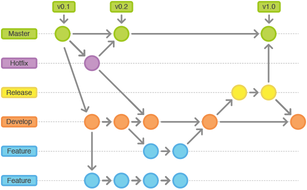

## Git Flow

Git Flow是一套基于git的工作流程，这个工作流程围绕着project的发布(release)定义了一个严格的如何建立分支的模型。

Git建分支是非常cheap的，我们可以任意建立分支，对任意分支再分支，分支开发完后再合并。

比较推荐、多见的做法是特性驱动(Feature Driven)的建立分支法(Feature Branch Workflow)。

简而言之就是每一个特性(feature)的开发并不直接在主干上开发，而是在分支上开发，分支开发完毕后再合并到主干上。

## Flow优点

- 还处于半成品状态的feature不会影响到主干
- 各个开发人员之间做自己的分支，互不干扰
- 主干永远处于可编译、可运行的状态

## 具体做法
- master 是长期分支，用于管理对外发布版本，每个 commit 对一个 tag，也就是一个发布版本
- hotfix 是短期分支 ，一般用于正式发布以后，出现 bug，需要创建一个分支，进行 bug 修补。
- release 是短期分支，一般用于发布正式版本之前（即合并到 master 分支之前），需要有的预发布的版本进行测试。release 分支在经历测试之后，测试确认验收，将会被合并的 develop 和 master
- develop 是长期分支，一般用于作为日常开发汇总，即开发版的代码
- feature 是短期分支，一般用于一个新功能的开发

## 建议阅读

- https://www.git-tower.com/learn/git/ebook/cn/command-line/advanced-topics/git-flow
- https://www.cnblogs.com/wish123/p/9785101.html
- https://juejin.im/post/5ad802faf265da50407bcc49
- https://juejin.im/post/5ad802faf265da50407bcc49
- https://segmentfault.com/a/1190000006194051
