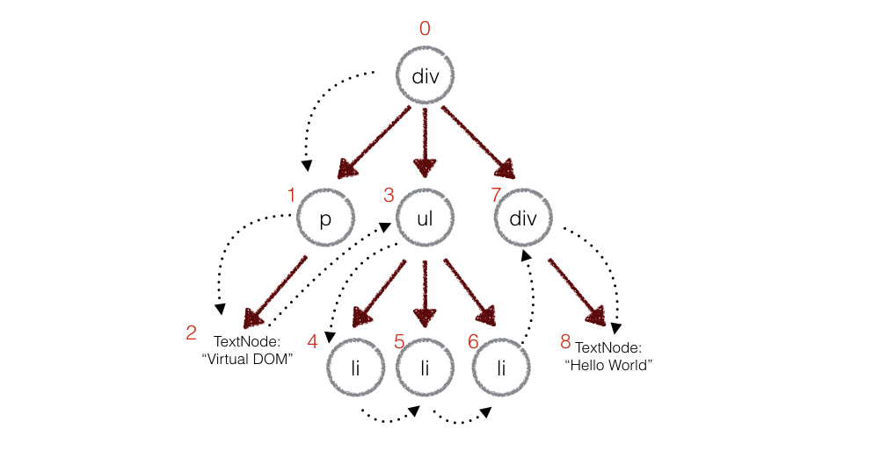

## 两种Diff策略

很多类React框架实现方式都不太一样，有的框架会选择保存上次渲染的虚拟DOM，然后对比虚拟DOM前后的变化，得到一系列更新的数据，然后再将这些更新应用到真正的DOM上。

也有一些框架会选择直接对比虚拟DOM和真实DOM，这样就不需要额外保存上一次渲染的虚拟DOM，并且能够一边对比一边更新，这也是我们选择的方式。

### diff虚拟树与真实树

>代码见[diff.js](../src/react-dom/diff.js)

这种方法不需要额外保存上一次渲染的虚拟DOM，在setState后又生成新的Virtual DOM后直接与真实DOM树比对，有不同的地方立刻更新（相当于一边diff一边更新）

### diff两颗虚拟树

>代码见[diff-两颗虚拟树](../src/react-dom/diff-两颗虚拟树.js) [patch-差异更新到真实树](../src/react-dom/patch-差异更新到真实树.js)

这种方法需要保存上一次的Virtual DOM，然后比如在setState后又生成新的Virtual DOM，然后对比虚拟DOM前后的变化，得到一系列更新的数据并保存起来，然后最后再统一更新到真实的DOM上。

## diff两颗虚拟树时如何保存差异最后更新

### 带索引的深度优先遍历

首先可以设置一个记录索引的变量，每遍历到一个节点，就将这个变量+1，这样新旧虚拟树相同位置的节点都能有一个索引对应，当比较到两个节点有差异时就把索引和差异记录下来就行了。
012345678就是节点的索引：

### diff-记录差异的类型

根据前面的文章有提到diff原理我们可以定义如下类型的差异：

- {type: 'REMOVE', index}新的DOM节点不存在
- {type: 'TEXT', text: 1}文本的变化
- {type: 'ATTR', attr: {class: 'list-group'}}当节点类型相同时，去看一下属性是否相同，产生一个属性的补丁包
- {type: 'REPLACE', newNode}节点类型不相同，直接采用替换模式

### patch-将差异更新到页面

现在构建的Virtual DOM Tree和render出来真正的DOM树的信息、结构是一样的。于是我们可以对真实的DOM树也进行深度优先的遍历，并且也带索引下去，这样索引就和之前diff出来的索引是对应的，所以我们在patches对象中能找出当前遍历的节点索引就表示有差异，由于我们也记录了差异的类型，比对后去执行对应的方法即可

