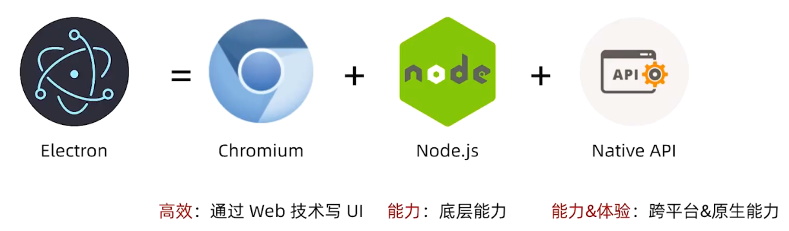
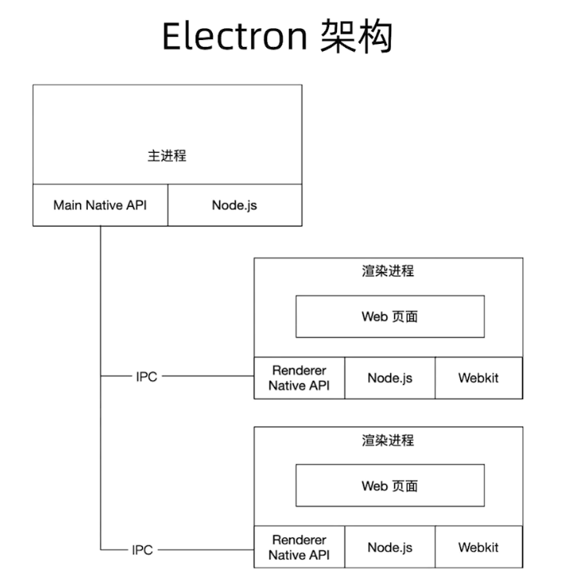
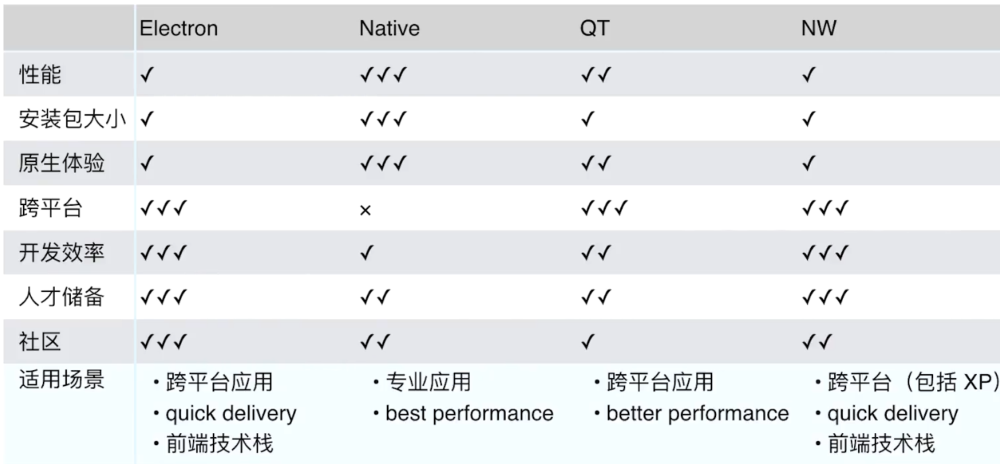

## 什么是Electron

## Electron架构

## 如何Node.js 和 Chromiums 整合

难点：Node.js 事件循环基于 libuv，但 Chromium 基于 message bump 
- Chromium 集成到 Node.js: 用 libuv 实现 messagebump  (nw) 

这种主进程时不太好处理，因为每个系统的GUI实现不太一样，而且很多边界条件处理不好，如果用定时器轮询GUI的事件会发现响应慢且耗费CPU资源。

后来libuv引入backend_fd(轮询事件的描述符)，所以我们可以通过轮询backend_fd就知道libuv是否有了一个新的事件，这样诞生了下面的方法。

- Node.js 集成到 Chromium （electron）：Electron起一个新的安全线程去轮询backed_fd,通过PostTask转发到Chromium的事件循环中。

## 在渲染层使用Node模块的导入方式

- window.require()
- 更改Webpack的target配置改为"electron-render" 就可以使用ESmoudle直接导入了

## 对比其它框架

