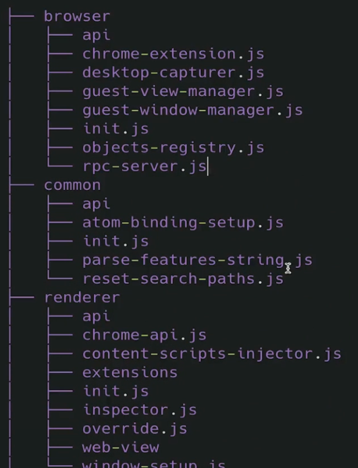
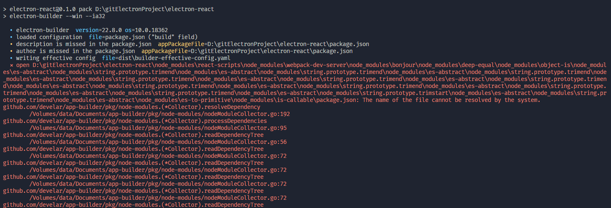
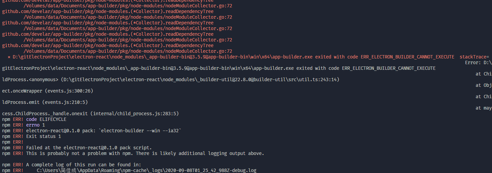
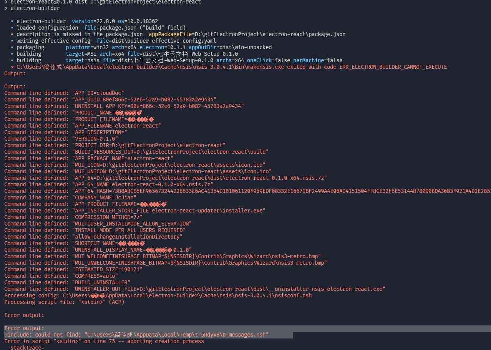

## 指令

```
    "pack": "electron-builder --dir", // 打包一个直接课执行的文件
    "dist": "electron-builder", // 打包成一个安装包
```

## React 与 electron 冲突

我们首先打包的React文件是默认在build文件夹下的，但是到electron-builder打包pack的时候，认为build文件夹是用来生成安装包使用的，不需要打包到应用程序中，那么我们的打包的应用程序就无法执行了。所以需要指定pack的files，需要把打包的文件都添加进去


## React 绝对路径的问题

React里打包出来的文件模块导入的路径都是绝对路径的。
我们可以在package.json中写homepage字段指定为`"./"`相对路径


## 生成环境与开发环境的问题


dependencies和devdependencies要区分好，这个和普通的前端项目还有区别的，比如一般我们的React相关的依赖都是在dependencies中devdependencies中。
原因就是react官方脚手架打包时生成了一个build目录（在没有指定NODE_ENV=production只要是被用到的依赖dev中也会被打包的），然后我们又使用electron去打包，默认electron会把dependencies中的依赖都打入到最终的一个resources中去的.asar文件中去，会导致包特别大，这个文件是源码的压缩文件。


electron-builder是默认不会去打包devdependencies里的依赖的，所以优化包的大小时，可以把主进程用到的模块写入dev中，其他都放到devdependencies

## asar压缩文件

### app.asar压缩文件

electron内部的源码保护文件，是压缩过的，不是很安全，容易破解

```
npm install asar -g
asar extract app.asar ./app 用于解压 解压后发就是被打包的源码部分
```


### electron.asar

内部是electron源代码和相关的模块，被压缩到这个里面

## exe可执行文件

exe就是一个被编译好的文件，包含了nodeV8的执行环境以及chromium，内部去加载resources的app.asar的内容，包括入口文件的地址都是从内部package.json中来的。


## win的安装配置
```
    "win": {
      "target": [
        "msi",
        "nsis"
      ],
      "icon": "assets/icon.ico",
      "artifactName": "${productName}-Web-Setup-${version}.${ext}",
      "publisherName": "Viking Zhang"
    },
    "nsis": {
      "allowToChangeInstallationDirectory": true, // 选择位置
      "oneClick": false, / 是否一键安装
      "perMachine": false
    }
```

## 比较完整的打包配置

```
"build": {
    "productName":"xxxx",//项目名 这也是生成的exe文件的前缀名
    "appId": "com.leon.xxxxx",//包名  
    "copyright":"xxxx",//版权  信息
    "directories": { // 输出文件夹
      "output": "build"
    }, 
    "nsis": {
      "oneClick": false, // 是否一键安装
      "allowElevation": true, // 允许请求提升。 如果为false，则用户必须使用提升的权限重新启动安装程序。
      "allowToChangeInstallationDirectory": true, // 允许修改安装目录
      "installerIcon": "./build/icons/aaa.ico",// 安装图标
      "uninstallerIcon": "./build/icons/bbb.ico",//卸载图标
      "installerHeaderIcon": "./build/icons/aaa.ico", // 安装时头部图标
      "createDesktopShortcut": true, // 创建桌面图标
      "createStartMenuShortcut": true,// 创建开始菜单图标
      "shortcutName": "xxxx", // 图标名称
      "include": "build/script/installer.nsh", // 包含的自定义nsis脚本
    },
    "publish": [
      {
        "provider": "generic", // 服务器提供商 也可以是GitHub等等
        "url": "http://xxxxx/" // 服务器地址
      }
    ],
    "files": [
      "dist/electron/**/*"
    ],
    "dmg": {
      "contents": [
        {
          "x": 410,
          "y": 150,
          "type": "link",
          "path": "/Applications"
        },
        {
          "x": 130,
          "y": 150,
          "type": "file"
        }
      ]
    },
    "mac": {
      "icon": "build/icons/icon.icns"
    },
    "win": {
      "icon": "build/icons/aims.ico",
      "target": [
        {
          "target": "nsis",
          "arch": [
            "ia32"
          ]
        }
      ]
    },
    "linux": {
      "icon": "build/icons"
    }
  }
```

## 打包常见的坑

### node_modules模块保错

这里总是会报一些模块找不到，一会儿是Array.from,一回儿是一些webpack模块，一会有事其他模块，总是在这步卡主。




我试了几个办法之后成功的，具体哪里的问题很难分析。
- 使用安装npm的包rimraf来删除依赖再从新下载，rimraf node_modules
- 重新梳理devdependencies和dependencies，electron主进程用到的全放到dependencies，和主进程无关的依赖全部放到devdependencies
- 你build里的files的文件目录一定要写对，排查清楚，不要出现错误的目录。

### nsis保存

nsis是把问之前打包出来的可执行文件夹再打一次包制作成windows下的安装包。但是总是会报一些目录早不到

问题原因有两种：
- 首先最优可能的是打包需要的文件有部分没有下载全。有点情况会直接提示那些文件下载失败了可以去找压缩文件解压放进去。但是我遇到的情况是啥都不提示，但打包又是什么not find之类的。最好的做法就是去`C:\Users\**\AppData\Local\electron-builder`把electron-builder删除掉从新打包，这时会重新去下载全部资源
- 如果还是不行可能是文件目录存在中文或者一些无法解析的字符也会导致打包失败。但是有个很蛋疼的问题是很多人windows账号是中文的，然后electron-builder的一些模块是缓存到用户目录的，尤其是在nsis制作安装包时，好像会在一个TEMP文件加下写入一些.nsh脚本，不是英文用户名就可能导致不成功。最好的做法是去添加一个新的管理员账号，然后再重新打包

>nsh文件：使用NSIS （ Nullsoft的脚本化安装系统） ，用于创建Windows安装程序安装文件，保存，可以包含所有.NSI安装脚本的头信息，有助于建立共同的环境条件下安装。软件程序的发布促使 NSIS (Nullsoft Scriptable Install System) 开发了 NSIS Header File 文件类型SourceForge。 根据我们的内部数据，NSIS Header File 文件最受Brazil用户的欢迎，其中大多数运行 Windows 10。

```
!macro customHeader
  !system "echo '' > ${BUILD_RESOURCES_DIR}/customHeader"
!macroend

!macro customInit
  !system "echo '' > ${BUILD_RESOURCES_DIR}/customInit"
!macroend

!macro customInstall
  !system "echo '' > ${BUILD_RESOURCES_DIR}/customInstall"
!macroend
```