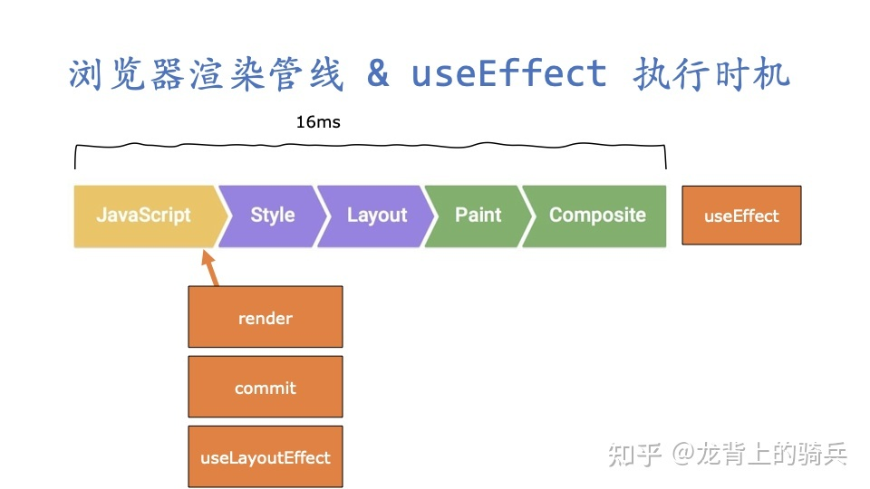

## useEffect
> 该 Hook 接收一个包含命令式、且可能有副作用代码的函数。在函数组件主体内（这里指在 React 渲染阶段）改变 DOM、添加订阅、设置定时器、记录日志以及执行其他包含副作用的操作都是不被允许的，因为这可能会产生莫名其妙的 bug 并破坏 UI 的一致性。使用 useEffect 完成副作用操作。赋值给 useEffect 的函数会在组件渲染到屏幕之后执行。你可以把 effect 看作从 React 的纯函数式世界通往命令式世界的逃生通道。

### 异步执行

为了防止渲染帧时间太长，React 将状态导致的副作用 useEffect 放在了额外的帧里执行，所以 useEffect 是一个名副其实的异步函数。

在未开启 Concurrent Mode 的情况下，React的 render phase, commit phase 都是同步执行，因为这一帧包含了太多的任务了，所以给我们做一些和渲染无关的任务 useEffect 就放到了渲染帧执行结束后再执行。如果有和渲染相关的任务，专门提供了一个 useLayoutEffect 的 hook放在 commit 之后同步执行。如下图



### 同步执行


如果只有一次render被触发，那么useEffect是异步执行的，但是如果两个render触发，react为了保证严格的 render useEffect render useEffect 顺序，一定会在下一次render来之前执行掉useEffect，所以useEffect也可能是同步触发的

### 先 destroy 再 create

在组件状态更新后，React 将先调用所有 destroy 函数，再调用所有 create 函数。在虚拟 DOM 树中，回调函数的执行顺序如下：
- 对于删除的虚拟 DOM，以先序遍历虚拟 DOM 树的顺序调用 destroy。
- 对于更新的虚拟 DOM，以后序遍历虚拟 DOM 树的顺序调用 destroy。
- 以后续遍历虚拟 DOM 树的顺序调用 create

```ts
useEffect(
  function create() {
    // 创建副作用的回调函数
    return function destroy() {
      // 清理副作用的回调函数
    }
  },
  // 副作用对应的依赖
  [...deps]
)
```


### 调度原理

调度器：调度更新 => 协调器：决定更新的内容 => 渲染器：将更新的内容渲染到视图中
- 协调器：触发更新时，FunctionComponent被执行，执行到useEffect时会判断他的第二个参数deps是否有变化
- 协调器：如果deps变化，则useEffect对应FunctionComponent的fiber会被打上Passive（即：需要执行useEffect）的标记。
- 协调器：他会为需要更新的内容对应的fiber（可以理解为虚拟DOM）打上标记,这些被打标记的fiber会形成一条链表effectList.
- 渲染器：遍历effectList过程中遍历到该fiber时，发现Passive标记，则依次执行该useEffect的destroy（即useEffect回调函数的返回值函数）与create（即useEffect回调函数）。

### 父子节点的顺序

协调器的工作流程是使用遍历实现的递归。所以可以分为递与归两个阶段:
- 递是从根节点向下一直到叶子节点
- 归是从叶子节点一路向上到根节点

effectList的构建发生在归阶段。所以，effectList的顺序也是从叶子节点一路向上
由于归阶段是从Child到Parent到App，所以相应effectList也是同样的顺序。

```tsx
function Child() {
  useEffect(() => {
    console.log('child');
  }, [])

  return <p>hello</p>;
}

function Parent() {
  useEffect(() => {
    console.log('parent');
  }, [])

  return <Child/>;
}

function App() {
  useEffect(() => {
    console.log('app');
  }, [])

  return <Parent/>;
}
// console child -> parent -> app
```


### 与componentDidMount不能类比

useEffect整个过程都和生命周期钩子没有关系。事实上生命周期钩子只是附着在这一流程上的钩子函数
```tsx
调度 -- 协调 -- 渲染
构建effectList -- 遍历effectList执行对应操作
```


### 源码如何实现

基于useEffect回调延迟调用（实际上就是异步调用） 的需求，在实现上利用scheduler的异步调度函数：scheduleCallback，将执行useEffect的动作作为一个任务去调度，这个任务会异步调用。Scheduler 任务调度是基于时间分片的思想，每隔一段时间就把主线程还给浏览器，避免长时间占用主线程，内部的异步调用特性是借助 MessageChannel 实现的，MessageChannel就是一个MacroTask宏任务。

不选择其他方案的原因：
- setTimeout(fn, 0)：最后间隔时间会变成 4 毫秒，而不是最初的 1 毫
- setInterval(fn, 0) 的效果，其结果与 setTimeout 相同

React 源码将 useEffect 回调的处理交给了 Scheduler 进行调度。React 源码如下：
```tsx
if (
  (finishedWork.subtreeFlags & PassiveMask) !== NoFlags ||
  (finishedWork.flags & PassiveMask) !== NoFlags
) {
  // 如果fiber节点上的flags存在Passive调度useEffect
  if (!rootDoesHavePassiveEffects) {
    rootDoesHavePassiveEffects = true
    scheduleCallback(NormalSchedulerPriority, () => {
      flushPassiveEffects()
      return null
    })
  }
}
```
可将 useEffect 的回调称为 Passive Effect。

flushPassiveEffects最后的步骤，执行effect的destroy和create。过程就是先循环待销毁的effect数组，再循环待创建的effect数组，这一过程发生在flushPassiveEffectsImpl函数中。循环的时候每个两项去effect是由于奇数项存储的是当前的fiber。

```tsx
// 可以近似的认为，React 做了这样一步，实际流程中要复杂的多
const Task = () => {
      const preDestory = element.destroy;
      if (!preDestory) prevDestroy();
      const destroy = create();
      element.destroy= destroy;
};

// MessageChannel构造宏任务
const channel = new MessageChannel()
const port = channel.port2

// 每次 port.postMessage() 调用就会添加一个宏任务
// 该宏任务为调用 scheduler.scheduleTask 方法
channel.port1.onmessage = scheduler.scheduleTask

const scheduler = {
  scheduleTask() {
    // 挑选一个任务并执行
    const task = pickTask()
    const continuousTask = task()

    // 如果当前任务未完成，则在下个宏任务继续执行
    if (continuousTask) {
      port.postMessage(null)
    }
  },
}

```

但 useEffect 的回调函数不一定在下个宏任务中执行。如果在 useEffect 的回调触发之前，React 组件又进行了一次状态更新，React 会先将之前的 Passive Effect 都处理掉。

## useLayoutEffect
> 其函数签名与 useEffect 相同，但它会在所有的 DOM 变更之后同步调用 effect。可以使用它来读取 DOM 布局并同步触发重渲染。在浏览器执行绘制之前，useLayoutEffect 内部的更新计划将被同步刷新。

useLayoutEffect 在渲染时是同步执行，其执行时机与 componentDidMount，componentDidUpdate 一致

与useEffect共用一套结构来存储effect链表。整体流程上都是先在render阶段，生成effect，并将它们拼接成链表，存到fiber.updateQueue上，最终带到commit阶段被处理。他们彼此的区别只是最终的执行时机不同，一个异步一个同步。

建议将修改 DOM 的操作里放到 useLayoutEffect 里：

- DOM 已经被修改，但但浏览器渲染线程依旧处于被阻塞阶段，所以还没有发生回流、重绘过程。
- 由于内存中的 DOM 已经被修改，通过 useLayoutEffect 可以拿到最新的 DOM 节点
- 并且在此时对 DOM 进行样式上的修改，假设修改了元素的 height，这些修改会在 react 做出的更改一起被一次性渲染到屏幕上，依旧只有一次回流、重绘的代价。

放在 useEffect 里，useEffect 的函数会在组件渲染到屏幕之后执行，此时对 DOM 进行修改，会触发浏览器再次进行回流、重绘，增加了性能上的损耗。


## 总结

- 一、单独就 useEffect 或 useLayoutEffect 而言，会先执行所有的 destroy 回调再执行所有 create 回调。
- 二、在虚拟 DOM 树中，回调函数的执行顺序如下：
  - 对于删除的虚拟 DOM，以先序遍历虚拟 DOM 树的顺序调用 destroy。
  - 对于更新的虚拟 DOM，以后序遍历虚拟 DOM 树的顺序调用 destroy。
  - 以后续遍历虚拟 DOM 树的顺序调用 create。
- 三、useEffect 和 useLayoutEffect 的区别在于： useLayoutEffect 是在提交阶段同步执行，而 useEffect 是在未来某时刻执行。
- 四、useEffect 回调的执行时机为以下两种情况之一：
  - 由 React Scheduler 调度，在后续宏任务中执行
  - 在下一次调和阶段之前执行。
