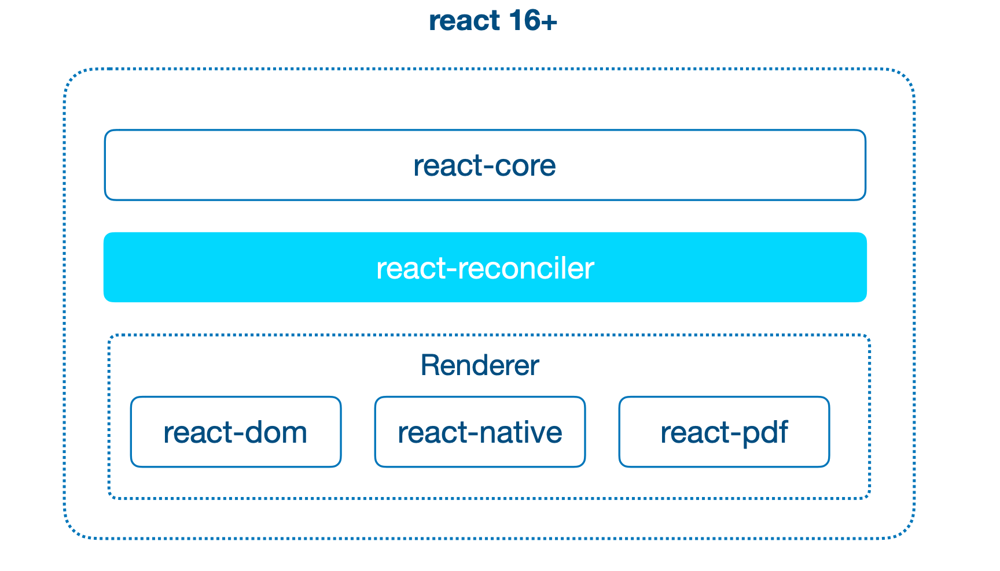
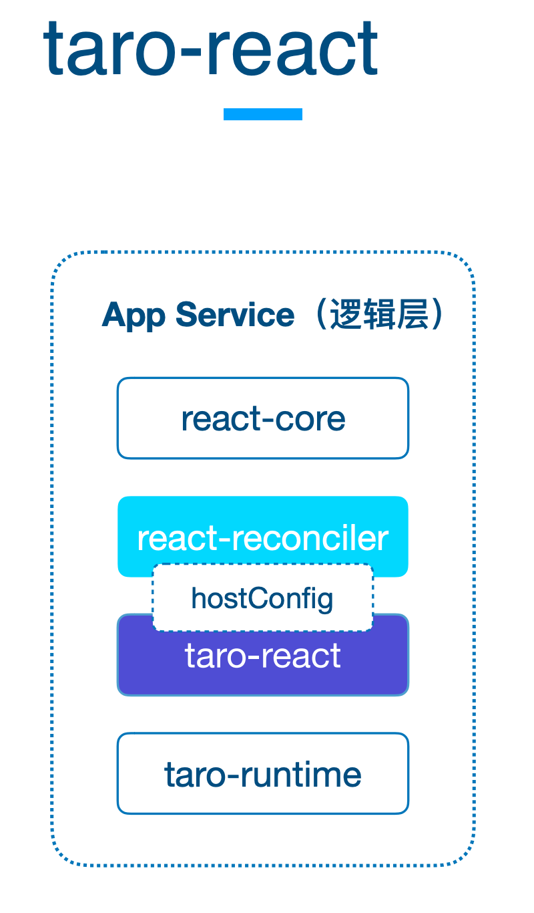
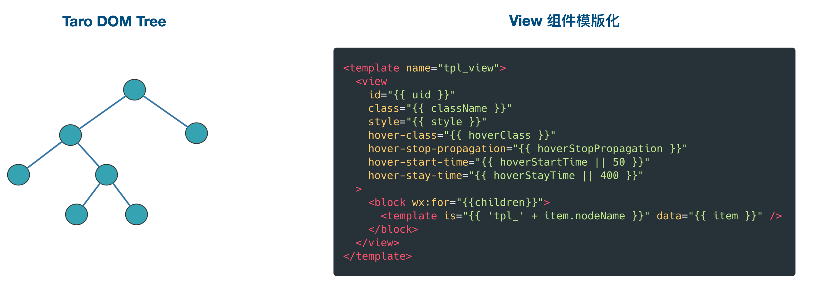
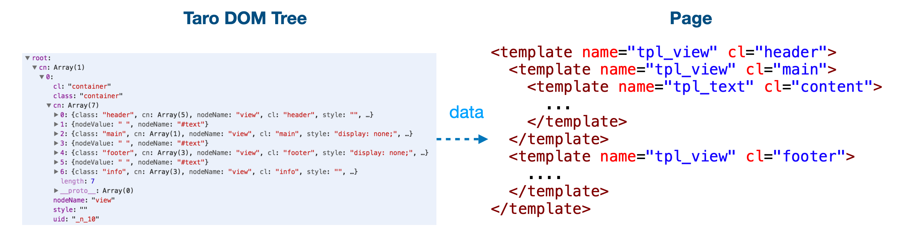
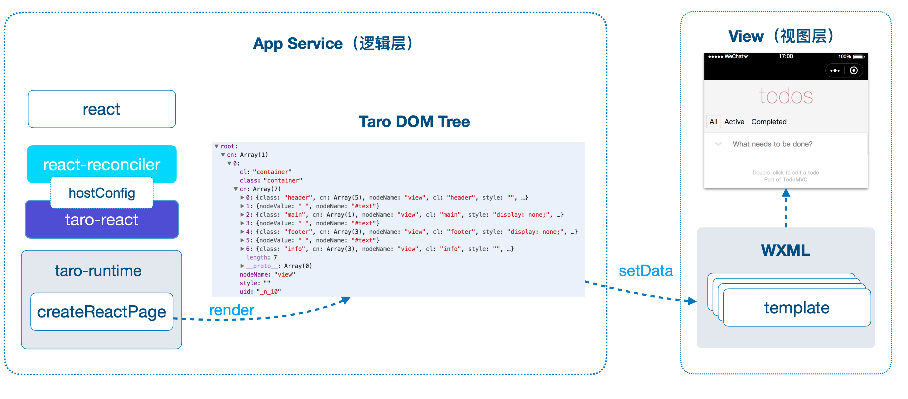
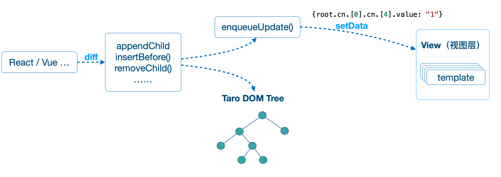
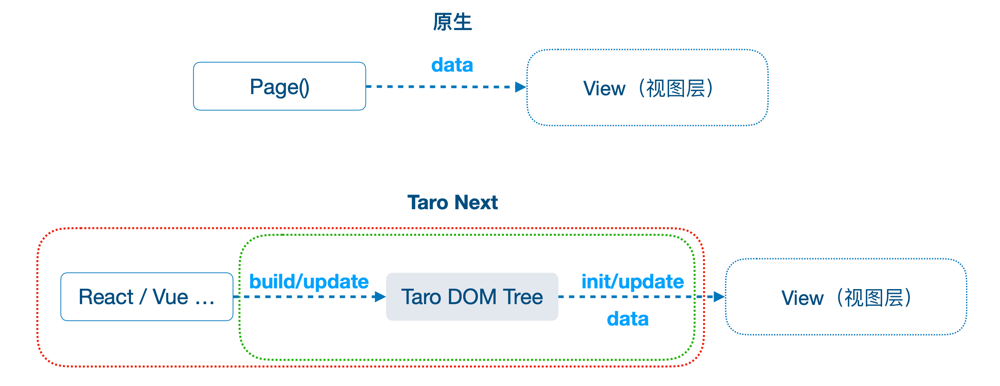

## Taro 1和2

架构主要分为：编译时 和 运行时。
- 其中编译时主要是将 Taro 代码通过 Babel 转换成 小程序的代码，如：JS、WXML、WXSS、JSON。
- 运行时主要是进行一些：生命周期、事件、data 等部分的处理和对接。
特点是：
- 重编译时，轻运行时：这从两边代码行数的对比就可见一斑。采用 穷举 的方式对 JSX 可能的写法进行了一一适配
- 编译后代码与 React 无关：Taro 只是在开发时遵循了 React 的语法。在代码编译之后实际运行时，和 React 并没有关系
- 直接使用 Babel 进行编译：这也导致当前 Taro 在工程化和插件方面的羸弱

## Taro3 开放式跨端跨框架解决方案

由「多端统一开发解决方案」变成了「开放式跨端跨框架解决方案」

- 无 DSL 限制：无论是你们团队是 React 还是 Vue 技术栈，都能够使用 Taro 开发
- 模版动态构建：和之前模版通过编译生成的不同，Taro Next 的模版是固定的，然后基于组件的 template，动态 “递归” 渲染整棵 Taro DOM 树。
- 新特性无缝支持：由于 Taro Next 本质上是将 React/Vue 运行在小程序上，因此，各种新特性也就无缝支持了。
- Taro 3 的 H5 端相较于之前版本的 Taro 是一次彻底的重写：基础组件现在全部使用 Web Components 构建，路由系统也完全与前端框架解耦，因此在 H5 端 Taro 也实现了跨框架。

## Taro3 DOM设计

浏览器的角度来思考前端的本质：无论开发这是用的是什么框架，React 也好，Vue 也罢，最终代码经过运行之后都是调用了浏览器的那几个 BOM/DOM 的 API ，如：createElement、appendChild、removeChild 等。

Taro3 使用 taro-runtime 实现了 一套 高效、精简版的 DOM/BOM API，通过 Webpack 的 ProvidePlugin 往全局注入自定义实现的window和document，在小程序中模拟实现现了 一套 高效、精简版的 DOM/BOM API，React和Vue这种Web框架也就直接能在小程序中跑了。


- React react-core：包含所有全局 React API，如createElement、Component
- React Reconciler：它是核心 diff 算法，管理声明式 UI 背后的命令式更新。Reconciler 找出应用程序 UI 在不同状态之间的变化并在幕后应用这些变化。
- React Renderer：渲染器实现了一些 react-reconciler 所需要的函数。react-reconciler 将根据需要调用这些函数，以对最终目标进行更新。如果使用 DOM API 来实现这些函数，则目标是 Web 应用。如果你使用 iOS UI Kit API 来实现这些函数，则目标是 iOS。如果使用 Android UI API 来实现这些函数，则目标是 Android。

通过 react-reconciler，仅需要提供一个 host config 对象，就能编写一个自定义渲染器。
```js
const Reconciler = require('react-reconciler');
const HostConfig = {
  // 你在这里需要实现一些方法。
  // 以下有更多信息和示例。
};

const MyRenderer = Reconciler(HostConfig);

const RendererPublicAPI = {
  render(element, container, callback) {
    // 调用 MyRenderer.updateContainer() 来调度根节点的改变。
    // 参考 ReactDOM 或 React Native。
  }
};
```
自定义渲染器host config 对象描述如何在目标环境（例如 DOM、canvas、控制台或任何你的渲染目标）中处理特定的操作。它看起来是这样的：
```js
const HostConfig = {
  createInstance(type, props) {
    // 例如，DOM 渲染器返回一个 DOM 节点
  },
  // ...
  appendChild(parent, child) {
    // 例如，DOM 渲染器将调用  .appendChild() 方法
  },
  // ...
};
```

**taro-react** 包来定制HostConfig，用来连接 react-reconciler 和 **taro-runtime** 的 BOM/DOM AP；

实现 render 函数（类似于 ReactDOM.render）方法，可以看成是创建 Taro DOM Tree 的容器，Taro DOM Tree是一个嵌套的对象描述了最终的页面结构



## Taro3 的渲染设计

因为⼩程序并没有提供动态创建节点的能⼒，需要考虑如何使⽤相对静态的 wxml 来渲染相对动态的 Taro DOM 树。Taro使⽤了模板拼接的⽅式，根据运⾏时提供的 DOM 树数据结构，各 templates 递归地 相互引⽤，最终可以渲染出对应的动态 DOM 树。

将小程序的所有组件挨个进行模版化处理，从而得到小程序组件对应的模版。如下图就是小程序的 view 组件模版经过模版化处理后的样子。⾸先需要在 template ⾥⾯写⼀个 view，把它所有的属性全部列出来（把所有的属性都列出来是因为⼩程序⾥⾯不能去动态地添加属性）。




接下来是遍历渲染所有⼦节点，基于组件的 template，动态 “递归” 渲染整棵树。

具体流程为先去遍历 Taro DOM Tree 根节点的子元素，再根据每个子元素的类型选择对应的模板来渲染子元素，然后在每个模板中我们又会去遍历当前元素的子元素，以此把整个节点树递归遍历出来。



我们可以查看打包出来的文件index.ttml
```js
<import src="../../base.ttml"/>
<template is="taro_tmpl" data="{{root:root}}" />
```
下面是base.ttml
```js

<template name="taro_tmpl">
  <block tt:for="{{root.cn}}" tt:key="sid">
    <template is="tmpl_0_container" data="{{i:item}}" />
  </block>
</template>

<template name="tmpl_0_catch-view">
  <view hover-class="{{i.hoverClass===undefined?'none':i.hoverClass}}" hover-stop-propagation="{{i.hoverStopPropagation===undefined?false:i.hoverStopPropagation}}" hover-start-time="{{i.hoverStartTime===undefined?50:i.hoverStartTime}}" hover-stay-time="{{i.hoverStayTime===undefined?400:i.hoverStayTime}}" bindtouchstart="eh" bindtouchend="eh" bindtouchcancel="eh" bindlongpress="eh" animation="{{i.animation}}" bindanimationstart="eh" bindanimationiteration="eh" bindanimationend="eh" bindtransitionend="eh" style="{{i.st}}" class="{{i.cl}}" bindtap="eh" catchtouchmove="eh"  id="{{i.uid||i.sid}}" data-sid="{{i.sid}}">
    <block tt:for="{{i.cn}}" tt:key="sid">
      <template is="tmpl_0_container" data="{{i:item}}" />
    </block>
  </view>
</template>

<template name="tmpl_0_static-view">
  <view hover-class="{{i.hoverClass===undefined?'none':i.hoverClass}}" hover-stop-propagation="{{i.hoverStopPropagation===undefined?false:i.hoverStopPropagation}}" hover-start-time="{{i.hoverStartTime===undefined?50:i.hoverStartTime}}" hover-stay-time="{{i.hoverStayTime===undefined?400:i.hoverStayTime}}" animation="{{i.animation}}" style="{{i.st}}" class="{{i.cl}}"  id="{{i.uid||i.sid}}" data-sid="{{i.sid}}">
    <block tt:for="{{i.cn}}" tt:key="sid">
      <template is="tmpl_0_container" data="{{i:item}}" />
    </block>
  </view>
</template>

<template name="tmpl_0_pure-view">
  <view style="{{i.st}}" class="{{i.cl}}"  id="{{i.uid||i.sid}}" data-sid="{{i.sid}}">
    <block tt:for="{{i.cn}}" tt:key="sid">
      <template is="tmpl_0_container" data="{{i:item}}" />
    </block>
  </view>
</template>

<template name="tmpl_0_view">
  <view hover-class="{{i.hoverClass===undefined?'none':i.hoverClass}}" hover-stop-propagation="{{i.hoverStopPropagation===undefined?false:i.hoverStopPropagation}}" hover-start-time="{{i.hoverStartTime===undefined?50:i.hoverStartTime}}" hover-stay-time="{{i.hoverStayTime===undefined?400:i.hoverStayTime}}" bindtouchstart="eh" bindtouchmove="eh" bindtouchend="eh" bindtouchcancel="eh" bindlongpress="eh" animation="{{i.animation}}" bindanimationstart="eh" bindanimationiteration="eh" bindanimationend="eh" bindtransitionend="eh" style="{{i.st}}" class="{{i.cl}}" bindtap="eh"  id="{{i.uid||i.sid}}" data-sid="{{i.sid}}">
    <block tt:for="{{i.cn}}" tt:key="sid">
      <template is="tmpl_0_container" data="{{i:item}}" />
    </block>
  </view>
</template>

<template name="tmpl_0_icon">
  <icon type="{{i.type}}" size="{{i.size===undefined?24:i.size}}" color="{{i.color}}" style="{{i.st}}" class="{{i.cl}}" bindtap="eh"  id="{{i.uid||i.sid}}" data-sid="{{i.sid}}"></icon>
</template>

<template name="tmpl_0_static-text">
  <text selectable="{{i.selectable===undefined?false:i.selectable}}" space="{{i.space}}" decode="{{i.decode===undefined?false:i.decode}}" style="{{i.st}}" class="{{i.cl}}"  id="{{i.uid||i.sid}}" data-sid="{{i.sid}}">
    <block tt:for="{{i.cn}}" tt:key="sid">
      <template is="tmpl_0_container" data="{{i:item}}" />
    </block>
  </text>
</template>

<template name="tmpl_0_text">
  <text selectable="{{i.selectable===undefined?false:i.selectable}}" space="{{i.space}}" decode="{{i.decode===undefined?false:i.decode}}" style="{{i.st}}" class="{{i.cl}}" bindtap="eh"  id="{{i.uid||i.sid}}" data-sid="{{i.sid}}">
    <block tt:for="{{i.cn}}" tt:key="sid">
      <template is="tmpl_0_container" data="{{i:item}}" />
    </block>
  </text>
</template>

<template name="tmpl_0_input">
  <template is="{{i.focus ? 'tmpl_0_input_focus' : 'tmpl_0_input_blur'}}" data="{{i:i}}" />
</template>

<template name="tmpl_0_input_focus">
  <input value="{{i.value}}" type="{{i.type===undefined?'':i.type}}" password="{{i.password===undefined?false:i.password}}" placeholder="{{i.placeholder}}" placeholder-style="{{i.placeholderStyle}}" placeholder-class="{{i.placeholderClass===undefined?'input-placeholder':i.placeholderClass}}" disabled="{{i.disabled}}" maxlength="{{i.maxlength===undefined?140:i.maxlength}}" cursor-spacing="{{i.cursorSpacing===undefined?0:i.cursorSpacing}}" focus="{{i.focus===undefined?false:i.focus}}" confirm-type="{{i.confirmType===undefined?'done':i.confirmType}}" confirm-hold="{{i.confirmHold===undefined?false:i.confirmHold}}" cursor="{{i.cursor===undefined?i.value.length:i.cursor}}" selection-start="{{i.selectionStart===undefined?-1:i.selectionStart}}" selection-end="{{i.selectionEnd===undefined?-1:i.selectionEnd}}" bindinput="eh" bindfocus="eh" bindblur="eh" bindconfirm="eh" name="{{i.name}}" style="{{i.st}}" class="{{i.cl}}" bindtap="eh"  id="{{i.uid||i.sid}}" data-sid="{{i.sid}}"></input>
</template>

<template name="tmpl_0_input_blur">
  <input value="{{i.value}}" type="{{i.type===undefined?'':i.type}}" password="{{i.password===undefined?false:i.password}}" placeholder="{{i.placeholder}}" placeholder-style="{{i.placeholderStyle}}" placeholder-class="{{i.placeholderClass===undefined?'input-placeholder':i.placeholderClass}}" disabled="{{i.disabled}}" maxlength="{{i.maxlength===undefined?140:i.maxlength}}" cursor-spacing="{{i.cursorSpacing===undefined?0:i.cursorSpacing}}" confirm-type="{{i.confirmType===undefined?'done':i.confirmType}}" confirm-hold="{{i.confirmHold===undefined?false:i.confirmHold}}" cursor="{{i.cursor===undefined?i.value.length:i.cursor}}" selection-start="{{i.selectionStart===undefined?-1:i.selectionStart}}" selection-end="{{i.selectionEnd===undefined?-1:i.selectionEnd}}" bindinput="eh" bindfocus="eh" bindblur="eh" bindconfirm="eh" name="{{i.name}}" style="{{i.st}}" class="{{i.cl}}" bindtap="eh"  id="{{i.uid||i.sid}}" data-sid="{{i.sid}}"></input>
</template>

<template name="tmpl_0_scroll-view">
  <scroll-view scroll-x="{{i.scrollX===undefined?false:i.scrollX}}" scroll-y="{{i.scrollY===undefined?false:i.scrollY}}" upper-threshold="{{i.upperThreshold===undefined?50:i.upperThreshold}}" lower-threshold="{{i.lowerThreshold===undefined?50:i.lowerThreshold}}" scroll-top="{{i.scrollTop}}" scroll-left="{{i.scrollLeft}}" scroll-into-view="{{i.scrollIntoView}}" scroll-with-animation="{{i.scrollWithAnimation===undefined?false:i.scrollWithAnimation}}" enable-back-to-top="{{i.enableBackToTop===undefined?false:i.enableBackToTop}}" bindscrolltoupper="eh" bindscrolltolower="eh" bindscroll="eh" bindtouchstart="eh" bindtouchmove="eh" bindtouchend="eh" bindtouchcancel="eh" bindlongpress="eh" animation="{{i.animation}}" bindanimationstart="eh" bindanimationiteration="eh" bindanimationend="eh" bindtransitionend="eh" style="{{i.st}}" class="{{i.cl}}" bindtap="eh"  id="{{i.uid||i.sid}}" data-sid="{{i.sid}}">
    <block tt:for="{{i.cn}}" tt:key="sid">
      <template is="tmpl_0_container" data="{{i:item}}" />
    </block>
  </scroll-view>
</template>

<template name="tmpl_0_static-image">
  <image src="{{i.src}}" mode="{{i.mode===undefined?'scaleToFill':i.mode}}" lazy-load="{{i.lazyLoad===undefined?false:i.lazyLoad}}" style="{{i.st}}" class="{{i.cl}}"  id="{{i.uid||i.sid}}" data-sid="{{i.sid}}">
    <block tt:for="{{i.cn}}" tt:key="sid">
      <template is="tmpl_0_container" data="{{i:item}}" />
    </block>
  </image>
</template>

<template name="tmpl_0_image">
  <image src="{{i.src}}" mode="{{i.mode===undefined?'scaleToFill':i.mode}}" lazy-load="{{i.lazyLoad===undefined?false:i.lazyLoad}}" binderror="eh" bindload="eh" bindtouchstart="eh" bindtouchmove="eh" bindtouchend="eh" bindtouchcancel="eh" bindlongpress="eh" style="{{i.st}}" class="{{i.cl}}" bindtap="eh"  id="{{i.uid||i.sid}}" data-sid="{{i.sid}}">
    <block tt:for="{{i.cn}}" tt:key="sid">
      <template is="tmpl_0_container" data="{{i:item}}" />
    </block>
  </image>
</template>

<template name="tmpl_0_#text">
  <block>{{i.v}}</block>
</template>

<template name="tmpl_0_container">
  <template is="{{'tmpl_0_' + i.nn}}" data="{{i:i}}" />
</template>

```



## Taro3 的更新

无论是 React 还是 Vue ，最终都会调用 Taro DOM 方法，如：appendChild、insertChild 等。
这些方法在修改 Taro DOM Tree 的同时，还会调用 enqueueUpdate 方法，这个方法能获取到每一个 DOM 方法最终修改的节点路径和值，如：{root.cn.[0].cn.[4].value: "1"}，并通过 setData 方法更新到视图层。

{root.cn.[0].cn.[4].value: "1"}并不是传统小程序逻辑层的data里的数据，而是经过React、Vue等上层框架通过Vdom diff 后产出的patch补丁，描述UI的变化的，这里通过小程序的setData来更新到小程序View线程视图




这里更新的粒度是 DOM 级别，只有最终发生改变的 DOM 才会被更新过去，相对于之前 data 级别的更新会更加精准，性能更好


## 性能问题

同等条件下，编译时做的工作越多，也就意味着运行时做的工作越少，性能会更好。Taro Next 的新架构变成 近乎全运行 之后，花了很多精力在性能优化上面。

再这之前。可以先看一下 Taro Next 的流程和原生小程序的流程对比。



相比原生小程序，Taro Next 多了红色部分的带来的性能隐患，
- 引入React/Vue 带来的 包的 Size 增加
- 运行时的损耗
- Taro DOM Tree 的构建和更新
- DOM data 初始化和更新。

而我们真正能做的，只有绿色部分，也就是：
- Taro DOM Tree 的构建和更新
- DOM data 初始化和更新。

Taro Next 的更新是 DOM 级别的，比 Data 级别的更新更加高效，因为 Data 粒度更新实际上是有冗余的，并不是所有的 Data 的改变最后都会引起 DOM 的更新。
其次，Taro 在更新的时候将 Taro DOM Tree 的 path 进行压缩，这点也极大的提升了性能。

目前仍然存在两个弊端：
- 1. 初始渲染时需要使用setData传递全量的模板渲染描述数据，初始渲染性能堪忧；
- 2. 视图更新时的性能完全取决于更新幅度，如果视图只是进行非常局部的更新那性能确实不会差，一旦出现大面积的视图更新，那setData的数据量也一定远高于静态模板的方式，这一点和初始渲染类似。文中提到这种动态构建视图的机制下wxml会变少，但其实这些变少的量也都是从原本的视图层迁移到了逻辑层，但视图描述的信息量大家都是一样的，不可能会减少，还增加了通过setData发送到视图层的额外开销，在我看来这个设计甚至是违背小程序本身设计初衷的。
- 3. 与 remax 一样，增加了镜像树，如果去掉镜像树可能需要自己维护 react-reconciler 这个包，也就是在 commitRoot 的中处理 effect 的时候就记录下路径和数据，而不需要去构建镜像树了，也就是需要重写这个 commitRoot。但是这又直接导致了后期需要根据react的更新而不断迭代，是否可以无侵入做到这一步？


## Taro的跨平台组件设计

只用一份代码构建的组件库能兼容所有的 web 开发框架：Web Components
使用原生语法去编写 Web Components 相当繁琐，因此我们需要一个框架帮助我们提高开发效率和开发体验：Stencil

Stencil 是一个可以生成 Web Components 的编译器。它糅合了业界前端框架的一些优秀概念，如支持 Typescript、JSX、虚拟 DOM 等。

```tsx
import { Component, Prop, State, h } from '@stencil/core'

@Component({
  tag: 'my-component'
})
export class MyComponent {
  @Prop() first = ''
  @State() last = 'JS'

  componentDidLoad () {
    console.log('load')
  }

  render () {
    return (
      <div>
        Hello, my name is {this.first} {this.last}
      </div>
    )
  }
}

<my-component first='Taro' />

```

除此之外还需要处理 React 与Web Component的一些兼容性问题
- React 使用 setAttribute 的形式给 Web Components 传递参数。当参数为原始类型时是可以运行的，但是如果参数为对象或数组时，由于 HTML 元素的 attribute 值只能为字符串或 null，最终给 WebComponents 设置的 attribute 会是 attr="[object Object]"。
- 因为 React 有一套合成事件系统，所以它不能监听到 Web Components 发出的自定义事件

解决方案参考https://docs.taro.zone/blog/2020-4-13-taro-components#%E5%9C%A8-react-%E4%B8%8E-vue-%E4%B8%AD%E4%BD%BF%E7%94%A8-stencil

## 参考

- https://docs.taro.zone/blog/2020-01-02-gmtc