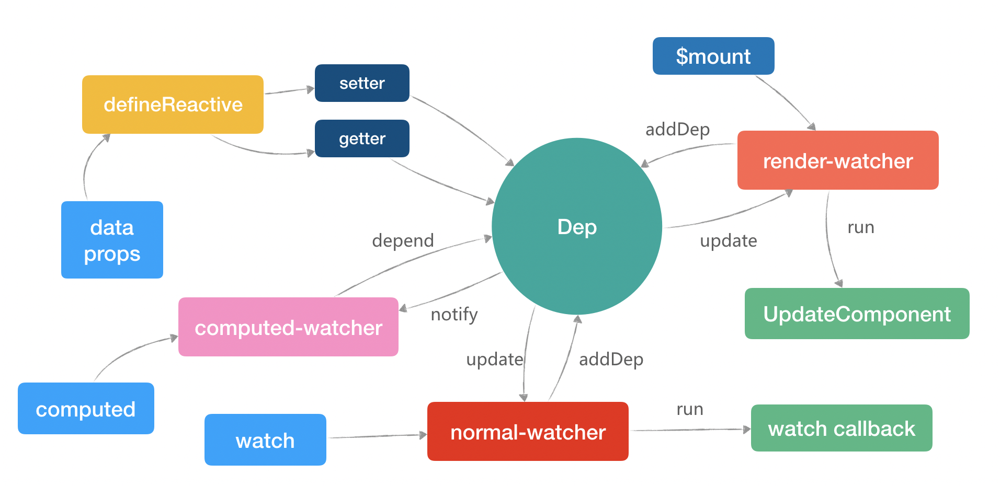

## 三种Watcher与Dep



## 初始化 computed

Vue 会对 options 中的每个 computed 属性也用 watcher 去包装起来，它的 get 函数显然就是要执行用户定义的求值函数，而 update 则是一个比较复杂的流程

首先在组件初始化的时候，会进入到初始化 computed 的函数
源码目录/src/core/instance/state.js
```tsx
// initState会在new Vue()时执行
export function initState (vm: Component) {
  /*
  	other
  */
  // 如果我们定义了comouted属性则执行initComputed
  if (opts.computed) initComputed(vm, opts.computed)
  /*
  	other
  */
}
```
定义了一个空的对象，用来存放所有计算属性相关的 watcher，后文我们会把它叫做 计算watcher。然后循环为每个 computed 属性生成了一个 计算watcher。

可以看到Watcher的getter就是我们computed上的方法

```tsx
function initComputed (vm, computed) {
  // 往组件实例上添加一个_computedWatchers属性，保存所有的computed watcher
  const watchers = vm._computedWatchers = Object.create(null)
  // 对所有的computed属性遍历处理
  for (const key in computed) {
    // 将我们定义的computed属性值用userDef保存
    const userDef = computed[key]
    // 我们在定义computed时可以是一个函数，也可以是一个对象{get:function(){}, set:function(){}}
    const getter = typeof userDef === 'function' ? userDef : userDef.get
    // 数据响应过程中的watcher（注意第二个参数是我们刚才拿到的getter,记住了）
    watchers[key] = new Watcher(
      vm,
      getter || noop, // 注意这里，注意这里，注意这里，（****知识点getter）
      noop,
      computedWatcherOptions // lazy
    )
    if (!(key in vm)) {
      defineComputed(vm, key, userDef)
    } 
  }
}
```
补充一波Watcher构造函数的源码，之前看响应式还觉得里面好多变量都不知道在干嘛，现在知道了
- watcher.dirty = true
- watcher.evaluate()会将this.dirty = false
- 接着会执行Watcher的this.get()
- 最终其实就是执行知识点getter：this.getter() 也就是expOrFn 这个就是computed上的方法
```tsx
constructor (vm, expOrFn, cb, options, isRenderWatcher) {
    this.vm = vm
    if (isRenderWatcher) {
      vm._watcher = this
    }
    vm._watchers.push(this)
    /* ... */
    if (options) {
      this.lazy = !!options.lazy // this.lazy = true
    }
    this.getter = expOrFn
    this.dirty = this.lazy // 初始化this.dirty = true
    /* ... */
    // 注意了，注意了，注意了
    // new时this.lazy为true所以this.value = 'undefined'
    this.value = this.lazy ? undefined : this.get()
  }
```

接下来我们还是在这个文件中找到defineComputed的实现

```tsx
export function defineComputed (target, key, userDef) {
  /* other */

  // 这里我对源码进行了简化
  // sharedPropertyDefinition是一个全局对象
  // 拿到一个get函数
  sharedPropertyDefinition.get = createComputedGetter(key)

  /* other */

  // 这个函数的主要功能是computed属性的get进行了重写
  Object.defineProperty(target, key, sharedPropertyDefinition)
}
```
createComputedGetter在defineProperty的sharedPropertyDefinition里的get属性上。 也就是说t劫持了target（VM）的key （sum）属性的，取sum的时候返回的是computed里sum函数返回的结果
```tsx
function createComputedGetter (key) {

  // 返回一个函数，也就是我们在上一个函数中那个get函数
  return function computedGetter () {

    // 拿到我们在initComputed函数中添加到vm上面的_computedWatchers
    const watcher = this._computedWatchers && this._computedWatchers[key]

    // 如果我们有定义computed属性，watcher必定存在
    if (watcher) {
      // 注意，注意，注意，只要在模板中使用了这个computed属性，之后每次页面更新就是循环知识点1到知识点5这个过程
      // 第二节主要就是在讲这一块，在理解下面的步骤时可以对照的看一下
      if (watcher.dirty) { // ****标记：知识点1
      //dirty设置为false 接着会执行Watcher的this.get()最终其实就是执行知识点getter：this.getter()
      // 计算属性的同时收集依赖，这里内部很巧妙，用来栈的结构来保存两个watcher（计算和渲染），并且计算属性内部如果用来响应式数据就会触发响应式get，触发收集全局的Dep.target,但是再执行计算属性方法前，Vue先把此时的Dep.target指向了这个计算属性key对应的watcher
        watcher.evaluate() 
      }
      if (Dep.target) { // Dep.target不可能为假 除非代码出错
        watcher.depend() // 收集依赖，这里收集的是render-watcher
      }
      return watcher.value // ****标记：知识点5
    }
  }
}
```

## 现在开始调用

第一次页面渲染时模板中的{{computedA}}通过上面的调用栈分析
```tsx
  // 拿到一个get函数
  sharedPropertyDefinition.get = createComputedGetter(key)
  // 这个函数的主要功能是computed属性的get进行了重写
  Object.defineProperty(target, key, sharedPropertyDefinition)
```
computed的get劫持被触发，执行computedA.get() 转到函数createComputedGetter中。然后首次的话会执行evaluate
这个函数其实很清晰，它先求值，然后把 dirty 置为 false。
```tsx
evaluate () {
  // 调用 get 函数求值
  this.value = this.get()
  // 把 dirty 标记为 false
  this.dirty = false
}
```


进入 this.get()，首先要明确一点，在模板中读取 {{ sum }} 变量的时候，全局的 Dep.target 应该是 渲染watcher.

全局的 Dep.target 状态是用一个栈 targetStack 来保存，便于前进和回退 Dep.target，至于什么时候会回退，接下来的get函数里就可以看到。

## computed 内函数调用时机巧妙

this.getter.call(vm, vm)就是computed的某个计算方法。

```tsx
get () {
  pushTarget(this)
  let value
  const vm = this.vm
  try {
    value = this.getter.call(vm, vm)
  } finally {
    popTarget()
  }
  return value
}
```
执行完 pushTarget(this) 后，Dep.target 变更为 计算watcher，targetStack 是 [ 渲染watcher，计算watcher ] 。

然后执行getter方法(computed)，computed的某个计算属性方法被执行，内部如果访问响应式数据，又会触发响应式数据的get，**响应式的get回调函数里会Dep.denpend收集依赖，现在就出现交叉了，收集的是计算watcher**


执行完这个函数后又会把执行到了 popTarget，计算watcher 出栈。Dep.target 变更为 渲染watcher。


把 subs 里保存的 watcher 依次去调用它们的 update 方法，也就是

调用 计算watcher 的 update
调用 渲染watcher 的 update

计算watcher 的 update
```tsx
update () {
  if (this.lazy) {
    this.dirty = true
  }
}

```

计算watcher 的 dirty 属性置为 true，所以又会重新调用用户传入的 sum 函数计算出最新的值，页面上自然也就显示出了最新的值。

## 为什么在computed里可以收集到内部访问响应式数据的依赖

name 变了会什么会触发sum自动执行
```tsx
computed:{
    sum(){
        return this.name
    }
}

```
因为执行evaluate方法，然后最终调用到sum进行求值的过程中又会触发name这个响应式数据的get，它们会将当前的computed-watcher作为依赖收集到自己的dep里，计算完毕之后将dirty置为false，表示已经计算过了。

然后执行depend让计算属性内的响应式数据订阅当前的render-watcher，所以computed内的响应式数据会收集computed-watcher和render-watcher两个watcher，当computed内的状态发生变更触发set后，首先通知computed需要进行重新计算，然后通知到视图执行渲染，再渲染中会访问到computed计算后的值，最后渲染到页面。


## 总结

- 计算属性初始化里会把每个属性新建一个watcher来观察。
- this上代理computed，并重写get，模板内访问计算属性触发get
- computed的get里调用了对应key的watcher的求值方法（这个计算属性方法被挂载到了watcher属性上
- 计算方法执行前，先将Dep.target指向了computed-Watcher（内部设置重新计算不用缓存值dirty 置true
- 计算方法执行时内部如果用到了响应式数据，则再次触发响应式的get
- 响应式get会调用Dep.denpend收集依赖，而此时收集的正是computed-Watcher
- 计算方法执行完又把Dep.target指向render-Watcher，那这个watcher又是在哪里被收集的呢？好问题我想了一个晚上都没弄亲，直到回过头去看createComputedGetter返回的computedGetter回调，里面在执行完evaluate后执行强行执行了一个这个 懂了吧
```tsx
      if (Dep.target) { // Dep.target不可能为假 除非代码出错
        watcher.depend() // 收集依赖，这里收集的是render-watcher
      }
```

月老牵线

月老牵线的意思，在白话版中也说清楚了，这里简单说一下

现有 页面-P，computed- C，data- D

1、P 引用了 C，C 引用了 D

2、理论上 D 改变时， C 就会改变，C 则通知 P 更新。

3、实际上 C 让 D 和 P 建立联系，让 D 改变时直接通知 P

这段的作用就是！（依然使用上面的例子 PCD 代号来说明）

让 D 的依赖收集器收集到 Dep.target，而 Dep.target 当前是什么？

没错，就是 页面 的 watcher！

所以这里，D 就会收集到 页面的 watcher 了，所以就会直接通知 页面 watcher

##2.6 版本计算属性更新的路径是这样的：

**响应式的值 count 更新**
同时通知 computed watcher 和 渲染 watcher 更新
computed watcher 把 dirty 设置为 true
视图渲染读取到 computed 的值，由于 dirty 所以 computed watcher 重新求值。


## 对于缓存和不缓存的情况，分别是这样的流程：

### 不缓存：

count 改变，先通知到 计算watcher 更新，设置 dirty = true（只有在计算watcher触发视图更新的时候，才会把这个dirty设置为true？）
再通知到 渲染watcher 更新，视图重新渲染的时候去 计算watcher 中读取值，发现 dirty 是 true，重新执行用户传入的函数求值。

### 缓存：

other 改变，直接通知 渲染watcher 更新。
视图重新渲染的时候去 计算watcher 中读取值，发现 dirty 为 false，直接用缓存值 watcher.value，不执行用户传入的函数求值。


## 整体流程分析

```tsx
new Vue({
  template: '<div>wellcome {{fullName}}</div>',
  el: '#app',
  data() {
    return {
      firstName: 'fly',
      lastName: 'yang',
    };
  },
  computed: {
    fullName() {
      return this.firstName + this.lastName;
    },
  },
});
```

## 

```tsx
new Vue({
  data(){
    return {
      dataA: 'a',
      dataB: 'b'
    }
  },
  template: '<div>{{computedA}}-{{dataB}}</div>',
  computed: {
    computedA() {
      return 'computed ' + this.dataA
    }
  },
  method: {
      changeA(){
          this.dataA = 'change dataA'
      },
      changeB(){
          this.dataA = 'change dataB'
      }
  }
})
```

- 第一次页面渲染时模板中的{{computedA}}执行computedA.get() 转到函数createComputedGetter中


## Watcher


这里说明了为什么watch和this.$watch的实现是一致的，以及简单解释它的原理就是为需要观察的数据创建并收集user-watcher，当数据改变时通知到user-watcher将新值和旧值传递给用户自己定义的回调函数。最后分析了定义watch时会被使用到的三个参数：sync、immediate、deep它们的实现原理。简单说明它们的实现原理就是：sync是不将watcher加入到nextTick队列而同步的更新、immediate是立即以得到的值执行一次回调函数、deep是递归的对它的子值进行依赖收集。


- https://zhuanlan.zhihu.com/p/62732142
- https://juejin.im/post/5afbfce56fb9a07ac0226f21#heading-6
- https://juejin.im/post/5a759ddbf265da4e9267fee0#heading-0
- https://juejin.im/post/5e8fd7a3f265da47c35d7d29#heading-6
