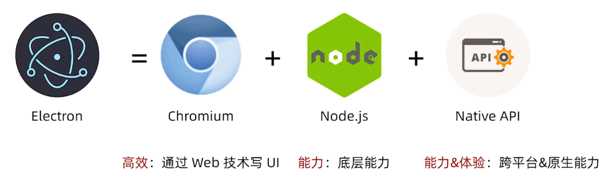
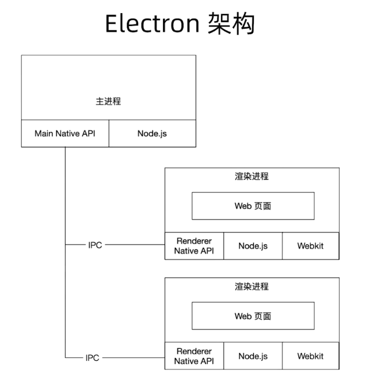
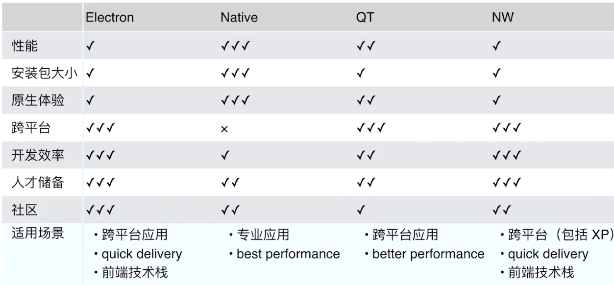

## 什么是Electron

## Electron架构

## 如何Node.js 和 Chromiums 整合

难点：Node.js 事件循环基于 libuv，但 Chromium 基于 message bump 
- Chromium 集成到 Node.js: 用 libuv 实现 messagebump  (nw) 

这种主进程时不太好处理，因为每个系统的GUI实现不太一样，而且很多边界条件处理不好，如果用定时器轮询GUI的事件会发现响应慢且耗费CPU资源。

后来libuv引入backend_fd(轮询事件的描述符)，所以我们可以通过轮询backend_fd就知道libuv是否有了一个新的事件，这样诞生了下面的方法。

- Node.js 集成到 Chromium （electron）：Electron起一个新的安全线程去轮询backed_fd,通过PostTask转发到Chromium的事件循环中。

## 在渲染层使用Node模块的导入方式

- window.require()
- 更改Webpack的target配置改为"electron-render" 就可以使用ESmoudle直接导入了

## 对比其它框架

##  NW.js 和 Electron

- NW.js 和 Electron 都可以用前端的知识来开发桌面应用。NW.js 和 Electron起初是同一 个作者开发。后来种种原因分为两个产品。一个命名为 NW.js(英特尔公司提供技术支持)、 另一命名为 - Electron(Github 公司提供技术支持)。
- NW.js 和 Electron 可以用 Nodejs 中几乎所有的模块。NW.js 和 Electron不仅可以把 html 写的 web 页面打包成跨平台可以安装到电脑上面的软件，也可以通过 javascript 访问操作 系统原生的 UI 和 Api(控制窗口、添加菜单项目、托盘应用菜单、读写文件、访问剪贴板)。

