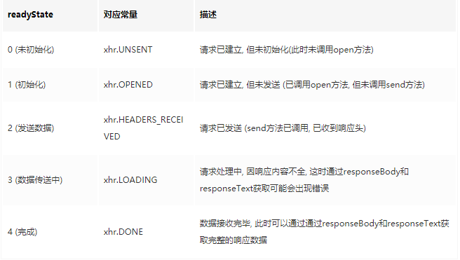

## Ajax

Ajax 全称 Asynchronous JavaScript and XML, 即异步 JS 与 XML(Extensible Markup Language 可扩展标记语言).
标准浏览器通过 XMLHttpRequest 对象实现了 ajax 的功能. 只需要通过一行语句便可创建一个用于发送 ajax 请求的对象.
Ajax 的工作原理相当于在用户和服务器之间加了一个中间层(ajax 引擎),使用户操作与服务器响应异步化。

## Ajax 常用属性

### readyState



### onreadystatechange

onreadystatechange 事件回调方法在 readyState 状态改变时触发, 在一个收到响应的 ajax 请求周期中, onreadystatechange 方法会被触发 4 次.

```tsx
xhr.onreadystatechange = function(e){
  if(xhr.readystate==4){
    var s = xhr.status;
    if((s >= 200 && s < 300) || s == 304){
      var resp = xhr.responseText;
      //TODO ...
    }
  }
}
```

### status

status 表示 http 请求的状态, 初始值为 0. 如果服务器没有显式地指定状态码, 那么 status 将被设置为默认值, 即 200.

### onload

onload 事件回调方法在 ajax 请求成功后触发, 触发时机在 readyState==4 状态之后.

### timeout

timeout 属性用于指定 ajax 的超时时长. 通过它可以灵活地控制 ajax 请求时间的上限.

### ontimeout

ontimeout 方法在 ajax 请求超时时触发, 通过它可以在 ajax 请求超时时做一些后续处理.

```tsx
xhr.ontimeout = function(e) {
  console.error("请求超时!!!")
}
```

### response responseText

均为只读属性, response 表示服务器的响应内容, 相应的, responseText 表示服务器响应内容的文本形式.

### responseType

responseType 表示响应的类型, 缺省为空字符串, 可取 "arraybuffer" , "blob" , "document" , "json" , and "text" 共五种类型.

### onerror

onerror 方法用于在 ajax 请求出错后执行. 通常只在网络出现问题时触发

## Post 请求的编码方式

由于 Post 请求 send(data),data 类型必须是一个字符串，所以我们需要设定一种编码类型，然后加到 header 里让服务器知道用哪种方法转码

### application/x-www-form-urlencoded

浏览器的原生 form 表单，如果不设置 enctype 属性，那么最终就会以 application/x-www-form-urlencoded 方式提交数据。请求类似于下面这样

```tsx
POST http://www.example.com HTTP/1.1
Content-Type: application/x-www-form-urlencoded;charset=utf-8

title=test&sub%5B%5D=1&sub%5B%5D=2&sub%5B%5D=3
```

提交的数据按照 key1=val1&key2=val2 的方式进行编码，key 和 val 都进行了 URL 转码。

### multipart/form-data

用来在 HTML 文档中上传二进制文件的。表单上传文件时，必须让 form 的 enctyped 等于这个值。

```tsx
Content-Type:multipart/form-data; boundary=----WebKitFormBoundaryrGKCBY7qhFd3TrwA

------WebKitFormBoundaryrGKCBY7qhFd3TrwA
Content-Disposition: form-data; name="text"
```

### application/json

用来告诉服务端消息主体是序列化后的 JSON 字符串。由于 JSON 规范的流行，除了低版本 IE 之外的各大浏览器都原生支持 JSON.stringify，服务端语言也都有处理 JSON 的函数，使用 JSON 不会遇上什么麻烦。

```tsx
POST http://www.example.com HTTP/1.1
Content-Type: application/json;charset=utf-8

{"title":"test","sub":[1,2,3]}
```

## 最简单的 Ajax 请求

```tsx
// 实例化
let xhr = new XMLHttpRequest()
// 初始化
xhr.open(method, url, async)
// 发送请求
xhr.send(data)
// 设置状态变化回调处理请求结果
xhr.onreadystatechange = () => {
  if (xhr.readyStatus === 4 && xhr.status === 200) {
    console.log(xhr.responseText)
  }
}
```

## 基于 Promise 封装的 ajax

注意几个问题：

- 转码问题 encodeURIComponent
- get 和 post 的 src 问题
  - get 需要判断 src 是否有“?”号，有加&，没有需要补上
  - post 无需拼接 src，但是要注意编码规范
  - post 时 xhr.send()的参数只能是编好码的字符串类型
- 请求需要带一个默认的 application/x-www-form-urlencoded;类型
- 请求头的设置需要在 xhr 被 open 后
- 注意部分参数的默认值比如默认 async = true 是异步的
- 方法转化为小写好判断
- 适配 IE 用 ActiveXObject
- 数据类型无法识别需要抛出错误，可以被 catch

```tsx
// 基于promise实现
function getCode(data) {
  let paramArr = [];
  let encodeData;
  if (data instanceof Object) {
    for (let key in data) {
      // 参数拼接需要通过 encodeURIComponent 进行编码
      paramArr.push(
        encodeURIComponent(key) + "=" + encodeURIComponent(data[key])
      );
    }
    encodeData = paramArr.join("&");
    return encodeData;
  } else if (typeof data === "string") {
    return data;
  } else {
    throw Error("发送的数据不合法");
  }
}

function ajax(options) {
  let {
    url = "",
    async = true,
    data = "",
    timeout,
    headers = {
      "Content-Type": "application/x-www-form-urlencoded;charset=UTF-8"
    }
  } = options;
  // 将方法转为小写
  const method = options.method.toLocaleLowerCase();

  let xhr;
  // 适配chrome和IE
  if (window.XMLHttpRequest) {
    xhr = new XMLHttpRequest();
  } else {
    xhr = new ActiveXObject("Microsoft.XMLHTTP");
  }

  // 请求超时
  if (timeout && timeout > 0) {
    xhr.timeout = options.timeout;
  }
  // 返回一个Promise实例
  return new Promise((resolve, reject) => {
    xhr.ontimeout = () => reject("请求超时");
    // 监听状态变化回调
    xhr.onreadystatechange = () => {
      if (xhr.readyState == 4) {
        // 200-300 之间表示请求成功，304资源未变，取缓存
        if ((xhr.status >= 200 && xhr.status < 300) || xhr.status == 304) {
          resolve(xhr.responseText);
        } else {
          reject("发现了未知错误");
        }
      }
    };
    // 错误回调
    xhr.onerror = err => reject(err);

    // 处理转码问题 提交的数据按照 key1=val1&key2=val2 的方式进行编码
    let encodeData = getCode(data);
    // 发送请求
    if (method === "get") {
      // 检测url中是否已存在 ? 及其位置
      const index = url.indexOf("?");
      if (data !== "") {
        if (index === -1) url += "?";
        else if (index !== url.length - 1) url += "&";
      }
      // 拼接url
      url += encodeData;
      xhr.open(method, url, async);
      // 设置请求头
      Object.keys(headers).forEach(key =>
        xhr.setRequestHeader(key, headers[key])
      );
      xhr.send(null);
    } else if (method === "post") {
      // 设置请求头
      xhr.open(method, url, async);
      Object.keys(headers).forEach(key =>
        xhr.setRequestHeader(key, headers[key])
      );
      xhr.send(encodeData);
    }
  });
}

```

```tsx
const res = ajax({
      method: "POST",
      // application/json
      data: JSON.stringify({
        name: "简佳成",
        age: "21"
      }),
      /*     // application/x-www-form-urlencoded;
    data:{
        name:'简佳成',
        age:'21'
    },
    // 不合法
    data:123, */
      headers: {
        "Content-Type": "application/json"
      },
      url: "http://120.79.176.26:3000/counter",
      async: true
    });
    console.log(res);
    res.then(res => console.log(res)).catch(error => console.log(error));//发现了未知错误
```
## 为什么需要encodeURIComponent转码

对于Url来说，之所 以要进行编码，是因为Url中有些字符会引起歧义。


如Url参数字符串中使用key=value键值对这样的形式来传参，键值对之间以&符号隔，如/s?q=abc&ie=utf- 8。如果你的value字符串中包含了=或者&，那么势必会造成接收Url的服务器解析错误，因此必须将引起歧义的&和=符号进行转义， 也就是对其进行编码。 如：我想把 username 整个当做参数传递给 CGI, 而不让 CGI 将username 分割掉。这话听不明白的话我换种方式来说，如果 username = 'a&foo=boo' 而不用 encodeURIComponent 的话，整个参数就成了 name=a&foo=boo, 这样 CGI 就获得两个参数 name 和 foo. 这不是我们想要的。
又如，Url的编码格式采用的是ASCII码，而不是Unicode，这也就是说你不能在Url中包含任何非ASCII字符，例如中文。否则如果客户端浏 览器和服务端浏览器支持的字符集不同的情况下，中文可能会造成问题。

url当作参数传递的时候，当参数出现空格这样的特殊字段，后台只可以读取到空格前的内容，后面内容丢失，造成数据读取失败，但是如果用encodeURIComponent()，则这些特殊字符进行转义，这样后台就可以成功读取了，所以encodeURIComponent()用于url作为参数传递的场景中使用。

- https://juejin.cn/post/6844903454599544839#heading-2
