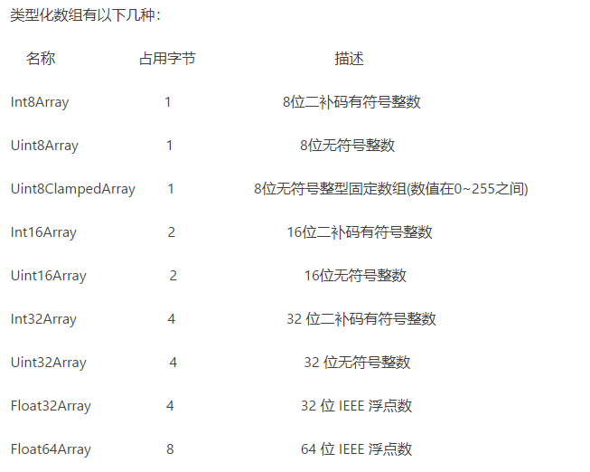

## Blob 对象

Blob 全称：Binary Large Object （二进制大型对象）。

Blob 对象表示一个不可变、原始数据的类文件对象。Blob 表示的不一定是 JavaScript 原生格式的数据。File 接口基于 Blob，继承了 blob 的功能并将其扩展使其支持用户系统上的文件。
Blob 对象表示一个二进制文件的数据内容，通常用来读写文件，比如一个图片文件的内容就可以通过 Blob 对象读写。

```tsx
const leoHtmlFragment = ['<a id="a"><b id="b">hey leo！</b></a>']; // 一个包含 DOMString 的数组
const leoBlob = new Blob(leoHtmlFragment, {type : 'text/html'});   // 得到 blob

leoBlob.size; // 38
leoBlob.type; // "text/html"

```

- array，必填，成员是字符串或二进制对象，表示新生成的 Blob 实例对象的内容；
  成员可以是一个由 ArrayBuffer , ArrayBufferView , Blob , DOMString 等对象构成的 Array ，或者其他类似对象的混合体，它将会被放进 Blob。DOMStrings 会被编码为 UTF-8。

- options，可选，是一个配置对象，这里介绍常用的属性 type，表示数据的 MIME 类型，默认空字符串；

与 ArrayBuffer 区别：
-Blob 用于操作二进制文件

- ArrayBuffer 用于操作内存

## File

File 接口基于 Blob，继承了 Blob 的功能，并且扩展支持了用户计算机上的本地文件，因此我们可以像使用 Blob 一样使用 File 对象。
总结：Blob 对象是用来接收后端接口返回的二进制文件流，File 对象是用户在一个 input 元素上选择文件返回的 FileList 对象，File 对象是特殊类型的 Blob，都可以被 FileReader、URL.createObjectURL()、createImageBitmap()、XMLHttpRequest.send()处理。

## FileReader

new FileReader()
返回一个新构造的 FileReader。

- FileReader.readAsArrayBuffer()：开始读取指定的 Blob 中的内容，一旦完成，result 属性中保存的将是被读取文件的 ArrayBuffer 数据对象。
- FileReader.readAsDataURL()：开始读取指定 Blob 中的内容。一旦完成，rusult 属性中将包含一个 data:URL 格式的字符串以表示所读文件的内容。一般用于读取本地图片实现预览功能，这样子就可以减少浏览器与服务器的交互。
- FileReader.readAsText()：开始读取指定的 Blob 中的内容。一旦完成，reuslt 属性中将包含一个字符串以表示所读取的文件内容。一般用于读取类型为 application/json 二进制数据。

```tsx
var btn = document.getElementById("btn");
btn.οnclick = function() {
  var file = flObj.files[0];
  flObj.files[0];
  var fReader = new FileReader();
  fReader.readAsDataURL(file);
  fReader.οnlοad = function(e) {
    document.getElementById("img").src = this.result;
  };
};
```

## ArrayBuffer 对象

ArrayBuffer 对象是 ES6 才纳入正式 ECMAScript 规范，是 JavaScript 操作二进制数据的一个接口。ArrayBuffer 是一个二进制数据的原始缓存区，无法直接读取或者写入（也就是说只能存放0,1并且不能直接修改和读取）,但是你可以使用特定的格式来创建typed array objects或 DataView对象以表示这种类型的buffer，然后就可以用来读或者写缓存的内容。


- 数组是放在堆中，ArrayBuffer数组则把数据放在栈中（所以取数据时后者快）
- ArrayBuffer初始化后固定大小，数组则可以自由增减。
```tsx
const buffer = new BufferAarray(12);
 // 生成一个可以12个字节的连续内存，每个字节的默认值是0

```


## TypedArray 类型化数组

TypedArray对象描述了一个类数组的底层二进制数据buffer的视图。

TypedArray 是一类构造函数的总称,用这九个构造函数生成的 typed array，和数组具有类似的行为。如都有 length 属性，都可以通过 [] 访问元素，也可以使用数组大部分的方法。



```tsx
const buffer = new ArrayBuffer(12);// 这里面全是二进制的
const x1 = new Int32Array(buffer);
x1[0] = -434393088;
[[Int32Array]]=[-434393088,0,0];
[[Int8Array]]: Int8Array(12) [0, -80, 27, -26, 0, 0, 0, 0, 0, 0, 0, 0]
[[Int16Array]]: Int16Array(6) [-20480, -6629, 0, 0, 0, 0]
[[Uint8Array]]: Uint8Array(12) [0, 176, 27, 230, 0, 0, 0, 0, 0, 0, 0, 0]

```


## node 中 buffer

* ArrayBuffer对象代表原始的二进制数据
* TypedArray视图用来读写简单类型的二进制数据（ArrayBuffer），DataView视图用来读写复杂类型的二进制数据(ArrayBuffer)。
* Node中的Buffer类是以更优化和更适合Nodejs的方式实现了Uint8Array API，意思就是Buffer类其实是TypedArray(Uint8Array)的nodejs实现。


## FormData

- 用一些键值对来模拟一系列表单控件：即把 form 中所有表单元素的 name 与 value 组装成 一个 queryString
- 异步上传二进制文件。

FormData 接口提供了一种表示表单数据的键值对的构造方式，经过它的数据可以使用 XMLHttpRequest.send() 方法送出，本接口和此方法都相当简单直接。如果送出时的编码类型被设为 "multipart/form-data"，它会使用和表单一样的格式。

FormData 对象的字段类型可以是 Blob, File, 或者 string: 如果它的字段类型不是 Blob 也不是 File，则会被转换成字符串类。

增加了 ajax 对二进制文件上传的支持,直接发就行了

```tsx
var xhr = new XMLHttpRequest();
var formData = new FormData();
var fileInput = document.getElementById("myFile");
var file = fileInput.files[0];
formdata.append('myFile', file);

xhr.open("POST", "/upload.php");

xhr.onload = function(){
    if(this.status === 200){
        //对请求成功的处理
    }
}

xhr.send(formData);
xhr = null;
```

```tsx


FormData 提供以下实例方法。

FormData.get(key) // 获取指定键名对应的键值，参数为键名。如果有多个同名的键值对，则返回第一个键值对的键值。
FormData.getAll(key) // 返回一个数组，表示指定键名对应的所有键值。如果有多个同名的键值对，数组会包含所有的键值。
FormData.set(key, value) // 设置指定键名的键值，参数为键名。如果键名不存在，会添加这个键值对，否则会更新指定键名的键值。如果第二个参数是文件，还可以使用第三个参数，表示文件名。
FormData.delete(key) // 删除一个键值对，参数为键名。
FormData.append(key, value) // 添加一个键值对。如果键名重复，则会生成两个相同键名的键值对。如果第二个参数是文件，还可以使用第三个参数，表示文件名。
FormData.has(key) // 返回一个布尔值，表示是否具有该键名的键值对。
FormData.keys() // 返回一个遍历器对象，用于for...of循环遍历所有的键名。
FormData.values() // 返回一个遍历器对象，用于for...of循环遍历所有的键值。
FormData.entries() // 返回一个遍历器对象，用于for...of循环遍历所有的键值对。如果直接用for...of循环遍历 FormData 实例，默认就会调用这个方法。

```

## Content—Type

```tsx
例如： Content-Type: text/html;charset:utf-8;

常见的媒体格式类型如下：
    text/html ： HTML格式
    text/plain ：纯文本格式
    text/xml ：  XML格式
    image/gif ：gif图片格式
    image/jpeg ：jpg图片格式
    image/png：png图片格式

以application开头的媒体格式类型：
   application/xhtml+xml：XHTML格式
   application/xml：XML数据格式
   application/atom+xml：Atom XML聚合格式
   application/json：JSON数据格式
   application/pdf：pdf格式
   application/msword：Word文档格式
   application/octet-stream：二进制流数据（如常见的文件下载）
   application/x-www-form-urlencoded： <form encType=””>中默认的encType，form表单数据被编码为key/value格式发送到服务器（表单默认的提交数据的格式）
   另外一种常见的媒体格式是上传文件之时使用的：

multipart/form-data ： 需要在表单中进行文件上传时，就需要使用该格式

```
