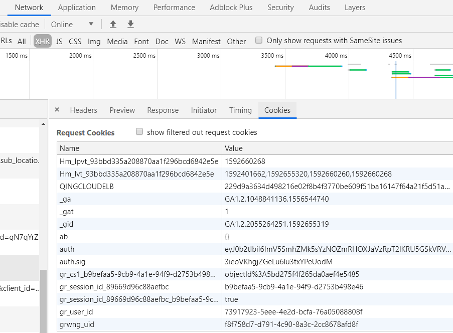

### 读取Cookie

```tsx
//  有编码的话需要使用encodeURIComponent decodeURIComponent这两个API
function getCookieValue(name) {
  const nameString = name + "="
  
  const value = document.cookie.split(";").filter(item => {
    return item.includes(nameString)
  })
  
  if (value.length) {
    return value[0].substring(nameString.length, value[0].length)
  } else {
    return ""
  }
}

```

正则方式：

```tsx
function getCookieValue(name) {
  let result = document.cookie.match("(^|[^;]+)\\s*" + name + "\\s*=\\s*([^;]+)")
  return result ? result.pop() : ""
}

```

### 修改Cookie


```tsx
document.cookie = "userId=new_value"
```

### 删除Cookie

```tsx
document.cookie = "userId=; expires=Thu, 01 Jan 1970 00:00:00 UTC;"

```

## 服务端操作Cookie

一个set-cookie只能设置一个cookie, 当你想设置多个, 需要添加同样多的set-cookie
服务端可以设置cookie的所有选项: expires, domain, path, secure, HttpOnly(比刚刚多了一个HttpOnly表示不允许Js来读取)
```tsx
设置cookie
基础设置：

res.writeHead(200, {
        'Set-Cookie': 'myCookie=test',
        'Content-Type': 'text/plain'
});
多组设置：

res.writeHead(200, {
     'Set-Cookie': ["aaa=bbb","ccc=ddd","eee=fff"],
     'Content-Type': 'text/plain'
 });
但真正使用时，我们的Cookie并非这样简单的的格式，需要设置过期时间等等：


res.writeHead(200, {
        'Set-Cookie': 'myCookie=test; Expires=Wed, 13-Jan-2021 22:23:01 GMT;HttpOnly ',
        'Content-Type': 'text/html'
});
```

## 特别注意跨域请求的Cookie写入

比如后台服务是request.com,然后现在页面是page.com; 
现在用户在page.com登录，请求request.com服务,request.com会用set-cookie的形式写入一个cookie，那问题来了，这个cookie在哪个域下呢？

答案是在request.com这个域名下，现在无法在Application下面的Cookies面板看到这个cookie(一般你在page.com打开这个面板只会看到page.com下面的Cookie)，而是要在network面板的所有请求这个request.com域的请求里才能看到。

**总结下就是客户端请求服务端，服务端返回时写入Cookie，是在浏览器控制的内存中存到服务端的域下，下次同一个浏览器无论在哪个域的页面上，请求这个服务端，都会带上这个cookie；现在你是否想到了跨站点请求伪造**



## 第三方cookie

### 跨站请求与第三方cookie
>同站(same-site)/跨站(cross-site)」：只要两个 URL 的 eTLD+1 相同即可，不需要考虑协议和端口。eTLD 表示有效顶级域名，eTLD+1 是有效顶级域名+二级域名

当一个请求本身的 URL 和它的发起页面的 URL 不属于同一个站点时，这个请求就算第三方请求。(也就是跨站请求)

当前页面发起的请求的 URL 不一定也是 a.com 上的，可能有 b.com 的，也可能有 c.com 的。我们把发送给 a.com 上的请求叫做第一方请求（first-party request），发送给 b.com 和 c.com 等的请求叫做第三方请求（third-party request），第三方请求和第一方请求一样，都会带上各自域名下的 cookie，所以就有了第一方 cookie（first-party cookie）和第三方 cookie（third-party cookie）的区别。上面提到的 CSRF 攻击，就是利用了第三方 cookie 。

### 利用img种第三方Cookie

目前，进行跨域cookie的方式有以下几种：
- iframe 跨域
- jsonp 跨域
- 使用img tag来完成cookie 跨域

使用html img 标签进行的跨域。其原理就是我们在设置img的src属性时，浏览器会自动去获取src指向的地址，且此方式为get请求。

现有 http://a.com 和 http://b.com，我们分别称呼为 A B。实现的效果是打开 A网站时，会为B网站设置一个cookie。
假设设置的cookie名为 uid，此处使用PHP语言来进行解释。

### A网站需要做的工作
在 http://a.com 指向的html页面中加入
```tsx
 
```


### B网站需要做的工作

Ｂ网站的路由控制器中需要返回一个透明1px图片同时设定cookie即可
```tsx
    // laravel 示例
    Route::get('set_cookie', function (Request $request) {
        return response(base64_decode('iVBOR......vDMAAAAASUVORK5CYII='), 200)
        ->header('Content-Type', 'image/png')
        ->cookie('uid', $request->uid);
        /* Returns 1px transparent image */
    });
```

我们打开 http://a.com 的时候在Application里的Cookie那栏就已经再 B 网站中设置好了 cookie!

## 参考

- https://javascript.ruanyifeng.com/bom/cookie.html
