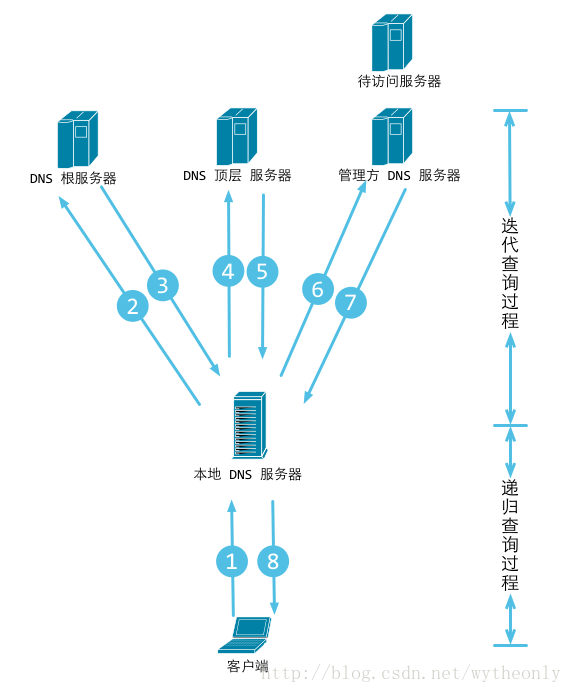
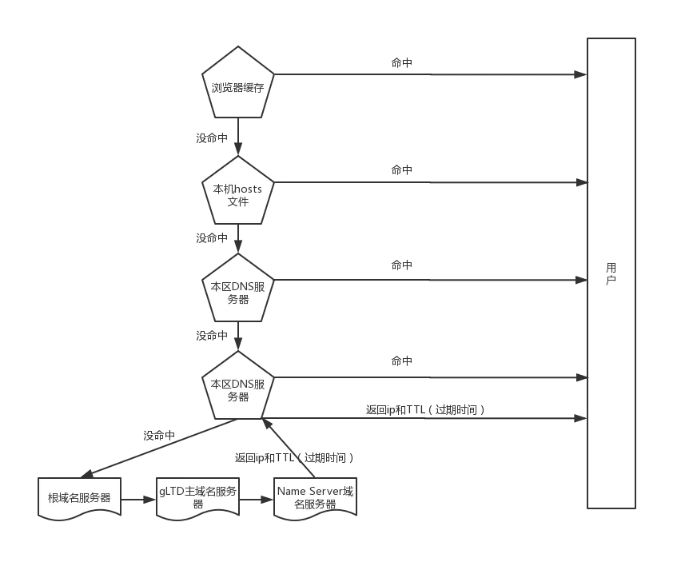
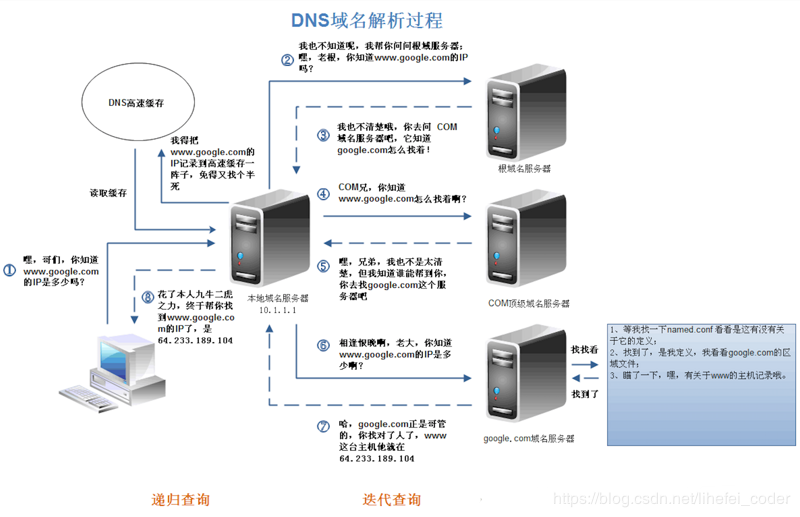

## 名词解释

### DNS

DNS，就是 Domain Name System 的缩写，翻译过来就是域名系统，是互联网上作为域名和 IP 地址相互映射的一个分布式数据库。DNS 能够使用户更方便的访问互联网，而不用去记住能够被机器直接读取的 IP 数串。通过域名，最终得到该域名对应的 IP 地址的过程叫做域名解析（或主机名解析）。

## 根域

就是所谓的“.”，其实我们的网址 www.baidu.com 在配置当中应该是 www.baidu.com.（最后有一点），一般我们在浏览器里输入时会省略后面的点，而这也已经成为了习惯。
根域服务器只是具有 13 个 IP 地址，但机器数量却不是 13 台，因为这些 IP 地址借助了任播的技术

### Top-Level Domain 顶级域名

> TLD Server 顶级域名服务器

顶级域名又称 TLD 是域名中最常见的部分。是互联网 DNS 等级之中的最高级的域，它保存于 DNS 根域的名字空间中。顶级域名是域名的最后一个部分，即是域名最后一点之后的字母，例如在 example.com 这个域名中，顶级域是.com（或.COM），大小写视为相同

### Root Server 根服务器

全球目前有 13 台根服务器。然而，因为每分钟有无数的名字要处理，所以事实上有很多这些服务器的镜像。有意思的是这些镜像服务器的 IP 竟然和单根服务器共享同样的 IP 地址。当请求要发送到一台根服务器，这个请求会被路由到最近的镜像根服务器上。

### CNAME 记录

CNAME 记录定义了一个给定的服务（一个通过 A 记录或者 AAAA 记录定义的）名字的别名。

例如：我们已经定义了一条 A 记录叫 server1 的 host，然后使用 www 来定义一个这个 host 的一个别名：

```
server1     IN  A       111.111.111.111
www         IN  CNAME   server1
```

### Name Server 名字服务器

名字服务器是一台设计用来转换域名到 IP 地址的计算机。这些服务器在 DNS 域名系统中做很多事情。因为这么多数量的域名转换工作如果都让一台服务器来干太多了，因此每台服务器把请求重定向到其他名字服务器或当他们响应时委派响应给他们的子域名。

## 输入 URL DNS 解析流程

打开浏览器，输入一个域名。比如输入 www.163.com，这时，你使用的电脑会发出一个 DNS 请求到本地 DNS 服务器。本地 DNS 服务器一般都是你的网络接入服务器商提供，比如中国电信，中国移动。

查询 www.163.com 的 DNS 请求到达本地 DNS 服务器之后，本地 DNS 服务器会首先查询它的缓存记录，如果缓存中有此条记录，就可以直接返回结果。如果没有，本地 DNS 服务器还要向 DNS 根服务器进行查询。

根 DNS 服务器没有记录具体的域名和 IP 地址的对应关系，而是告诉本地 DNS 服务器，你可以到域服务器上去继续查询，并给出域服务器的地址。

本地 DNS 服务器继续向域服务器发出请求，在这个例子中，请求的对象是.com 域服务器。.com 域服务器收到请求之后，也不会直接返回域名和 IP 地址的对应关系，而是告诉本地 DNS 服务器，你的域名的解析服务器的地址。

最后，本地 DNS 服务器向域名的解析服务器发出请求，这时就能收到一个域名和 IP 地址对应关系，本地 DNS 服务器不仅要把 IP 地址返回给用户电脑，还要把这个对应关系保存在缓存中，以备下次别的用户查询时，可以直接返回结果，加快网络访问。

## 递归查询和迭代查询

一、递归查询:主机向本地域名服务器的查询一般都是采用递归查询。所谓递归查询就是：如果主机所询问的本地域名服务器不知道被查询的域名的 IP 地址，那么本地域名服务器就以 DNS 客户的身份，向其它根域名服务器继续发出查询请求报文(即替主机继续查询)，而不是让主机自己进行下一步查询。因此，递归查询返回的查询结果或者是所要查询的 IP 地址，或者是报错，表示无法查询到所需的 IP 地址。

简单说 就是说我们请求的地址 必须返回一个准确的 ip 地址，没有就向别的地址查询，然后返回给我们一个准确的 ip 地址。我们的本地服务器就是递归服务器。

二、迭代查询:本地域名服务器向根域名服务器的查询的迭代查询。迭代查询的特点：当根域名服务器收到本地域名服务器发出的迭代查询请求报文时，要么给出所要查询的 IP 地址，要么告诉本地服务器：“你下一步应当向哪一个域名服务器进行查询”。然后让本地服务器进行后续的查询。根域名服务器通常是把自己知道的顶级域名服务器的 IP 地址告诉本地域名服务器，让本地域名服务器再向顶级域名服务器查询。顶级域名服务器在收到本地域名服务器的查询请求后，要么给出所要查询的 IP 地址，要么告诉本地服务器下一步应当向哪一个权限域名服务器进行查询。最后，知道了所要解析的 IP 地址或报错，然后把这个结果返回给发起查询的主机。




## DNS 域名解析流程

这里本地域名服务器向各级服务器进行的就是迭代查询，各级服务器自身不返回 ip，而是返回给下一级的 DNS 服务器地址。



## DNS 域名解析流程

DNS 是应用层协议，事实上他是为其他应用层协议工作的，包括不限于 HTTP 和 SMTP 以及 FTP，用于将用户提供的主机名解析为 ip 地址。
具体过程如下：

### (1)浏览器缓存:

当用户通过浏览器访问某域名时，浏览器首先会在自己的缓存中查找是否有该域名对应的 IP 地址（若曾经访问过该域名且没有清空缓存便存在)；这个缓存是有过期时长的，一般是几分钟到几小时不等。

### (2)系统缓存：

当浏览器缓存中无域名对应 IP 则会自动检查用户计算机系统 Hosts 文件 DNS 缓存是否有该域名对应 IP；

### (3)路由器缓存:

当浏览器及系统缓存中均无域名对应 IP 则进入路由器缓存中检查，以上三步均为客户端的 DNS 缓存；

### (4)ISP（互联网服务提供商）DNS 缓存:

> 好像也可以叫 LDNS 本地区 DNS 域名服务器

当在用户客服端查找不到域名对应 IP 地址，则将进入 ISP DNS 缓存中进行查询。

- 比如你用的是电信的网络，则会进入电信的 DNS 缓存服务器中进行查找；
- 如果果你是通过学校连接互联网的一般是你学校的 DNS 服务器(或者向网络设置中指定的 local DNS 进行查询，
- 如果在 PC 指定了 DNS 的话，如果没有设置比如 DNS 动态获取，则向 ISP DNS 发起查询请求)

### (5)根域名服务器:

当以上均未完成，则进入根服务器进行查询。全球仅有 13 台根域名服务器，1 个主根域名服务器，其余 12 为辅根域名服务器。
根域名收到请求后会查看区域文件记录，如果没有根域名服务器会给本地域名服务器 LDNS 一个所查询的主域名服务器（gTLD）地址，gTLD 是国际顶级域名服务器，比如.com,.cn,.org 等。

### (6)顶级域名服务器:

gLTD 服务器查询并返回域名对应的 Name Server 域名服务器的地址，通常是你注册的域名服务器，例如你在某个域名服务器提供商申请的域名，那么这个域名解析任务就由这个域名服务提供商来完成。

### (7)Name Server 域名服务器:

Name Server 域名服务器会查询存储的域名和 ip 的映射关系表，将 ip 连同一个 TTL 值返回给 DNS Server 域名服务器。

### (8)保存结果至缓存:

本地域名服务器把返回的结果保存到缓存，以备下一次使用，同时将该结果反馈给客户端，客户端通过这个 IP 地址与 web 服务器建立链接。缓存时间由 TTL 值控制。

## 实例



## DNS解析为什么使用UDP

>「DNS 使用 UDP 协议作为传输层协议的主要原因是为了避免使用 TCP 协议时造成的连接时延。」DNS域名系统，是应用层协议，运行UDP协议之上，使用端口53。

- 为了得到一个域名的 IP 地址，往往会向多个域名服务器查询，如果使用 TCP 协议，那么每次请求都会存在连接时延，这样使 DNS 服务变得很慢。
- 大多数的地址查询请求，都是浏览器请求页面时发出的，这样会造成网页的等待时间过长。

## DNS实现负载平衡

因为一般的大型网站使用多台服务器提供服务，因此一个域名可能会对应 多个服务器地址。

- 当用户发起网站域名的 DNS 请求的时候，DNS 服务器返回这个域名所对应的服务器 IP 地址的集合
- 在每个回答中，会循环这些 IP 地址的顺序，用户一般会选择排在前面的地址发送请求。
- 以此将用户的请求均衡的分配到各个不同的服务器上，这样来实现负载均衡。
