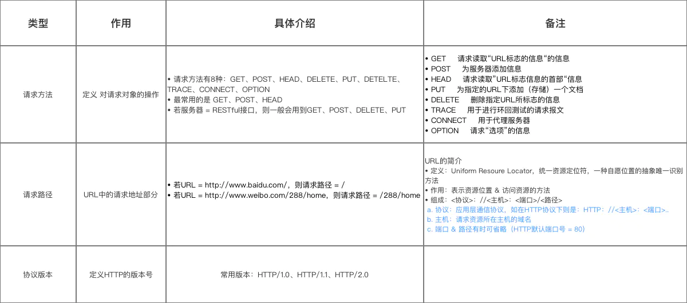
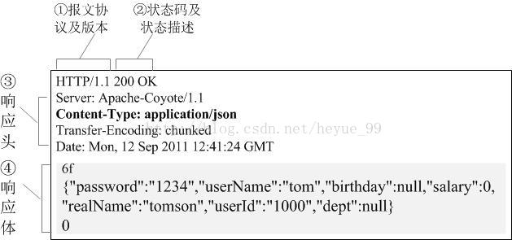
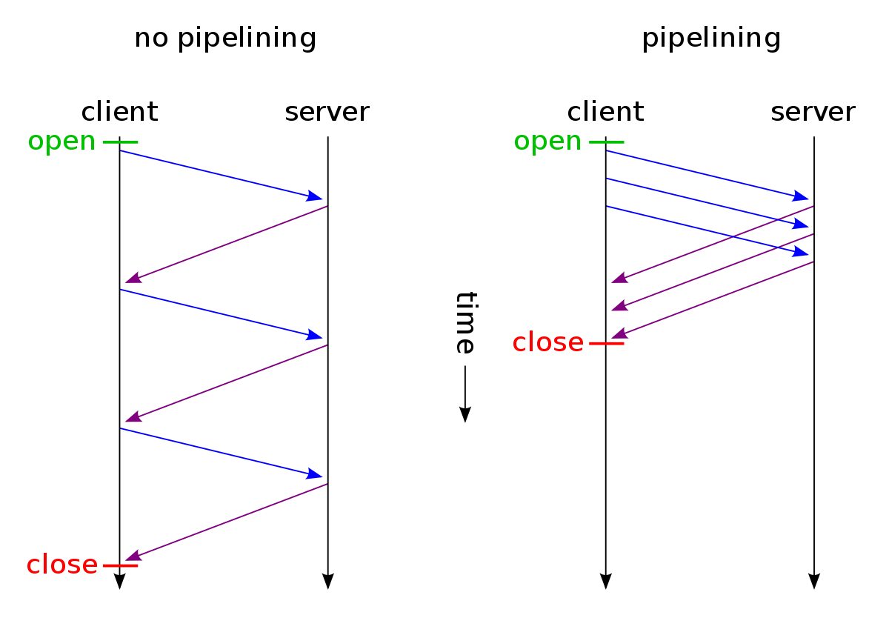
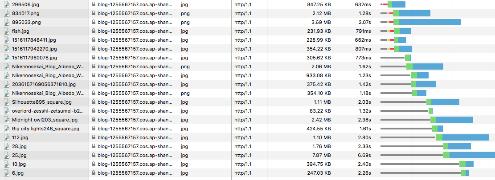
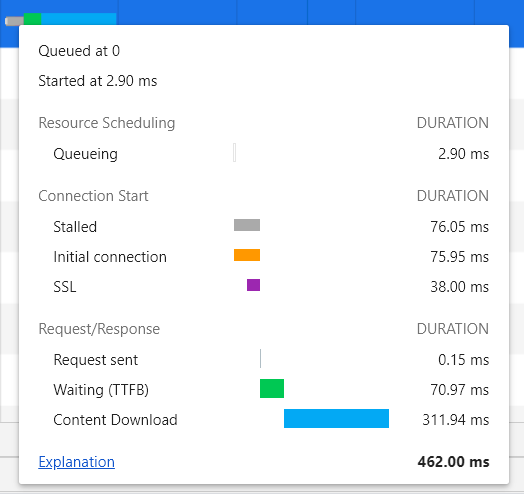
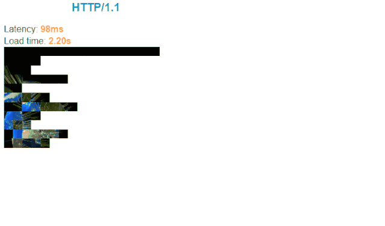

## HTTP

### B/S 结构定义

浏览器-服务器（Browser/Server）结构，简称 B/S 结构，与 C/S 结构不同，其客户端不需要安装专门的软件，只需要浏览器即可，浏览器通过 Web 服务器与数据库进行交互

### URI (统一资源标志符)

在电脑术语中，统一资源标识符（英语：Uniform Resource Identifier，或 URI)是一个用于标识某一互联网资源名称的字符串。

### HTTP 协议

Web 使用一种名为 HTTP（HyperText Transfer Protocol，超文本传输协议）的协议作为规范，完成从客户端到服务器等一系列运作流程。而协议是指规则的约定。

它是为 Web 浏览器与 Web 服务器之间的通信而设计的，但也可以用于其他目的。可以说，Web 是建立在 HTTP 协议上通信的。

HTTP 遵循经典的客户端-服务端模型，客户端打开一个连接以发出请求，然后等待它收到服务器端响应。该协议虽然通常基于 TCP/IP 层，但可以在任何可靠的传输层上使用。

HTTP 是不保存状态的协议，既无状态协议，协议本身对于请求或响应之间的通信状态不进行保存，因此连接双方不能知晓对方当前的身份和状态。这也是 Cookie 技术产生的重要原因之一：客户端的状态管理。浏览器会根据从服务器端发送的响应报文内 Set-Cookie 首部字段信息自动保持 Cookie。而每次客户端发送 HTTP 请求，都会在请求报文中携带 Cookie，作为服务端识别客户端身份状态的标识。



### HTTP 协议主要特点

- 简单快速：当客户端向服务器端发送请求时，只是简单的填写请求路径和请求方法即可，然后就可以通过浏览器或其他方式将该请求发送就行了
- 灵活：HTTP 协议允许客户端和服务器端传输任意类型任意格式的数据对象
- 无连接(短连接）：无连接的含义是限制每次连接只处理一个请求。服务器处理完客户的请求，并收到客户的应答后，即断开连接，采用这种方式可以节省传输时间。(当今多数服务器支持 Keep-Alive 功能，使用服务器支持长连接，解决无连接的问题)
- 无状态：无状态是指协议对于事务处理没有记忆能力，服务器不知道客户端是什么状态。即客户端发送 HTTP 请求后，服务器根据请求，会给我们发送数据，发送完后，不会记录信息。(使用 cookie 机制可以保持 session，解决无状态的问题)

### HTTP 请求报文解析

> 请求行(第一行)+请求头+请求体


### HTTP 响应报文



### HTTP 字段
>- https://juejin.im/post/5cd0438c6fb9a031ec6d3ab2#heading-11


通用首部

- Cache-Control: 控制缓存的行为
- Connection：逐跳首部，连接的管理
- Date：创建报文的日期时间
- Pragma：报文指令
- Trailer：报文末端的首部一览
- Transfer-Encoding：指定报文主体的传输编码方式
- Upgrade：升级为其他协议

请求首部

- Accept: 用户代理可处理的媒体类型
- Accept-Charset: 优先的字符集
- Accept-Encoding: 优先的内容编码
- Accept-Language: 优先的语言
- Authorization: web 认证信息
- From: 用户的电子邮箱地址
- Host: 请求资源所在服务器
- if-Match: 比较实体标记
- if-Modified-Since: 比较资源的更新时间
- if-None-Match: 比较实体标记（与if-Match相反）
- if-Range: 资源为更新时发送实体Byte的范围请求
- if-Unmodified-Since: 比较资源的更新时间
- Referer: 对请求中的 Url 的原始获取方法
- User-Agent: HTTP 客户端程序的信息

响应首部

- Accept-Ranges: 是否接受字节范围请求
- Age: 推算资源创建经过时间
- ETag: 资源的匹配信息
- Location: 令客户端重定向至指定的URL
- Proxy-Authenticate: 代理服务器对客户端的认证信息
- Rety-After: 对再次发起请求的时机要求
- Server: HTTP服务器的安装信息
- Vary: 代理服务器缓存的管理信息
- WWW-Authenticate: 服务器对客户端的认证信息

### host，origin,referer 区别

- Host test.com:1998
- Origin http://test.com:1998
- Referer http://test.com:1998/home

#### Host 域名+端口号

描述请求将被发送的目的地
Host 是 HTTP 1.1 协议中新增的一个请求头，不传会报 400,主要用来实现虚拟主机技术。虚拟主机（virtual hosting）即共享主机（shared web hosting），可以利用虚拟技术把一台完整的服务器分成若干个主机，因此可以在单一主机上运行多个网站或服务。每次访问都会根据不同的 Host 的信息请求到不同的站点上面。

配置了三个虚拟主机：a.com, b.com, c.com, 这三个域名都指向 11.11.11.11。 当我们访问 c.com 的网站时，看到的是 c.com 的页面而不是 a.com 和 b.com 的页面，原因就是 Host 请求头决定着访问哪个虚拟主机。

**`Host：test.com:1998`，虚拟主机的原理是通过HTTP请求头中的Host是否匹配Nginxd的server_name来实现的。**

默认再用 Nginx 反向代理请求的时候会丢失 Host，所以需要加上前面三句保证 host 不会丢失

```tsx
location /test {
            proxy_set_header  Host  $host;
            proxy_set_header  X-real-ip $remote_addr;
            proxy_set_header  X-Forwarded-For $proxy_add_x_forwarded_for;

            proxy_pass http://192.168.2.12:5252/test;
}
```

#### Origin 协议+域名+端口

用来说明请求从哪里发起的
只有跨域请求（可以看到 response 有对应的 header：Access-Control-Allow-Origin），或者同域时发送 post 请求，才会携带 origin 请求头。 当我们的浏览器发出跨站请求时，服务器会校验当前请求是不是来自被允许的站点。服务器就是通过 Origin 字段的值来进行判断。

#### Referer 协议+域名+端口+查询参数（不含锚点

告知服务器请求的原始资源的 URI，其用于所有类型的请求
服务端一般使用 Referer 首部识别访问来源，可能会以此进行统计分析、日志记录以及缓存优化等，还有个常见的用途是图片防盗链。
防盗链原理是：当用户访问网页时，referer 就是前一个网页的 URL；如果是图片的话，通常指的就是图片所在的网页。当浏览器向服务器发送请求时，referer 就自动携带在 HTTP 请求头了。
图片服务器根据这个请求头判断，如果 referer 不是自己的服务器，就将其拦截。

## [HTTP Keep-Alive](HTTP1的keep-alive.md)

## 一个 TCP 可以发多个 HTTP 请求吗

可以，keep-alive 保持长连接就可以了

## 一个 TCP 连接中，几个 HTTP 请求可以同时一起发送吗？

1. HTTP/1.1 默认不可以，可以建立多个 TCP 连接
2. HTTP2 可以，多路复用

HTTP/1.1 存在一个问题，单个 TCP 连接在同一时刻只能处理一个请求，即两个请求的生命周期不能重叠，任意两个 HTTP 请求从开始到结束的时间在同一个 TCP 连接里不能重叠。
虽然 HTTP/1.1 规范中规定了 Pipelining 来试图解决这个问题，但是这个功能在浏览器中默认是关闭的。

## HTTP1.1-Pipelining 管道化同时发请求

### 首先 HTTP 管道化是什么

HTTP1.1 允许在持久连接上可选的使用请求管道。这是相对于 keep-alive 连接的又一性能优化。在相应到达之前，可以将多条请求放入队列，当第一条请求发往服务器的时候，第二第三条请求也可以开始发送了，在高延时网络条件下，这样做可以降低网络的环回时间，提高性能。
非管道化与管道化的区别示意



### HTTP 管道化的限制

- 管道化要求服务端按照请求发送的顺序返回响应（FIFO），原因很简单，HTTP 请求和响应并没有序号标识，无法将乱序的响应与请求关联起来。
- 客户端需要保持未收到响应的请求，当连接意外中断时，需要重新发送这部分请求。
- 只有幂等的请求才能进行管道化，也就是只有 GET 和 HEAD 请求才能管道化，否则可能会出现意料之外的结果

## HTTP1.1 管道化引起的请求队头阻塞


一个支持持久连接的客户端可以在一个连接中发送多个请求（不需要等待任意请求的响应）。收到请求的服务器必须按照请求收到的顺序发送响应。

那如果一个响应返回延迟了，那么其后续的响应都会被延迟，直到队头的响应送达。

由于 HTTP/1.1 是个文本协议，同时返回的内容也并不能区分对应于哪个发送的请求，所以顺序必须维持一致。例如你向服务器发送了两个请求 GET/query?type=1 和 GET/query?type=2，服务器返回了两个结果，浏览器是没有办法根据响应结果来判断响应对应于哪一个请求的。

Pipelining 的问题-连接头阻塞：在建立起一个 TCP 连接之后，假设客户端在这个连接连续向服务器发送了多个请求。如果按照标准的话，服务器应该按照收到请求的顺序返回结果，假设服务器在处理首个请求时花费了大量时间，那么后面所有的请求都需要等着首个请求结束才能响应，造成了阻塞。

## TCP也有队头阻塞

TCP数据包是有序传输，中间一个数据包丢失，会等待该数据包重传，造成后面的数据包的阻塞。

解决办法就是只有舍弃TCP协议，不然无法根本解决。

## http2 的请求可以并行-多路复用

在 HTTP/1.1 存在 Pipelining 技术可以完成这个多个请求同时发送，但是由于浏览器默认关闭，所以可以认为这是不可行的。在 HTTP2 中由于 Multiplexing（多路复用） 特点的存在，多个 HTTP 请求可以在同一个 TCP 连接中并行进行，可以在一个 TCP 连接中同时完成多个 HTTP 请求

## 为什么 HTTP1.1 不能实现多路复用

http1.1 虽然提出了管线化(pipelining)技术，一次性发送多个 request 请求，但是 pipelining 在接收 response 返回时，也必须依顺序接收，如果前一个请求遇到了阻塞，后面的请求即使已经处理完毕了，仍然需要等待阻塞的请求处理完毕。

因为 HTTP/1.1 不是二进制传输，而是通过文本进行传输。由于没有流的概念，在使用并行传输（多路复用）传递数据时， HTTP1.1 并不能区分多个响应分别对应的请求，以及顺序，所以无法将多个响应的结果重新进行组装，也就实现不了多路复用。**文本传输为什么就无法区分对应的请求呢，感觉不太清楚？个人猜测：是因为文本传输没有经过封装，一个字一个字原样传输，没有属于哪个请求的信息，二进制流经过帧的封装，每一帧都带有记录属于哪个请求的唯一id，且含有帧序号，确保顺序**


HTTP1.x 是序列和阻塞机制
举例来说，在一个 TCP 连接里面，服务器同时收到了 A 请求和 B 请求，于是先回应 A 请求，结果发现处理过程非常耗时，于是就发送 A 请求已经处理好的部分， 接着回应 B 请求，完成后，再发送 A 请求剩下的部分。

- 旧的 http1.1 是会等 A 请求完全处理完后在 处理 B 请求，会阻塞

- HTTP 2.0 是多工复用 TCP 连接，在一个连接里，客户端和浏览器都可以同时发送多个请求或回应，而且不用按照顺序一一对应，这样就避免请求部分的"队头堵塞",但丢包还是会有堵塞，而且更严重。

## http2 的多路复用和 http1 的 keep-alive 的区别？

> keep-alive 的话是有一个并发的限制？一次性最多可以同时发多少条？多路复用不用考虑并发？ 美团面试官应该是这么说的 我还没理清楚。。

- HTTP/1.\* 一次请求-响应，建立一个连接，用完关闭；每一个请求都要建立一个连接；

- HTTP/1.1 Pipeling 解决方式为，若干个请求排队串行化单线程处理，后面的请求等待前面请求的返回才能获得执行机会，一旦有某请求超时等，后续请求只能被阻塞，毫无办法，也就是人们常说的线头阻塞；(归根到底就是没有分帧，并对帧进行编号)

- HTTP/2 多个请求可同时在一个连接上并行执行。某个请求任务耗时严重，不会影响到其它连接的正常执行

## HTTP/1.1 最多可产生多少个 TCP 连接

如果使用的是 HTTP/1.1 ，即没有多路传输，当浏览器需要加载有几十张图片的网页该怎么办呢？肯定不能只开一个 TCP 连接顺序下载，那样用户肯定不能接受，但是如果每个图片都开一个 TCP 连接发 HTTP 请求，那电脑或者服务器都可能受不了，要是有 1000 张图片的话总不能开 1000 个 TCP 连接吧，即使你的电脑同意 NAT 也不定同意的

**浏览器通过多线程建立的多个链接实现**
Chrome、火狐、IE 10+ 最多允许对同一个 Host 建立六个 TCP 连接。不同的浏览器有一些区别

Opera 10.51+是 8 个，Safari 3,4 好像是 4 个



查看请求的时间构成，前面的请求是首次就需要进行连接的初始化，比如进行 SSL 的握手啊等等，http1.1 请求默认是长连接，后面的请求就复用了之前的连接，从上图看出后面的请求就没有之前那些黄色和紫色的颜色了：


- Queueing 请求排队的时间。关于这个，需要知道一个背景，就是浏览器与同一个域名建立的 TCP 连接数是有限制的，chrome 设置的 6 个，如果说同一时间，发起的同一域名的请求超过了 6 个，这时候就需要排队了，也就是这个 Queueing 时间

- Stalled 是浏览器得到要发出这个请求的指令，到请求可以发出的等待时间，一般是代理协商、以及等待可复用的 TCP 连接释放的时间，不包括 DNS 查询、建立 TCP 连接等时间等
- DNS Lookup DNS 查询的时间，页面内任何新的域名都需要走一遍 完整的 DNS 查询过程，已经查询过的则走缓存
- Initial Connection / Connecting 建立 TCP 连接的时间，包括 TCP 的三次握手和 SSL 的认证
- SSL 完成 ssl 认证的时间
- Request sent/sending 请求第一个字节发出前到最后一个字节发出后的时间，也就是上传时间
- Waiting 请求发出后，到收到响应的第一个字节所花费的时间(Time To First Byte)
- Content Download 收到响应的第一个字节，到接受完最后一个字节的时间，就是下载时间

## 那如何并行更多 TCP 请求呢？

1.给定一组域名，如：img1.baidu.com、img2.baidu.com、img3.baidu.com、img4.baidu.com... ...

2.这组域名指向同一个源，或者说最终源是一个。

3.上传图片（静态文件）的时候随机返回这组域名中的其中一个即可，这样图片的访问域名就不会出现只是一个域名了。

## http1.1 的多个 TCP 连接对比 HTTP2 的多路复用

在 HTTP/2 中引入了多路复用的技术。多路复用很好的解决了浏览器限制同一个域名下的请求数量的问题，同时也接更容易实现全速传输，毕竟新开一个 TCP 连接都需要慢慢提升传输速度。


## 参考

- https://blog.csdn.net/ywlmsm1224811/article/details/96436768
- https://juejin.im/post/5a31ee6451882531ea654913
- https://segmentfault.com/a/1190000020370495
- https://blog.csdn.net/xiaoduanayu/article/details/78386508
- https://www.cnblogs.com/sunsky303/p/8862128.html
- https://zhuanlan.zhihu.com/p/61423830
