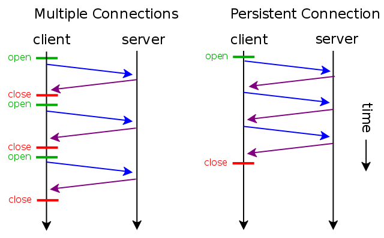
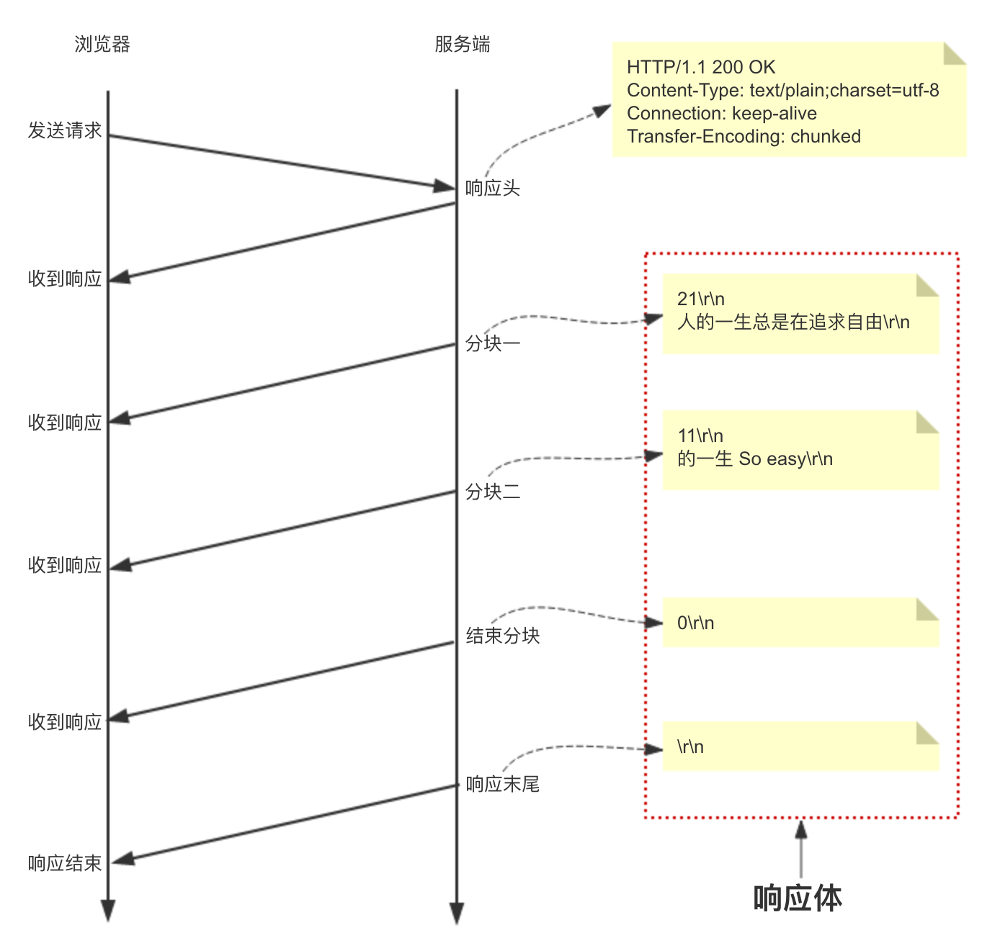

## Keep alive

HTTP 协议采用“请求-应答”模式，当使用普通模式，即非 KeepAlive 模式时，每个请求/应答客户和服务器都要新建一个连接，完成 之后立即断开连接（HTTP 协议为无连接的协议），每次请求都会经过三次握手四次挥手过程，效率较低；当使用 Keep-Alive 模式时，客户端到服务器端的连接不会断开，当出现对服务器的后继请求时，客户端就会复用已建立的连接。

下图是每次新建连接和连接复用在通信模型上的区别：



通过使用 keep-alive 机制，可以减少 tcp 连接建立次数，也意味着可以减少 TIME_WAIT 状态连接，以此提高性能和提高 http 服务器的吞吐率(更少的 tcp 连接意味着更少的系统内核调用,socket 的 accept()和 close()调用)。

## Keep alive 原理或流程？
>[http client 实现 keep-alive 源码探究](https://segmentfault.com/a/1190000020593866?utm_source=tag-newest)

HTTP版本为1.0,表明上是通过请求头`Connection: Keep-Alive`来实现开启

- 建立tcp连接
- Client 发出request，并声明HTTP版本为1.0，且包含header:"Connection： keep-alive"。
- Server收到request，通过HTTP版本1.0和"Connection： keep-alive"，判断连接为长连接；故Server在response的header中也增加"Connection： keep-alive"。
- 同时，Server不释放tcp连接，在Client收到response后，认定为长连接，同样也不释放tcp连接。这样就实现了会话的保持。
- 直到会话保持的时间超过keepaliveTime时，client和server端将主动释放tcp连接。


## Keep-Alive 优缺点

### 优点

- 节省了服务端 CPU 和内存适用量
- 降低拥塞控制 （TCP 连接减少）
- 减少了后续请求的延迟（无需再进行握手）

### 缺点

对于某些低频访问的资源/服务，比如一个冷门的图片服务器，一年下不了几次，每下一次连接还保持就比较浪费了（这个场景举的不是很恰当）。Keep-Alive 可能会非常影响性能，因为它在文件被请求之后还保持了不必要的连接很长时间，额外占用了服务端的连接数。

长时间的 tcp 连接容易导致系统资源无效占用。配置不当的 keep-alive，有时比重复利用连接带来的损失还更大。所以，正确地设置 keep-alive timeout 时间非常重要。

## Http 1.1 默认开启 Keep-Alive

Http1.1 以后，Keep-Alive 已经默认支持并开启。客户端（包括但不限于浏览器）发送请求时会在 Header 中增加一个请求头 Connection: Keep-Alive，当服务器收到附带有 Connection: Keep-Alive 的请求时，也会在响应头中添加 Keep-Alive。这样一来，客户端和服务器之间的 HTTP 连接就会被保持，不会断开（断开方式下面介绍），当客户端发送另外一个请求时，就可以复用已建立的连接。

```
HTTP/1.1 200 OK
Connection: Keep-Alive
Content-Encoding: gzip
Content-Type: text/html; charset=utf-8
Date: Thu, 11 Aug 2016 15:23:13 GMT
Keep-Alive: timeout=5, max=1000
Last-Modified: Mon, 25 Jul 2016 04:32:39 GMT
Server: Apache

[body]

```

## 长连接在何时关闭

### Response Header 设置

timeout：在 15S 保持了连接不销毁，15 后就销毁
max：最多 100 次请求，强制断掉连接。就是在 timeout 时间内又有新的连接过来，同时 max 会自动减 1，直到为 0，强制断掉。

```
Keep-Alive:timeout=15, max=100
```

### 通过 Connection close 标识

还有一种方式是接收端通在 Response Header 中增加 Connection close 标识，来主动告诉发送端，连接已经断开了，不能再复用了；客户端接收到此标示后，会销毁连接，再次请求时会重新建立连接。

## Http 连接复用后包边界问题处理

在没有连接复用时，Http 接收端（注意这里是接收端，并没有特指 Client/Server，因为 Client/Server 都同是发送端和接收端）只需要读取 Socket 中所有的数据就可以了，解决“拆包”问题即可；但是连接复用后，无法区分单次 Http 报文的边界，所以还需要额外处理报文边界问题。当然这个通过 Http 中 Header 的长度字段，按需读取即可解决。

### Content-Length 处理包边界

一般情况下这个特殊标志就是 Content-Length，来指明响应体的数据大小，比如 Content-Length: 120 表示响应体内容有 120 个字节，这样浏览器接收到 120 个字节的响应体后就知道了已经响应完成。

如果Content-Length < 实际长度

所产生的现象就是每一次的请求都被截断, 但不会产生解析混乱(如将上一次剩下的消息拼接到后续的请求消息中).所以很有可能造成第一次请求没错误，但下一次请求因为是上一次的拼接所以会报错，信息不完整

OPTIONS请求的Content-Length好像是0

### Chunked 分块传输处理包边界

由于 Content-Length 字段必须真实反映响应体长度，但实际应用中，有些时候响应体长度并没那么好获得，例如响应体来自于网络文件，或者由动态语言生成。这时候要想准确获取长度，只能先开一个足够大的内存空间，等内容全部生成好再计算。但这样做一方面需要更大的内存开销，另一方面也会让客户端等更久。这时候 Transfer-Encoding: chunked 响应头就派上用场了，该响应头表示响应体内容用的是分块传输，此时服务器可以将数据一块一块地分块响应给浏览器而不必一次性全部响应，待浏览器接收到全部分块后就表示响应结束。



## TCP 的 keepAlive 和 HTTP 的 keep-alive

TCP keepalive 指的是 TCP 保活计时器（keepalive timer）。设想有这样的情况：客户已主动与服务器建立了 TCP 连接。但后来客户端的主机突然出故障。显然，服务器以后就不能再收到客户发来的数据。因此，应当有措施使服务器不要再白白等待下去。这就是使用保活计时器。服务器每收到一次客户的数据，就重新设置保活计时器，时间的设置通常是两小时。若两小时没有收到客户的数据，服务器就发送一个探测报文段，以后则每隔 75 秒发送一次。若一连发送 10 个探测报文段后仍无客户的响应，服务器就认为客户端出了故障，接着就关闭这个连接.------谢希仁《计算机网络》

- TCP 的 keepAlive 是侧重于保持客户端和服务端的连接，会不定时发送心跳包验证有没有断开连接，如果没有这个机制的话，一方断开，另一方不知道，就会对服务器资源产生较大的影响

* HTTP 的 keep-alive 可以让服务器客户端保持这个连接，不需要重新 tcp 进行连接了

## WebSocket 和 Keep Alive 区别？

你可以把 WebSocket 看成是 HTTP 协议为了支持长连接所打的一个大补丁，它和 HTTP 有一些共性，是为了解决 HTTP 本身无法解决的某些问题而做出的一个改良设计。在以前 HTTP 协议中所谓的 keep-alive connection 是指在一次 TCP 连接中完成多个 HTTP 请求，但是对每个请求仍然要单独发 header；所谓的 polling 是指从客户端（一般就是浏览器）不断主动的向服务器发 HTTP 请求查询是否有新数据。**这两种模式有一个共同的缺点，就是除了真正的数据部分外，服务器和客户端还要大量交换 HTTP header，信息交换效率很低。Keep Alive建立的“长连接”是伪长连接**，只不过好处是不需要对现有的 HTTP server 和浏览器架构做修改就能实现。

WebSocket 解决的第一个问题是，通过第一个 HTTP request 建立了 TCP 连接之后，之后的交换数据都不需要再发 HTTP request 了，使得这个长连接变成了一个真.长连接。但是不需要发送 HTTP header 就能交换数据显然和原有的 HTTP 协议是有区别的，所以它需要对服务器和客户端都进行升级才能实现。在此基础上 WebSocket 还是一个双通道的连接，在同一个 TCP 连接上既可以发也可以收信息。此外还有 multiplexing 功能，几个不同的 URI 可以复用同一个 WebSocket 连接。这些都是原来的 HTTP 不能做到的。

keep-alive 只是一种为了达到复用 tcp 连接的“协商”行为，双方并没有建立正真的连接会话，服务端也可以不认可，也可以随时（在任何一次请求完成后）关闭掉。WebSocket 不同，它本身就规定了是正真的、双工的长连接，两边都必须要维持住连接的状态。

另外，http 协议决定了浏览器端总是主动发起方，http 的服务端总是被动的接受、响应请求，从不主动。而 WebSocket 协议，在连接之后，客户端、服务端是完全平等的，不存在主动、被动之说。


## 没有WebSocket双向通信之前可以用客户端轮询

### 短轮询

- 浏览器每隔一段时间向浏览器发送 http 请求，服务器端在收到请求后，不论是否有数据更新，都直接进行 响应。
- 这种方式实现的即时通信，本质上还是浏览器发送请求，服务器接受请求的一个过程，通过让客户端不断的进行请求，使得客户端能够模拟实时地收到服务器端的数据的变化。

```
var tis = setInterval(function(){$.ajax(getting)},3000);//{调用ajax(自己封装的数据)},每3秒执行一次
var getting = {
    type:'GET',
    url://地址,
    success: function (obj) {
        console.log(obj)
    　    //这里需要你判断服务器返回的数据
        //成功后取消clearTimeout(tis);
    },
    error: function (err) {
        console.log(err);
    }
}
```

优缺点：

- 优点是比较简单，易于理解。

- 缺点是这种方式由于需要不断的建立 http 连接，严重浪费了服务器端和客户端的资源。当用户增加时，服务器端的压力就会变大，这是很不合理的。

由于间隔时间很短，比如二维登录的时候就是在不断的短轮询，发请求询问服务端登录状态是否改变，对性能有一点的影响

### 长轮询

长轮询的基本思路:

- 首先由客户端向服务器发起请求，当服务器收到客户端发来的请求后，服务器端不会直接进行响应，而是先将 这个请求挂起，然后判断服务器端数据是否有更新。

- 如果有更新，则进行响应，如果一直没有数据，则到达一定的时间限制才返回。客户端 JavaScript 响应处理函数会在处理完服务器返回的信息后，再次发出请求，重新建立连接。

优缺点：

- 长轮询和短轮询比起来，它的优点是「明显减少了很多不必要的 http 请求次数」，相比之下节约了资源。
- 长轮询的缺点在于，连接挂起也会导致资源的浪费。

