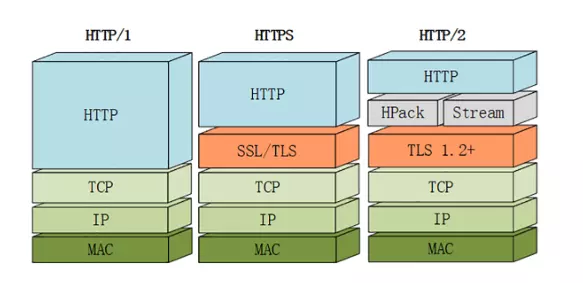
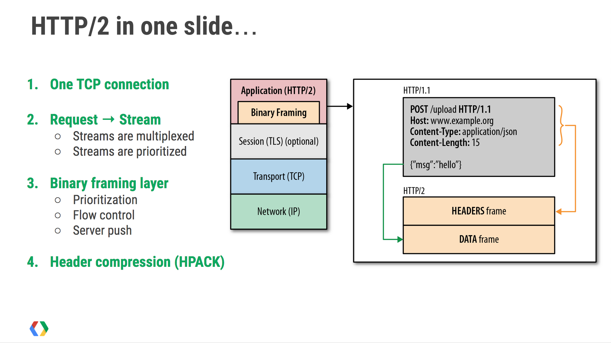
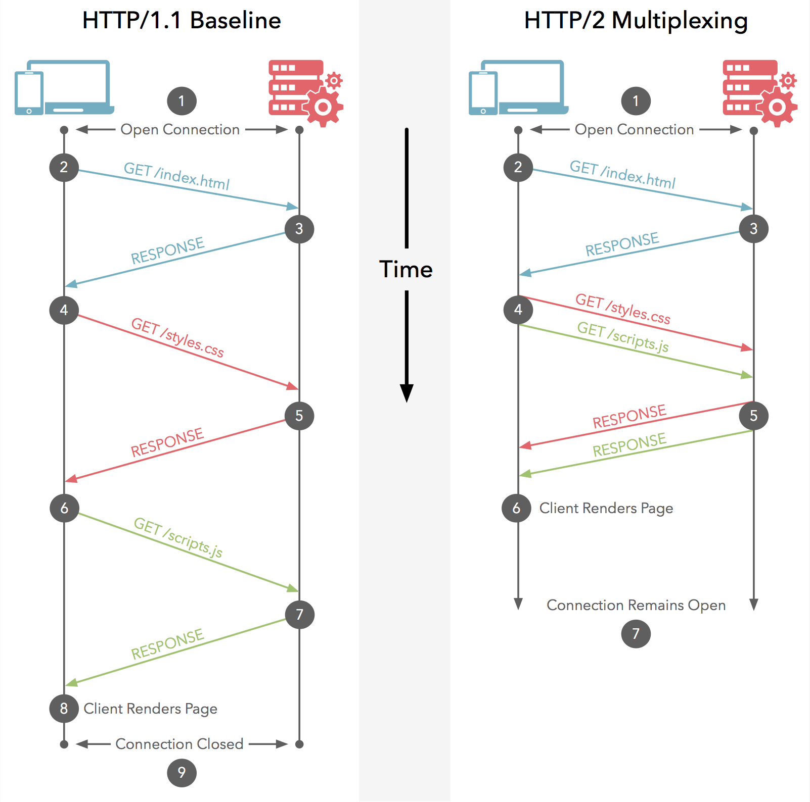
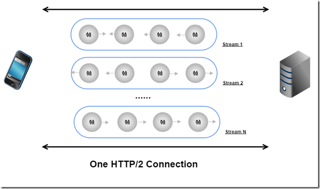
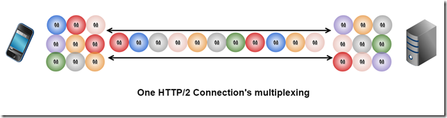
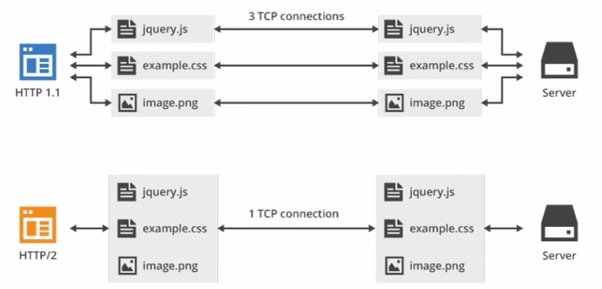
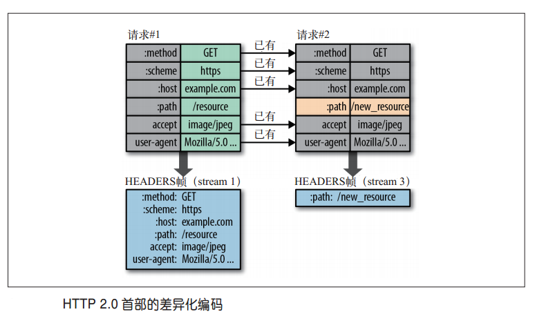
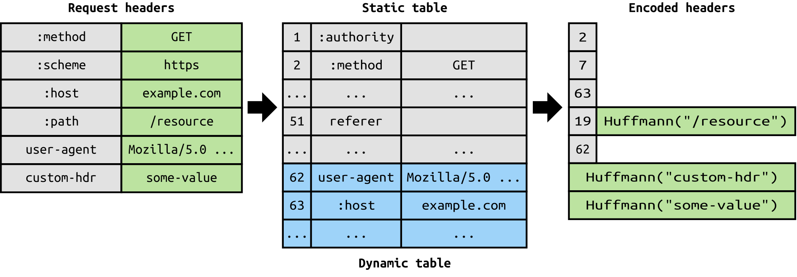
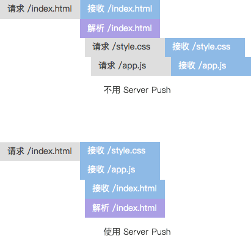

## HTTP2.0

> 谷歌推行一种协议 SPDY(HTTP 之下 SSL 之上[TCP]),可以算是 HTTP2 的前身,chrome90后默认就是http2

HTTP2.0 可以说是 SPDY 的升级版（其实原本也是基于 SPDY 设计的），但是，HTTP2.0 跟 SPDY 仍有不同的地方，主要是以下两点：

- HTTP2.0 支持明文 HTTP 传输，而 SPDY 强制使用 HTTPS
- HTTP2.0 消息头的压缩算法采用 HPACK，而非 SPDY 采用的 DEFLATE



## 新的二进制格式（Binary Format）

HTTP1.x 的解析是基于文本(基于字符编码如 ASCII 码)。基于文本协议的格式解析存在天然缺陷，文本的表现形式有多样性，要做到健壮性考虑的场景必然很多，二进制则不同，只认 0 和 1 的组合。基于这种考虑 HTTP2.0 的协议解析决定采用二进制格式，实现方便且健壮。

帧是数据传输的最小单位，以二进制传输代替原本的明文传输，原本的报文消息被划分为更小的数据帧

- 流（Stream）：已建立的 TCP 连接上的双向字节流，可以承载一个或多个消息。
- 消息（Message）：一个完整的 HTTP 请求或响应，由一个或多个帧组成。特定消息的帧在同一个流上发送，这意味着一个 HTTP 请求或响应只能在一个流上发送。
- 帧（Frame）：通信的基本单位。

帧（Frame）是 HTTP2 通讯中的最小传输单位，所有帧以固定的 9 个八位字节头部开头，随后是一个可变长度的有效载荷

```
帧结构图
 +-----------------------------------------------+
 |                 长度Length (24)                |
 +---------------+---------------+---------------+
 |   类型Type (8)    |   标志Flags (8)   |
 +-+-------------+---------------+-------------------------------+
 |R|                 流标识符Stream Identifier (31)               |
 +=+=============================================================+
 |                   帧载荷Frame Payload (0...)                 ...
 +---------------------------------------------------------------+
```




一个 TCP 连接上可以有任意数量的流。HTTP2 的传输单位是帧，流其实就是一个帧的分组集合的概念，为什么需要这个逻辑集合呢？答案就在多路复用。

## 多路复用（MultiPlexing）



### 多路复用的基础-帧和流

在 HTTP/2 中，有两个非常重要的概念，分别是帧（frame）和流（stream）。
帧代表着最小的数据单位，每个帧会标识出该帧属于哪个流，流也就是多个帧组成的数据流。

多路复用，就是在一个 TCP 连接中可以存在多条流。换句话说，也就是可以发送多个请求，对端可以通过帧中的标识知道属于哪个请求。通过这个技术，可以避免 HTTP 旧版本中的队头阻塞问题，极大的提高传输性能。

HTTP2 连接上传输的每个帧都关联到一个“流”。流是一个独立的，双向的帧序列，可以通过一个 HTTP2 的连接在服务端与客户端之间不断的交换数据。

### HTTP2 流的例子

在 HTTP1.1 的协议中，我们传输的 request 和 response 都是基本于文本的，这样就会引发一个问题：所有的数据必须按顺序传输，比如需要传输：hello world，只能从 h 到 d 一个一个的传输，不能并行传输，因为接收端并不知道这些字符的顺序，所以并行传输在 HTTP1.1 是不能实现的。


HTTP/2 引入二进制数据帧和流的概念，其中帧对数据进行顺序标识，如下图所示，这样浏览器收到数据之后，就可以按照序列对数据进行合并，而不会出现合并后数据错乱的情况。同样是因为有了序列，服务器就可以并行的传输数据，这就是流所做的事情。


### 并行的流

每个单独的 HTTP2 连接都可以包含多个并行的流(\微观来看准确的说应该是并发，一条流时间片轮转发送多个分组的帧https://www.cnblogs.com/yudar/p/4642602.html)，这些流中交错的包含着来自两端的帧。流既可以被客户端/服务器端单方面的建立和使用，也可以被双方共享，或者被任意一边关闭。在流里面，每一帧发送的顺序非常关键。接收方会按照收到帧的顺序来进行处理。

流的概念提出是为了实现多路复用，在单个连接上实现同时进行多个业务单元数据的传输。逻辑图如下：



实际传输可能是这样的：



而流就是由二进制帧组成的。二进制帧的头部信息会标识自己属于哪一个流，所以这些帧是可以交错传输，然后在接收端通过帧头的信息组装成完整的数据。这样就解决了线头阻塞的问题，同时也提高了网络速度的利用率。

### 流的优先级

每一个 TCP 连接中承载了多个双向流通的流，每一个流都有一个独一无二的标识和优先级（也就是“权重”），它被用来告诉对端哪个流更重要。当资源有限的时候，服务器会根据优先级来选择应该先发送哪些流。


### TCP 多连接并行与多路复用的并行

每个流都包含一个优先级（也就是“权重”），它被用来告诉对端哪个流更重要。当资源有限的时候，服务器会根据优先级来选择应该先发送哪些流。

HTTP1.x 中，并发多个请求需要多个 TCP 连接，浏览器为了控制资源会有 6-8 个 TCP 连接都限制。
在 HTTP/2 中，有了二进制分帧之后，HTTP /2 不再依赖 TCP 链接去实现多流并行了

- 同域名下所有通信都在单个连接上完成，消除了因多个 TCP 连接而带来的延时和内存消耗。
- 单个连接上可以并行交错的请求和响应，之间互不干扰
- 数据流以消息的形式发送，而消息又由一个或多个帧组成，多个帧之间可以乱序发送，因为根据帧首部的流标识可以重新组装。
  

## HTTP2 多路复用的部分优点

### 减小 TCP 不断握手对

同个域名只需要占用一个 TCP 连接，使用一个连接并行发送多个请求和响应,这样整个页面资源的下载过程只需要一次慢启动，同时也避免了多个 TCP 连接竞争带宽所带来的问题。

### 优先级的调度

在HTTP/2中，每个请求都可以带一个31bit的优先值，0表示最高优先级， 数值越大优先级越低。有了这个优先值，客户端和服务器就可以在处理不同的流时采取不同的策略，以最优的方式发送流、消息和帧。

### 还解决了一个占用 Web 服务器并发数的问题

连接数过多。我们假设 Apache 设置了最大并发数为 300，因为浏览器限制，浏览器发起的最大请求数为 6，也就是服务器能承载的最高并发为 50，当第 51 个人访问时，就需要等待前面某个请求处理完成。


HTTP/2 对同一域名下所有请求都是基于流，也就是说同一域名不管访问多少文件，也只建立一路连接。同样 Apache 的最大连接数为 300，因为有了这个新特性，最大的并发就可以提升到 300，比原来提升了 6 倍！

## 多路复用也是存在缺点的-更严重的TCP队头阻塞
>TCP数据包是有序传输，中间一个数据包丢失，会等待该数据包重传，造成后面的数据包的阻塞。

http2.0 也存在队头阻塞问题，如果造成队头阻塞，问题可能比http1.1还严重。
在HTTP/2中，多个请求是跑在一个TCP管道中的。但当出现了丢包时，HTTP/2 的表现反倒不如 HTTP/1 了。

因为TCP为了保证可靠传输，有个特别的“丢包重传”机制，丢失的包必须要等待重新传输确认，HTTP/2出现丢包时，整个 TCP 都要开始等待重传，那么就会阻塞该TCP连接中的所有请求。

而对于 HTTP/1.1 来说，可以开启多个 TCP 连接，出现这种情况反到只会影响其中一个连接，剩余的 TCP 连接还可以正常传输数据。

为什么不直接去修改 TCP 协议？其实这已经是一件不可能完成的任务了。因为 TCP 存在的时间实在太长，已经充斥在各种设备中，并且这个协议是由操作系统实现的，更新起来不大现实。

但是Google干了件牛掰的事情就是直接封装UDP弄了一个QUIC协议，不可靠的UDP上实现快速可靠的传输，并且还内置了TSL安全协议，最后被标准认可发展成了HTTP3,，下一个笔记有详细的解释

## 多路复用常见的一些问题
### 为什么 HTTP/1.1 不能实现“多路复用”，HTTP2 能？

HTTP/2 是基于二进制“帧”的协议，HTTP/1.1 是基于“文本分割”解析的协议。

```
GET / HTTP/1.1
Accept:text/html,application/xhtml+xml,application/xml;q=0.9,image/webp,image/apng,*/*;q=0.8
Accept-Encoding:gzip, deflate, br
Accept-Language:zh-CN,zh;q=0.9,en;q=0.8
Cache-Control:max-age=0
Connection:keep-alive
Cookie:imooc_uuid=b2076a1d-6a14-4cd5-91b0-17a9a2461cf4; imooc_isnew_ct=1517447702; imooc_isnew=2; zg_did=%7B%22did%22%3A%20%221662d799f3f17d-0afe8166871b85-454c092b-100200-1662d799f4015b%22%7D; loginstate=1;cvde=5be7a057c314b-1; IMCDNS=1
Host:www.imooc.com
Referer:https://www.imooc.com/
Upgrade-Insecure-Requests:1
User-Agent:Mozilla/5.0 (Windows NT 6.1; WOW64) AppleWebKit/537.36 (KHTML, like Gecko) Chrome/63.0.3239.132 Safari/537.36
```

以上就是 HTTP/1.1 发送请求消息的文本格式：以换行符分割每一条 key:value 的内容，解析这种数据用不着什么高科技，相反的，解析这种数据往往速度慢且容易出错。“服务端”需要不断的读入字节，直到遇到分隔符（这里指换行符，代码中可能使用/n 或者/r/n 表示），这种解析方式是可行的，并且 HTTP/1.1 已经被广泛使用了二十多年，这事已经做过无数次了，问题一直都是存在的：

- 一次只能处理一个请求或响应，因为这种以分隔符分割消息的数据，在完成之前不能停止解析。
- 解析这种数据无法预知需要多少内存，这会带给“服务端”很大的压力，因为它不知道要把一行要解析的内容读到多大的“缓冲区”中，在保证解析效率和速度的前提下：内存该如何分配？

HTTP/2 设计是基于“二进制帧”进行设计的，这种设计无疑是一种“高超的艺术”，因为它实现了一个目的：一切可预知，一切可控。

总结一下：

- HTTP1.x 是阻塞机制,一个请求完了才是一下个
- http1 没有序列号标签，交错发送无法排序
- HTTP/1.1 不是二进制传输，而是通过文本进行传输。由于没有流的概念，在使用并行传输（多路复用）传递数据时，接收端在接收到响应后，并不能区分多个响应分别对应的请求，所以无法将多个响应的结果重新进行组装，也就实现不了多路复用。
- 多路复用归功于， HTTP/2 中的 帧（frame）和流（stream）。帧代表着最小的数据单位，每个帧会标识出该帧属于哪个流，流也就是多个帧组成的数据流。就是在一个 TCP 连接中可以存在多条流。

### 在 HTTP1 上实现多路复用？

服务端+keep-alive+浏览器实现：

- 0.合并请求
- 1.多文件合成流
- 2.多个流同时发送/接受
- 3.校验完整性、合并、执行

长连接复用与 Http2 复用的区别

- HTTP/1.\* 一次请求-响应，建立一个连接，用完关闭；每一个请求都要建立一个连接；
- HTTP/1.1 Pipeling 解决方式为，若干个请求排队串行化单线程处理，后面的请求等待前面请求的返回才能获得执行机会，一旦有某请求超时等，后续请求只能被阻塞，毫无办法，也就是人们常说的队头阻塞；
- HTTP/2 多个请求可同时在一个连接上并行执行。某个请求任务耗时严重，不会影响到其它连接的正常执行

## 头部压缩

> 同一域名下的资源一般可以头部压缩；
> 不同域名下的资源，但是满足两个条件：1）解析到同一个 IP；2）使用同一个证书；

### HTTP1 的问题

HTTP 协议本身是无状态（stateless） 的：每个请求之间互不关联，每个请求都需要携带服务器所需要的所有细节信息。比如说请求 1 发送给服务器信息“我是用户 A”，然后请求二发送信息“修改我的用户名为 XX”，这时如果请求二没有携带“我是用户 A”的信息，那么服务器是不知道要修改哪个用户的用户名的。

这显然是不符合当前 web 应用系统架构的，因为一般系统都需要进行鉴权，日志记录，安全校验等限制，所以需要获取当前操作用户的信息，出于安全和性能考虑我们不能在消息体中明文包含这些信息，HTTP2 之前的解决方案一般是使用 Cookies 头、服务器 session 等方式模拟出“状态”。而  使用 Cookies 头的缺点就是每个请求都需要携带庞大的重复的信息并且无法压缩，假设一个请求的 header 是 2kb，那么一百个请求就是重复的 200Kb 信息，这是一个巨大的带宽浪费。

### 为什么需要压缩

HTTP 1.1 请求的大小正变得越来越大，有时甚至会大于 TCP 窗口的初始大小，这会严重拖累发送请求的速度。因为它们需要等待带着 ACK 的响应回来以后，才能继续被发送。这也是另一个需要压缩的理由。

### 压缩的概念简单理解

通信的双方各拥有一本字典，记录着某些字符对应的文本内容，例如 x 代表危险，y 代表撤退，z 代表进攻等；
消息发送方根据字典生成消息文本比如'x，y'
接收方接收到消息后，根据字典还原内容：“危险，撤退”

### Hpack 思想简介
>https://halfrost.com/http2-header-compression/

HTTP2 在户端和服务器端使用“首部表”来跟踪和存储之前发送的键-值对，对于相同的数据，不再通过每次请求和响应发送；通信期间几乎不会改变的通用键-值对（用户代理、可接受的媒体类型，等等）只需发送一次。

- 消息发送端和消息接受端共同维护一份静态表和一份动态表（这两个合起来充当字典的角色）
- 每次请求时，发送方根据字典的内容以及一些特定指定，编码压缩消息头部，
- 接收方根据字典进行解码，并且根据指令来判断是否需要更新动态表


### 静态表

静态表是预先设定好的
静态表很简单，只包含已知的 header 字段。点此查看完整的静态表，分为两种：

- name 和 value 都可以完全确定，比如:metho: GET、:status: 200
- 只能够确定 name：比如:authority、cookie

- 第一种情况很好理解，已知键值对直接使用一个字符表示；
- 第二种情况稍微说明下：首先将 name 部分先用一个字符（比如 cookie）来表示，同时，根据情况判断是否告知服务端，将 cookie: xxxxxxx 添加到动态表中（我们这里默认假定是从客户端向服务端发送消息）

```
+-------+-----------------------------+---------------+
| Index | Header Name                 | Header Value  |
+-------+-----------------------------+---------------+
| 1     | :authority                  |               |
| 2     | :method                     | GET           |
| 3     | :method                     | POST          |
| 4     | :path                       | /             |
| 5     | :path                       | /index.html   |
| 6     | :scheme                     | http          |
| 7     | :scheme                     | https         |
| 8     | :status                     | 200           |
| 9     | :status                     | 204           |
| 10    | :status                     | 206           |
| 11    | :status                     | 304           |
| 12    | :status                     | 400           |
| 13    | :status                     | 404           |
| 14    | :status                     | 500           |
| 15    | accept-charset              |               |
| 16    | accept-encoding             | gzip, deflate |
| 17    | accept-language             |               |
| 18    | accept-ranges               |               |
| 19    | accept                      |               |
| 20    | access-control-allow-origin |               |
| 21    | age                         |               |
| 22    | allow                       |               |
| 23    | authorization               |               |
| 24    | cache-control               |               |
| 25    | content-disposition         |               |

                     ... ...

| 60    | via                         |               |
| 61    | www-authenticate            |               |
+-------+-----------------------------+---------------+
```

### 动态表

动态表是请求连接成功后建立的
动态表是一个由先进先出的队列维护的有空间限制的表，同样维护的是头部与对应的索引。每个动态表只针对一个连接，每个连接的压缩解压缩的上下文有且仅有一个动态表。

- 动态表最初是一个空表，当每次解压头部的时候，有可能会添加条目（比如前面提到的 cookie，当解压过一次 cookie 时，cookie: xxxxxxx 就有可能被添加到动态表了，至于是否添加要根据后面提到的指令判断）
- 动态表允许包含重复的条目，也就是可能出现完全相同的键值对
- 为了限制解码器的需求，动态表大小有严格限制的
- 新的条目从在动态表的开头插入，从动态表末尾移除。
- 动态索引表中最新的值是索引值最小的，最旧的值是索引值最大的。

如果有多次请求，后面的请求有一些头部字段和前面的一样，那么会用一个动态表格维护相同的头部字段。如果name/value是在上面说的静态表格都有的就不会保存到动态表格。动态表格可以用一个栈或者动态数组来存储。

例如，第一次请求头部字段"Method: OPTION"在静态表格没有，它会被压到一个栈里面去，此时栈只有一个元素，用索引为62 = 61 + 1表示这个字段，在接下来的第二次、第三次请求如果用到了这个字段就用index为62表示，即遇到了62就表示Method: OPTION。如果又有其它一个自定义字段被压到这个栈里面，这个字段的索引就为62，而Method: OPTION就变成了63，越临近压进去的编号就越往前。

### 索引地址空间
静态表和动态表一起组成一个索引地址空间,有了这个索引空间以后，header的字段一共有以下几种表示方法：
- 直接用索引值来表示（比如2表示method：get）
- 字段的name使用索引值表示，字段的value直接使用原有字面的值的八位字节序列或者使用静态哈夫曼编码表示

```
<----------  Index Address Space ---------->
<-- Static  Table -->  <-- Dynamic Table -->
+---+-----------+---+  +---+-----------+---+
| 1 |    ...    | s |  |s+1|    ...    |s+k|
+---+-----------+---+  +---+-----------+---+
                       ^                   |
                       |                   V
                Insertion Point      Dropping Point
```

### 请求头压缩

HTTP/1.1 的请求头带有大量信息，而且每次都要重复发送。HTTP1.1 中的请求头是没有压缩的，gzip 只会压缩请求体。一般轮询请求头，特别是 cookie 会占用很多的空间，请求头压缩会使得整个 HTTP 请求的数据表小很多，传输也就会更快。HTTP/2 为了减少这部分开销，采用了 HPACK 请求头压缩算法对头部进行压缩。


HTTP/2 的 HPACK 请求头压缩算法是在服务器和客户端维护一个“请求头表”，表中用索引代码请求头名称，或者请求头键-值对，第一次发送两端都会记住已发送过哪些请求头，下一次发送只需要传输差异的数据，相同的数据直接用索引表示即可，另外还可以选择地对请求头压缩后再传输。按照这样的设计，两次轮询的请求头基本上是一样的，那之后的请求基本只需要发送几个索引即可。



## 服务端推送（server push）

### 什么是服务端推送

服务端接收到客户端主请求，“预测”主请求的依赖资源，在相应主请求的同时，主动并发推送依赖资源到客户端。客户端解析主请求响应后，可以“无延时”从本地缓存中获取依赖资源，减少访问延时，提高访问体验，加大了链路的并发能力。

下图中表示通过只通过一次 HTML 请求，就同时把 js、css 等全部发送给浏览器，通过一次通信获得所有资源,节省二次请求时间。



如果推送时遇到网络拥塞应该主动释放推送

### Nginx 实现

```
server {
    listen 443 ssl http2;
    ···//省略
    location / {
        ···//省略
        http2_push /style.css；
        http2_push /example.png;
    }
}
```

### HTTP 头表示法：

其中 rel 表明了资源\</push.css\>是预加载的，as 表明了资源的文件类型。

```
Link: <push.css>; rel=preload; as=style
```
##  流量控制
多路复用会引入资源竞争，流量控制可以保证流之间不会严重影响到彼此。流量控制通过使用WINDOW_UPDATE帧实现，可作用于单个流以及整个的连接。

一些原则如下：
- 逐跳，具有方向性
- 不能够被禁止
- 初始窗口值为65535字节，针对单个流，以及整个连接都有效
- 基于WINDOW_UPDATE帧传输实现，接收端通告对端准备在流/连接上接收的字节数
- 接收端完全控制权限，接受端可通告针对流/连接的窗口值，发送者需要遵守
- 目前只有DATA帧可被流量控制，仅针对其有效负载计算；超出窗口值，其负载可以为空


需要注意事项：
流量控制是为解决线头阻塞问题，同时在资源约束情况下保护一些操作顺利进行，针对单个连接，某个流可能被阻塞或处理缓慢，但同时不会影响到其它流上正在传输的数据
虽然流量控制可以用来限制一个对等端消耗的内存，但若在不知道网络带宽延迟乘积的情况下可能未必能够充分利用好网络资源
流量控制机制很复杂，需要考虑大量的细节，实现很困难

## stream 优先级
>https://halfrost.com/http2-http-frames/

客户端可以通过 HEADERS 帧的 PRIORITY 信息指定一个新建立流的优先级，其他期间也可以发送 PRIORITY 帧调整流优先级
设置优先级的目的是为了让端点表达它所期望对端在并发的多个流之间如何分配资源的行为。更重要的是，当发送容量有限时，可以使用优先级来选择用于发送帧的流。
流可以被标记为依赖其他流，所依赖的流完成后再处理当前流。每个依赖 (dependency) 后都跟着一个权重 (weight)，这一数字是用来确定依赖于相同的流的可分配可用资源的相对比例

流的优先级在于允许终端向对端表达所期待的给予具体流更多资源支持的意见的表达，不能保证对端一定会遵守，非强制性需求建议；默认值16。在资源有限时，可以保证基本数据的传输。
优先级改变：

- 终端可在新建的流所传递HEADERS帧中包含优先级priority属性
- 可单独通过PRIORITY帧专门设置流的优先级属性

## 流的依赖
>https://juejin.im/post/5b88a4f56fb9a01a0b31a67e#heading-28

## http1.0 http1.1 http2.0 特性及区别
> https://blog.csdn.net/qq_37467034/article/details/92816067


## 参考

- https://blog.csdn.net/qq_20597727/article/details/80849031
- https://blog.csdn.net/weixin_34183910/article/details/88834647
- https://snowolf.gitee.io/2018/10/03/1/
- https://segmentfault.com/a/1190000011172823
- https://juejin.im/post/5d9abde7e51d4578110dc77f
