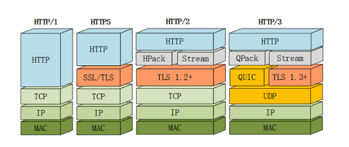
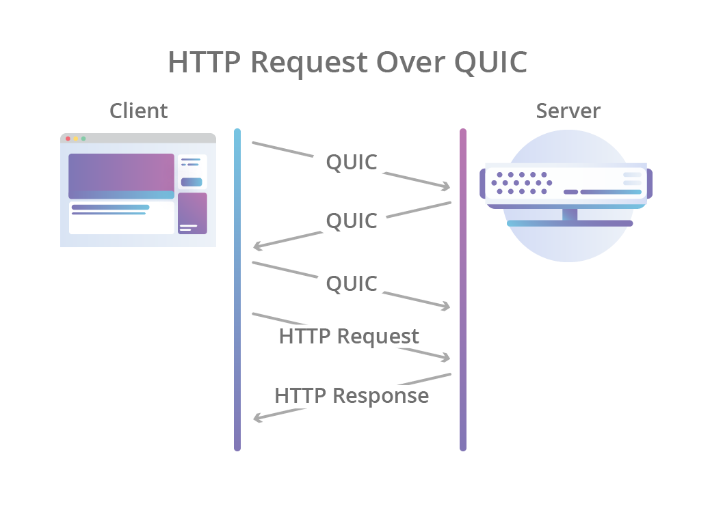
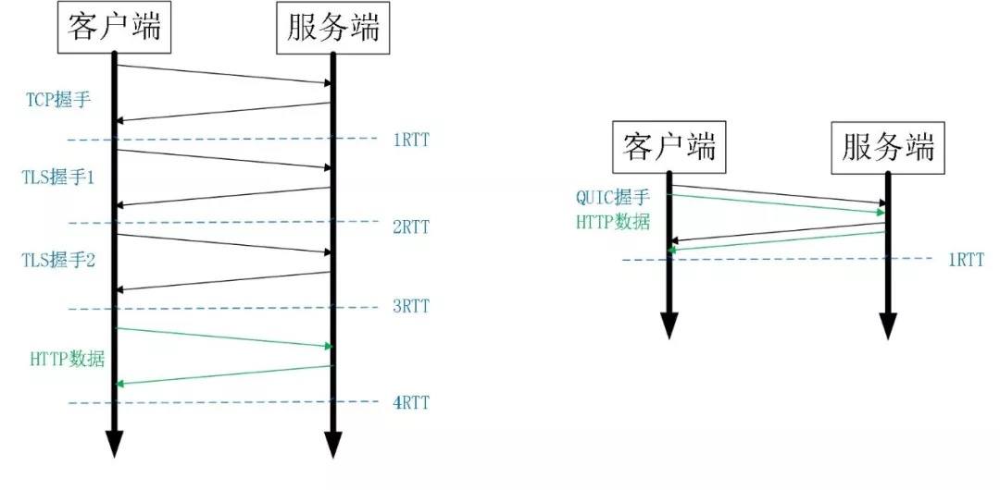
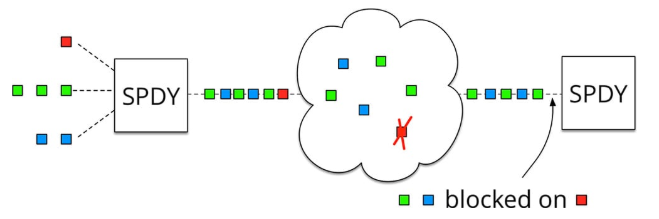
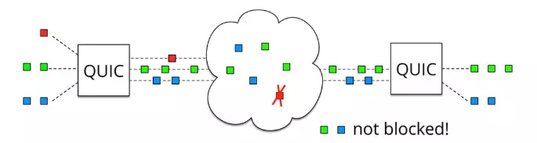

## 维基百科上对 HTTP3 的描述

在 HTTP/3 中，将弃用 TCP 协议，改为使用基于 UDP 协议的 QUIC 协议实现。QUIC（Quick UDP Internet Connection快速 UDP 网络连接）是一种实验性的传输层网络传输协议，由 Google 开发，该协议旨在取代 TCP 协议，使网页传输更快。

在 2018 年 10 月 28 日的邮件列表讨论中，互联网工程任务组（IETF） HTTP 和 QUIC 工作组主席 Mark Nottingham 提出了将 HTTP-over-QUIC 更名为 HTTP/3 的正式请求，以“明确地将其标识为 HTTP 语义的另一个绑定……使人们理解它与 QUIC 的不同”，并在最终确定并发布草案后，将 QUIC 工作组继承到 HTTP 工作组。在随后的几天讨论中，Mark Nottingham 的提议得到了 IETF 成员的接受，他们在 2018 年 11 月给出了官方批准，认可 HTTP-over-QUIC 成为 HTTP/3。

## 走进 HTTP3

它不使用 TCP 作为会话的传输层，而是使用 QUIC（一种新的 Internet 传输协议，Quick UDP Internet Connection,让传输更快），该协议将流作为传输层的一级公民引入。QUIC 流共享相同的 QUIC 连接，因此不需要额外的握手和慢启动来创建新的 QUIC 流，但 QUIC 流是独立交付的，因此在大多数情况下，包丢失只影响一个流而不影响其他流。这是可能的，因为 QUIC 数据包被封装在 UDP 数据报头的顶部。

与 TCP 相比，使用 UDP 可以提供更大的灵活性，并且可以使 QUIC 完全于用户空间中实现——对协议实现的更新不像 TCP 那样需要绑定到操作系统更新。使用 QUIC，可以简单地将 HTTP 级别的流映射到 QUIC 流的顶部，从而获得 HTTP/2 的所有好处，而不会产生前端阻塞。

QUIC 还结合了典型的 3 次 TCP 握手和 TLS 1.3 的握手。结合了这些步骤意味着 QUIC 在默认情况下提供了加密和身份验证，并且可以更快地建立连接。换句话说，即使 HTTP 会话中的初始请求需要一个新的 QUIC 连接，在数据开始流动之前产生的延迟也低于使用 TLS 的 TCP 时的情况。

## QUIC - 百度百科

- QUIC很好地解决了当今传输层和应用层面临的各种需求，包括处理更多的连接，安全性，和低延迟。
- QUIC融合了包括TCP，TLS，HTTP/2等协议的特性，但基于UDP传输。QUIC的一个主要目标就是减少连接延迟，当客户端第一次连接服务器时，QUIC只需要1RTT（Round-Trip Time）的延迟就可以建立可靠安全的连接,相对于TCP+TLS的1-3次RTT要更加快捷。
- 之后客户端可以在本地缓存加密的认证信息，在再次与服务器建立连接时可以实现0-RTT的连接建立延迟。
- QUIC同时复用了HTTP/2协议的多路复用功能（Multiplexing），但由于QUIC基于UDP所以避免了HTTP/2的线头阻塞（Head-of-Line Blocking）问题。
- 因为QUIC基于UDP，运行在用户域而不是系统内核，使得QUIC协议可以快速的更新和部署，从而很好地解决了TCP协议部署及更新的困难

## QPACK-头部压缩

虽然一些 HTTP/2 特性可以很容易地映射到 QUIC 上，但并不是所有特性都这样。特别是 HTTP/2 的请求头压缩方案 HPACK，它在很大程度上取决于将不同的 HTTP 请求和响应发送到端点的顺序。QUIC 在单个流中强制字节的传递顺序，但不保证不同流之间的顺序。

这种行为需要创建一个新的 HTTP 请求头压缩方案，称为 QPACK，它修复了这个问题，但是需要更改 HTTP 映射。此外，QUIC 本身已经提供了 HTTP/2 提供的某些功能（例如每流流控制），因此我们从 HTTP/3 中删除了这些功能，以消除协议中不必要的复杂性。

## QUIC 新功能

### 实现了类似 TCP 的流量控制、传输可靠性的功能。

虽然 UDP 不提供可靠性的传输，但 QUIC 在 UDP 的基础之上增加了一层来保证数据可靠性传输。它提供了数据包重传、拥塞控制以及其他一些 TCP 中存在的特性。

### 实现了快速握手功能。
>RTT(Round-Trip Time往返时延)=传播时延（往返哒）+排队时延（路由器和交换机的）+数据处理时延（应用程序的）。https://halfrost.com/https_tls1-3_handshake/

由于 QUIC 是基于 UDP 的，所以 QUIC 可以实现使用 0-RTT 或者 1-RTT 来建立连接，这意味着 QUIC 可以用最快的速度来发送和接收数据

通过使用类似 TCP 快速打开的技术，缓存当前会话的上下文，在下次恢复会话的时候，只需要将之前的缓存传递给服务端验证通过就可以进行传输了。0RTT 建连可以说是 QUIC 相比 HTTP2 最大的性能优势。
- 传输层 0RTT 就能建立连接。
- 加密层 0RTT 就能建立加密连接。

比如上图左边是 HTTPS 的一次完全握手的建连过程，需要 3.5(TCP:1.5 RTT + TLS:2RTT) 个 RTT。就算是 Session Resumption[14]，也需要至少 2 个 RTT。

而 QUIC 呢？由于建立在 UDP 的基础上，同时又实现了 0RTT 的安全握手，所以在大部分情况下，只需要 0 个 RTT 就能实现数据发送

### 集成了 TLS 加密功能。

目前 QUIC 使用的是 TLS1.3，相较于早期版本 TLS1.3 有更多的优点，其中最重要的一点是减少了握手所花费的 RTT 个数。

### 彻底解决 TCP 中队头阻塞的问题

和 TCP 不同，QUIC 实现了在同一物理连接上可以有多个独立的逻辑数据流（如下图）。实现了数据流的单独传输，就解决了 TCP 中队头阻塞的问题。

HTTP2一个管道上如果其中一个请求丢包整个 TCP 都要开始等待重传,会阻塞其他请求

HTTP3多个独立的逻辑数据流：

## HTTP/3 问题与挑战

### UDP 连通性问题
几乎所有的电信运营商都会“歧视” UDP 数据包，原因也很容易理解，毕竟历史上几次臭名昭著的 DDoS 攻击都是基于 UDP 的。国内某城宽带在某些区域更是直接禁止了非53端口的UDP数据包，而其他运营商及IDC即使没有封禁UDP，也是对UDP进行严格限流的。这点上不太乐观，但是我们相信随着标准的普及和推广落地，运营商会逐步改变对UDP流量的歧视策略。国外的情况会稍好一些，根据Google的数据，他们部署的QUIC降级的比例不到10%。

### QUIC 不支持明文传输
对于用户来说，这是一个优势，并不是问题。对于国内内容审查环境来说是个不可忽视的坎。但QUIC以后毕竟也是基于TLS协议的，国内HTTPS都能普及下来，QUIC的普及也许会更乐观一些。

### UDP 消耗资源多
当前阶段，UDP消耗的CPU资源多，且处理速度慢。这是不争的事实，但是我相信随着UDP应用的增多，内核和硬件的优化一定会跟上，直至达到或超过TCP的性能。而 QUIC 因为实在应用层实现，因此迭代速度更快，部署和更新难度和代价更小，能够一定程度缓解如TCP那样的协议僵化问题。

## 参考

- https://blog.fundebug.com/2019/03/07/understand-http2-and-http3/
- https://blog.cloudflare.com/zh/http3-the-past-present-and-future-zh/
- https://http3-explained.haxx.se/zh
- https://www.infoq.cn/article/IgME_4ebP3d46m3tHbaT
- https://juejin.im/post/5d9abde7e51d4578110dc77f#heading-16

## 实战

- [让互联网更快的协议，QUIC在腾讯的实践及性能优化](https://zhuanlan.zhihu.com/p/32560981)
