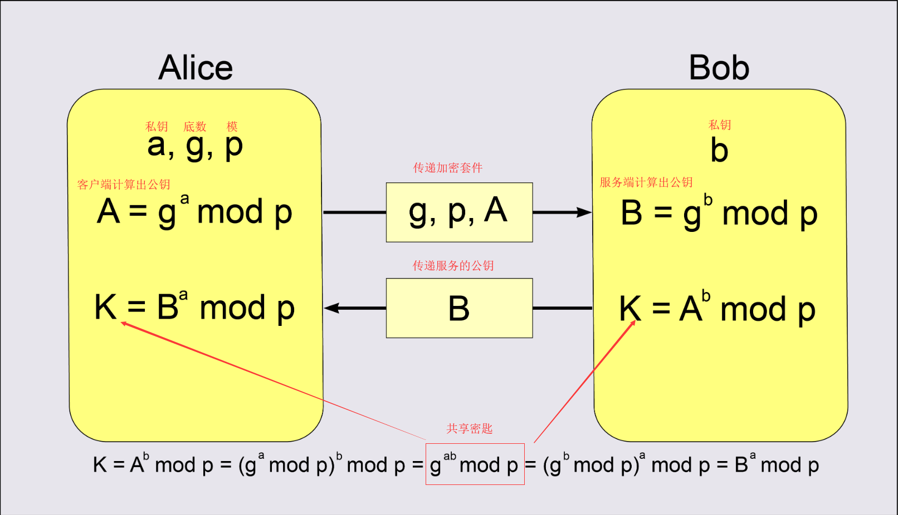
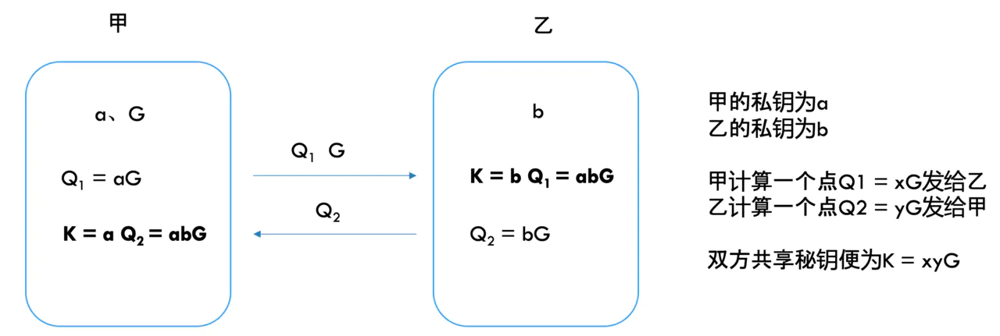
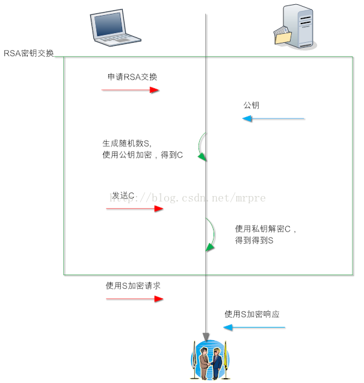
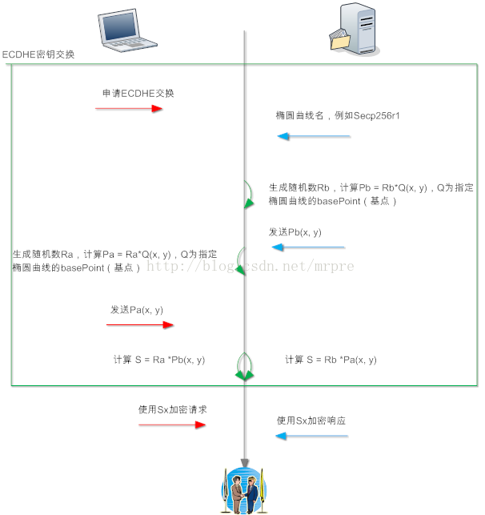
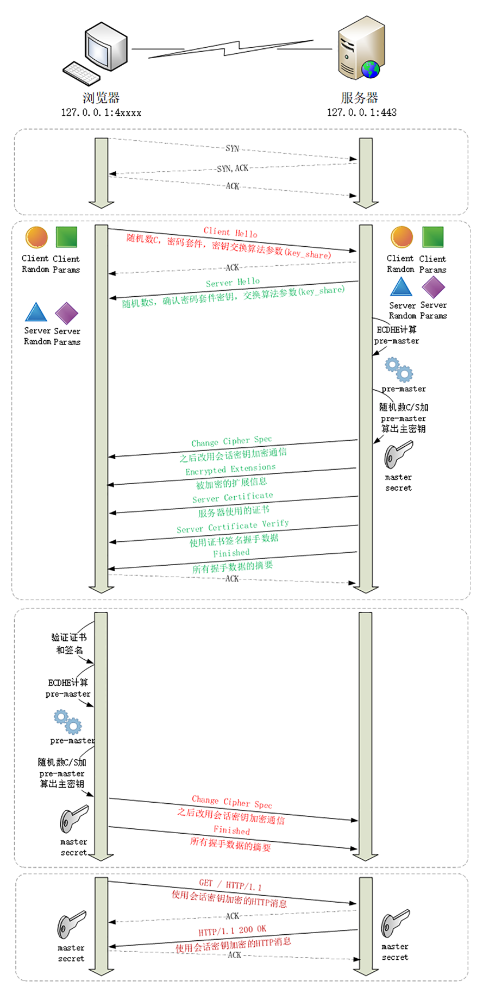

## ECDHE算法

ECDHE 就是“椭圆曲线-迪菲-赫尔曼-短暂”算法（Elliptic Curve Diffie–Hellman-Ephemeral），它是对迪非-赫尔曼密钥交换算法的改进。

“迪菲 - 赫尔曼”，也就是 DH 算法。DH 算法是一种非对称加密算法，只能用于密钥交换，它的数学基础是“离散对数”（Discrete logarithm）。

## Diffie-Hellman 密钥交换

Diffie-Hellman 迪菲-赫尔曼 密钥交换(Diffie-Hellman key exchange) 是 1976 年由 Whitfield Diffie 和 Martin Hellman 共同发明的一种算法。使用这种算法，通信双方仅通过交换一些可以公开的信息就能生成出共享的对称密码的密钥。

虽然这种算法叫“密钥交换”，但是实际上并没有真正的交换密钥，而是通过计算生成出了一个相同的共享密钥。准确的来说，应该叫 Diffie-Hellman 密钥协商(Diffie-Hellman key agreement)

## 离散对数

例如，如果以 10 作为底数，那么指数运算是 y=10^x，对数运算是 y=logx，100 的对数是 2（10^2=100，log100=2），2 的对数是 0.301（log2≈0.301）。
对数运算的域是实数，取值是连续的，而“离散对数”顾名思义，取值是不连续的，数值都是整数，但运算具有与实数对数相似的性质

离散对数里的一个核心操作是模运算，也就是取余数（mod，在 C、Java、Lua 等语言里的操作符是“%”）。

就是在离散整数域上的一次指数运算：
```tsx
5 ^ 3 % 17 = 6 // 模数 17，底数 5,取余=6
6 的离散对数就是 3（Ind(5, 6) = 3 ( mod 17)）
```

这里的（17，5）是离散对数的公共参数，6 是真数，3 是对数。知道了对数，就可以用幂运算很容易地得到真数，但反过来，知道真数却很难推断出对数，于是就形成了一个“单向函数”。

这个例子里，选择的模数 17 很小，使用穷举法从 1 到 17 暴力破解也能够计算得到 6 的离散对数是 3。

但如果我们选择的是一个非常非常大的数，比如说是有 1024 位的超大素数，那么暴力破解的成本就非常高了，几乎没有什么有效的方法能够快速计算出离散对数，这就是 DH 算法的数学基础。

## DH算法详解

**共享密钥K也就是Pre-Master**



Alice 和 Bob 公开了 4 个信息：P、G、A、B，其中 P、G 是算法的参数，A 和 B 是公钥，而 a、b 是各自秘密保管的私钥，无法获取，所以黑客只能从已知的 P、G、A、B 下手计算离散对数，但计算量很大一般破解不了。

**核心原理就是客户端把私钥去做指数运算，计算出一个很大的值（公钥），传递给服务端，服务端并不需要知道客户端的私钥，只是用自己的私钥再计算出一个公钥传递给服务端。然后双方用对分的公钥作为底求私钥次方，这样双方计算的共享会话密钥是相等的**

## DHE 算法

DH 算法有两种实现形式，一种是已经被废弃的 DH 算法，也叫 static DH 算法，另一种是现在常用的 DHE 算法（有时候也叫 EDH）。

static DH 算法里有一方的私钥是静态的，通常是服务器方固定，即 a 不变。而另一方（也就是客户端）随机选择私钥，即 b 采用随机数。


于是 DH 交换密钥时就只有客户端的公钥会变，而服务器公钥不变，在长期通信时就增加了被破解的风险，使得拥有海量计算资源的攻击者获得了足够的时间，最终能够暴力破解出服务器私钥，然后计算得到所有的共享秘密 Pre-Master，不具有“前向安全”。

而 DHE 算法的关键在于“E”表示的临时性上（ephemeral），每次交换密钥时双方的私钥都是随机选择、临时生成的，用完就扔掉，下次通信不会再使用，相当于“一次一密”。

所以，即使攻击者破解了某一次的私钥，其他通信过程的私钥仍然是安全的，不会被解密，实现了“前向安全”。

## ECC密钥交换


就是把 DHE 算法里整数域的离散对数，替换成了椭圆曲线上的离散对数。之前交换的是两个幂次方的数，现在变成交换两个曲线上的点。原来 DHE 算法里的是任意整数，而 ECDHE 则是把连续的椭圆曲线给“离散化”成整数，用椭圆曲线上的“倍运算”替换了 DHE 里的幂运算。倍运算：也就是下面的sG（s倍的G）

而曲线方程是规定好的，例如Curve X25519使用的曲线方程为：y^2 = x^3 + 486662x^2 + x，在密钥交换里面会指定所使用的曲线方程。

EC的难点在于给定起点G和点K：K = sG （起点G(x, y)。

这个s便是私钥，而K = sG便是公钥（我传输时用K，想要得到s（s足够大）是一件很困难的事情

而ECC的破解难点在于找到指定点的系数。

各自随机选择两个数字 a 和 b 作为私钥，计算 A=aG、B=bG 作为公钥，然后互相交换，用与 DHE 相同的算法，计算得到 aB=abG=Ab，就是共享秘密 Pre-Master。



因为椭圆曲线离散对数的计算难度比普通的离散对数更大，所以 ECDHE 的安全性比 DHE 还要高，更能够抵御黑客的攻击。


## 对比RSA

因为椭圆曲线离散对数的计算难度比普通的离散对数更大，所以 ECDHE 的安全性比 DHE 还要高，更能够抵御黑客的攻击。

RSA算法：国际标准算法，应用较早，最为普及，比ECC算法的适用范围更广，兼容性更好，一般采用 2048 位的加密长度，但是对服务端性能消耗高。

ECC算法：中文名称为椭圆加密算法，新一代算法趋势主流，一般采用 256 位加密长度，加密速度快，效率更高，对服务器资源消耗低，而且最重要的是更安全，抗攻击型更强。

ECC 和 RSA 相比，在许多方面都有对绝对的优势，主要体现在以下方面：

- 抗攻击性强
- CPU 占用少
- 内容使用少
- 网络消耗低
- 加密速度快
  
ECC的安全性要高于RSA；换而言之，同样的安全性，由于ECC密钥只需要更短的密钥（一般认为160位密钥的ecc安全性相当于1024位密钥的rsa），ECC的计算量要少于RSA。

## TLS-RSA交换密钥

RSA有一个问题，就是如果私钥泄漏，即私钥被第三方知道，那么第三方就能从C中解密得到S，即只要保存所有的A和B的报文，等到私钥被泄漏的那一天，或者有办法快从C中计算S的方法出现（量子计算机分解大素数），那么A和B就没有什么私密性可言了。

这就是所谓的前向不安全，私钥参与了密钥交换，安全性取决于私钥是否安全保存。



## TLS-ECDHE交换密钥




 SSL协议中，上图中椭圆曲线名和Pb通过server key exchange报文发送；Pa通过client key exchange报文发送。

## 完整的TLS1.2-ECDHE握手流程


### Client Hello
在 TCP 建立连接之后，浏览器会首先发一个“Client Hello”消息，也就是跟服务器“打招呼”。里面有客户端的版本号、支持的密码套件，还有一个随机数（Client Random），用于后续生成会话密钥。

### Server Hello

服务器收到“Client Hello”后，会返回一个“Server Hello”消息。把版本号对一下，也给出一个随机数（Server Random），然后从客户端的列表里选一个作为本次通信使用的密码套件

### Server Key Exchange

因为服务器选择了 ECDHE 算法，所以它会在证书后发送“Server Key Exchange”消息，里面是椭圆曲线的公钥（Server Params），用来实现密钥交换算法，再加上自己的私钥签名认证。

### Server Hello Done

服务器说：“我的信息就是这些，打招呼完毕。”

这样第一个消息往返就结束了（两个 TCP 包），结果是客户端和服务器通过明文共享了三个信息：Client Random、Server Random 和 Server Params。

### 验证双方身份-验证证书RSA算法

客户端这时也拿到了服务器的证书，那这个证书是不是真实有效的呢？

密钥交换过程中应该会使用到非对称加密中的公钥加密），RSA进行身份验证（私钥加密公钥解密），再用证书公钥验证签名，就确认了服务器的身份。


### Client Key Exchange

客户端按照密码套件的要求，也生成一个椭圆曲线的公钥（Client Params），用“Client Key Exchange”消息发给服务器。

### 计算Pre-Master随机数-共享密钥

就用 ECDHE 算法一阵算，算出了一个新的东西，叫“Pre-Master”，其实也是一个随机数。

现在客户端和服务器手里有了三个随机数：

- Client Random
- Server Random
- Pre-Master

### Master Secret 主密钥

用上面的三个随机数作为原始材料，就可以生成用于加密会话的主密钥，叫“Master Secret”。而黑客因为拿不到“Pre-Master”，所以也就得不到主密钥。

为什么非得这么麻烦，非要三个随机数呢？
这就必须说 TLS 的设计者考虑得非常周到了，他们不信任客户端或服务器伪随机数的可靠性，为了保证真正的“完全随机”“不可预测”，把三个不可靠的随机数混合起来，那么“随机”的程度就非常高了，足够让黑客难以猜测。

## 完整的TLS1.3-ECDHE握手流程

可以看到最大的差别就是Client Parans 椭圆曲线倍数公钥提前计算好了，在第一次请求的时候就直接发过去了



## 总结

ECDHE（DHE）算法属于DH类密钥交换算法， 私钥不参与密钥的协商，故即使私钥泄漏，户端和服务器之间加密的报文都无法被解密，因为客户端服务端的私钥（s倍数）都是随机生成的，所以计算出的用于密钥协商的椭圆曲线的密钥（公钥）是临时生成的，每次握手都不固定，这叫前向安全（forward secrity）。由ECDHE每条会话都重新计算一个密钥（Ra、Rb），故一条会话被解密后，其他会话仍安全。

然而，ECDH和RSA算法服务器端的私钥是固定的，即证书的私钥，故ECDH和RSA不被认为前安全，因为私钥泄漏导致会话密钥可被第三方计算。ECDH交换法已经被OpenSSL废.