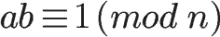
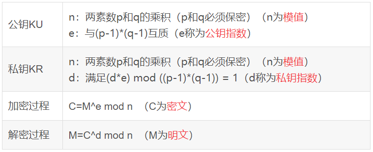

## 非对称加密--RSA


RSA加密算法是最常用的非对称加密算法，由罗纳德·李维斯特（Ron Rivest）、阿迪·萨莫尔（Adi Shamir）和伦纳德·阿德曼（Leonard Adleman）于1977年一起提出，RSA就是他们三人姓氏开头字母拼在一起组成的。非对称加密算法的特点就是加密秘钥和解密秘钥不同，秘钥分为公钥和私钥，用私钥加密的明文，只能用公钥解密；用公钥加密的明文，只能用私钥解密。

## 数论知识

### 素数

又称质数，指在一个大于1的自然数中，除了1和此整数自身外，不能被其他自然数整除的数。

### 互质

又称互素。若N个整数的最大公因子是1，则称这N个整数互质。

### 模运算

即求余运算。“模”是“Mod”的音译。和模运算紧密相关的一个概念是“同余”。数学上，当两个整数除以同一个正整数，若得相同余数，则二整数同余。

### 模反元素  

如果两个正整数a和n互质，那么一定可以找到整数b，使得 ab-1 被n整除，或者说ab被n除的余数是1。这时，b就叫做a的“模反元素”。



三等号是余数的意思，（a*b）%n = 1

### 欧拉函数

计算小于或等于n的正整数中与n互质的数的数目，以φ(n)表示。
```
// 如果n可以分解成两个互质的整数之积，即 n = p * k ，则φ(n) = φ(p * k) = φ(p1)*φ(p2)
r = φ(N) = φ(p)φ(q) = (p-1)(q-1)。// φ(8) = 4，因为1,3,5,7均和8互质。
```
### 欧拉定理   
>欧拉定理就可以用来证明模反元素必然存在。 

如果两个正整数a和n互质，则n的欧拉函数 φ(n) 可以让下面的等式成立：

a^φ(n) = 1(mod n)

由此可得：a的φ(n - 1)次方肯定是a关于n的模反元素。


由模反元素的定义和欧拉定理我们知道，a的φ(n)次方减去1，可以被n整除。比如，3和5互质，而5的欧拉函数φ(5)等于4，所以3的4次方*(81)减去1，可以被5*整除（80/5=16）。

### 费马小定理  

假设正整数a与质数p互质，因为质数p的φ(p)等于p-1，则欧拉定理可以写成

a^(p-1) = 1 (mod p)

这其实是欧拉定理的一个特例。


## 密钥的生成过程
### 生成过程
1. 随意选择两个大的素数p和q，p不等于q，计算n = pq.
2. 根据欧拉函数的性质，求得r=φ(n)=φ(p)φ(q)=(p-1)(q-1).
3. 选择一个小于r的整数e,且e与r互素；并求得e关于r的模反元素，命名为d.(模反元素存在，当且仅当e与r互质; 求d令ed≡1(mod r)）
4. 将p和q的记录销毁,其中(n，e)是公钥，(n，d)是私钥. 
### 实例：
5. A随机选两个不相等的质数61和53，并计算两数的积n=61*53=3233，n的长度就是密钥长度。3233的二进制是110010100001，一共12位， 
   所以这个密钥就是12位. 实际应用中，RSA密钥一般是1024位，重要的场合是2048位.
2. 计算n的欧拉函数; φ(n)=(p-1)(q-1)=60*52=3120.
3. A在1到3120上随机选择了一个随机数e=17，与3120互素.
4. 计算e对φ(n)的模反元素d，即时，ed-1=kφ(n)。
即使求解：17d+3120k=1.用扩展欧几里得算法求解。可以算出一组解(d,k)=(2753,-15)，即d=2753. 公钥(3233, 17)，私钥(3233,2753)
5. 至此完成计算.

### 加密解密
> 私钥解密这个是可以证明的，这里不展开了。

加密过程：(m^e) mod n=c，其中m为原信息，c为加密信息，n、e为公开密钥。
解密过程：(c^d) mod n=m，其中d为解密密钥。
其中(n，e)是公钥，(n，d)是私钥.上面已经计算得出。

### 总结过程



##  RSA的可靠性

在RSA私钥和公钥生成的过程中，共出现过p,q,n,φ(N),e,d：

- p,q：我们随机挑选的两个大质数；
- N：是由两个大质数p和q相乘得到的。N = p * q；
- r：由欧拉函数得到的N的值，r = φ(N) = φ(p)φ(q) = (p-1)(q-1)。
- e：随机选择和和r互质的数字，实际中通常选择65537；
- d： d是以欧拉定理为基础求得的e关于r的模反元素，ed = 1 (mod r)；

其中n,e组成公钥，其他的都不是公开的，一旦d泄露，就等于私钥泄露;
那么能不能根据n,e推导出d呢？
- 1. ed ≡ 1(mod φ(n)) 只有知道e和φ(n)，才能算出d 
- 2. φ(n)=(p-1)(q-1) 只有知道p和q,才能算出φ(n）
- 3. n=pq,只有将n分解才能算出p和q
  
所以，只有将n素因数分解，才能算出d; 也就意味着私钥破译. 但是，大整数的质因数分解是非常困难的. 所以理论上来说，如果我们找到

了快速对大整数进行质因数分解的方法，那么RSA加密也就没什么安全性可言了；遗憾的是，目前数学上并没有找到这样快速的质因数分解方法.

## RSA算法基于一个十分简单的数论事实

将两个大质数相乘十分容易，但是想要对其乘积进行因式分解却极其困难，因此可以将乘积公开作为加密密钥。

## 参考文章

- https://blog.csdn.net/u013073067/article/details/86674474