## HTTPS

超文本传输安全协议（英语：Hypertext Transfer Protocol Secure，缩写：HTTPS，常称为 HTTP over TLS，HTTP over SSL 或 HTTP Secure）是一种通过计算机网络进行安全通信的传输协议。HTTPS 经由 HTTP 进行通信，但利用 SSL/TLS 来加密数据包。HTTPS 开发的主要目的，是提供对网站服务器的身份认证，保护交换数据的隐私与完整性。

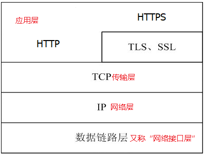

## SSL 和 TLS 的关系

SSL 是指安全套接字层，简而言之，它是一项标准技术，可确保互联网连接安全，保护两个系统之间发送的任何敏感数据，防止网络犯罪分子读取和修改任何传输信息，包括个人资料。两个系统可能是指服务器和客户端（例如，浏览器和购物网站），或两个服务器之间（例如，含个人身份信息或工资单信息的应用程序）。

TLS传输层安全性协议（英语：Transport Layer Security，缩写作 TLS），是更为安全的升级版 SSL，目的是为互联网通信，提供安全及数据完整性保障。

## TLS/SSL 协议
>**基于TLS1.2分析，后面对比与TLS1.3的区别**

安全传输层协议（TLS）用于在两个通信应用程序之间提供保密性和数据完整性。

该协议由两层组成： 
- TLS 记录协议（TLS Record）和 TLS 握手协议（TLS Handshake）。
- 较低的层为 TLS 记录协议，位于某个可靠的传输协议（例如 TCP）上面。

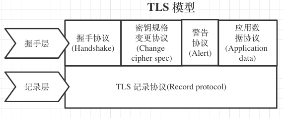

参考：https://blog.csdn.net/enweitech/article/details/81781405

### TLS 记录协议
记录协议负责在传输连接上交换的所有底层消息，并且可以配置加密。每一条 TLS 记录以一个短标头开始。标头包含记录内容的类型 (或子协议)、协议版本和长度。原始消息经过分段 (或者合并)、压缩、添加认证码、加密转为 TLS 记录的数据部分。

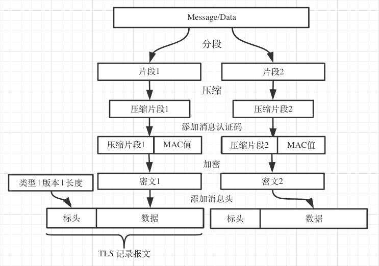

参考：https://blog.csdn.net/enweitech/article/details/81781405

### TLS 握手协议
- 保密(message privacy)，保密通过加密encryption实现，所有信息都加密传输，第三方无法嗅探；
- 完整性(message integrity)，通过MAC校验机制，一旦被篡改，通信双方会立刻发现；
- 认证(mutual authentication)，双方认证,双方都可以配备证书，防止身份被冒充；

TLS/SSL 的功能实现主要依赖于三类基本算法：散列函数 Hash、对称加密和非对称加密，其利用非对称加密实现身份认证和密钥协商，对称加密算法采用协商的密钥对数据加密，基于散列函数验证信息的完整性。
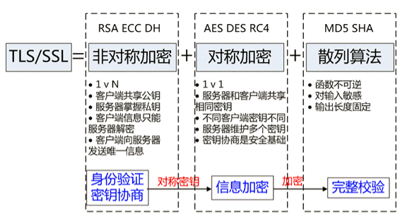

## 加密算法

### RSA算法

RSA算法是基于大数难于分解的原理。不但可以用于认证，也可以用于密钥传输。那么用户A和B如何利用RSA算法来传输密钥呢？
- 1：A产生一个密钥K，用B的公钥加密K，然后将得到的密文发送给B。
- 2：B用自己的私钥解密收到的密钥，就可以得到密钥。

#### [详细分析HTTPS-RSA加密算法](./HTTPS-RSA加密算法.md)

### DH算法

DH算法的出现就是用来进行密钥传输的。DH算法是基于离散对数实现的。用户A和B如何利用RSA算法来传输密钥？
在通信前，用户A和B双方约定2个大整数n和g,其中1，这两个整数可以公开

- 1.A随机产生一个大整数a，然后计算Ka=ga mod n。（a需要保密）
- 2.B随机产生一个大整数b，然后计算Kb=gb mod n。（b需要保密）
- 3.A把Ka发送给B,B把Kb发送给A
- 4.A计算K=Kba mod n
- 5.B计算K=Kab mod n
由于Kba mod n= （gb mod n）a mod n= （ga mod n）b mod n，因此可以保证双方得到的K是相同的，K即是共享的密钥。

#### [详细分析HTTPS-ECDHE加密算法](./HTTPS-ECDHE加密算法.md)

## SSL 证书

SSL 证书就是遵守 SSL 协议，由受信任的数字证书颁发机构 CA，在验证服务器身份后颁发，具有服务器身份验证和数据传输加密功能。

CA（数字证书认证，Certificate Authority）机构，是承担公钥合法性检验的第三方权威机构，负责指定政策、步骤来验证用户的身份，并对 SSL 证书进行签名，确保证书持有者的身份和公钥的所有权。

CA 机构为每个使用公开密钥的用户发放一个 SSL 证书，SSL 证书的作用是证明证书中列出的个人/企业合法拥有证书中列出的公开密钥。

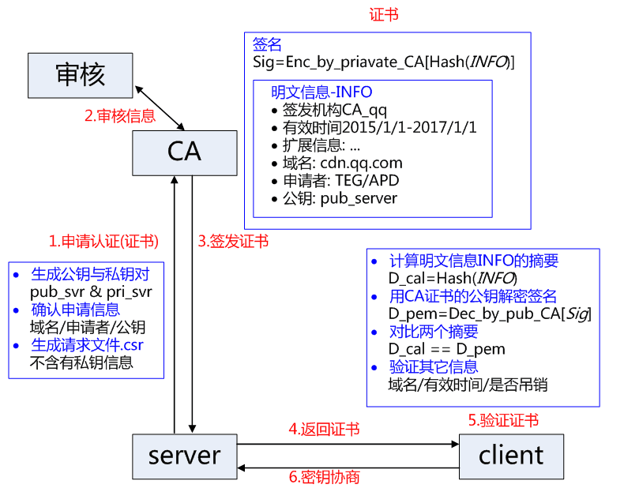

## 对称加密和非对称加密

> 非对称加密算法有很多，用的最多的是 RSA 算法，公钥为(n,e) 私钥为(n,d)，https://juejin.im/post/5a76d7e3f265da4e752770a3

- 对称加密：对称加密指的就是加密和解密使用相同秘钥，叫对称加密。对称加密只有一个秘钥。
- 非对称加密: 加密和解密使用不同的秘钥，一把作为公开的公钥，另一把作为私钥。公钥加密的信息，只有私钥才能解密。如果用私有密钥对数据进行加密，只有用对应的公开密钥才能解密。

- https 在证书验证阶段，使用非对称加密来传输共享秘钥，之后的传输中都使用对称加密方式。原因是，非对称加密的加解密效率是非常低的，而 http 场景中通常端与端之间的交互量很大，对非对称加密的效率是无法忍受的。另外， HTTPS 场景中只有服务端保存了私钥，一对公私钥只能实现单向加解密过程。因此 HTTPS 中的内容传输采用对称加密。

## TLS/SLL先看整体过程
> https://juejin.im/post/5b305758e51d4558ce5ea0d9#heading-2

- session key: 这是 TLS/SSL 最后协商的结果，用来进行对称加密。
- client random: 是一个 32B 的序列值，每次连接来时，都会动态生成，即，每次连接生成的值都不会一样。因为，他包含了 4B 的时间戳和 28B 的随机数。
- server random: 和 client random 一样，只是是由 server 端生成。
- premaster secret: 这是 48B 的 blob 数据。它能和 client & server random 通过 pseudorandom (PRF) 一起生成 session key。
- cipher suite: 用来定义 TLS 连接用到的算法。通常有 4 部分：

  - 非对称加密 (ECDH 或 RSA)
  - 证书验证 (证书的类型)
  - 保密性 (对称加密算法)
  - 数据完整性 (产生 hash 的函数)比如 AES128-SHA 代表着：
    - RSA 算法进行非对称加密
    - RSA 进行证书验证
    - 128bit AES 对称加密
    - 160bit SHA 数据加密算法
  - 比如 ECDHE-ECDSA-AES256-GCM-SHA384 代表着

    - ECDHE  算法进行非对称加密
    - ECDSA 进行证书验证
    - 265bit AES 对称加密
    - 384bit SHA 数据加密算法

## 对称加密秘的问题

每个客户端应用不同的对称加密秘钥，那么这个秘钥客户端或者服务端是如何知道的呢，只能是在一端生成一个秘钥，然后通过 HTTP 传输给另一端。

那么这个传输秘钥的过程，又如何保证加密？如果被中间人拦截，秘钥也会被获取。你会说，对秘钥再进行加密，那又如何保证对秘钥加密的过程，是加密的呢，这时一个 while(1)循环

## 验证身份采用-非对称加密

私钥只保存在服务器端，公钥可以发送给所有的客户端。

在传输公钥的过程中，肯定也会有被中间人获取的风险，但在目前的情况下，至少可以保证客户端通过公钥加密的内容，中间人是无法破解的，因为私钥只保存在服务器端，只有私钥可以破解公钥加密的内容。

### 非对称加密问题1-公钥被掉包怎么办

公钥被掉包的问题出现，是因为我们的客户端无法分辨返回公钥的人到底是中间人，还是真的服务器。这其实就是密码学中提到的身份验证问题。

既然服务器需要将公钥传给客户端，这个过程本身是不安全的，那么我们为什么不对这个过程本身再加密一次？可是，你是使用对称加密，还是非对称加密？看又进入我们的标题了，感觉又近了鸡生蛋蛋生鸡问题了。又是循环。

所以，我们**不能直接将服务器的公钥传递给客户端，而是第三方机构使用它的私钥对我们的公钥进行加密后，形成一个数字证书，再传给客户端**。客户端再使用第三方机构的公钥进行解密。

现在加密和解密证书用的钥匙都第三方的，如果一方加密另一方能解密的话，那肯定是CA机构确保的双方身份是真实的。因为如果中间人使用自己的私钥加密后的东西东西传给客户端，客户端时无法使用第三方的公钥进行解密的。

### 非对称加密问题2-证书直接被掉包怎么办

第三方机构不可能只给你一家公司制作证书，它也可能会给中间人这样有坏心思的公司发放证书（中间人只需要用自己的公钥向CA机构申请证书,有通过的可能，那么就能获得一个CA的证书）。

这样，中间人就有机会对你的证书进行掉包，客户端在这种情况下无法分辨出接受的是你的证书，还是中间人的。因为不论中间人，还是你的证书，都能使用第三方机构的公钥进行解密。

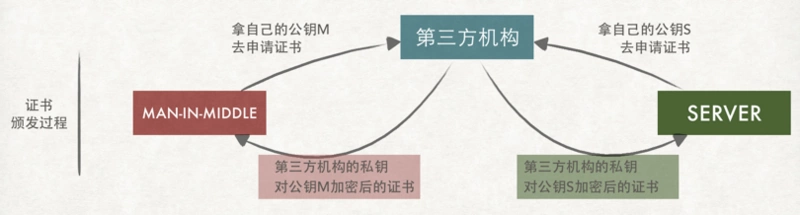

**注意一个细节：客户端能解密同一家第三方机构颁发的所有证书**
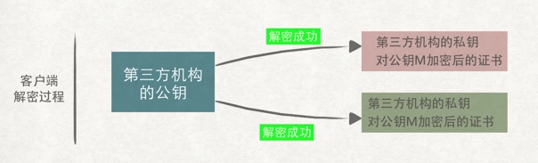

所以，中间人把自己用公钥申请的证书，在将我们的证书掉包，那么它的私钥就可以解密我们的信息，并且窜改，这里有一点绕，可以看下图

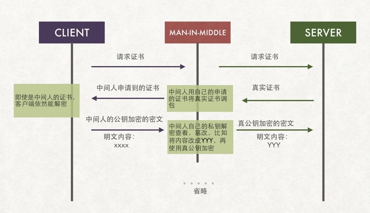

## 解决中间人攻击问题-第三方认证+数字签名

上述的难点在于如果我们在传输过程中，始终无法解决信息被中间人调包的问题。

### 证书+数字签名 = 身份验证＋防篡改：

- 使用权威的第三方机构也就是 CA 向安全的服务器颁发证书。来证明这台服务器的合法性。
- 证书是被第三方的私钥加密的，证书里有服务器端的公钥，服务器通过这个证书来把自己的公钥安全的发给客户端
- 客户端收到这个加密后的公钥以后 ，就用第三方机构的公钥 把这个服务器返回的加密后的公钥 解密 从而得到真正的服务器的公钥
- 中间会使用 MD5 算法生成数字签名，验证信息是否被篡改（后面说明

### 问题 1：客户端到哪去取第三方公钥?

- 你的操作系统或者浏览器自身就带有权威机构的第三方公钥
- 验证签发者合法性的使用的是其上一级签发者公钥，直到根证书，内置在系统中。为了节省验签消耗，一些大的 CA 机构证书也一并内置在系统中了。
- 也就是说操作系统或者浏览器维护了一个 CA 的认证列表

### 问题 2：客户端本地怎么验证证书的合法性呢（万一被窜改了呢

第三方机构不可能只给你一家公司制作证书，它也可能会给中间人这样有坏心思的公司发放证书。这样，中间人就有机会对你的证书进行掉包，客户端在这种情况下无法分辨出接受的是你的证书，还是中间人的。

辨别同一机构下不同证书的这个职责，只能放到客户端了。意思是，客户端在拿到证书后，自己就有能力分别证书是否被篡改了。

证书上写着如何根据证书的内容生成证书编号。客户端拿到证书后根据证书上的方法自己生成一个证书编号，如果生成的证书编号与证书上的证书编号相同，那么说明这个证书是真实的。

**注意证书的编号也叫做数字签名**

服务端用 CA 机构的私钥加密编号（签名）：

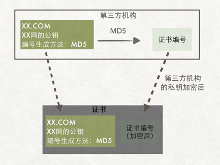

客户端内置有第三方的公钥来解密：

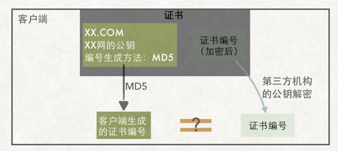

解密后取出编号，然后自身再根据 MD5 散列算法生成一个比对
一样的话那就是合格的，没有被窜改

### 具体过程

客户端在接受到服务端发来的 SSL 证书时，会对证书的真伪进行校验，以浏览器为例说明如下：

现在公钥不是重服务端直接传回来，而是通过第三方 CA 来的，就可以验证是不是真实服务器发出的内容：

- （1）首先浏览器读取证书中的证书所有者、有效期等信息进行一一校验

- （2）浏览器开始查找操作系统中已内置的受信任的证书发布机构 CA 列表，与服务器发来的证书中的颁发者 CA 比对，用于校验证书是否为合法机构颁发

- （3）如果找不到，浏览器就会报错，说明服务器发来的证书是不可信任的。

- （4）如果找到，那么浏览器就会从操作系统中取出 颁发者 CA 的公钥，然后对服务器发来的证书里面的签名进行解密

加上一个数字签名，是通过 MD5 生成了内容摘要，**如果修改了内容，服务端生成的内容摘要和客户端用同样的算法生成的结果一定不一样**：

- （5）浏览器使用相同的 hash 算法计算出服务器发来的证书的 hash 值，将这个计算的 hash 值与证书中签名做对比

- （6）对比结果一致，则证明服务器发来的证书合法，没有被冒充

最后才读取证书里传来的真正用于加密的公钥：

- （7）此时浏览器就可以读取证书中的公钥，用于后续加密了

所以通过发送 SSL 证书的形式，既解决了公钥获取问题，又解决了黑客冒充问题，一箭双雕，HTTPS 加密过程也就此形成。

**假如中间人拦截后把服务器的公钥替换为自己的公钥，因为数字签名的存在，会导致客户端验证签名不匹配，这样就防止了中间人替换公钥的问题。**

### https(TLS) 握手过程

- 客户端发起请求，服务端响应给用户端证书，证书中包含公钥,首先先用第三方公钥进行验证，是否是真实的服务器；
- 客户端接收到证书后并验证后，生成随机数，通过公钥加密，将随机数发送给服务端，并凭随机数构造对称加密和服务端通信，并告知服务端此次通信后的通信都将使用随机数秘钥（Pre-master secret）进行加密；(主要是验证服务端是否是真正的服务器，发送的签名信息用公钥加密；)
- 服务器端收到使用公钥加密的签名信息后，使用私钥解密签名信息，再加这个签名信息使用私钥加密，返回给客户端；同样告知客户端之后的请求将使用随机数进行加密。

验证完身份后，最后都是通过回话密钥来进行对称的加密，以在保证安全的条件下提升性能

注意一下这个是TLS1.2的版本需要两个RTT(往返时延)的，而TLS1.3里优化相关的操作，减少了RTT，只需要一个RTT。

## 总结一下为什么 HTTPS 安全

### 第三方的加密传输证书辨认双方是否真实

注意有两个不同的公钥，一个是传输加密解密的公钥由权威的第三方提供给双方，第三方作为桥梁为为两边提供一个公钥加密解密，一边能解密出来另一边的内容，那证明双方肯定是真实的

另一个公钥是第三方 CA 发给服务端的证书里包含的，服务器会把证书(内含被加密的公钥)传输给客户端，客户端收到这个加密后的公钥以后 ，就用之前浏览器内置的有效第三方公钥，来把这个服务器返回的加密后的公钥 解密 从而得到真正的服务器的公钥

### 防止信息被串改

客户端和服务端都会采用 MD5 生成内容摘要(客户端的 MD5 算法应该是在服务端传回的证书里)，在传输数据给服务端时，如果内容被串改，服务端根据内容生成摘要就和客户端的摘要就不匹配

此时的第三方恶意网站是无法得知 MD5 算法(得用第三方 CA 的公钥解密才知道)，也就是说它无法伪造我们的摘要信息

**注意：既然提了这么多次第三方 CA 机构了,肯定是非常重要的，如果这个机构把一个公钥发给了恶意网站，那传输也会被解密得到包含 MD5 等系列的东西，导致被伪造内容，那还是有危险，**

## https 并非绝对安全

### 客户端证书出错问题
黑客通过特殊途径在被攻击者的手机上安装根证书；
客户端发起连接请求，代理服务器（Fiddler）在中间截取请求，返回自己签名的伪造证书；
客户端收到证书后会在系统中查找信任的根证书，因为黑客已经事先在被攻击者手机上安装了自己的根证书，因此客户端验证通过；
客户端后续就会把Fiddler当成合法的服务器；
而Fiddler会与真实的服务器通信，截获密钥，解密数据。
至此，服务器和客户端的数据对于中间人Fiddler而言已经是完全透明的了。

### 伪造证书
HTTPS 证书最大的问题就是伪造证书的存在，一旦出现伪造证书，安全体系将会非常脆弱，出现伪造证书的原因如下：

- CA 机构有意无意会签发一些错误的证书，比如 CA 机构没有正确校验申请者的身份。
- CA 机构是一个追求盈利的机构，在利益的驱动下，可能会无节制的签发证书，如果签发一个恶意的二级 CA 证书，带来的危害更大。
- 攻击者会通过各种技术攻击手段，冒充或者伪造某个域名的拥有者，从而成功申请到一张证书，然后通过证书进行危害操作。

这时，证书的使用者可能会存在下面的困惑：

- 域名拥有者无法知晓那些 CA 机构给他签发了证书，也不知道是否有人冒充他的身份申请证书并提供服务。
- CA 机构并不清楚它到底签发了多少证书，也不确定是否签发了伪造证书，二级 CA 签发机制不可控。
- 对于浏览器来说，它没有技术手段校验证书是否是合法的。

#### 实例：CA证书发给中间人

比如A和B通信，B的公钥和数字证书被O截取。而O原先已将自己的公钥上传CA，并得到了CA签发的一张等效的数字证书。于是O将B的公钥和证书一起替换成O的公钥和O的证书，再发给A。

用户没有任何办法判断自己是不是正在遭受攻击，而且这样的攻击已经大规模发生过最少两次了。

### 应对伪造的措施 - 证书透明度

为了解决证书潜在的问题，谷歌提出了一个解决方案，这就是证书透明度（CT）。CT 是一组技术解决方案，它能够审计、监控证书的签发、使用，从而让更透明，它不是证书的替代解决方案，而是证书的有效补充。通过 CT，能够达成以下的几个目标：

- CA 机构能够知晓其签发了那些证书，并快速检测到是否签发恶意证书了。
- 网站拥有者能够知晓域名对应证书签发的全过程，一旦发现有攻击者伪造了域名对应的证书，可以快速联系 CA 机构，吊销该证书。
- 浏览器厂商能够审计证书的使用情况，如果发现有恶意证书，可以快速关闭HTTPS连接，保障用户的安全。

CT 日志服务所使用的技术和区块链技术非常类似，通过密码学手段（Merkle hash tree）保证了其数据只能增长，但修改、插入、删除都会被发现。由于审计单条数据的成本并不高，审计员可以是一个单独的服务，也可以是观察者的一项功能，甚至可以作为客户端的一部分。

## HTTP 对比 HTTPS

http 请求存在哪些不足：

- 通信使用明文（不加密），内容可能会被窃听
- 不会验证通信方的身份，因此可能会遭遇伪装
- 无法保证报文的完整性，请求或响应的内容被篡改也无法知道

https 就是对上面三点不足的解决：

- https == http + 加密 + 身份验证 + 数据完整性保护
- http 使用明文传输，https 则是具有安全性的 ssl 加密传输协议
- http 不会验证通信放的身份，https 会通过数字证书来验证身份
- https 可以保证数据的完整性，防止传输内容被中间人冒充或篡改
- 除以上外，http 和 https 使用的端口也不同，前者使用 80 端口，后者使用 443 端口

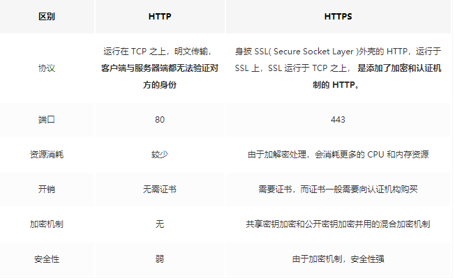

## 密匙交换的过程

### RSA 秘钥交换
1：client 发起请求（Client Hello）
2：server 回复 certificate
3：client使用证书中的公钥，加密预主秘钥，发给 server（Client Key Exchange）
4：server 提取出 预主秘钥，计算主秘钥，然后发送对称秘钥加密的finished。
5：client 计算主秘钥，验证 finished，验证成功后，就可以发送Application Data了。

### ECDHE秘钥交换
1：client 发送请求（Client Hello），extension携带支持的椭圆曲线类型。
2：server 回复 Server Hello和certificate等；server选择的椭圆曲线参数，然后 生成私钥（BIGNUM），乘以椭圆曲线的base point得到公钥（POINT），顺便签个名表示自己拥有证书，然后将报文发给client，报文就是Server Key Exchange，其包含了server选择的椭圆曲线参数、自己根据这个参数计算的公钥、自己用证书的私钥对当前报文的签名。
3：client 收到 Server Key Exchange，获得椭圆曲线参数，生成私钥（BIGNUM）后计算公钥（POINT），然后把公钥发出去Client Key Exchange。client使用自己的私钥（BIGNUM）和server的公钥（POINT）计算出主秘钥。
4：server 收到 client的公钥（POINT），使用自己的私钥（BIGNUM），计算主秘钥。两端主秘钥是一致。

### ECDHE的向前安全性

ECDHE在每次握手时都会生成临时的密钥对，即使私钥被破解，之前的历史消息并不会收到影响。这种一次破解并不影响历史信息的性质也叫前向安全性

## TLS1.2 对比 TLS1.3 (ECDHE)
>参考：https://juejin.im/post/6844904100035821575#heading-83

RSA的这一对公钥私钥并不是临时的,所以不具备向前安全性，一般现在都采用ECDHE算法来交换密钥，ECDHE私钥是临时随机生成的，具备向前安全性，更加安全。

### TLS1.2握手流程

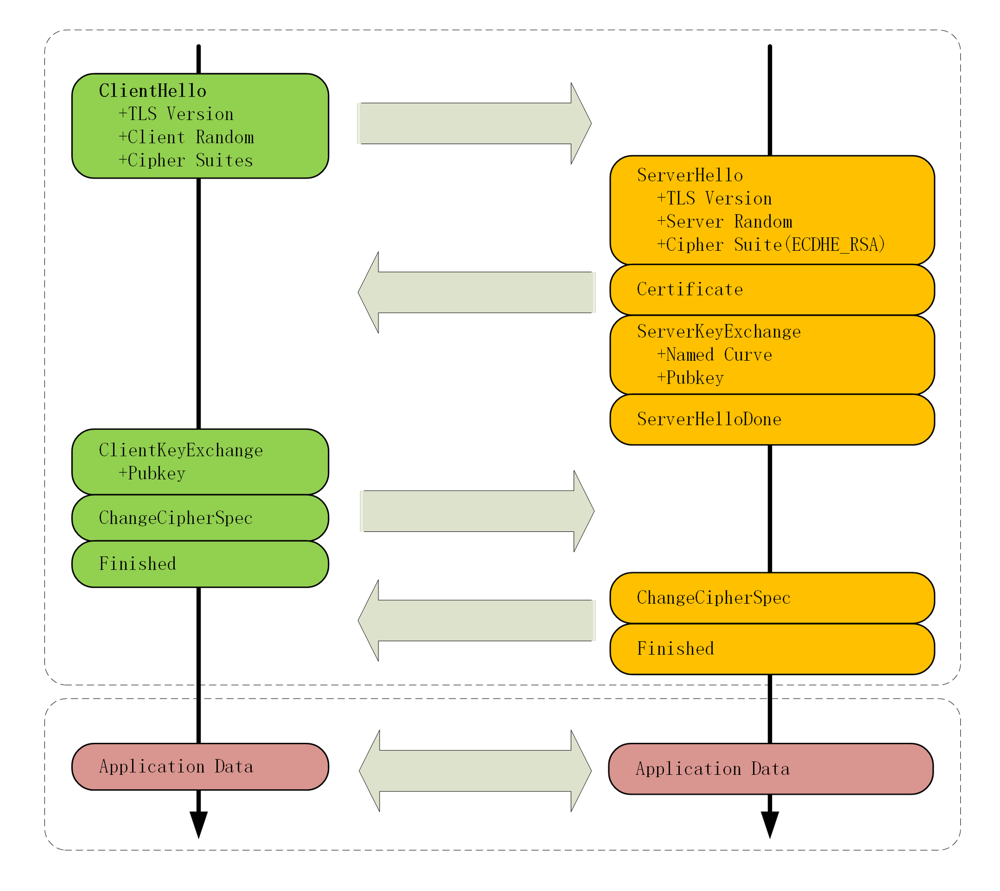

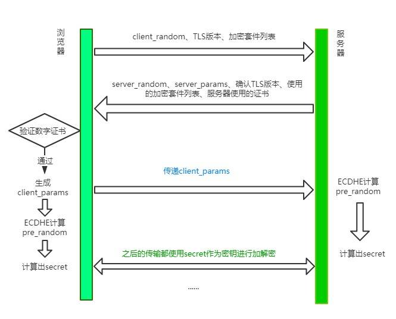

### ECDHE算法
>ECDHE 就是“短暂 - 椭圆曲线 - 迪菲 - 赫尔曼”算法（ephemeral Elliptic Curve Diffie–Hellman），里面的关键字是“短暂”“椭圆曲线”和“迪菲 - 赫尔曼”，我先来讲“迪菲 - 赫尔曼”，也就是 DH 算法。DH 算法是一种非对称加密算法，只能用于密钥交换，它的数学基础是“离散对数”（Discrete logarithm）。

客户端通过ECDHE算法计算出pre_random，其中传入两个参数:server_params和client_params。现在你应该清楚这个两个参数的作用了吧，由于ECDHE基于椭圆曲线离散对数，这两个参数也称作椭圆曲线的公钥。

客户端现在拥有了client_random、server_random和pre_random，接下来将这三个数通过一个伪随机数函数来计算出最终的secret。

服务端开始用ECDHE算法生成pre_random，接着用和客户端同样的伪随机数函数生成最后的secret。

使用 ECDHE 还有一个特点，就是客户端发送完收尾消息后可以提前抢跑，直接发送 HTTP 报文，节省了一个 RTT，不必等到收尾消息到达服务器，然后等服务器返回收尾消息给自己，直接开始发请求。这也叫TLS False Start。

### TLS 1.3 握手流程

大体的方式和 TLS1.2 差不多，不过和 TLS 1.2 相比少了一个 RTT， 服务端不必等待对方验证证书之后才拿到client_params，而是直接在第一次握手的时候就能够拿到, 拿到之后立即计算secret，节省了之前不必要的等待时间。同时，这也意味着在第一次握手的时候客户端需要传送更多的信息，一口气给传完。

- 客户端在“Client Hello”消息里直接用“supported_groups”带上支持的曲线，比如 P-256、x25519，用“key_share”带上曲线对应的客户端公钥参数，用“signature_algorithms”带上签名算法。
- 服务器收到后在这些扩展里选定一个曲线和参数，再用“key_share”扩展返回服务器这边的公钥参数，就实现了双方的密钥交换
- TLS1.3 还引入了“0-RTT”握手，用“pre_shared_key”和“early_data”扩展，在 TCP 连接后立即就建立安全连接发送加密消息

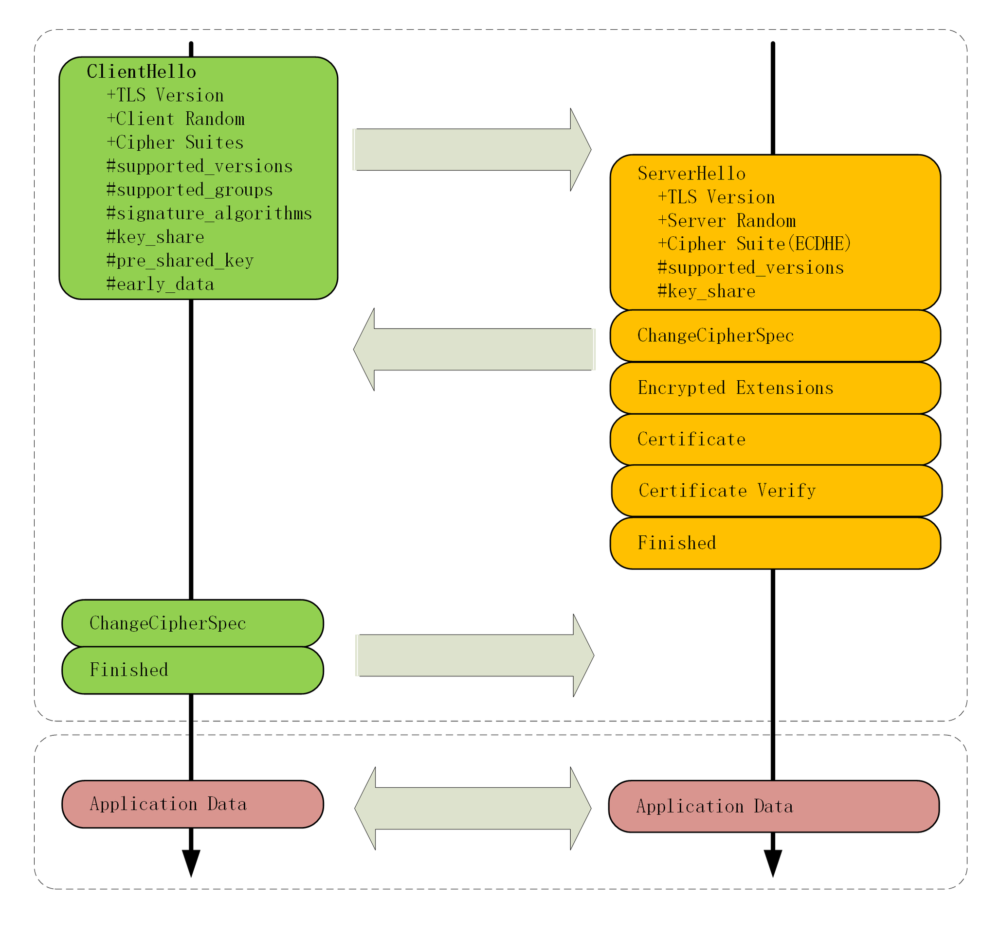

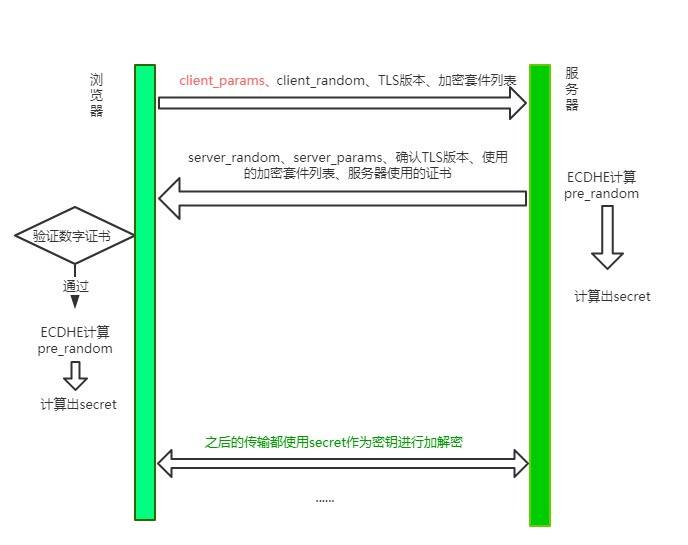

这种 TLS 1.3 握手方式也被叫做1-RTT握手。但其实这种1-RTT的握手方式还是有一些优化的空间的，接下来我们来一一介绍这些优化方式。

#### TLS 1.3 会话复用 - 0RTT

会话复用有两种方式: Session ID和Session Ticket。

Seesion ID，具体做法是客户端和服务器首次连接后各自保存会话的 ID，并存储会话密钥，当再次连接时，客户端发送ID过来，服务器查找这个 ID 是否存在，如果找到了就直接复用之前的会话状态，会话密钥不用重新生成，直接用原来的那份。session ID 只能够存在一台服务器上，如果我们的请求通过负载平衡被转移到了其他的服务器上，那么就无法恢复对话。

##### Session Ticket。

 session ID 对应的数据只能够存在一台服务器上,服务端的压力大，那就把压力分摊给客户端呗。
 
 具体来说，双方连接成功后，服务器加密会话信息，用Session Ticket消息发给客户端，让客户端保存下来,这个 ticket 是加密的，只有服务器能够解密，里面包含了本次会话的信息，比如对话秘钥和加密方法等。
 
 下次重连的时候，就把这个 Ticket 进行解密，验证它过没过期，如果没过期那就直接恢复之前的会话状态。这种方式虽然减小了服务端的存储压力，但与带来了安全问题，即每次用一个固定的密钥来解密 Ticket 数据，一旦黑客拿到这个密钥，之前所有的历史记录也被破解了。因此为了尽量避免这样的问题，密钥需要定期进行更换.

#### PSK

在发送Session Ticket的同时带上应用数据，不用等到服务端确认，这种方式被称为Pre-Shared Key，即 PSK。

当一个支持 TLS 1.3 的客户端连接到同样支持 TLS 1.3 的服务器时， 客户端会将收到服务器发送过来的 Ticket 通过相关计算，一起组成新的 预共享密钥，PSK （PreSharedKey）。

客户端会将该 PSK 缓存在本地，在会话恢复时在 Client Hello 上带上 PSK 扩展，同时通过之前客户端发送的完成（finished）计算出恢复密钥 （Resumption Secret）通过该密钥加密数据发送给服务器。

服务器会从会话 Ticket 中算出 PSK，使用它来解密刚才发过来的加密数据。至此完成了该 0-RTT 会话恢复的过程。

0-RTT模式不具有前向安全性，且消息可能被用作重放攻击，所以安全性较低，需慎重使用。

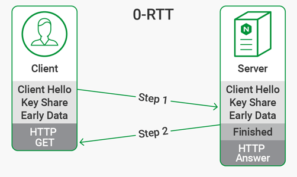

#### 强化安全

在 TLS1.3 中废除了非常多的加密算法，RSA这么重要的非对称加密算法怎么不在了？

- 2015年发现了FREAK攻击，即已经有人发现了 RSA 的漏洞，能够进行破解了。
- 一旦私钥泄露，那么中间人可以通过私钥计算出之前所有报文的secret，破解之前所有的密文。
- 回到 RSA 握手的过程中，客户端拿到服务器的证书后，提取出服务器的公钥，然后生成pre_random并用公钥加密传给服务器，服务器通过私钥解密，从而拿到真实的pre_random。当中间人拿到了服务器私钥，并且截获之前所有报文的时候，那么就能拿到pre_random、server_random和client_random并根据对应的随机数函数生成secret，也就是拿到了 TLS 最终的会话密钥，每一个历史报文都能通过这样的方式进行破解。

但ECDHE在每次握手时都会生成临时的密钥对，即使私钥被破解，之前的历史消息并不会收到影响。这种一次破解并不影响历史信息的性质也叫前向安全性。RSA 算法不具备前向安全性，而 ECDHE 具备，因此在 TLS1.3 中彻底取代了RSA。

#### TLS 1.3 与之前的协议有较大差异，主要在于：

- 相比过去的的版本，引入了新的密钥协商机制 — PSK
- 支持 0-RTT 数据传输，在建立连接时节省了往返时间
- 废弃了 3DES、RC4、AES-CBC 等加密组件，废弃了 SHA1、MD5 等哈希算法
- ServerHello 之后的所有握手消息采取了加密操作，可见明文大大减少
- 不再允许对加密报文进行压缩、不再允许双方发起重协商
- DSA 证书不再允许在 TLS 1.3 中使用

### 更快的访问速度

TLS 1.3 的握手不再支持静态的 RSA 密钥交换，这意味着必须使用带有前向安全的 Diffie-Hellman 进行全面握手。从上图可以看出，使用 TLS 1.3 协议只需要一次往返（ 1-RTT ）就可以完成握手。而TLS1.2需要两次RTT,然后才是HTTP

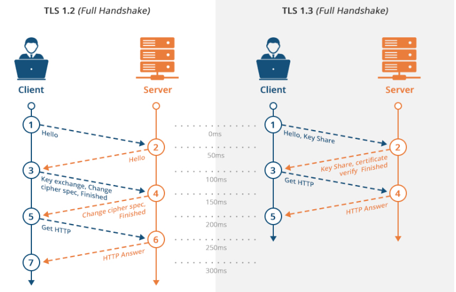