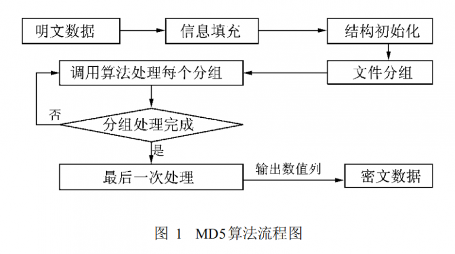
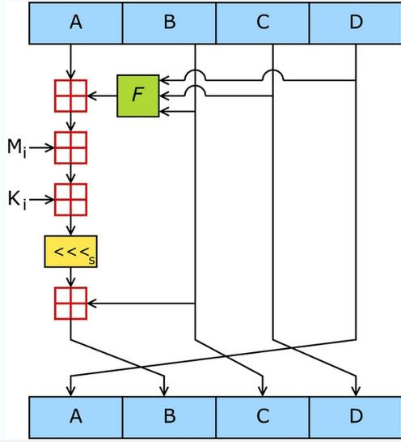

## MD5

MD5的全称是Message-Digest Algorithm，是Hash算法中的一种重要算法，具有单项加密、加密结果唯一、安全性能好等特点。MD5以512位分组来处理输入的信息 ，且每一分组又被划分为16个 32位子分组，经过了一系列的处理后 ，算法的输出由四个32位分组组成，将这四个32位分组级联后将生成一个128位散列值。




## MD5特点

压缩性： 任意长度的数据，算出的MD5值长度都是固定的。
容易计算： 从原数据计算出MD5值很容易。
抗修改性： 对原数据进行任何改动，哪怕只修改1个字节，所得到的MD5值都有很大区别。
强抗碰撞： 已知原数据和其MD5值，想找到一个具有相同MD5值的数据（即伪造数据）是非常困难的。

## 信息填充

- 首先需要对明文信息进行填充，使其位长度对512求余的结果等于448。因此，信息的位长度(Bits Length)将被扩展至 N\*512 + 448。
- 然后，再在这个结果后面附加一个以64位二进制表示的填充前信息长度。
- 经过这两步的处理 ，现在的信息字节长度为 N*512 + 448 + 64 = (N + 1) *512，即长度恰好是 512的整数倍。

## 结构初始化

在处理过程中需要定义一个结构。该结构包含了每一次需要处理的一个明文块 (512bit)和计算出来的散列值 (128bit)。在散列的整个过程中，它的作用非常重要 ，各个明文块计算出来的散列值都是通过它来传递的。

## 处理分组,循环加工

ABCD都是32位，分别与真实数据的每32位做运算



图中，A，B，C，D就是哈希值的四个分组。每一次循环都会让旧的ABCD产生新的ABCD。一共进行多少次循环呢？由处理后的原文长度决定。
假设处理后的原文长度是M
主循环次数 = M / 512
每个主循环中包含 512 / 32 * 4 = 64 次 子循环。


###  绿色F

绿色F，代表非线性函数。官方MD5所用到的函数有四种：
```
F(X, Y, Z) =(X&Y) | ((~X) & Z)
G(X, Y, Z) =(X&Z) | (Y & (~Z))
H(X, Y, Z) =X^Y^Z
I(X, Y, Z)=Y^(X|(~Z))
```
在主循环下面64次子循环中，F、G、H、I 交替使用，第一个16次使用F，第二个16次使用G，第三个16次使用H，第四个16次使用I。

### 红色“田”字

很简单，红色的田字代表相加的意思。

### Mi

Mi是第一步处理后的原文。在第一步中，处理后原文的长度是512的整数倍。把原文的每512位再分成16等份，命名为M0\~M15，每一等份长度32。在64次子循环中，每16次循环，都会交替用到M1~M16之一。

### Ki

一个常量，在64次子循环中，每一次用到的常量都是不同的。

### 黄色的<<


主循环有M / 512轮，每轮循环都很相似。第一轮进行16次操作。每次操作对 a、b、c和 d中的其中三个作一次非线性函数运算 ，然后将所得结果加上第四个变量，一个子分组和一个常数。再将所得结果向右环移一个不定的数，并加上 a、b、c或 d中之一，最后用该结果取代 a、b、c或 d中之一。
```
FF(a,b,c,d,Mj,s,ti)表示a=b+((a+F(b,c,d)+Mj+ti)<<<s)
GG(a,b,c,d,Mj,s,ti)表示a=b+((a+G(b,c,d)+Mj+ti)<<<s)
HH(a,b,c,d,Mj,s,ti)表示a=b+((a+H(b,c,d)+Mj+ti)<<<s)
II(a,b,c,d,Mj,s,ti)表示a=b+((a+I(b,c,d)+Mj+ti)<<<s)


第一轮
a=FF(a,b,c,d,M0,7,0xd76aa478)
b=FF(d,a,b,c,M1,12,0xe8c7b756)
c=FF(c,d,a,b,M2,17,0x242070db)
d=FF(b,c,d,a,M3,22,0xc1bdceee)
a=FF(a,b,c,d,M4,7,0xf57c0faf)
b=FF(d,a,b,c,M5,12,0x4787c62a)
c=FF(c,d,a,b,M6,17,0xa8304613)
d=FF(b,c,d,a,M7,22,0xfd469501)
a=FF(a,b,c,d,M8,7,0x698098d8)
b=FF(d,a,b,c,M9,12,0x8b44f7af)
c=FF(c,d,a,b,M10,17,0xffff5bb1)
d=FF(b,c,d,a,M11,22,0x895cd7be)
a=FF(a,b,c,d,M12,7,0x6b901122)
b=FF(d,a,b,c,M13,12,0xfd987193)
c=FF(c,d,a,b,M14,17,0xa679438e)
d=FF(b,c,d,a,M15,22,0x49b40821)

第二轮
a=GG(a,b,c,d,M1,5,0xf61e2562)
b=GG(d,a,b,c,M6,9,0xc040b340)
c=GG(c,d,a,b,M11,14,0x265e5a51)
d=GG(b,c,d,a,M0,20,0xe9b6c7aa)
a=GG(a,b,c,d,M5,5,0xd62f105d)
b=GG(d,a,b,c,M10,9,0x02441453)
c=GG(c,d,a,b,M15,14,0xd8a1e681)
d=GG(b,c,d,a,M4,20,0xe7d3fbc8)
a=GG(a,b,c,d,M9,5,0x21e1cde6)
b=GG(d,a,b,c,M14,9,0xc33707d6)
c=GG(c,d,a,b,M3,14,0xf4d50d87)
d=GG(b,c,d,a,M8,20,0x455a14ed)
a=GG(a,b,c,d,M13,5,0xa9e3e905)
b=GG(d,a,b,c,M2,9,0xfcefa3f8)
c=GG(c,d,a,b,M7,14,0x676f02d9)
d=GG(b,c,d,a,M12,20,0x8d2a4c8a)

第三轮
a=HH(a,b,c,d,M5,4,0xfffa3942)
b=HH(d,a,b,c,M8,11,0x8771f681)
c=HH(c,d,a,b,M11,16,0x6d9d6122)
d=HH(b,c,d,a,M14,23,0xfde5380c)
a=HH(a,b,c,d,M1,4,0xa4beea44)
b=HH(d,a,b,c,M4,11,0x4bdecfa9)
c=HH(c,d,a,b,M7,16,0xf6bb4b60)
d=HH(b,c,d,a,M10,23,0xbebfbc70)
a=HH(a,b,c,d,M13,4,0x289b7ec6)
b=HH(d,a,b,c,M0,11,0xeaa127fa)
c=HH(c,d,a,b,M3,16,0xd4ef3085)
d=HH(b,c,d,a,M6,23,0x04881d05)
a=HH(a,b,c,d,M9,4,0xd9d4d039)
b=HH(d,a,b,c,M12,11,0xe6db99e5)
c=HH(c,d,a,b,M15,16,0x1fa27cf8)
d=HH(b,c,d,a,M2,23,0xc4ac5665)

第四轮
a=II(a,b,c,d,M0,6,0xf4292244)
b=II(d,a,b,c,M7,10,0x432aff97)
c=II(c,d,a,b,M14,15,0xab9423a7)
d=II(b,c,d,a,M5,21,0xfc93a039)
a=II(a,b,c,d,M12,6,0x655b59c3)
b=II(d,a,b,c,M3,10,0x8f0ccc92)
c=II(c,d,a,b,M10,15,0xffeff47d)
d=II(b,c,d,a,M1,21,0x85845dd1)
a=II(a,b,c,d,M8,6,0x6fa87e4f)
b=II(d,a,b,c,M15,10,0xfe2ce6e0)
c=II(c,d,a,b,M6,15,0xa3014314)
d=II(b,c,d,a,M13,21,0x4e0811a1)
a=II(a,b,c,d,M4,6,0xf7537e82)
b=II(d,a,b,c,M11,10,0xbd3af235)
c=II(c,d,a,b,M2,15,0x2ad7d2bb)
d=II(b,c,d,a,M9,21,0xeb86d391)
```

每轮循环后，将A，B，C，D分别加上a，b，c，d，然后进入下一循环.

## 输出结果

当全部信息处理完成后 ，将分组处理的结果进行处理，输出计算结果。

所有这些完成之后 ，将 A、B、C、D分别加上 a、b、c、d。然后用下一分组数据继续运行算法 ，最后的输出是 A、B、C和 D的级联。当全部分组处理完成后，将结果级联 ，即得到了 MD5处理的结果。


## MD5算法原理--用途


　　1、防止被篡改，比如我提供文件下载，为了防止不法分子在安装程序中添加木马，我可以在网站上公布由安装文件得到的MD5输出结果。

　　2、防止直接看到明文，现在很多网站在数据库存储用户的密码的时候都是存储用户密码的MD5值。这样就算不法分子得到数据库的用户密码的MD5值，也无法知道用户的密码。

　　3、防止抵赖(数字签名)，例如A写了一个文件，认证机构对此文件用MD5算法产生摘要信息并做好记录。这样可以防止出现以后A不承认此事而带来的麻烦。


## 解释问题

MD5为什么能把一个不管多长的文件都变成定长的?

MD5使用4个32位的数据，和数据中的每个32位的数据进行计算，最终输出这4个32位数


### MD5为什么是不可逆的

```
//如果一个函数入参只有一个X那么告诉你Z的结果很容易推导出X
F(X) = Z
X*3 = Z
//但是如果入参是多个，比如X，Y，那么就算很简单的加法函数，
//你也没法直接通过Z推导出X、Y只能枚举。何况MD5这么多入参
F(X,Y) = Z
X+Y = Z
```

### MD5到底会不会重复，概率有多大

```
MD5是个128位的数，那么假设有N个完全不同的文件足够随机足够散列 那么当N大于2^128时才有可能出现重复
2^128 -> 10^32 -> 10^8*10^24 -> 中一百万亿亿次头等大奖的彩票
```


## MD5算法可以破解么？为什么？网上有在线破解是怎么回事？
> 参考https://blog.csdn.net/dawn_after_dark/article/details/54429766

### 答：MD5算法不可以破解。

因为MD5是单向散列函数，输入任意长度的信息，经过处理，输出为128位的信息；不同的输入得到的不同的结果；根据128位的输出结果不可能反推出输入的信息。所以不能从密文（散列值）反过来得到原文，即没有解密算法。

MD5计算的过程中丢失了信息，一个MD5的值可以对应多个原文。一个MD5理论上的确是可能对应无数多个原文的，因为MD5是有限多个的而原文可以是无数多个。比如主流使用的MD5将任意长度的“字节串映射为一个128bit的大整数。也就是一共有2^128种可能，大概是3.4*10^38，这个数字是有限多个的，而但是世界上可以被用来加密的原文则会有无数的可能性。

### 举个简单例子：

原文：我今年大四

### 加密规则：

每个字取拼音声调+笔画数，最后的结果计算乘积，为了也使得我的结果始终保持在一个限定范围内，取最后结果取其与2^14=16384的余数，如“我”是7画3声，也就是“特征值10”，以此类推，今4+1=5 年5+2=7 大3+4=7 四5+4=9，最后我发明的不可逆函数值就是10*5*7*7*9=22050与16384的余数，也就是5666，如果单单给5666这个数字和加密算法，无论如何不可能推出原文是“我今年大四”的，不过如果给你“我今年大四”你却很容易验证答案是否正确。

### 网上有在线破解：

网上md5的破解主要都是采用暴力生成各种字符串组合然后进行hash，很多用户的密码都不够复杂，所以很容易被这种方式生成出来。防范这种方式的办法一个是随机salt，只要salt够随机也够长，就会带来巨大的状态空间，极大降低被暴力生成到的可能。另一个办法是生成hash的速度够慢，比如迭代1000次，这样就大大降低了暴力运算的速度。

还有种破解就是采用彩虹表和字典：通过数据库把常见字符转的MD5存储起来为彩虹表，然后直接反查。有两种方法得到字典，一种是日常搜集的用做密码的字符串表，另一种是用排列组合方法生成的，先用MD5程序计算出这些字典项的MD5值，然后再用目标的MD5值在这个字典中检索。

比如我通过大量例子发现某密文中A对应C，然后我会记在数据字典中，下次直接用C代替A，看上去好像了破解了，实则并没有破解，只是找到了规律适应这种密文而已。