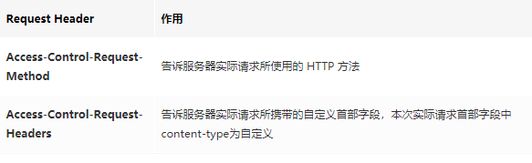
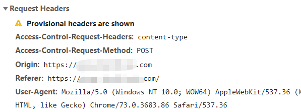
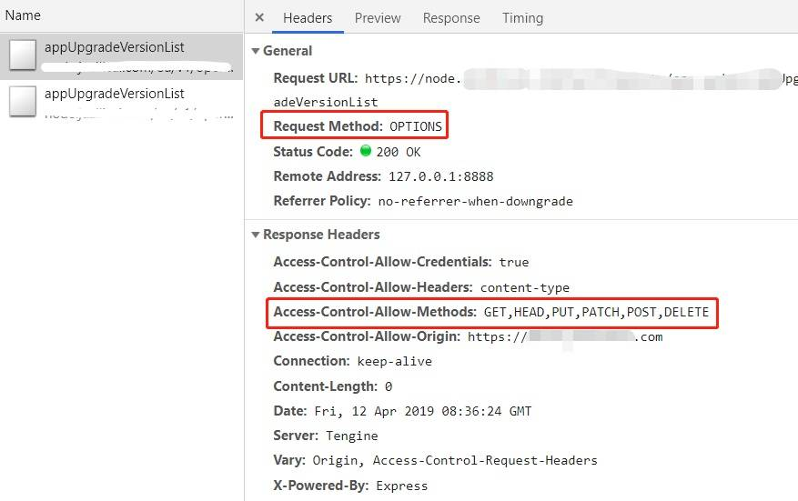
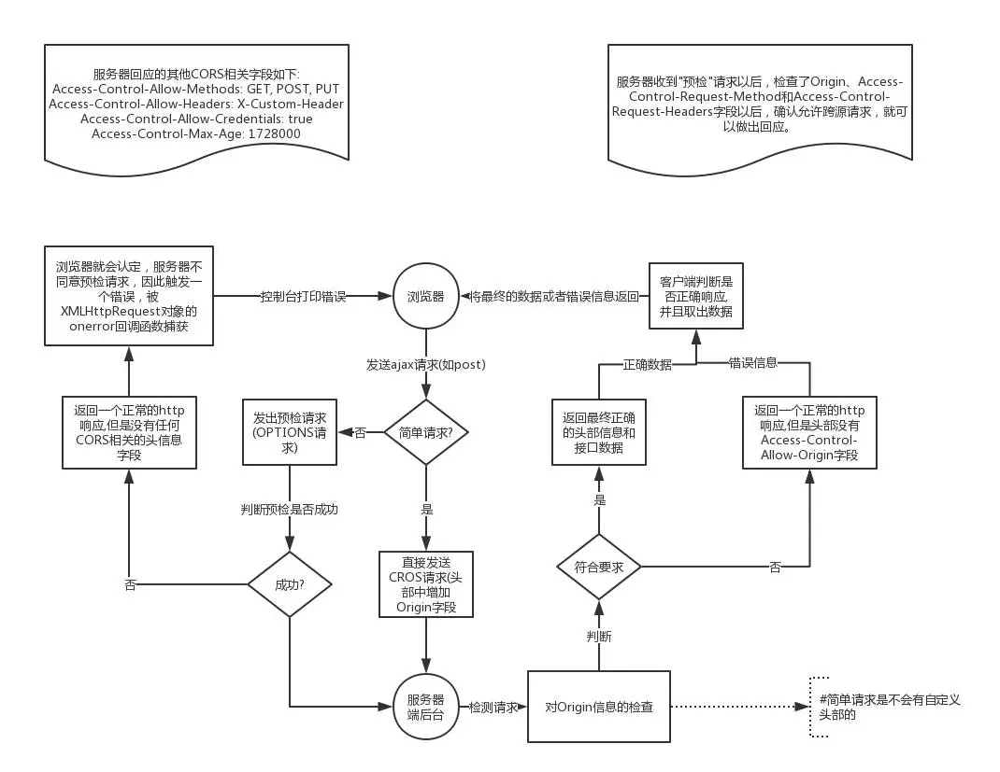

## OPTIONS 请求自动发起

在正式跨域之前，浏览器会根据需要发起一次预检（也就是 option 请求），用来让服务端返回允许的方法（如 get、post），被跨域访问的 Origin（来源或者域），还有是否需要 Credentials(认证信息)等。以获知服务器是否允许该实际请求。"预检请求“的使用，可以避免跨域请求对服务器的用户数据产生未预期的影响

## 简单请求不会触发

不会触发 CORS 预检的请求称为简单请求，满足以下所有条件的才会被视为简单请求，基本上我们日常开发只会关注前面两点

- 使用 GET、POST、HEAD 其中一种方法
- 只使用了如下的安全首部字段，不得人为设置其他首部字段
  - Accept
  - Accept-Language
  - Content-Language
  - Content-Type 仅限以下三种
    - text/plain
    - multipart/form-data
    - application/x-www-form-urlencoded
  - HTML 头部 header field 字段：DPR、Download、Save-Data、Viewport-Width、WIdth
- 请求中的任意 XMLHttpRequestUpload 对象均没有注册任何事件监听;XMLHttpRequestUpload 对象可以使用 XMLHttpRequest.upload 属性访问
- 请求中没有使用 ReadableStream 对象

对于简单请求的cors跨域，具体的流程如下：

- 浏览器发起请求，在请求header中增加Origin字段，表示本次请求来自哪个源
- 服务端接收到请求后，判断Origin指定的源，如果在允许调用的范围呢，服务端正常返回，需要注意的是，服务端在返回时需要在header中设置Access-Control-Allow-Origin字段，浏览器会判断该字段是否包含请求中的Origin值，如果包含，响应正确，否则，浏览器会抛出错误

### 1. form-data

它会将表单的数据处理为一条消息，以标签为单元，用分隔符分开。既可以上传键值对，也可以上传文件。当上传的字段是文件时，会有 Content-Type 来说明文件类型；content-disposition，用来说明字段的一些信息；
由于有 boundary 隔离，所以 multipart/form-data 既可以上传文件，也可以上传键值对，它采用了键值对的方式，所以可以上传多个文件。用表单上传文件时，必须让 `<form>` 表单的 enctype 等于 multipart/form-data.

### 2. x-www-form-urlencoded

就是 application/x-www-from-urlencoded, 会将表单内的数据转换为键值对，比如，name=java&age = 23

### multipart/form-data 与 x-www-form-urlencoded 区别

- multipart/form-data：既可以上传文件等二进制数据，也可以上传表单键值对，只是最后会化为一条信息；
- x-www-form-urlencoded：只能上传键值对，并且键值对都是间隔分开的。

## CORS 概述

跨域资源共享标准新增了一组 HTTP 首部字段，允许服务器声明哪些源站通过浏览器有权限访问哪些资源。

另外，规范要求，对那些可能对服务器数据产生副作用的 HTTP 请求方法（特别是 GET 以外的 HTTP 请求，或者搭配某些 MIME 类型的 POST 请求），浏览器必须首先使用 OPTIONS 方法发起一个预检请求（preflight request），从而获知服务端是否允许该跨域请求。

服务器确认允许之后，才发起实际的 HTTP 请求。在预检请求的返回中，服务器端也可以通知客户端，是否需要携带身份凭证（包括 Cookies 和 HTTP 认证相关数据）。

## 预检请求头 request header 的关键字段：

## 预检响应头 response header 的关键字段

 
Access-Control-Allow-Credentials: true 只是服务端允许接收客户端的cookie，但是跨域的时候ajax请求默认是不带cookie的，就很坑，你需要手动开启xhr.withCredentials = true;

## 两张流程图

## 重定向 CORS 跨域请求
- 非简单请求不可重定向，包括第一个preflight请求和第二个真正的请求都不行。
- 简单请求可以重定向任意多次，但如需兼容多数浏览器，只可进行一次重定向。
- 中间服务器应当同样配置相关 CORS 响应头。

多次重定向的讨论
多次重定向涉及的一个关键问题是：preflight 后的请求不允许重定向。因此：

- 对于简单请求并且没有任何 preflight 的情况：浏览器会一直跟随重定向（当然 HTTP 另有规定的除外，如 POST 被 302 时），直到最后一个请求返回或者中间请求的 CORS 验证失败（比如Access-Control-Allow-Origin设置错误）。
- 对于简单请求但是浏览器会发起 preflight 的情况（比如 Safari 对 DNT 的处理）：因 preflight 后重定向真正的请求会导致 CORS 失败，所以多次重定向是不可行的。
- 对于非简单请求：浏览器会直接发起 preflight，后续的重定向都是不允许的因此多次重定向不可行。

总之，如果需要兼容大多数浏览器，不论是否为简单请求都不可以多次重定向。

## 总结

OPTIONS 请求即预检请求，可用于检测服务器允许的 http 方法。当发起跨域请求时，由于安全原因，触发一定条件时浏览器会在正式请求之前自动先发起 OPTIONS 请求，即 CORS 预检请求，服务器若接受该跨域请求，浏览器才继续发起正式请求。

还有好处是 OPTION 是不带数据的，比较节省资源吧。不然复杂请求那扔那么多数据过去，然后不允许跨域，那么不是耗费资源了么，带宽是很宝贵的
