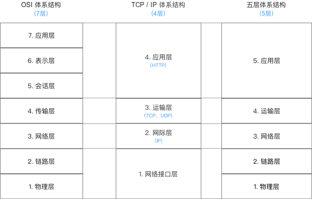

## 计算机网络体系结构

- OSI体系结构：开放系统互联(Open System Interconnection)概念清楚 & 理念完整，但复杂 & 不实用
- TCP / IP体系结构：是Internet的核心协议 & 被广泛应用于局域网 和 广域网
- 五层体系结构：融合了OSI 与 TCP / IP的体系结构，目的是为了学习 & 讲解计算机原理

名词解释：

- TCP（Transmission Control Protocol）传输控制协议是一种面向连接的、可靠的、基于字节流的传输层通信协议，含了一系列构成互联网基础的网络协议
- IP（Internet Protocol）协议，又称网际协议，它负责Internet上网络之间的通信，并规定了将数据从一个网络传输到另一个网络应遵循的规则

### 应用层

应用层( application-layer ）的任务是通过应用进程间的交互来完成特定网络应用。应用层协议定义的是应用进程（进程：主机中正在运行的程序）间的通信和交互的规则。对于不同的网络应用需要不同的应用层协议。在互联网中应用层协议很多，如域名系统 DNS，支持万维网应用的 HTTP 协议，支持电子邮件的 SMTP 协议等等。交互的数据单元称为报文

### 传输层

传输层(transport layer)的主要任务就是负责向两台主机进程之间的通信提供通用的数据传输服务。

### 网络层

网络层的任务就是选择合适的网间路由和交换结点，确保计算机通信的数据及时传送。在发送数据时，网络层把运输层产生的报文段或用户数据报封装成分组和包进行传送。在 TCP/IP 体系结构中，由于网络层使用 IP 协议，因此分组也叫 IP 数据报 ，简称数据报。

### 数据链路层

数据链路层(data link layer)通常简称为链路层。两台主机之间的数据传输，总是在一段一段的链路上传送的，这就需要使用专门的链路层的协议。

### 物理层

在物理层上所传送的数据单位是比特。 物理层(physical layer)的作用是实现相邻计算机节点之间比特流的透明传送，尽可能屏蔽掉具体传输介质和物理设备的差异。使其上面的数据链路层不必考虑网络的具体传输介质是什么

## 功能总结

## 常见协议

长连接：一个连接上可以连续发送多个数据包，在连接期间，如果没有数据包发送，需要双方发链路检查包。

TCP/IP：TCP/IP属于传输层，主要解决数据在网络中的传输问题，只管传输数据。但是那样对传输的数据没有一个规范的封装、解析等处理，使得传输的数据就很难识别，所以才有了应用层协议对数据的封装、解析等，如HTTP协议。

HTTP：HTTP是应用层协议，封装解析传输的数据。 从HTTP1.1开始其实就默认开启了长连接，也就是请求header中看到的Connection:Keep-alive。但是这个长连接只是说保持了（服务器可以告诉客户端保持时间Keep-Alive:timeout=200;max=20;）这个TCP通道，直接Request - Response，而不需要再创建一个连接通道，做到了一个性能优化。但是HTTP通讯本身还是Request - Response。

socket：与HTTP不一样，socket不是协议，它是在程序层面上对传输层协议（可以主要理解为TCP/IP）的接口封装。 我们知道传输层的协议，是解决数据在网络中传输的，那么socket就是传输通道两端的接口。所以对于前端而言，socket也可以简单的理解为对TCP/IP的抽象协议。

WebSocket： WebSocket是包装成了一个应用层协议作为socket,从而能够让客户端和远程服务端通过web建立全双工通信。websocket提供ws和wss两种URL方案。协议英文文档和中文翻译

