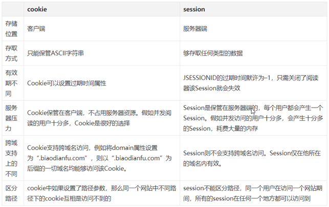
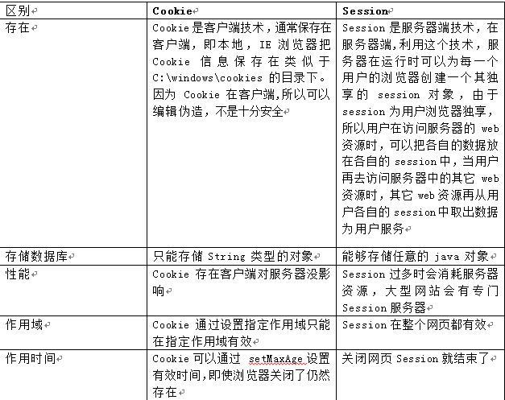

## Session：记录一系列状态

Session 与 cookie 功能效果相同。Session 与 Cookie 的区别在于 Session 是记录在服务端的，而 Cookie 是记录在客户端的。

### 解释 session

当访问服务器否个网页的时候，会在服务器端的内存里开辟一块内存，这块内存就叫做 session，而这个内存是跟浏览器关联在一起的。这个浏览器指的是浏览器窗口，或者是浏览器的子窗口，意思就是，只允许当前这个 session 对应的浏览器访问，就算是在同一个机器上新启的浏览器也是无法访问的。而另外一个浏览器也需要记录 session 的话，就会再启一个属于自己的 session

### 原理

HTTP 协议是非连接性的，取完当前浏览器的内容，然后关闭浏览器后，链接就断开了，而没有任何机制去记录取出后的信息。而当需要访问同一个网站的另外一个页面时(就好比如在第一个页面选择购买的商品后，跳转到第二个页面去进行付款)这个时候取出来的信息，就读不出来了。所以必须要有一种机制让页面知道原理页面的 session 内容。

### 问题

如何知道浏览器和这个服务器中的 session 是一一对应的呢？又如何保证不会去访问其它的 session 呢？

### 原理解答

就是当访问一个页面的时候给浏览器创建一个独一无二的号码，也给同时创建的 session 赋予同样的号码。这样就可以在打开同一个网站的第二个页面时获取到第一个页面中 session 保留下来的对应信息（理解：当访问第二个页面时将号码同时传递到第二个页面。找到对应的 session。）。这个号码也叫 sessionID，session 的 ID 号码，session 的独一无二号码。

## 有四种方式让 Session 正常工作

- 通过 URL 传递 SessionID
- 通过 Cookie 传递 SessionID
- 通过 SSL 传递 SessionID
- 通过隐藏表单传递 SessionID

## Session 机制原理

Session 是基于 Cookie 来工作的，同一个客户端每次访问服务器时，只要当浏览器在第一次访问服务器时，服务器设置一个 id 并保存一些信息(例如登陆就保存用户信息，视具体情况)，并把这个 id 通过 Cookie 存到客户端，客户端每次和服务器交互时只传这个 id，就可以实现维持浏览器和服务器的状态，而这个 ID 通常是 NAME 为 JSESSIONID 的一个 Cookie。

Cookie 是有大小限制和数量限制的，并且越来越多的 Cookie 代表客户端和服务器的传输量增加，可不可以每次传的时候不传所有 cookie 值，我们通过 Session 只传一个唯一 ID，通过这个 ID 直接在服务器查找用户信息，也就是说 session 将信息保存在服务器

当客户端请求创建一个 session 的时候，服务器会先检查这个客户端的请求里是否已包含了一个 session 标识 sessionId，

- 如果已包含这个 sessionId，则说明以前已经为此客户端创建过 session，服务器就按照 sessionId 把这个 session 检索出来使用（如果检索不到，可能会新建一个）
- 如果客户端请求不包含 sessionId，则为此客户端创建一个 session 并且生成一个与此 session 相关联的 sessionId


## session 的销毁

### session 的声明周期是从创建到超时过期

也就是说，当 session 创建后，浏览器关闭，会话级别的 Cookie 被销毁，如果没有超过设定时间，该 SessionID 对应的 session 是没有被销毁的。

tomcat 中 session 的默认失效时间为 30 分钟，可调用调用 session 的 invalidate 方法强制清楚。

关闭浏览器只是在客户端的内存中清除了与原会话相关的 cookie，再次打开浏览器进行连接时，浏览器无法发送 cookie 信息，所以服务器会认为是一个新的会话。因此，如果有某些与 session 关联的资源想在关闭浏览器时就进行清理（如临时文件等），那么应该发送特定的请求到服务器端，而不是等到 session 的自动清理。

### 检查 session 失效

检查每个 Session 是否失效是在 Tomcat 的一个后台线程完成的(backgroundProcess()方法中)；除了后台进程检验 session 是否失效外，调用 request.getSession()也会检查该 session 是否过期，当然，调用这种方法如果过期的话又会重新创建一个新的 session。

由于 Session 依赖于名为 JSESSIONID 的 Cookie，而 Cookie JSESSIONID 的过期时间默许为–1，只需关闭了阅读器该 Session 就会失效，因而 Session 不能完成信息永世有效的效果。运用 URL 地址重写也不能完成。而且假如设置 Session 的超时时间过长，服务器累计的 Session 就会越多，越容易招致内存溢出。

## Session ID 被劫持？

假如攻击者劫持了你的 Session ID，但是你又不知道，为了安全建议经常性的重置 Session ID（比如不定期的使用 session_regenerate_id()函数），这样攻击者等同于拿到的是旧的 Session ID（假设新的 Session ID 攻击者获取不到），这样就不能获取 Session 数据了。
但这也不是完全有效的（因为攻击者有方法能劫持你的 Session ID）。

更有效的方式其实应该是在用户操作**更高权限功能的时候**（比如电商结账的时候），让用户重新输入密码去验证（获取用户密码是另外一种攻击方式 ）。这是从应用层角度考虑最有效的保护方式。

## Session 对比 Cookie



### 存储位置不同

- cookie 的数据信息存放在客户端浏览器上。
- session 的数据信息存放在服务器上。

### 存储容量不同

- 单个 cookie 保存的数据<=4KB，一个站点最多保存 20 个 Cookie。
- 对于 session 来说并没有上限，但出于对服务器端的性能考虑，session 内不要存放过多的东西，并且设置 session 删除机制。

### 存储方式不同

- cookie 中只能保管 ASCII 字符串，并需要通过编码方式存储为 Unicode 字符或者二进制数据。
- session 中能够存储任何类型的数据，包括且不限于 string，integer，list，map 等。

### 隐私策略不同

- cookie 对客户端是可见的，别有用心的人可以分析存放在本地的 cookie 并进行 cookie 欺骗，所以它是不安全的。
- session 存储在服务器上，对客户端是透明对，不存在敏感信息泄漏的风险。

### 有效期上不同

- 开发可以通过设置 cookie 的属性，达到使 cookie 长期有效的效果。
- session 依赖于名为 JSESSIONID 的 cookie，而 cookie JSESSIONID 的过期时间默认为-1，只需关闭窗口该 session 就会失效，因而 session 不能达到长期有效的效果。

### 服务器压力不同

- cookie 保管在客户端，不占用服务器资源。对于并发用户十分多的网站，cookie 是很好的选择。
- session 是保管在服务器端的，每个用户都会产生一个 session。假如并发访问的用户十分多，会产生十分多的 session，耗费大量的内存。

### 浏览器支持不同

假如客户端浏览器不支持 cookie：

- cookie 是需要客户端浏览器支持的，假如客户端禁用了 cookie，或者不支持 cookie，则会话跟踪会失效。关于 WAP 上的应用，常规的 cookie 就派不上用场了。
- 运用 session 需要使用 URL 地址重写的方式。一切用到 session 程序的 URL 都要进行 URL 地址重写，否则 session 会话跟踪还会失效。
- 还有一种技术叫做表单隐藏字段。就是服务器会自动修改表单，添加一个隐藏字段，以便在表单提交时能够把 session id 传递回服务器。

假如客户端支持 cookie：

- cookie 既能够设为本浏览器窗口以及子窗口内有效，也能够设为一切窗口内有效。
- session 只能在本窗口以及子窗口内有效。


### 详细对比图



## 为什么 session 在关闭浏览器后就失效了呢？

### 原因：

因为默认情况下，当 getSession()后，session 就被被创建。session 在创建时，服务器会写入名为JSESSIONID 的 Cookie，默认过期时间是-1（即关闭会话就失效） ，之后服务器根据浏览器 Cookie 里的 session 的 ID 来分辨不同用户。所以在 session 在关闭浏览器后名为JSESSIONID就失效了。

### 解决办法（后端办的事

我们可以创建一个新的 CooKie，该 Cookie 的名字为 jsession，path 为 WEB 应用的虚拟路径，并设置 setMaxAge()的毫秒值，让 Cookie 保存在客户端的硬盘中，这时即使多次对浏览器进行关开操作是不会清除客户端硬盘文件的。所以，Cookie 就不丢失了，SessionId 也不会随浏览器关闭而丢失。

```
Cookie cookie = new Cookie("JSESSIONID",session.getId());
          cookie.setPath(request.getContextPath()+"/");
          cookie.setMaxAge(30*60);
          response.addCookie(cookie);
```

所以只要我们用来 JSESSIONID 这种处理办法就不会出现那种失效的问题
