## 大纲

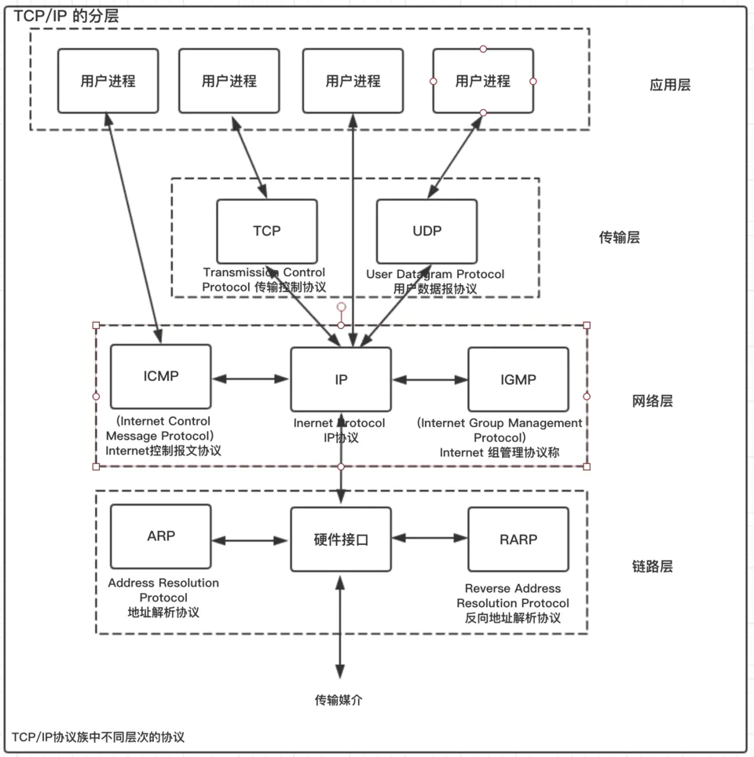

## IP：网际协议

IP 协议的作用是把各种数据包传送给对方。而要保证确实传送到对方那里，则需要满足各类条件，其中两个重要的条件是 IP 地址和 MAC 地址（Media Access Control Address）。

IP协议处于OSI参考模型的第三层——网络层，网络层的主要作用是实现终端节点间的通信。

IP协议可以分为三大作用模块：IP寻址、路由和IP分包。

### 提供不可靠、无连接的数据报传输服务。

#### 不可靠（unreliable） ：

它不能保证IP数据报能成功到达目的地。IP仅提供尽力而为的传输服务。当 IP 数据包在传输的过程中，发生错误，路由器的处理是丢掉该数据包，然后发送 ICMP 给该 IP 数据包的源；任何要求的可靠性必须由上层来提供（TCP）。

ICMP协议是一种面向无连接的协议，用于传输出错报告控制信息。它是一个非常重要的协议，它对于网络安全具有极其重要的意义。   它属于网络层协议，主要用于在主机与路由器之间传递控制信息，包括报告错误、交换受限控制和状态信息等。当遇到IP数据无法访问目标、IP路由器无法按当前的传输速率转发数据包等情况时，会自动发送ICMP消息。

#### 无连接（connectionless）：

IP并不维护任何关于后续数据报的状态信息。每个数据报的处理都是独立的。即 IP 数据包可以不按照顺序发送接收。

### IP数据包

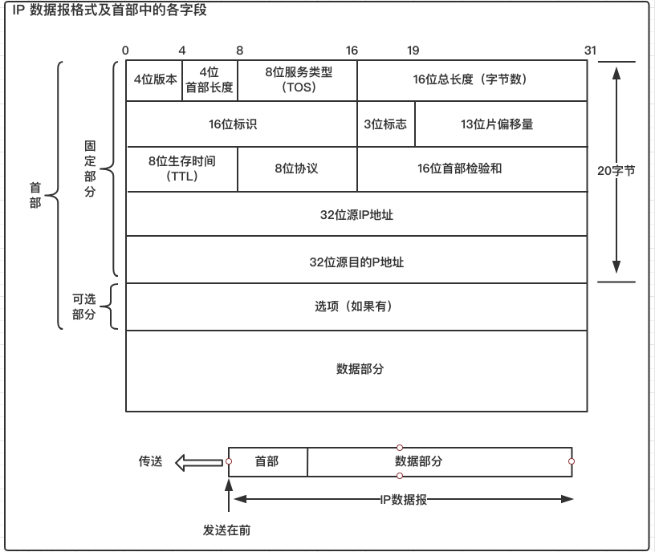

- IP 版本号（Version）：IP 协议版本号，长度 4bit；目前常有 IPv4 的该域值是（0100）；
- 首部长度（Head Length）：表明 IP 数据包的首部长度，长度 4bit，单位是 32bit（4 字节，图 1 中的一行），首部长度最大 15*4=60 字节，没有选填的选项，首部长度为 20 字节，该值为（0101）；
- 服务类型（Differentiated Services Field）：表明该 IP 数据包选择何种优先级服务传输，长度 8bit，其中前 3bit，后 1bit 没有用的，一般为 0（000XXXX0）；有用的 4bit 部分（XXXX）表示服务类型，每一位表示一种类型，分别是 最小延迟、  最大吞吐量、  最高可靠性、  最小代价，这 4bit 每次最多只有一位为 1，若全为 0，表示普通的传输服务；
- 标识域（Identification）：唯一地标识主机发送的每一份 IP 数据包。通常每发送一份数据包它的值就会加 1；长度 16bit；
- 协议类型（Protocol）： 指明上层协议类型，长度 8bit， 常用协议值 0x01-ICMP，0x02-IGMP，0x06-TCP，0x11-UDP。
- 标志域（Flags）：在 IP 数据包分片使用，长度 3bit。
- 片偏移（fragment offset）：在 IP 数据包分片使用，长度 13bit。
- 生存时间（Time to Live，TTL）：IP 数据包可以经过的最大路由跳转数，长度 8bit，初值一般为 0x40，IP 数据包每经过一次路由，该值 - 1，当 TTL 为 0 的时候，IP 数据包被丢弃，并发送一个 ICMP 包给该 IP 数据包的主机。
- 首部校验和（Header checknum）：校验首部，长度 16bit，与以太帧的 CRC 校验不同，这个只校验 IP 数据包的首部。如果校验未通过，直接丢弃该数据包，不发送 ICMP，由上层协议来控制。
- 源 IP 地址（Source IP）：告诉 IP 数据包，从哪来。长度 32bit。
- 目标 IP 地址（Destination IP）：告诉 IP 数据包，要到哪去。长度 32bit。
- 其他：可选。

### IP地址

IP 地址（IPv4 地址）由32位正整数来表示。IP 地址在计算机内部以二进制方式被处理。然而，由于我们并不习惯于采用二进制方式，我们将32位的 IP 地址以每8位为一组，分成4组，每组以 “.” 隔开，再将每组数转换成十进制数

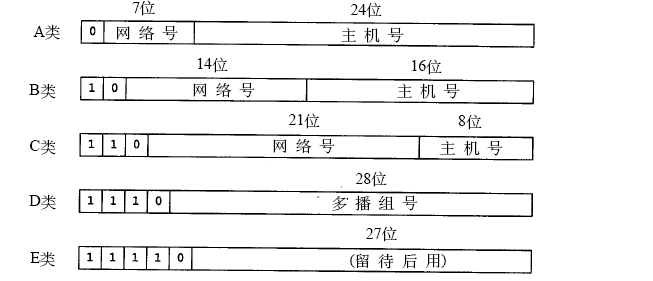

### IP地址由网络标识和主机标识组成

**网络标识**在数据链路的每个段配置不同的值。网络标识必须保证相互连接的每个段的地址不相重复。而相同段内相连的主机必须有相同的网络地址。

**主机标识**则不允许在同一个网段内重复出现。

由此，可以通过设置网络地址和主机地址，在相互连接的整个网络中保证每台主机的 IP 地址都不会相互重叠。即 IP 地址具有了唯一性。

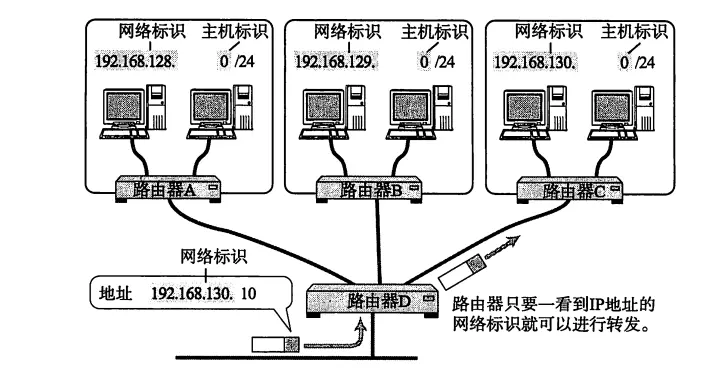

### 子网掩码

我们知道IP地址分类的本质是区分网络标识和主机标识，另一种更加灵活、细粒度的区分方法是使用子网掩码。

子网掩码 (subnet mask) 又叫网络掩码、地址掩码、子网络遮罩，是一个应用于 TCP/IP 网络的 32 位二进制值。它可以屏蔽掉 IP 地址中的一部分，从而分离出 IP 地址中的网络部分与主机部分，基于子网掩码，管理员可以将网络进一步划分为若干子网。它必须结合 IP 地址一起使用。

子网掩码的组成：
- 子网掩码和IP地址一样，都是32位
- 子网掩码由「连续」的0和连续的1组成的

子网掩码的作用：
- 通过子网掩码和IP进行与运算，就可以快速得到该IP所属的子网号
- 于是将一个IP地址划分成网络地址和主机地址两部分。
- 以前使用ABCD类会发现划分好的地址类会造成浪费，划分方式不够灵活，空白大半个网段地址或一个地址段不够用。后期就用可变子网掩码来做“订制服务”了。

现在一个 IP 地址的网络标识和主机标识已不再受限于该地址的类别，而是由一个叫做“子网掩码”的识别码通过子网网络地址细分出比 A 类、B 类、C 类更小粒度的网络。这种方式实际上就是将原来 A 类、B 类、C 类等分类中的主机地址部分用作子网地址，可以将原网络分为多个物理网络的一种机制。

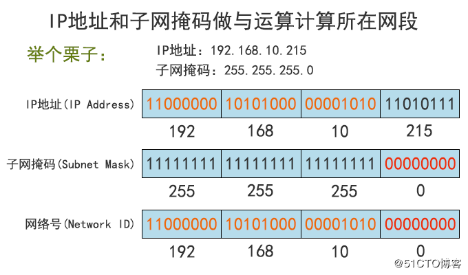

A类的默认子网掩码 255.0.0.0
B类的默认子网掩码 255.255.0.0  
C类的默认子网掩码 255.255.255.0 

###  IP 分包与组包

#### 分包

每种数据链路的最大传输单元（MTU）都不尽相同，因为每个不同类型的数据链路的使用目的不同。使用目的不同，可承载的 MTU 也就不同。
任何一台主机都有必要对 IP 分片进行相应的处理。分片往往在网络上遇到比较大的报文无法一下子发送出去时才会进行处理。
经过分片之后的 IP 数据报在被重组的时候，只能由目标主机进行。路由器虽然做分片但不会进行重组。

#### 重组

接收端根据IP首部中的标志(Flag)和片偏移(Fragment Offset)进行数据重组。具体内容将在分析IP首部时详细解释。

### 网关
> 注意网关只是网络中的一种概念，不是实体产品

网关(Gateway)又称网间连接器、协议转换器。网关在网络层以上实现网络互连，是复杂的网络互连设备，仅用于两个高层协议不同的网络互连。

连接两个不同的网络的设备都可以叫网关设备；网关的作用就是实现两个网络之间进行通讯与控制。

网关设备可以是 交互机（三层及以上才能跨网络）、路由器、启用了路由协议的服务器、代理服务器、防火墙等.

下面路由控制的路由器123就可以成为网关。

### 集线器

集线器的主要功能是对接收到的信号进行再生整形放大，以扩大网络的传输距离，同时把所有节点集中在以它为中心的节点上。它工作于OSI参考模型第一层，即“物理层”。

与交换机原理相同，相当于低级的交换机，因为每个端口发送的包会传到所有端口，而交换机影响的只是两个端口，因为交换机内部有MAC地址表，而集线器仅仅只是将这些线接在一起（通俗的讲）。

### 交换机

交换机是集线器的升级换代产品，外形上和集线器没什么分别，是一种在通信系统中自动完成信息交换功能的设备，用途和HUB一样也是连接组网之用，但是它具有比集线器更强大的功能。

作用在数据链路层。根据包头中的MAC地址，在交换机内部的MAC地址表，找到该MAC地址对应的端口，然后将包从该端口（一个端口对应一个MAC地址）发送出去。

交换机为电信号转发的网络设备，而网关则为连接两个网络的设备，网关能在不同协议间移动数据，相当于传统所说的IP网关。

### 路由器(Router)

路由器是网络中进行网间连接的关键设备。作为不同网络之间互相连接的枢纽，路由器系统构成了基于 TCP/IP 的国际互连网络 Internet 的主体脉络。 

作用在网络层。根据包头中的目标IP在路由表中寻找，由IP和子网掩码得出网络号，然后在路由表中的“目标地址项中的IP按位从左向右与刚刚算出的网络号对比，如果相同，就将包从此条记录的对应的“接口”选项发出去。

### 路由控制

路由控制(Routing)是指将分组数据发送到目标地址的功能，这个功能一般由路由器完成。(不要与家里用的小型无线路由器混为一谈)路由器中保存着路由控制表，它在路由控制表中查找目标IP地址对应的下一个路由器地址。下图描述了这一过程：

**注意/24是子网掩码的简单表示方法代码24个1和8个0的子网掩码**
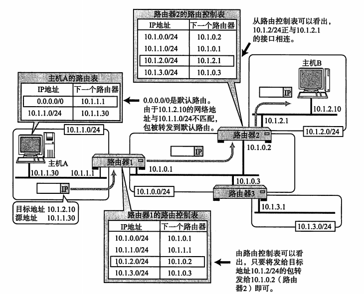

- IP 地址的网络地址部分用于进行路由控制。
- 路由控制表中记录着网络地址与下一步应该发送至路由器的地址。
- 在发送 IP 包时，首先要确定 IP 包首部中的目标地址，再从路由控制表中找到与该地址具有相同网络地址的记录，根据该记录将 IP 包转发给相应的下一个路由器。
- 如果路由控制表中存在多条相同网络地址的记录，就选择一个最为吻合的网络地址。

## TCP 协议

传输控制协议（TCP，Transmission Control Protocol）是一种面向连接的、可靠的、基于字节流的传输层通信协议

### TCP 报文

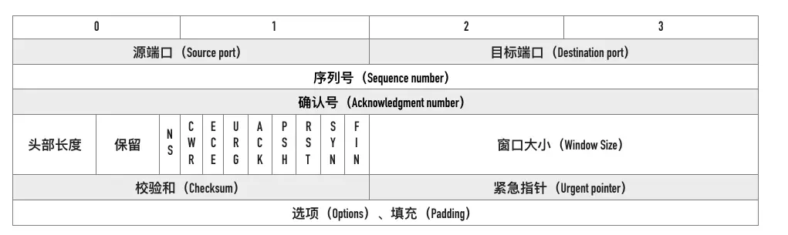

### 面向连接

意味着两个使用 TCP 的应用（通常是一个客户和一个服务器）在彼此交换数据之前必须先建立一个 TCP 连接。在一个 TCP 连接中，仅有两方进行彼此通信；

### 字节流服务
>1位=1比特
1字=2字节
1字节=8位
1字=16位
一个汉字是2个字节。
一个英文字母(不分大小写)是一个字节

意味着两个应用程序通过 TCP 连接交换 8bit 字节构成的字节流，TCP 不在字节流中插入记录标识符。

### 仅支持单播传输

每条 TCP 传输连接只能有两个端点，只能进行点对点的数据传输，不支持多播和广播传输方式。

### 面向字节流

#### “字节流”还是“报文段”
TCP 不像 UDP 一样那样一个个报文独立地传输，而是在不保留报文边界的情况下以字节流方式进行传输。

“字节流”还是“报文段”，区别在于，对使用协议的用户而言，读数据的时候，是不是有“边界”。有边界，就是报文段，没边界，就是字节流。没有边界，怎么理解呢？就是上层也不知道我这次调用read，是读到了几个TCP数据包，可能是一个，半个，也可能是好几个。因此上层协议往往需要自己的边界来划分，比如rpc用tcp协议，需要在应用层头部包含这次rpc请求的size。

#### 类别水流与水桶

对于上层来说：TCP就像一个水管，交给上层协议时，前面的水流一定是排在前面的；UDP就像瓶装水，交给上层的时候，那一瓶先到了，那一瓶丢了，没有任何保证。

虽然应用程序和TCP的交互是一次一个数据块（大小不等），视为无结构的字节流（无边界约束，课分拆/合并）。TCP有一个缓冲，当应用程序传送的数据块太长，TCP就可以把它划分短一些再传送。如果应用程序一次只发送一个字节，TCP也可以等待积累有足够多的字节后再构成报文段发送出去。

发送方UDP对应用程序交下来的报文，在添加首部后就向下交付IP层。UDP对应用层交下来的报文，既不合并，也不拆分，而是保留这些报文的边界。接收方UDP对IP层交上来的UDP用户数据报，在去除首部后就原封不动地交付上层的应用进程，一次交付一个完整的报文。

#### TCPUDP字节流与报文段总结

面向报文的传输方式是应用层交给UDP多长的报文，UDP就照样发送，即一次发送一个报文。因此，应用程序必须选择合适大小的报文。若报文太长，则IP层需要分片，降低效率。若太短，会是IP太小。UDP对应用层交下来的报文，既不合并，也不拆分，而是保留这些报文的边界。这也就是说，应用层交给UDP多长的报文，UDP就照样发送，即一次发送一个报文。

面向字节流的话，虽然应用程序和TCP的交互是一次一个数据块（大小不等），但TCP把应用程序看成是一连串的无结构的字节流。TCP有一个缓冲，当应用程序传送的数据块太长，TCP就可以把它划分短一些再传送。如果应用程序一次只发送一个字节，TCP也可以等待积累有足够多的字节后再构成报文段发送出去。

### 可靠传输

TCP 之所以可靠，大体上由于以下原因：

- 数据包校验：TCP 将保持它首部和数据的检验和。这是一个端到端的检验和，目的是检测数据在传输过程中的任何变化。如果收到段的检验和有差错，TCP 将丢弃这个报文段和不确认收到此报文段。
- 对失序数据包重排序：TCP 给发送的每一个包进行编号，接收方对数据包进行排序，把有序数据传送给应用层。**注意正是这里造成了TCP队头阻塞，因为前面的包超时了得等重传才能按顺序提交给应用层**
- 丢弃重复数据：对于重复数据，能够丢弃重复数据；
- 应答机制：当 TCP 收到发自 TCP 连接另一端的数据，它将发送一个确认。
- 超时重发：重发超时是指在重发数据之前，等待确认应答到来的那个特定时间间隔。如果超过这个时间仍未收到确认应答，发送端将进行数据重发。最理想的是，找到一个最小时间，它能保证“确认应答一定能在这个时间内返回”。
- 流量控制：TCP 连接的每一方都有固定大小的缓冲空间(滑动窗口)。TCP的接收端只允许发送端发送接收端缓冲区能接纳的数据。当接收方来不及处理发送方的数据，能提示发送方降低发送的速率，防止包丢失。TCP 使用的流量控制协议是可变大小的滑动窗口协议。 （TCP 利用滑动窗口实现流量控制）
- 拥塞控制： 当网络拥塞时，减少数据的发送。

### TCP包交给应用层一定是按顺序的

以前一直以为数据包先发的不一定先到，直到今天才意识这个问题的缺陷，数据包是不一定先发先到，但是对于TCP有一点特殊，若我们接受的数据包是在应用层，并且应用层用的是TCP的传输协议的话，这个顺序是保证，这个**顺序的保证是在传输层保证的**，举个例子：

client发生数据A,B给server，使用的TCP传输，client发送毫无疑问是先发送A，然后发送B，但是有些搞网络的同学可能会有这个疑问，A跟B在物理层走的链路不一样，传输速度不一样，B是会比A先到达Server,这个是没有错的，但是这个数据包被接受是在网络层跟传输层，请记住网络跟传输层的作用。

网络层是保证同一个包的完整，就是说若你的传输层发出的包过大，在网络层（也就是IP层）会被分包，同时在Sever的网络接受的时候会被组包，有一个完整的包才会交给传输层，若包不完整是会丢弃，同时他也不保证你的包的是否达到，数据包的保证是在传输层做的，就是说若传输层(TCP协议才会，UDP并不保证)没有收到对方的确认包，会有超时重传，每个数据包也是有序列号的，同时，传输层就是根据这个序列号来保证A,B包的顺序，**即使B比A先到达了，TCP也会是等A到达之后，先把A提交给应用层，再把B的数据提交给应用层，从而保证了，同一条TCP链接，先发的包先到**

**所以有一个包超时或者链路较长迟到了会造成TCP队头阻塞，等前面的到了在向应用层（http）提交**

### 滑动窗口

滑动窗口协议（Sliding Window Protocol），属于TCP协议的一种应用，用于网络数据传输时的流量控制，以避免拥塞的发生。该协议允许发送方在停止并等待确认前发送多个数据分组。由于发送方不必每发一个分组就停下来等待确认，因此该协议可以加速数据的传输，提高网络吞吐量。

TCP通过滑动窗口的概念来进行流量控制。设想在发送端发送数据的速度很快而接收端接收速度却很慢的情况下，为了保证数据不丢失，显然需要进行流量控制， 协调好通信双方的工作节奏。所谓滑动窗口，可以理解成接收端所能提供的缓冲区大小。TCP利用一个滑动的窗口来告诉发送端对它所发送的数据能提供多大的缓 冲区。由于窗口由16位bit所定义，所以接收端TCP 能最大提供65535个字节的缓冲。由此，可以利用窗口大小和第一个数据的序列号计算出最大可接收的数据序列号。 

滑动窗口本质上是描述接受方的TCP数据报缓冲区大小的数据，发送方根据这个数据来计算自己最多能发送多长的数据。如果发送方收到接受方的窗口大小为0的TCP数据报，那么发送方将停止发送数据，等到接受方发送窗口大小不为0的数据报的到来。 

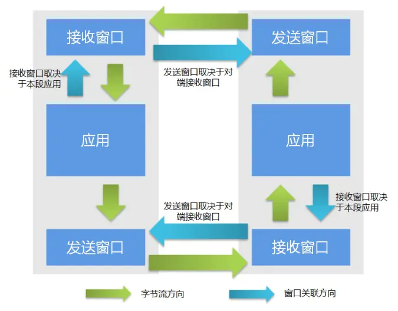

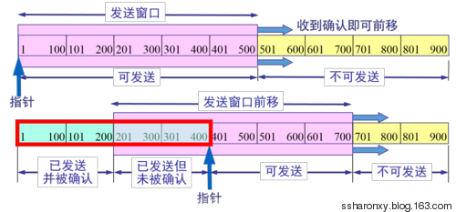

### 提供拥塞控制
> https://blog.csdn.net/qq_41431406/article/details/97926927 快重传，快恢复

对于拥塞控制来说，TCP 每条连接都需要维护两个核心状态:
- 拥塞窗口（Congestion Window，cwnd）
- 慢启动阈值（Slow Start Threshold，ssthresh）

拥塞窗口（Congestion Window，cwnd）是指目前自己还能传输的数据量大小。

- 接收窗口(rwnd)是接收端给的限制
- 拥塞窗口(cwnd)是发送端的限制
- 发送窗口大小 = min(rwnd, cwnd)

### 四大拥塞控制算法

#### 慢热启动算法 – Slow Start

所谓慢启动，也就是TCP连接刚建立，一点一点地提速，试探一下网络的承受能力，以免直接扰乱了网络通道的秩序。
- 1)连接建好的开始先初始化拥塞窗口cwnd大小为1，表明可以传一个MSS大小的数据。
- 2)每当收到一个ACK，cwnd大小加一，呈线性上升。
- 3)每当过了一个往返延迟时间RTT(Round-Trip Time)，cwnd大小直接翻倍，乘以2，呈指数让升。
- 4)还有一个ssthresh（slow start threshold），是一个上限，当cwnd >= ssthresh时，就会进入“拥塞避免算法”（后面会说这个算法）

#### 拥塞避免算法 – Congestion Avoidance

过了慢启动阈值后，拥塞避免算法可以避免窗口增长过快导致窗口拥塞，而是缓慢的增加调整到网络的最佳值。让拥塞窗口cwnd缓慢地增大，即每经过一个往返时间RTT就把发送方的拥塞窗口cwnd加1，而不是加倍。这样拥塞窗口cwnd按线性规律缓慢增长，比慢开始算法的拥塞窗口增长速率缓慢得多。
- （1）拥塞窗口cwnd初始化为1个报文段，慢开始门限初始值为16
- （2）执行慢开始算法，指数规律增长到第4轮，即cwnd=16=ssthresh，改为执行拥塞避免算法，拥塞窗口按线性规律增长
- （3）假定cwnd=24时，网络出现超时（拥塞），则更新后的ssthresh=12，cwnd重新设置为1，并执行慢开始算法。当cwnd=12=ssthresh时，改为执行拥塞避免算法

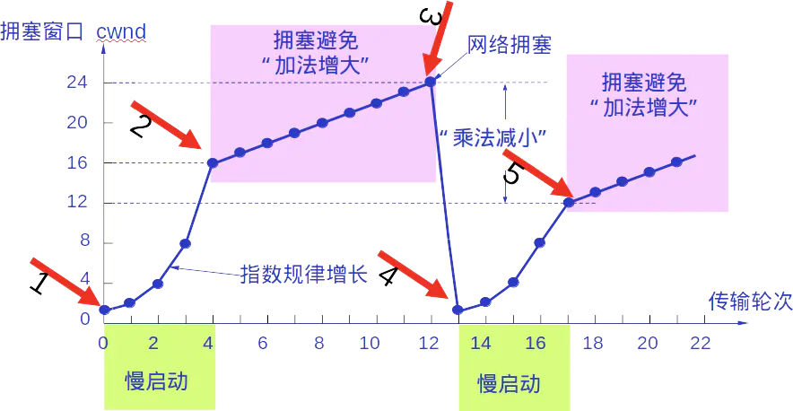

#### 快速恢复算法 – Fast Recovery

与快重传配合使用的还有快恢复算法，其过程有以下两个要点：
- 当发送方连续收到三个重复确认，就执行“乘法减小”算法，把慢开始门限ssthresh减半。
- 与慢开始不同之处是现在不执行慢开始算法（即拥塞窗口cwnd现在不设置为1），而是把cwnd值设置为 慢开始门限ssthresh减半后的数值，然后开始执行拥塞避免算法（“加法增大”），使拥塞窗口缓慢地线性增大。

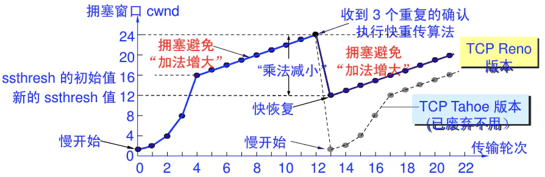

#### 快重传

接收方收到后，发现这不是按序到达的报文段，因此给发送方发送针对2号报文段的重复确认。
发送方收到了累计3个连续的针对2号报文段的重复确认，立即重传3号报文段，接收方收到后，给发送方发回针对6号报文的确认，表明，序号到6为至的报文都收到了，这样就不会造成发送方对3号报文的超时重传，而是提早收到了重传。

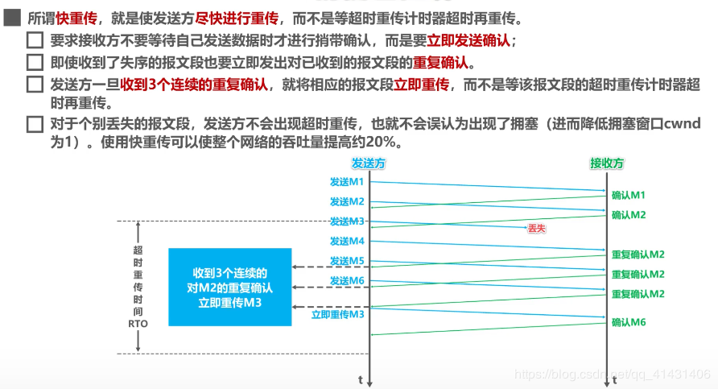

### 对比滑动窗口和拥塞窗口

流量控制：是端到端的控制，例如A通过网络给B发数据，A发送的太快导致B没法接收(B缓冲窗口过小或者处理过慢，接收方缓存大小与发送速率不匹配)，这时候的控制就是流量控制，原理是通过滑动窗口的大小改变来实现。

滑动窗口：是控制接收以及同步数据范围的，通知发送端目前接收的数据范围，用于流量控制，接收端使用。具体的操作是接收方会向发送方通知自己可以接受数据的大小，而发送方会根据这个数值，发送数据。如果接收方的缓存无限大，会因为网络层的原因发生拥塞，这时就需要拥塞窗口。

拥塞控制：拥塞控制是作用于网络的，它是防止过多的数据注入到网络中，避免出现网络负载过大的情况；拥塞控制是一个全局性的过程，涉及到所有的主机、路由器，以及与降低网络性能有关的所有因素。

拥塞窗口：拥塞窗口用控制全局网络的拥塞情况。通过控制发送方每次发送的流量的多少，用来逐渐试探整体网络的拥塞程度。如果没有拥塞控制，发送方每次发送的数据大小为滑动窗口。

两个窗口的维护是独立的，滑动窗口主要由接收方反馈缓存情况来维护，拥塞窗口主要由发送方的拥塞控制算法检测出的网络拥塞程度来决定的。

介绍流量控制时，我们没有考虑cwnd，认为发送方的滑动窗口最大即为rwnd。实际上，需要同时考虑流量控制与拥塞处理，则发送方窗口的大小不超过min{rwnd-接收窗口大小, cwnd-拥塞控制窗口大小}，发送方窗口的大小受拥塞窗口的影响。

### TCP 提供全双工通信
>百度百科：又称为双向同时通信，即通信的双方可以同时发送和接收信息的信息交互方式。

TCP 允许通信双方的应用程序在任何时候都能发送数据，因为 TCP 连接的两端都设有缓存，用来临时存放双向通信的数据。

### 为什么 TCP 建立连接需三次握手

> 详细参考：https://juejin.im/post/5ccd0dfc6fb9a0324a08bb73
> https://juejin.im/post/5d9c284b518825095879e7a5

结论：防止服务器端因接收了早已失效的连接请求报文，从而一直等待客户端请求，客户端因为知道请求是失效的所有没管了，最终导致形成死锁、浪费资源。

分析：
客户端发送了第一个连接的请求报文，但是由于网络不好，这个请求没有立即到达服务端，而是在某个网络节点中滞留了，直到某个时间才到达服务器，本来这已经是一个失效的报文，但是服务器端接收到这个请求报文后，还是会想客户端发出确认的报文，表示同意连接。

假如不采用三次握手，那么只要服务器发出确认，新的建立就连接了，但其实这个请求是失效的请求，客户端是不会理睬服务器的确认信息，也不会向服务端发送确认的请求，但是服务器认为新的连接已经建立起来了，并一直等待客户端发来数据，这样，服务器的很多资源就没白白浪费掉了

采用三次握手就是为了防止这种情况的发生，服务器会因为收不到确认的报文，就知道客户端并没有建立连接。这就是三次握手的作用。

**所以第三次握手的终极目标就是确认客户端是否有接受能力(避免服务器发数据给已失效的客户端)**

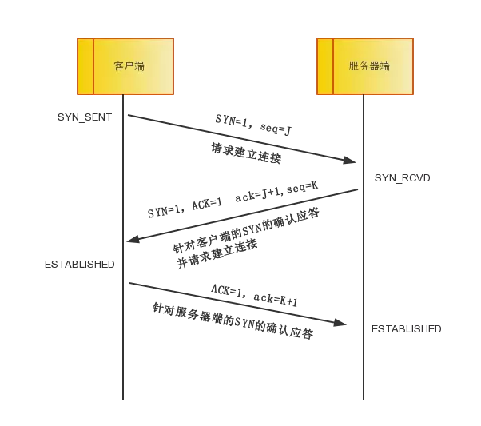

- seq：序号
- ack：确认序号
- ACK:确认
- SYN：同步

第一次握手：
- 客户端：我具有发送数据的能力，不知道服务端能不能接受数据
- 服务端：我能接受数据的，我还能发送数据，就不知道你能不能发送数据

第二次握手：
- 客户端：知道了服务端有发送和接受数据的能力（服务端发的SYN+ACK一起的）
- 服务端：我还是不知道客户端能不能接受数据

第三次握手：
- 客户端：我是有效的，具备接受数据的能力
- 服务端：好我知道了，来建立连接吧（双向有效）

### 为什么 TCP 释放连接需四次挥手

结论：首先保证通信双方都能通知对方 需释放 & 断开连接，即释放连接后，都无法接收 / 发送消息给对方，但是服务端得先应答后断开，因为数据可能还没处理完

分析：
tcp 我握手的时候为何 ACK(确认)和 SYN(建立连接)是一起发送。挥手的时候为什么是分开的时候发送呢.

因为当 Server 端收到 Client 端的 SYN 连接请求报文后，可以直接发送 SYN+ACK 报文。其 ACK 报文是用来应答的，SYN 报文是用来同步的。

但是关闭连接时，当收到对方的 FIN 报文通知时，它仅仅表示对方没有数据发送给你了；但未必你所有的数据都全部发送给对方了，所以你可以未必会马上会关闭 SOCKET,也即你可能还需要发送一些数据给对方之后，再发送 FIN 报文给对方来表示你同意现在可以关闭连接了，所以它这里的 ACK 报文和 FIN 报文多数情况下都是分开发送的。

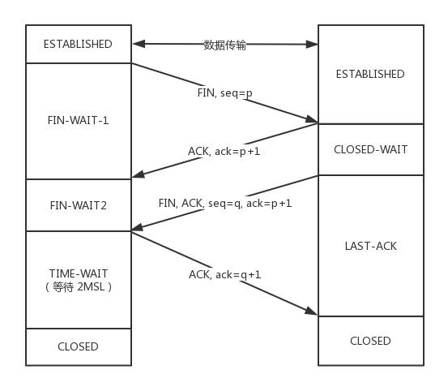

- 客户端要断开了，向服务器发送 FIN 报文，发送后客户端变成了FIN-WAIT-1状态
- 这时候客户端同时也变成了half-close(半关闭)状态，即无法向服务端发送报文，只能接收。
- 服务端接收后向客户端确认，变成了CLOSED-WAIT状态。
- 客户端接收到了服务端的确认，变成了FIN-WAIT2状态。
- 随后，服务端向客户端发送FIN，自己进入LAST-ACK状态，
- 客户端收到服务端发来的FIN后，自己变成了TIME-WAIT状态，然后发送 ACK 给服务端。
- 注意了，这个时候，客户端需要等待足够长的时间，具体来说，是 2 个 MSL(Maximum Segment Lifetime，报文最大生存时间), 在这段时间内如果客户端没有收到服务端的重发请求，那么表示 ACK 成功到达，挥手结束，否则客户端重发 ACK。

### 客户端关闭之前需要等待 2MSL 

（1）为了保证客户端发送的最后一个ACK报文段能够到达服务器。该ACK报文段很有可能丢失，因而使处于在LIST—ACK状态的服务器收不到对已发送的FIN+ACK报文段的确认，服务器可能会重传这个FIN+ACK报文段，而客户端就在这2MSL时间内收到这个重传的FIN+ACK报文段，接着客户端重传一次确认，重新启动2MSL计时器，最后客户端和服务器都进入CLOSED状态。

（2）防止已失效的请求连接出现在本连接中。在连接处于2MSL等待时，任何迟到的报文段将被丢弃，因为处于2MSL等待的，由该插口（插口是IP和端口对的意思，socket）定义的连接在这段时间内将不能被再用，这样就可以使下一个新的连接中不会出现这种旧的连接之前延迟的报文段。（如果不等待，客户端直接跑路，当服务端还有很多数据包要给客户端发，且还在路上的时候，若客户端的端口此时刚好被新的应用占用，那么就接收到了无用数据包，造成数据包混乱。所以，最保险的做法是等服务器发来的数据包都死翘翘再启动新的应用。

## TCP Fast Open - TCP快速打开 
>https://www.jianshu.com/p/8d178c18b6e7

TCP快速打开（TCP Fast Open，TFO）是对TCP的一种简化握手手续的拓展，用于提高两端点间连接的打开速度。简而言之，就是在TCP的三次握手过程中传输实际有用的数据。其目的是缩短 TCP 三次握手的时间。通过加入 cookie，在握手阶段就可以传输数据包，从而将三次握手的延时降低到最低。比较适用于网络延时比较长的场景。

三次握手的过程中，当用户首次访问server时，发送syn包，server根据用户IP生成cookie，并与syn+ack一同发回client；client再次访问server时，在syn包携带TCP cookie；如果server校验合法，则在用户回复ack前就可以直接发送数据；否则按照正常三次握手进行。

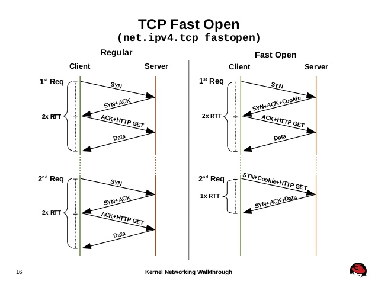

假设单程延时为 t，如果没有用 TFO，那么需要三次握手后才会开始发送数据，即发送数据延时至少为 2t，而用了 TFO，发送数据延时就是0。当然从用户体验来看，从发起请求到接收到服务端发送过来数据的延时分别是4t和2t(1RTT=2t)。

### 请求Fast Open Cookie

- 客户端发送SYN数据包，该数据包包含Fast Open选项，且该选项的Cookie为空，这表明客户端请求Fast Open Cookie；
- 支持TCP Fast Open的服务器生成Cookie，并将其置于SYN-ACK数据包中的Fast Open选项以发回客户端；
- 客户端收到SYN-ACK后，缓存Fast Open选项中的Cookie。

### 实施TCP Fast Open

- 客户端发送SYN数据包，该数据包包含数据（对于非TFO的普通TCP握手过程，SYN数据包中不包含数据）以及此前记录的Cookie；
- 支持TCP Fast Open的服务器会对收到Cookie进行校验：如果Cookie有效，服务器将在SYN-ACK数据包中对SYN和数据进行确认（Acknowledgement），服务器随后将数据递送至相应的应用程序；否则，服务器将丢弃SYN数据包中包含的数据，且其随后发出的SYN-ACK数据包将仅确认（Acknowledgement）SYN的对应序列号；
- 如果服务器接受了SYN数据包中的数据，服务器可在握手完成之前发送数据；
- 客户端将发送ACK确认服务器发回的SYN以及数据，但如果客户端在初始的SYN数据包中发送的数据未被确认，则客户端将重新发送数据；
- 此后的TCP连接和非TFO的正常情况一致。

## TCP/IP 通信传输流

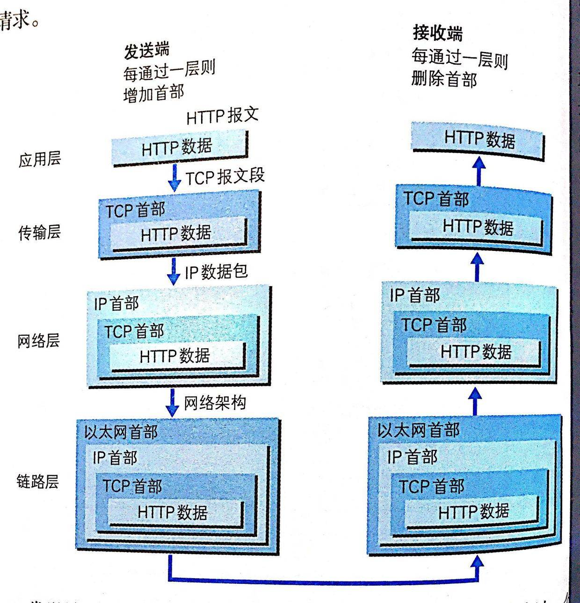

## UDP 协议

用户数据报协议（UDP，User Datagram Protocol）。UDP 为应用程序提供了一种无需建立连接就可以发送封装的 IP 数据包的方法。

### 面向无连接

UDP 是不需要和 TCP 一样在发送数据前进行三次握手建立连接的，想发数据就可以开始发送了。并且也只是数据报文的搬运工，不会对数据报文进行任何拆分和拼接操作。

### 有单播，多播，广播的功能

UDP 不止支持一对一的传输方式，同样支持一对多，多对多，多对一的方式，也就是说 UDP 提供了单播，多播，广播的功能。

### UDP 是面向报文的

发送方的 UDP 对应用程序交下来的报文，在添加首部后就向下交付 IP 层。UDP 对应用层交下来的报文，既不合并，也不拆分，而是保留这些报文的边界。

### 不可靠性

不可靠性体现在无连接上，通信都不需要建立连接，想发就发，这样的情况肯定不可靠。

并且收到什么数据就传递什么数据，并且也不会备份数据，发送数据也不会关心对方是否已经正确接收到数据了。

### UDP 应用场景

- 域名转换：DNS 协议
- 文件传输：FTP 协议
- 网络管理：SNMP 协议
- 远程文件服务器：NFS 协议

当对网络通讯质量要求不高的时候，要求网络通讯速度能尽量的快，这时就可以使用UDP。常见使用UDP协议的应用如下：QQ语音，QQ视频，TFTP等。

## TCP 对比 UDP

UDP：相当于发信息，不需要对方同意就可以发，也不知道对方看了短信没有。
TCP：相当于打电话，需要对方同意了接听电话，可靠，知道对方接了电话

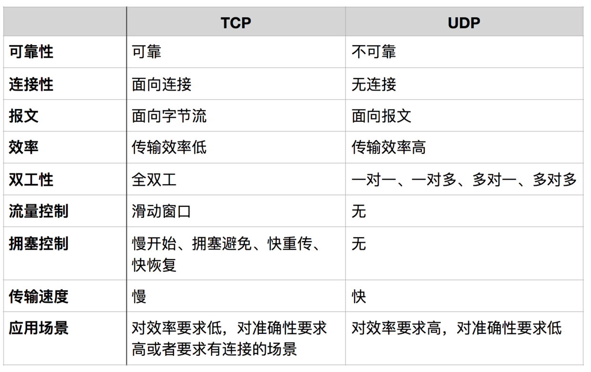
