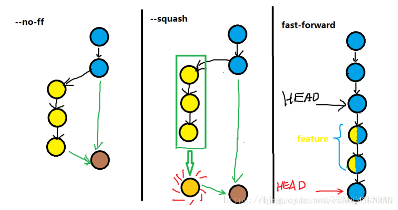
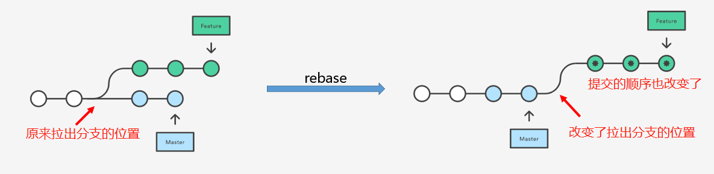
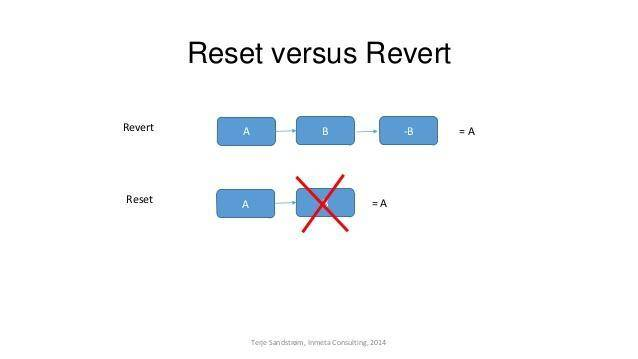

## 推送Git push

在使用git commit命令将修改从暂存区提交到本地版本库后，只剩下最后一步将本地版本库的分支推送到远程服务器上对应的分支了，如果不清楚版本库的构成，可以查看我的另一篇，git 仓库的基本结构。

### 1.0 git push <远程主机名> <本地分支名> ： <远程分支名> 
这是git push的一般形式
例如 **git push origin master：refs/for/master** ，即是将本地的master分支推送到远程主机origin上的对应master分支， origin 是远程主机名，第一个master是本地分支名，第二个master是远程分支名。

### 1.1 git push origin master

如果远程分支被省略，如上则表示将本地分支推送到与之存在追踪关系的远程分支（通常两者同名），如果该远程分支不存在，则会被新建

### 1.2 git push origin ：refs/for/master 

　　如果省略本地分支名，则表示删除指定的远程分支，因为这等同于推送一个空的本地分支到远程分支，等同于 git push origin --delete master

### 1.3 git push origin 或者是写全  git push origin dev

如果当前分支与远程分支存在追踪关系，则本地分支和远程分支都可以省略，将当前分支推送到origin主机的对应分支 

### 1.4git push

　　如果当前分支只有一个远程分支，那么主机名都可以省略，形如 git push，可以使用git branch -r ，查看远程的分支名

###　1.5 git push 的其他命令

这几个常见的用法已足以满足我们日常开发的使用了，还有几个扩展的用法，如下：

- （1） git push -u origin master 如果当前分支与多个主机存在追踪关系，则可以使用 -u 参数指定一个默认主机，这样后面就可以不加任何参数使用git push，不带任何参数的git push，默认只推送当前分支，这叫做simple方式，还有一种matching方式，会推送所有有对应的远程分支的本地分支， Git 2.0之前默认使用matching，现在改为simple方式
如果想更改设置，可以使用git config命令。git config --global push.default matching OR git config --global push.default simple；可以使用git config -l 查看配置

- （2） git push --all origin 当遇到这种情况就是不管是否存在对应的远程分支，将本地的所有分支都推送到远程主机，这时需要 -all 选项

- （3） git push --force origin git push的时候需要本地先git pull更新到跟服务器版本一致，如果本地版本库比远程服务器上的低，那么一般会提示你git pull更新，如果一定要提交，那么可以使用这个命令。

- （4） git push origin --tags //git push 的时候不会推送分支，如果一定要推送标签的话那么可以使用这个命令

## 拉取 git pull

git pull命令的作用是，取回远程主机某个分支的更新，再与本地的指定分支合并。它的完整格式稍稍有点复杂。

$ git pull <远程主机名> <远程分支名>:<本地分支名>
比如，取回origin主机的next分支，与本地的master分支合并，需要写成下面这样。

$ git pull origin next:master
如果远程分支是与当前分支合并，则冒号后面的部分可以省略。

$ git pull origin next

## 使用git diff 查看最新pull下来的代码修改内容

git pull对于拉下来的修改文件自动对其进行git add /rm 及git commit 操作。**所以拉下来的文件有那些修改，查看的方式可把它们归结于上一次提交的比较**

git diff HEAD 显示工作目录与git仓库之间的差异，

git diff HEAD^ 则显示上一次提交之前工作目录与git仓库之间的差异。所以我们在git pull后，可以通过git diff HEAD^ 来查看拉下来的文件有那些具体的修改。

所以用git pull 拉取最新代码后，我们使用git diff HEAD^ 查看对比最近一次提交两次文件内容具体修改了什么

## Git Stash
```js
git stash save "save message"  : 执行存储时，添加备注，方便查找
git stash list  ：查看stash了哪些存储
git stash show ：显示做了哪些改动，默认show第一个存储:比如第二个：git stash show  stash@{1}  -p
git stash pop ：命令恢复之前缓存的工作目录，将缓存堆栈中的对应stash删除，并将对应修改应用到当前的工作目录下
git stash drop stash@{$num} ：丢弃stash@{$num}存储，从列表中删除这个存储
git stash clear ：删除所有缓存的stash
```
应用场景1： 忘记切换分支就做了修改

在分支操作时，我们已经修改了一部分master的代码才想起来这里需要新开一个test分支来开发。
这时可以：
```js
git stash          //把本地当前改动暂存起来，此时master分支就恢复到了上次拉取时的状态
git checkout test  //切换到需要改动的分支
git stash pop　　　 //将改动pop到自己当前的分支
```

应用场景2： 有人与我改动同一分支
我在本地修改好后，发现远程分支已经被改动了，此时我本地也被改动了就造成了冲突，无法push或者pull。
此时可以使用git stash：
```
git stash //把本地的改动暂存起来
git pull  //拉取远端分支（此时本地分支会回滚到上次commit的情况，新的改动都存在了stash中）
git stash pop // 将栈顶改动重新加回本地分支，就可以继续修改了，当然，如果改好了就是add,commit,push啥的。。
```
这样做能解决冲突是相当于把自己的修改先存起来，拉下来别人的修改，然后在其他人修改的基础上追加修改（感觉相当于是在本地覆盖了他人的代码

## master、origin master 与 origin/master

如果没有特意去了解 master、origin master 与 origin/master 的区别的话，经常会导致在使用的时候模糊两者之间的区别。

- master 这个很好理解，它代表本地的某个分支名。

- origin master 代表着两个概念，前面的 origin 代表远程名，后面的 master 代表远程分支名

- origin/master 只代表一个概念，即远程分支名，是从远程拉取代码后在本地建立的一份拷贝（因此也有人把它叫作本地分支）。

举几个例子可能会更加清晰地说明问题：

- 执行 git fetch origin master 时，它的意思是从名为 origin 的远程上拉取名为 master 的分支到本地分支
origin/master 中。既然是拉取代码，当然需要同时指定远程名与分支名，所以分开写。
- 执行 git merge origin/master 时，它的意思是合并名为 origin/master
的分支到当前所在分支。既然是分支的合并，当然就与远程名没有直接的关系，所以没有出现远程名。需要指定的是被合并的分支。
- 执行 git push origin master 时，它的意思是推送本地的 master 分支到远程
origin，涉及到远程以及分支，当然也得分开写了。
- 还可以一次性拉取多个分支的代码：git fetch origin master stable oldstable；
- 也还可以一次性合并多个分支的代码：git merge origin/master hotfix-2275 hotfix-2276
hotfix-2290；

## 本地建立分支与远程联系

查看分支：git branch （-r 查看远程 -a查看远程和本地所有分支 -vv查看链接关系

创建分支：git branch \<name\>

切换分支：git checkout \<name\>

创建+切换分支：git checkout -b \<name\>

合并某分支到当前分支：git merge \<name\>

删除分支：git branch -d \<name\>  
拉取所有远端的最新代码：

- git fetch 
- git merge origin/develop

**fetch完了后本地会多出几个远程分支：**

使用git branch -a 才能看到全部（不fetch即使-a也看不到远程分支

本地分支和远程分支的链接关系没有创建，用命令
`git branch --set-upstream-to origin/branch-name branch-name `
`git branch -u origin/branch-name branch-name `

## 本地分支与远程分支的映射关系的作用

git pull或者git push时就不必每次都要指定从远程的哪个分支拉取合并和推送到远程的哪个分支了。 

git branch -vv 可以查看映射关系

如果没有，就需要手动建立： 
git branch -u origin/分支名， 
或者 
git branch --set-upstream-to origin/分支名 
origin 为git地址的标志，可以建立当前分支与远程分支的映射关系
## 本地分支推送到远端仓库并建立连接
本地分支推送到远程服务器时，远程分支自动创建，推送本地分支到远程：

```
git push --set-upstream <remote_host_name> <local_branch_name>:<remote_branch_name>
<remote_host_name>：远程 Git 服务器名称，一般为origin
<local_branch_name>：本地分支名称
<remote_branch_name>：远程分支名称
--set-upstream参数用来关联本地分支和远程分支
一般情况下，本地分支和远程分支名称相同，所以可简化为：

git push --set-upstream <remote_host_name> <branch_name>
 git push -u origin jcjian_search_858499413 // // 推送本地jcjian_search_858499413分支到仓库，并建立联系

 //所以可以总结一下：git push -u origin mybranch1 相当于 git push origin mybranch1 + git branch --set-upstream-to mybranch1 origin/mybranch1 
```

## 远程创建分支拉取到本地开发

```
git fetch 拉取远程分支到本地但不会合并
git branch -a 查看本地和远程的分支
git checkout -b local/dev  origin/dev  本地创建dev分支并切换过去 然后再与远程分支创建联系，会自动拉取远程的更新到本地的这个分支
// git checkout --track origin/branch 也可以建了分支并联系 但只能建了名为branch的本地同名分支
git pull origin dev 现在是本地的dev分支 建立了联系然后远程又有分支后拉取远程的dev到本地
git push origin dev 建立联系后其实dev都可以不用写
```
上面的git checkout -b可能会出错，因为本地可能没有远程分支的相关信息
```
git checkout -b Q3 origin/Q3
复制代码这个时候操作失败提示如下：

fatal: 'origin/Q3' is not a commit and a branch 'Q3' cannot be created from it
代表你本地没有Q3这个远程分支。

可以执行 git branch -r 来检查本地是否有Q3远程分支。
拉取远程分支到本地并切换分支。上面的命令并没有每一次都从远程更新仓库信息，这样子做是为了效率，我们可以手动更新一下：
git fetch origin Q3 // 也可以直接git fetch 命令将某个远程主机的最新版本，全部取回本地;不会自动merge。git fetch命令通常用来查看其他人的进程，因为它取回的代码对你本地的开发代码没有影响;
git checkout -b Q3 origin/Q3 //切换到dev分支上,接着跟远程的origin地址上的dev分支关联起来,这里要注意origin代表是一个路径,可以用git remote -v 查看
复制代码拉取远程分支到本地
git pull origin Q3
```

## 使用分支进行功能开发

### step 1: 如果有dev分支的话先切换到`develop`分支 


```
// 一般master分支是不动的 dev有了一个完整功能的提升和测试完成直接合到master
    >>> git checkout develop
```

### step 2: 从 dev 上分出一个功能性分支 feature-discuss 

```
    >>> git checkout -b feature-discuss
```

### step 3: 将本地的分支推送的远程，并创建关联，然后就可以多次推送了

```
// 这里只是推送本地分支到远程
git push origin feature-discuss:feature-discuss

// 这里是将本地的分支与远程建立联系
git branch --set-upstream-to feature-discuss origin/feature-discuss

// 然后就是本地修改了想要推送到远程分支 直接
git push
   
```

### step 4: 把做好的功能合并到`develop`中

```
    >>> git checkout develop
    # 回到develop分支

    >>> git merge --no-ff feature-discuss
    # 把做好的功能合并到develop中
    #--ff : 使用fast-forward，不保留分支的commit历史（默认
    #--no-ff：不使用fast-forward方式合并，保留分支的commit历史
    #--squash：使用squash方式合并，把多次分支commit历史压缩为一次
    # 参考https://www.jianshu.com/p/418323ed2b03中的图片

    >>> git branch -d feature-discuss
    # 删除功能性分支

    >>> git push origin develop
    # 把develop提交到自己的远程仓库中
```



这样，就完成一次功能的开发和提交。

### step5 远程的 master 有更新需要拉下了

```
git fetch origin master//取回origin主机的master分支。
git branch -a//-a 查看所有 -r查看远程
* master
  remotes/origin/master
```

### step6 合并远程分支

使用`git merge`命令或者`git rebase`命令，在本地分支上合并远程分支。

```
git merge origin/master


```


## rebase 与 merge 的区别
> https://www.jianshu.com/p/f23f72251abc(图解）

它会把你整个master分子移动到test分支后面，有效的把所有test分支新的提交并入过来,形成一条完整的时间线。

两个分支,test 和 master，提交如下：

```
      D---E test
     /
A---B---C---F master
```

在 master 执行 git merge test,然后会得到如下结果：

```
      D--------E
     /          \
A---B---C---F----G   test, master
```

在 master 执行 git rebase test，然后得到如下结果：

```
A---B---D---E---C'---F'   test, master
```

merge 操作会生成一个新的节点，之前的提交分开显示。
而 rebase 操作不会生成新的节点，是将两个分支融合成一个线性的提交。
如果你想要一个干净的，没有 merge commit 的线性历史树，那么你应该选择 git rebase 如果你想保留完整的历史记录，并且想要避免重写 commit history 的风险，你应该选择使用 git merge

## rebase 详解

### 作用一： 合并git commit 的提交

git log 查看head的hash

两种合并方式，第一种是不闭合，默认合并到最新

git rebase -i hash值 // 把这次hash提交之后的所有提交进行整合
其中-i的意思是–interactive，即弹出交互式的界面让用户编辑完成合并操作

[startpoint] [endpoint]则指定了一个编辑区间，如果不指定[endpoint]，则该区间的终点默认是当前分支HEAD所指向的commit(注：该区间指定的是一个前开后闭的区间)。


第二种是左开右闭原则，（1，,4],意思是把234合并
git rebase -i 第一次的hash 第四次的hash // 


```
pick f9a2daa add 1.txt
// 需要合并提交且不要commit信息就把pick改为fixup  f dd0326f add 2.txt 
f dd0326f add 2.txt 
f 9728be5 add 3.txt

# Rebase 869af45..9728be5 onto 869af45 (3 commands)
#
# Commands:
# p, pick = use commit
# r, reword = use commit, but edit the commit message
# e, edit = use commit, but stop for amending
# s, squash = use commit, but meld into previous commit
# f, fixup = like "squash", but discard this commit's log message
# x, exec = run command (the rest of the line) using shell
# d, drop = remove commit
                         
```

### 作用二： 修改分支历史达到变基的效果



和 git merge 不同的是，你需要在 feature 分支上进行 git rebase master 的操作，意味着让当前分支 feature 相对于 分支 master 进行变基：

- 改变当前分支从 master 上拉出分支的位置
- 没有多余的合并历史的记录，且合并后的 commit 顺序不一定按照 commit 的提交时间排列
- 更清爽一些，master 分支上每个 commit 点都是相对独立完整的功能单元
- 可能会多次解决同一个地方的冲突（有 squash 来解决）
  - git diff看哪里
  - 改了后 git add . 重新提交
  - 然后git rebase --continue 
  
下面是为gitignore冲突的提示，照着上面的做就能解决
```
Using index info to reconstruct a base tree...
M       .gitignore
Falling back to patching base and 3-way merge...
Auto-merging .gitignore
CONFLICT (content): Merge conflict in .gitignore
error: Failed to merge in the changes.
hint: Use 'git am --show-current-patch' to see the failed patch
Patch failed at 0002 feat: test

Resolve all conflicts manually, mark them as resolved with
"git add/rm <conflicted_files>", then run "git rebase --continue". // 这步之前确保解决冲突并从新add
You can instead skip this commit: run "git rebase --skip".
To abort and get back to the state before "git rebase", run "git rebase --abort".


```

### 还有pull rebase

```
git pull = git fetch + git merge FETCH_HEAD 

git pull --rebase =  git fetch + git rebase FETCH_HEAD 
```
场景一：

问题：
当多个人在同一个开发分支上工作的时候，会出现一些冗余的难以接受的历史记录

Merge branch 'feature/x' of github.com:xxx/learn-git into feature/x
翻译过来就是把远程仓库分支feature/x合并到本地分支feature/x。这个提示老是在且不是线性，就很烦 rebase可以解决

场景二： A和B共同开发一个分支，A先推了后，B相推就必须先拉取A提交的（但这样会产生Merge branch，拉下来时因为本地有了自己的更改就会merge）

这个时候也可以使用git pull --rebase直接变基在推，把当前分支的基放在即将拉下来的change 的后面，历史提交线会很清晰

### 一 + 二 + 三 = 线性合并分支且清爽

- 在master上pull下来最新的代码（但是最好用fetch）
- checkout -b dev
- dev commit了很多次
- git rebase -i 合并很多次
- git rebase master 变基 让master的更改放到为合并commit之前 （如果第一步是fetch那这里去合origin/master）
- git push -f 推到远程分支 （需要强制推送是因为我们每次commit都会提前推入远程分支，以免本地出现意外。现在把本地的合并了远程却没有合并，所以就需要强制推送去把远程覆盖了）
- 然后再去发merge request就会很清爽 因为只有一个提交


## git cherry-pick `<commitHash>`
> rebase的本质和cherry-pick是相同的

上面命令就会将指定的提交commitHash，应用于当前分支。这会在当前分支产生一个新的提交，当然它们的哈希值会不一样。

举例来说，代码仓库有master和feature两个分支。
```js
    a - b - c - d   Master
         \
           e - f - g Feature
```
现在将提交f应用到master分支。
```
# 切换到 master 分支
$ git checkout master

# Cherry pick 操作
$ git cherry-pick f

    a - b - c - d - f   Master
         \
           e - f - g Feature
```
git cherry-pick命令的参数，**不一定是提交的哈希值**，分支名也是可以的，表示转移该分支的最新提交。

```js
$ git cherry-pick A..B  // 转移多个提交  A 将不会包含在 Cherry pick 中
$ git cherry-pick A^..B  // A 将包含

```
## add 错文件撤销

git status 先看一下 add 中的文件(红色还没add，绿色add了没有commit)
git reset  如果后面什么都不跟的话 就是上一次 add 里面的全部撤销了
git reset  filename 如果是撤销某个文件或文件夹
add reset .//撤销所有的已经 add 的文件

## commit 错文件

### 如果想退回到上次 commit 的地方可以

- 1.git reset --hard commit_id（用 git log 命令查看 commit_id 的 hash 值
- 2.git revert HEAD 撤销前一次 commit
- 3.git reset --hard HEAD^ 撤销前一次 commit （一般会提示先stash存一个，不然就直接丢失了
- 4.git reset --hard HEAD^^ 撤销前两次 commit
- 5.git reset commit -id 返回指定版本

**注意：reset是直接退回，会丢失后面的提交信息，而revert是新开一个旧的版本到当前版本，不会丢失之前的提交版本**

### 如果不想退回仅仅删除 commit 错的文件可以

git rm --cached 文件路径，然后在提交，这个操作是将这个文件（已经跟踪的），去除版本跟踪
git rm -r --cached 文件夹名字

### 删除.git 重新提交

最后如果实在是有些本地厂库或者暂存区的文件解决不了
暴力一点，直接把 git 文件删了从新 add 在 commit 就行了

## 取消 pull

采用退回到上次 commit 的地方 git reset --hard commit_id

## 取消 push

第一步有两种选择：是否改变本地代码

- git reset --soft HEAD^ 只是改变了 HEAD 的指向，本地代码不会变化
- git reset --hard HEAD^ 不仅仅指向变化了，代码也回到了那个版本时的代码

然后，强制 push

- git push origin HEAD --force

```
--soft – 缓存区和工作目录都不会被改变 
--mixed – 默认选项。缓存区和你指定的提交同步，但工作目录不受影响 
--hard – 缓存区和工作目录都同步到你指定的提交
```

## revert 与 reset 的区别

- git revert 是用一次新的 commit 来回滚之前的 commit
- git reset 是直接删除退回指定节点后面的 commit，来回滚到目标。



git reset 是把 HEAD 向后移动了一下，而 git revert 是 HEAD 继续前进，只是新的 commit 的内容和要 revert 的内容正好相反，能够抵消要被 revert 的内容。


## git log 和 git reflog

- git log 查看所有提交过的版本信息
- git reflog 可以查看所有分支的所有操作记录（包括已经被删除的 commit 记录和 reset 的操作）

如果说 reset --soft 是后悔药，那 reflog 就是强力后悔药。它记录了所有的 commit 操作记录，便于错误操作后找回记录。

使用 reset --hard，结果紧张不小心记错了 commitHash，reset 过头，把同事的 commit 搞没了。没办法，reset --hard 是强制回退的，找不到 commitHash 了

这时用 git reflog 查看历史记录，把错误提交的那次 commitHash 记下。
再次 reset 回去，就会发现回来了。

## 取消本次分支合并

- git merge --abort

该命令仅仅在合并后导致冲突时才使用。git merge --abort将会抛弃合并过程并且尝试重建合并前的状态。但是，当合并开始时如果存在未commit的文件，git merge --abort在某些情况下将无法重现合并前的状态。（特别是这些未commit的文件在合并的过程中将会被修改时）

运行git-merge时含有大量的未commit文件很容易让你陷入困境，这将使你在冲突中难以回退。因此非常不鼓励在使用git-merge时存在未commit的文件，建议使用git-stash命令将这些未commit文件暂存起来，并在解决冲突以后使用git stash pop把这些未commit文件还原出来。


## git 查看本地厂库的文件

- git ls-files

### 更换远程厂库

直接修改远程仓库地址：

```
git remote set-url origin 你新的远程仓库地址
```

先删除在添加你的远程仓库

```
git remote rm origin
git remote add origin 你的新远程仓库地址
```

直接修改你本地的.git 文件

## git 强制拉取最新代码

- git fetch --all
- git reset --hard origin/develop
- git pull

git fetch 只是下载远程的库的内容，不做任何的合并  
git reset 把 HEAD 指向刚刚下载的最新的版本

## Tag

项目的版本管理中,每当一个 release 版本发布时,需要做一个记录,以便以后需要的时候能查找特定的版本,这时候就用到 tag 这个功能.

Git 中的 tag 指向一次 commit 的 id，通常用来给开发分支做一个标记，如标记一个版本号。

### tag 和 branch 有什么区别？

- branch 是一个分支；tag 是分支上的一个里程碑，一个点；
- tag 就是一个只读的 branch；一般为每一个可发布的里程碑版本打一个 tag；
- 简单说比如 branch 有 1.0，1.1 等，其中 1.0 分支里可以有 1.0.1，1.0.2 这些 tag；
- tag 就像是一个里程碑一个标志一个点; branch 是一个新的征程一条线；
- tag 是静态的，branch 要向前走；
- 稳定版本备份用 tag，新功能多人开发用 branch（开发完成后 merge 到 master）。

### 如何打标签

```
git add .
git commit -m “fixed some bugs”
git tag -a 0.1.3 -m “Release version 0.1.3″
```

### 提交标签

- tags参数表示提交所有tag至服务器端，普通的git push origin master操作不会推送标签到服务器端。
- 如果指定特性的taggit push origin [tagname]
```
git push origin master
git push origin --tags
```

### 删除标签的命令

```
git tag -d 0.1.3  本地
git push origin :refs/tags/0.1.3  远程
```

## commit 规范

- type: commit 的类型
  - feat: 新特性
  - fix: 修改问题
  - refactor: 代码重构
  - docs: 文档修改
  - style: 代码格式修改, 注意不是 css 修改
  - test: 测试用例修改
  - chore: 其他修改, 比如构建流程, 依赖管理.
- scope: commit 影响的范围, 比如: route, component, utils, build...
- subject: commit 的概述, 建议符合 50/72 formatting
- body: commit 具体修改内容, 可以分为多行, 建议符合 50/72 formatting
- footer: 一些备注, 通常是 BREAKING CHANGE 或修复的 bug 的链接.

```
<type>(<scope>): <subject> //这一行就是header
// 空一行
<body>
// 空一行
<footer> 
```


## husky 用于实现各种 Git Hook

git的hook可以理解成当执行如git add、git commit等git操作时的回调，可以查看.git文件下的hooks目录，这里存放的是git相关操作的一些脚本例子。通过git hook就可以在本地进行commit的时候触发代码扫描来确保本地代码的质量。

### 实现commitlint检测
这里做一个代码提交规范的hook
添加commitlint校验
```
$ npm i -D @commitlint/config-conventional @commitlint/cli
```
在项目更目录下建立配置文件 commitlint.config.js 或者 .commitlintrc.js

```
module.exports = {
    extents:[
        "@commitlint/config-conventional"
    ],
    rules:{
        'body-leading-blank': [1, 'always'],
        'footer-leading-blank': [1, 'always'],
        'header-max-length': [2, 'always', 72],
        'scope-case': [2, 'always', 'lower-case'],
        'subject-case': [
            2,
            'never',
            ['sentence-case', 'start-case', 'pascal-case', 'upper-case']
        ],
        'subject-empty': [2, 'never'],
        'subject-full-stop': [2, 'never', '.'],
        'type-case': [2, 'always', 'lower-case'],
        'type-empty': [2, 'never'],
        'type-enum': [
            2,
            'always',
            [
                'build',
                'chore',
                'ci',
                'docs',
                'feat',
                'fix',
                'improvement',
                'perf',
                'refactor',
                'revert',
                'style',
                'test'
            ]
        ]
    }
}
```

结合git hook来检验commit message,这样当你的提交不符合规范时就会阻止你提交
```
$ npm i -D husky

//package.json
"husky": {
    "hooks": {
      "commit-msg": "commitlint -E HUSKY_GIT_PARAMS"
    }
  }
```
这样当你有不符合规范的时候你将提交不了.

### 结合渐进式使用Lint工具lint-staged

按上面的做法, 会将整个仓库在提交时都会进行格式化. 但在实际工作当中, 有些仓库是存量的, 已经有不少代码编写不规范, 但并不影响功能. 因此, 多数情况下, 大家还是希望在项目当中能够渐进式的使用这些工具. 相对而言, 保证业务系统的稳定性是最重要的事情. 针对此种场景, 我们可以考虑使用lint-staged

lint-staged 就是基于此种场景开发的，其中 staged 是 Git 里面的概念，指待提交区，使用git commit -a，或者先 git add 然后 git commit 的时候，你的修改代码都会经过待提交区。

就是每次只对当前修改后的文件进行扫描，即进行git add加入到stage区的文件进行扫描即可

```
npm install -D lint-staged
```
```
"scripts": {
  "precommit": "lint-staged"
},
"husky": {
  "hooks": {
    "commit-msg": "commitlint -E HUSKY_GIT_PARAMS"
  }  
}
"lint-staged": {
  "src/**/*.js": [
    "eslint --fix --ext .js",
    "prettier --write",
    "git add"
  ]
},


```
在进行git commit的时候回触发到git hook进而执行precommit，而precommit脚本引用了lint-staged配置表明只对git add到stage区的文件进行扫描，具体lint-staged做了三件事情：
1. 执行eslint --fix操作，进行扫描，若发现工具可修复的问题进行fix；
2. 执行prettier脚本，这是对代码进行格式化的，在下面具体来说；
3. 上述两项任务完成后对代码重新add。


## git 中为什么是 pull request 而不是 push request？

pull request 请求对方(原项目)拉取(合并)自己的改动

通过拉取请求，您可以告诉其他人你已经将针对某个分支的更改推送到了 GitHub 存储库。发送拉取请求后,您可以与协作者进行讨论、查看更改，并在更改合并到基本分支之前添加后续提交。

虽然说 push request 可以理解成：请求推送到对方的项目。但是实际上主体是不一样的，你的 push 是推送到自己仓库的，pull request 只是告诉对方你有改动。具体会不会合并和你没关系，而且就算是合并到了原项目，也是对方执行了 pull 操作合并的。

另外，你是没有别人项目的操作权限的，想要改变别人的内容，只有请求对方去修改(拉取)，无论如何都不是你主动推送

## GitHub从单机到联机

>参考https://juejin.im/entry/6844903566247723015

一般参与开源开发的时候，我们没有对库的直接写入权限，都是通过fork到直接的厂库，然后在clone下来进行开发，最后提pull request，交给管理者来review然后合并。

那如何保持 Fork 来的仓库同步，这时候需要用下面的指令来添加上游厂库，然后

```
将开源厂库添加进我们的 remote 仓库中，将其命名为 upstream
$ git remote add upstream https://github.com/exercism/python.git

查看有哪些远程仓库
$ git remote -v
origin  https://github.com/mRcfps/python.git (fetch)
origin  https://github.com/mRcfps/python.git (push)
upstream        https://github.com/exercism/python.git (fetch)
upstream        https://github.com/exercism/python.git (push)

获取 upstream 的修改，再并入我们本地的 master 分支
$ git checkout master
$ git fetch upstream
$ git merge upstream/master

再把本地的更新 push 到 origin，也就是我们的 GitHub 仓库：
$ git push
```

## 解决冲突

一般有两种方法一直是本地先stash，另一种是合并冲突后修改再add
- https://segmentfault.com/a/1190000006218554
- https://segmentfault.com/a/1190000021952276

## Git 怎样撤销一次分支的合并 Merge

- https://segmentfault.com/q/1010000000140446

## 参考

- https://segmentfault.com/a/1190000002413519
