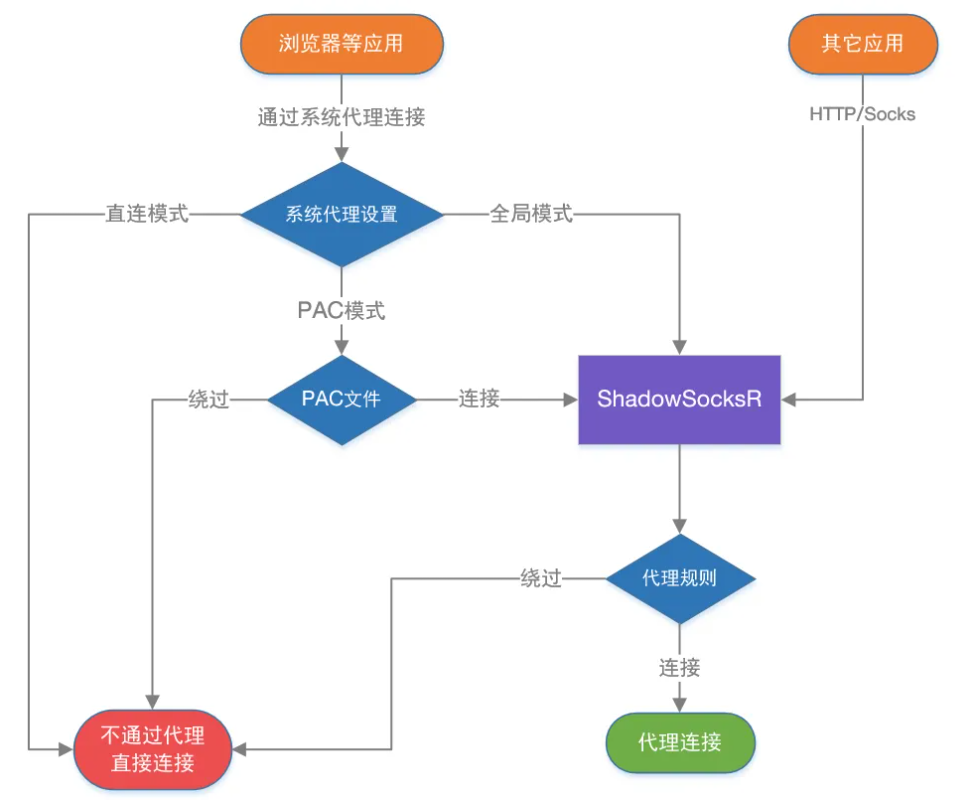

## 小飞机

### 代理模式的区别

ShadowsocksR目前分两种规则方式，那就是

- 系统代理模式
  - 直连模式（相当于没有科学上网）
  - PAC
  - 全局
- 代理规则
  - 绕过局域网
  - 绕过局域网和大陆
  - 绕过局域网和非大陆（国外访问国内用）
  - 全局

**看似两个规则，但是是一起用的，先走系统代理模式，然后走代理规则。选了PAC就是可以先按域名把流量分发到小飞机客户端或者系统直连，然后再小飞机端的流量又再通过ip来进行回流或者出海**

### PAC规则 

是根据PAC文件中的黑白地址名单来判断那些网站走代理。也就是判断 流量是否进入客户端。当你要访问的网站满足 PAC里的设置，那么浏览器就会向代理服务器也就是客户端发送网站请求数据，这时候我们才进入了ShadowsocksR客户端，接下来我们就进入了代理规则判断环节。

当你修改PAC选项时，小飞机回去修改你安装文件夹下的一个缓存PAC文件，里面是一些域名的规则

### 代理规则 

是根据IP判断，按选择的规则来判断进入 客户端的流量是直连还是走代理。

当你访问 google 网站，然后是全局或者满足PAC条件（不满足条件如baidu就直接直连访问了，也不会有接下来的代理规则判断了），
从而访问 google 网站的请求数据流量进入了客户端，然后客户端会根据 google 网站的IP来判断，如下：

- 绕过局域网：当IP属于局域网内的，那么SSR客户端就会让流量直连，反之则会让流量走代理（发送到SSR服务端）。
- 绕过局域网和大陆：当IP属于大陆内或局域网的，那么SSR客户端就会让流量直连，反之则会让流量走代理（发送到SSR服务端）。
- 绕过局域网和非大陆：当IP属于大陆外(非大陆IP都算大陆外)或局域网的，那么SSR客户端就会让流量直连，反之则会让流量走代理（发送到SSR服务端）。
- 全局：无论什么情况都直接走代理。

这两种判断方式是相互配合使用的，**先用系统代理模式来判断是否让数据进入SSR客户端，再用代理规则来判断进入SSR客户端的数据是直连还是走代理**。

### 举个栗子

假设系统代理模式为 PAC，那么访问 www.google.com 。

- 第一步：浏览器在PAC文件中匹配这个域名，并发现这个域名按PAC规则应走代理，所以 浏览器就会发送 访问网页数据到 PAC中的代理服务器(默认如127.0.0.1:1080)，于是SSR客户端就收到了 访问谷歌的数据，而这时候就该用 代理规则 判断了。
- 第二步在到代理规则进行ip判断：
  - 代理规则为：绕过局域网，则判断 www.google.com 域名的IP是否是局域网IP，然而不是局域网IP，于是走代理。
  - 代理规则为：绕过局域网和大陆，则判断 www.google.com 域名的IP是否是局域网IP 或 大陆IP，然而不是局域网IP或大陆IP，于是走代理。
  - 代理规则为：绕过局域网和非大陆，则判断 www.google.com 域名的IP是否是局域网IP 或 非大陆IP，然而是非大陆IP，于是不走代理，直连。
  - 代理规则为：全局，不判断 www.google.com 域名的IP，直接走代理。

### 一图胜所有

## V2Ray
> https://toutyrater.github.io/#v2ray-%E8%B7%9F-shadowsocks-%E6%9C%89%E4%BB%80%E4%B9%88%E5%8C%BA%E5%88%AB%EF%BC%9F

### V2Ray 跟 Shadowsocks 有什么区别？

区别还是有的，Shadowsocks 只是一个简单的代理工具，而 V2Ray 定位为一个平台，任何开发者都可以利用 V2Ray 提供的模块开发出新的代理软件。

了解 Shadowsocks 历史的同学都知道，Shadowsocks 是 clowwindy 开发的自用的软件，开发的初衷只是为了让自己能够简单高效地科学上网，自己使用了很长一段时间后觉得不错才共享出来的。V2Ray 是 clowwindy 被喝茶之后 V2Ray 项目组为表示抗议开发的，一开始就致力于让大家更好更快的科学上网。

由于出生时的历史背景不同，导致了它们性格特点的差异。

简单来说，Shadowsocks 功能单一，V2Ray 功能强大。听起来似乎有点贬低 Shadowsocks 呢？当然不！换一个角度来看，Shadowsocks 简单好上手，V2Ray 复杂配置多。

### 既然 V2Ray 复杂，为什么要用它？

童鞋，某事物的优点和缺点总是相生相随的。相对来说，V2Ray 有以下优势：

- 更完善的协议: V2Ray 使用了新的自行研发的 VMess 协议，改正了 Shadowsocks 一些已有的缺点，更难被墙检测到
- 更强大的性能: 网络性能更好，具体数据可以看 V2Ray 官方博客
- 更丰富的功能: 以下是部分 V2Ray 的功能
- mKCP: KCP 协议在 V2Ray 上的实现，不必另行安装 kcptun
- 动态端口：动态改变通信的端口，对抗对长时间大流量端口的限速封锁
- 路由功能：可以随意设定指定数据包的流向，去广告、反跟踪都可以
- 传出代理：看名字可能不太好理解，其实差不多可以称之为多重代理。类似于 Tor 的代理
- 数据包伪装：类似于 Shadowsocks-rss 的混淆，另外对于 mKCP 的数据包也可伪装，伪装常见流量，令识别更困难
- WebSocket 协议：可以 PaaS 平台搭建V2Ray，通过 WebSocket 代理。也可以通过它使用 CDN 中转，抗封锁效果更好
- Mux:多路复用，进一步提高科学上网的并发性能