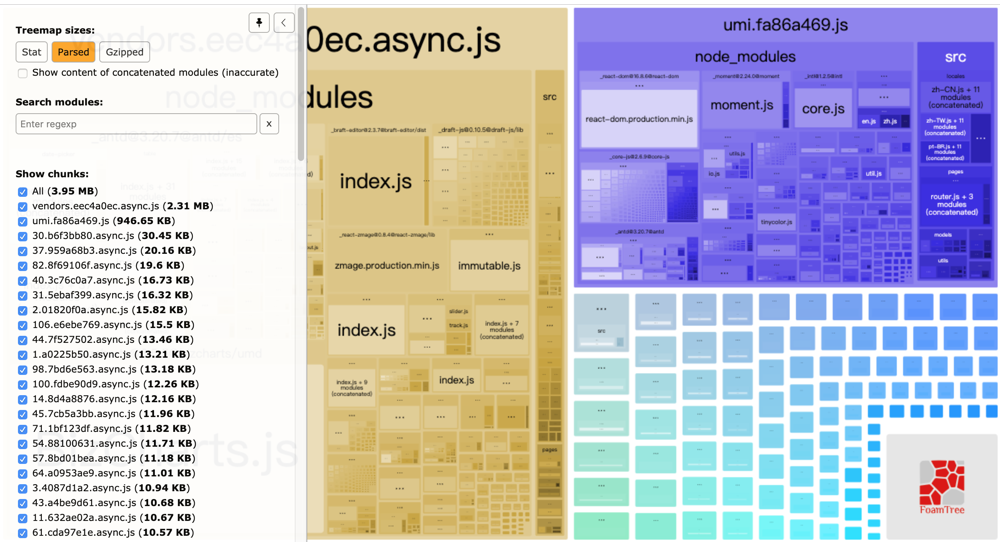

## 服务器端开启gzip
* step1:启动 分析页面打包情况
```
cnpm run analyze
```


* step2: 在nginx 中启用gzip功能

```
server {
    listen 80;
    # gzip config
    gzip on;  
    #包大于1K时gzip才生效
    gzip_min_length 1k; //
    #压缩比例1-10,数字越大压缩比例越高，也越消耗服务器CPU
    gzip_comp_level 9;
    #gzip针对的文件类型
    gzip_types text/plain application/javascript application/x-javascript text/css application/xml text/javascript application/x-httpd-php image/jpeg image/gif image/png;
    gzip_vary on;
    #IE6以下的浏览器不支持
    gzip_disable "MSIE [1-6]\.";
```
* step 3:分析打包之后的文件，修改`config/config.js`来减少包的大小

## 项目屏蔽较大的插件使用

### 放弃使用bizchars只使用Echars

先安装echarts的依赖
`npm install echarts --save` 

再安装一个插件
`npm install echarts-for-react --save`

页面中使用方式
```
import ReactEcharts from 'echarts-for-react';//引入组件
import {graphic} from 'echarts/lib/echarts';//按需引入使用的方法

<div className={styles.salesBar}>
     <ReactEcharts
         option={option};
       
     />
</div>
```
### 更改antdPro的icon载入方式
原来的icon加载是将所用的icon放入dist.js全部载入，没有做到按需加载
* step1:在src文件夹下面创建icons.js文件，用于引入按需加载的图标
```
export {
  default as CopyrightOutline
} from '@ant-design/icons/lib/outline/CopyrightOutline';
export {
  default as UserOutline
} from '@ant-design/icons/lib/outline/UserOutline';
export {
  default as LockFill
} from '@ant-design/icons/lib/fill/LockFill';
```
* step2:在config.js里面配置以替换载入路径
```
export default {
  alias: {
    '@ant-design/icons/lib/dist$': path.resolve(__dirname, '../src/icons.js')
  },
}
```
   
## 参考材料
* [umi-plugin-react](https://umijs.org/zh/plugin/umi-plugin-react.html)
* [umi配置](https://umijs.org/zh/config/)


