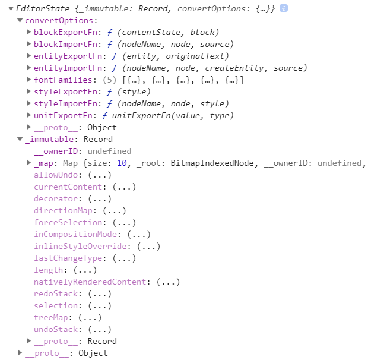
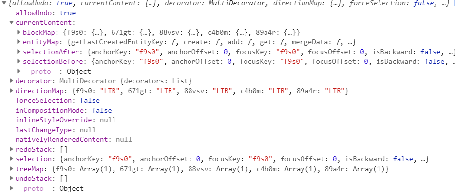
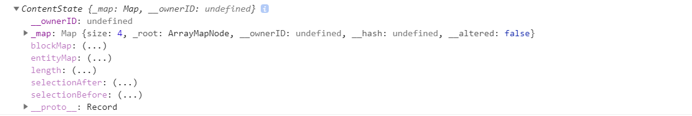
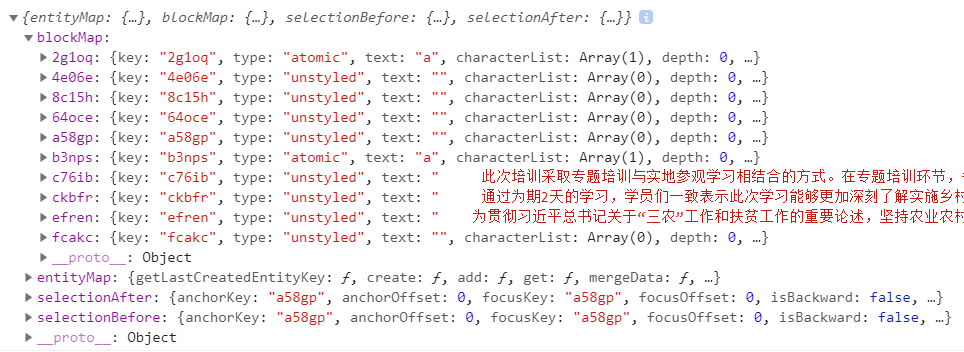
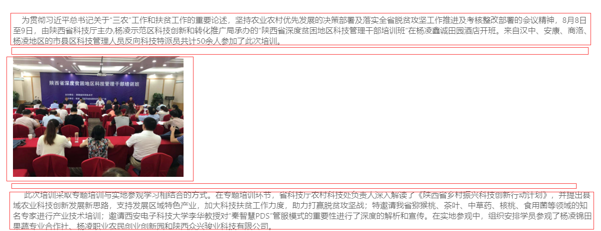
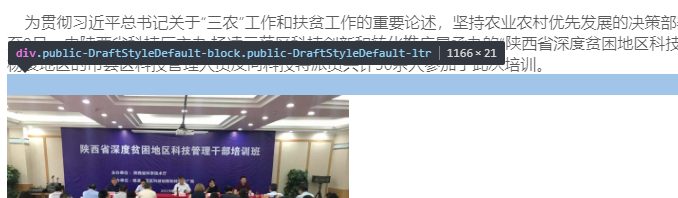
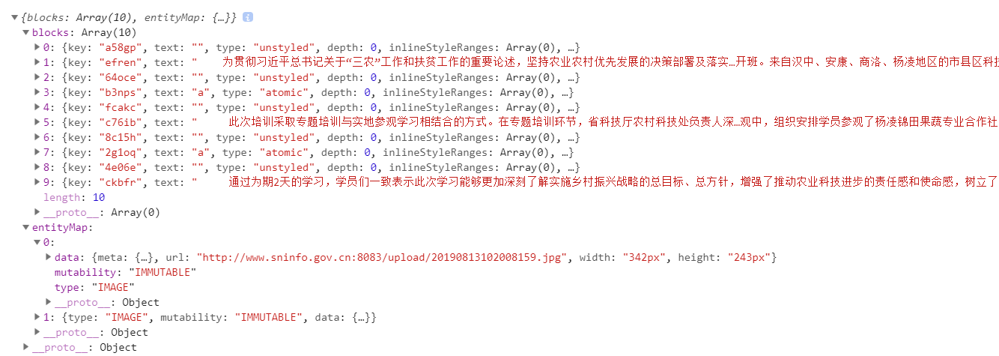

## 安装与使用
* step1:下载组件`cnpm install braft-editor --save`
* step2:在表单域里的使用方式 

```tsx
import BraftEditor from 'braft-editor';
import 'braft-editor/dist/index.css';
```

```tsx
   <FormItem
     label="新闻内容"
   >
     {getFieldDecorator('context', {//content为base64必须转为EditorState对象
       initialValue: BraftEditor.createEditorState(infoById.content) || '',
       rules: [{
         required: true,
         message: '文章内容必填！',
       }],
     })(
       <BraftEditor />
     )}
   </FormItem>
```
* 具体用法参考[官方文档](https://www.yuque.com/braft-editor/be/lzwpnr)

## 富文本编辑器内部自动压缩图片处理 

### 准备工作
* step1:首先需要有draft-js依赖和lrz这个压缩插件，没有可以直接cnpm install
* step2:引入draft-js里面的一些函数以及lrz插件
* 了解draft-js内部封装的一些对象 

```tsx 
import BraftEditor from 'braft-editor';
import {convertToRaw} from 'draft-js';
import lrz from 'lrz'
import 'braft-editor/dist/index.css';
```

### Immutable.JS
- 封装在 Immutable.JS 对象中的数据永远不会发生变换（mutate）。总是会返回一个新的拷贝对象。这与 JavaScript 相反，其中一些操作不会改变数据（例如，一些数组方法，包括 map，filter，concat，forEach 等），但有一些操作会改变数据（Array 的 pop，push，splice 等）。
- 尤其是对大型复杂数据集（如嵌套的 Redux state tree(状态树)）进行不可变操作时，中间可能会产生很多拷贝对象，当浏览器的垃圾回收器清理对象时，这些拷贝对象会消耗内存并降低性能。Immutable.JS 内部通过巧妙共享数据结构避免了这种情况，最大限度地减少了拷贝数据的情况。
- 详情介绍请看官网[ImmutableJS](http://cn.redux.js.org/docs/recipes/UsingImmutableJS.html)  

### EditorState
在创建基本的编辑器的时候，我们用到了 EditorState。EditorState是编辑器最顶层的状态对象，它是一个 Immutable Record 对象，保存了编辑器中全部的状态信息，包括文本状态、选中状态等。



可一看到这个对象和传统js对象还是有区别的这时我们可执行 

```tsx 
console.log(values.context.toJS())  
``` 


这样就可以看到内部详细信息


### getCurrentContent()
currentContent 是一个 ContentState 对象，存放的是当前编辑器中的内容
通过getCurrentContent()来获取
```tsx
//values.context为EditorState对象
const currentContent = values.context.getCurrentContent()
        console.log(currentContent)
        console.log(currentContent.toJS())
```


ContentState 也是一个 Immutable Record 对象，其中保存了编辑器里的全部内容和渲染前后的两个选中状态。可以通过 EditorState.getCurrentContent() 来获取当前的 ContentState，同样调用 .toJS() 后将它打印出来看下：


blockMap 和 entityMap 里放置的就是编辑器中的 block 和 entity，它们是构建 Draft 编辑器的砖瓦。  

ContentBlock 表示一个编辑器内容中的一个独立的 block，即视觉上独立的一块,如下图
  

注意空白行也是一块block
  

### convertToRaw()  

从上一步看出每一个图片也该是一个block块，能够拿到所有的图片block就能完成压缩
而convertToRaw()正好 注输出blocks 和 entityMap 这两项。
 entityMap里面就是保存的是想图片这些媒体信息,相当于原始块对象  
 
 ```tsx 
 const blockData = convertToRaw(currentContent)
 ```
  

### lrz进行压缩
注意三个问题
- entityMap是一个类数组对象，并不是真的数组，需要用for in来遍历才行
- 压缩图片是一个异步过程，当多个图片需要压缩时，for循环内部需要注意使用闭包
- 不是每一个url都是图片的base64编码，需要先用正则验证，如果不是就无需要压缩图片加载速度也是很快的
```tsx
   for(var i in blockData.entityMap){
     ((i)=>{//自执行函数创建闭包保证i的值不会被垃圾回收
       var base64 =/^\s*data:([a-z]+\/[a-z0-9-+.]+(;[a-z-]+=[a-z0-9-]+)?)?(;base64)?,([a-z0-9!$&',()*+;=\-._~:@\/?%\s]*?)\s*$/i;
       var isBase64 = blockData.entityMap[i].data.url.test(base64)
       if(isBase64){
         lrz(blockData.entityMap[i].data.url, {quality:0.2})//压缩为0.2倍
           .then((rst)=>{
             blockData.entityMap[i].data.url=rst.base64;
           })
       }
     })(i)
   }
```
### 提交表单以及富文本编辑器的内容
注意：数据的处理不能直接放到刚刚压缩代码的后面，如果直接跟在后面拿到的还是为压缩的值  

原因：.then是一个回调，会放到事件队列的微任务的队列里面，而不是主线程，所以处理数据的地方必须要在这个微任务之后；

confirm组件里面的onOK事件就是一个事件监听，事件触发后注册在微任务队列里正好符合,所以获取新的context放到这里面来写  

  
先将上文修改过的EditorState转成HTML格式，在通过Base64转码为base64编码传给后台  

```tsx
confirm({
          title: '提示',
          content: '是否保存？',
          okText: '确定',
          cancelText: '取消',
          onOk: () => {
            const context = Base64.encode(values.context.toHTML());
            const params = {
              editNewsId:infoById.id,
              status:1,
              .....
              news: {
                id: infoById.id,
                context,
                .....
              },
            };
            dispatch({
              type: 'editNewsModal/save',
              payload: params,
            });
          }
        });
      }
      else{
        message.error('error')
      }
    });
```


